# Adobe Analytics - Data Connector{#adobe-analytics-data-connector}

## A propos de l&#39;intégration de Data Connector {#about-data-connector-integration}

>[!CAUTION]
>
>Le connecteur de données Adobe Analytics n’est pas compatible avec les messages transactionnels (Message Center).

Le connecteur de données (anciennement appelé Adobe Genesis) permet de faire interagir Adobe Campaign et Adobe Analytics par l’intermédiaire du package **Connecteurs Web Analytics**. Il transmet des données à Adobe Campaign sous forme de segments portant sur le comportement des internautes, suite à une campagne email. Inversement, il envoie les indicateurs et les attributs des campagnes email lancées par Adobe Campaign vers Adobe Analytics - Connecteur de données.

Adobe Campaign dispose d&#39;une fonctionnalité de mesure d&#39;audience sur Internet (Web Analytics) via le connecteur de données. Grâce à ces intégrations, Adobe Campaign est en mesure de récupérer les données concernant le comportement des visiteurs sur un ou plusieurs sites suite à une campagne marketing et, après analyse, de lancer une campagne dite de remarketing pour les convertir en acheteurs. Inversement, les outils de Web analytics permettent à Adobe Campaign de transmettre les indicateurs et les attributs des campagnes vers leur plate-forme.

Pour plus d’informations sur la mise en œuvre de l’intégration d’Adobe Analytics avec Adobe Campaign, consultez [cette documentation](https://helpx.adobe.com/marketing-cloud/how-to/analytics-ac.html).

Les champs d&#39;action de chaque outil sont les suivants :

* Rôle du connecteur Web Analytics :

   1. marque les campagnes email lancées avec Adobe Campaign,
   1. enregistre, sous forme de segments, les comportements des destinataires sur le site où ils se sont rendus après avoir cliqué sur les liens contenus dans l&#39;email de la campagne. Les segments portent sur les produits abandonnés (consultés sur le site mais qui ne sont ni mis dans le panier, ni achetés), les achats ou les abandons de panier.

* Rôle d&#39;Adobe Campaign :

   1. envoie les indicateurs et les attributs de la campagne vers le connecteur qui les transfère vers l&#39;outil de Web Analytics,
   1. récupère et analyse les segments,
   1. déclenche une campagne de remarketing.

## Configurer l&#39;intégration {#setting-up-the-integration}

Pour installer le connecteur de données, vous devez vous connecter à votre instance Adobe Campaign et réaliser les opérations suivantes :

* [Etape 1 : paramétrer l&#39;intégration dans Analytics](#step-1--configure-integration-in-analytics)
* [Etape 2 : créer le compte externe dans Campaign](#step-2--create-the-external-account-in-campaign)
* [Étape 3 : synchroniser Adobe Campaign et Adobe Analytics](#step-3--synchronize-adobe-campaign-and-adobe-analytics)

### Etape 1 : paramétrer l&#39;intégration dans Analytics {#step-1--configure-integration-in-analytics}

Les étapes suivantes décrivent le paramétrage du connecteur de données via un assistant.

1. Connectez-vous à Adobe Experience Cloud à l’aide d’un Adobe ID ou d’un Enterprise ID.

   

1. Dans la liste des solutions Experience Cloud, sélectionnez **[!UICONTROL Analytics]**.

   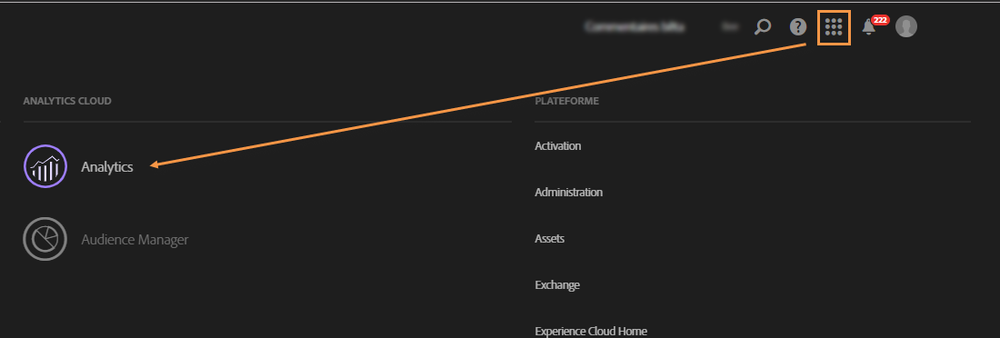

1. Dans l’ **[!UICONTROL Admin]** onglet, sélectionnez **[!UICONTROL Data Connectors]**.

   Pour accéder au **[!UICONTROL Data Connectors]** menu, vous devez disposer des autorisations suivantes pour les outils Analytics. Voir à ce propos [cette page](https://docs.adobe.com/content/help/en/analytics/admin/admin-console/permissions/analytics-tools.html)
   * Intégrations (Créer)
   * Intégrations (mise à jour)
   * Intégrations (Supprimer)
   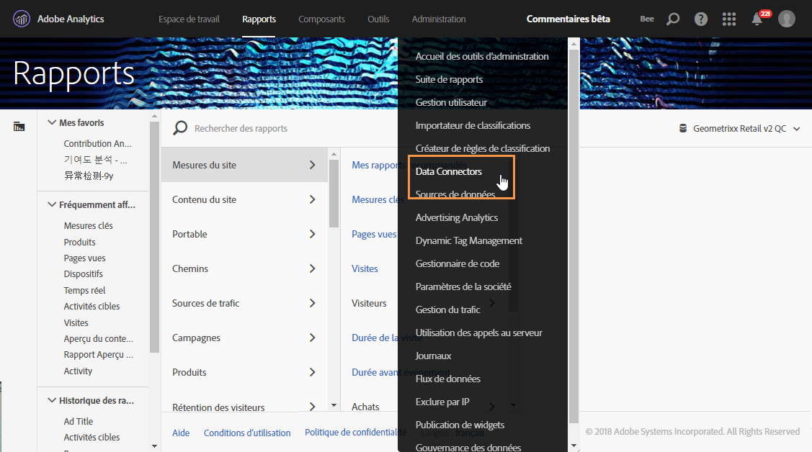

1. From the list of partners, select **[!UICONTROL Adobe Campaign Classic]**.

   

1. Dans la **[!UICONTROL Add integration]** boîte de dialogue, cliquez sur **[!UICONTROL Activate]**.
1. Cochez **[!UICONTROL I accept these terms and conditions]** et sélectionnez le **[!UICONTROL Report suite]** lien associé à cette intégration et saisissez le libellé du connecteur.

   Lorsque vous avez terminé, cliquez sur **[!UICONTROL Create and configure this integration]**.

   

1. Enter the email address that will receive the notifications on behalf of the connector, then copy the **[!UICONTROL Account ID]** as it appears in the external Adobe Campaign account (for more on this, refer to the [Step 2: Create the external account in Campaign](#step-2--create-the-external-account-in-campaign)).

   

1. Indiquez ensuite les identifiants qui vont permettre de mesurer l&#39;impact de la campagne email, soit le nom interne de la campagne (cid) et l&#39;identifiant de la table NmsBroadlog (bid). Indiquez également les indicateurs des événements à collecter.
Assurez-vous que vos **[!UICONTROL Events]** valeurs sont de type numérique, sinon elles n’apparaîtront pas dans le menu déroulant.

   

1. Si besoin est, définissez des segments personnalisés.

   

1. In **[!UICONTROL Data collection]**, select a method for recovering data, in this case the **[!UICONTROL cid]** and **[!UICONTROL bid]** identifiers specified in step 6.

   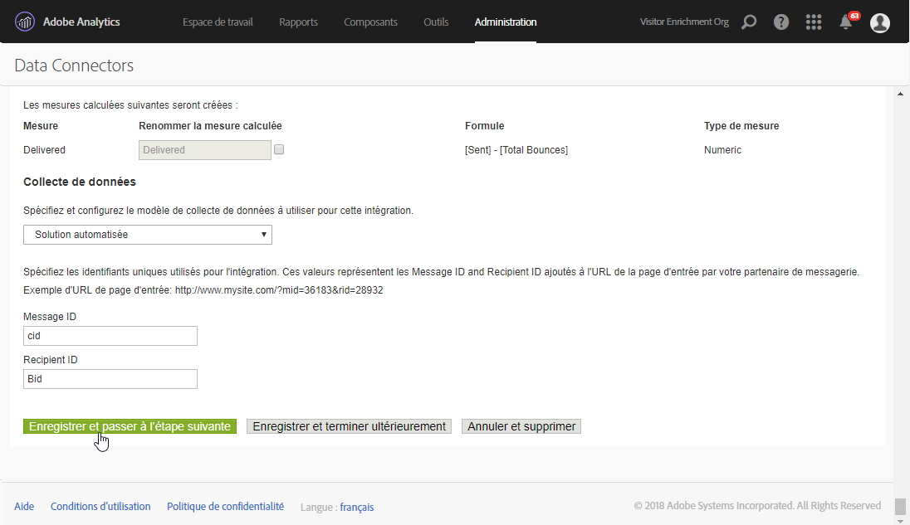

1. Sélectionnez les informations à afficher dans le tableau de bord.

   

1. Vérifiez le paramétrage dans la page résumant les étapes précédentes.

   

1. Click **[!UICONTROL Activate Now]** to approve configuration and activate the connector.

   

   Le connecteur de données est maintenant paramétré.

### Etape 2 : créer le compte externe dans Campaign {#step-2--create-the-external-account-in-campaign}

L’intégration d’Adobe Campaign aux plates-formes d’Analytics se fait par l’intermédiaire d’un connecteur. Pour synchroniser les deux applications, vous devez :

1. Installer le package **Connecteurs Web Analytics** dans Adobe Campaign.
1. Accédez au **[!UICONTROL Administration > Platform > External accounts]** dossier de l&#39; Adobe Campaign arbre.
1. Right-click the list of external accounts and select **[!UICONTROL New]** in the drop-down menu (or click the **[!UICONTROL New]** button above the list of external accounts).
1. Use the drop-down list to select the **[!UICONTROL Web Analytics]** type.
1. Choisissez le fournisseur du connecteur, par exemple ici **[!UICONTROL Adobe Analytics - Data Connector]**.

   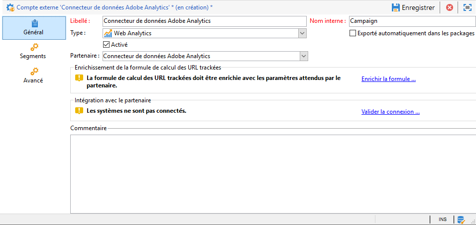

1. Click the **[!UICONTROL Enrich the formula...]** link to change the URL calculation formula to specify the Web analytics tool integration information (campaign IDs) and the domains of the sites whose activity must be tracked.
1. Indiquez le ou les noms de domaine des sites.

   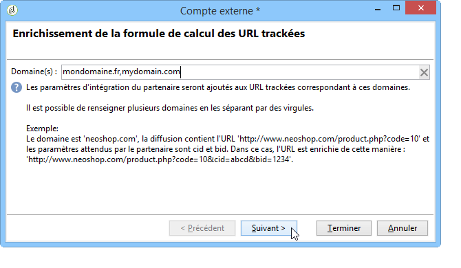

1. Click **[!UICONTROL Next]** and make sure the domain names have been saved.

   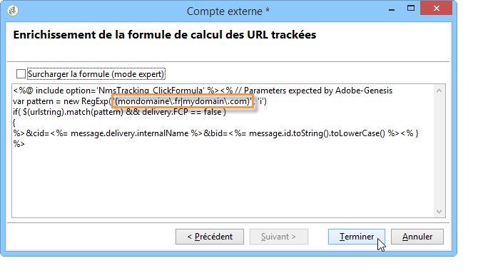

1. Au besoin, vous devez surcharger la formule de calcul. Pour cela, cochez la case et modifiez la formule directement dans la fenêtre.

   

   >[!CAUTION]
   >
   >Ce type de paramétrage s&#39;adresse à des utilisateurs experts : toute erreur dans cette formule risque de bloquer l&#39;envoi des emails.

1. The **[!UICONTROL Advanced]** tab lets you configure or modify more technical settings.

   * **[!UICONTROL Lifespan]**: vous permet de spécifier le délai (en jours_ après lequel le Web  récupéré  par le. Valeur par défaut : 180 jours.
   * **[!UICONTROL Persistence]** : permet de définir la période pendant laquelle tout événement web (un achat par exemple) peut être attribué à une campagne de remarketing. Par défaut : 7 jours.

>[!NOTE]
>
>Si vous utilisez plusieurs outils de mesure  , vous pouvez sélectionner **[!UICONTROL Other]** dans le **[!UICONTROL Partners]** déroulant  lors de la création du. Vous ne pouvez référencer qu’un seul  dans les propriétés  du : vous devrez donc adapter la formule des URL suivies en ajoutant les paramètres attendus par Adobe et tous les autres outils de mesure utilisés.

### Étape 3 : synchroniser Adobe Campaign et Adobe Analytics {#step-3--synchronize-adobe-campaign-and-adobe-analytics}

Après avoir créé le compte externe, vous devez synchroniser les deux applications.

1. Accédez au compte externe créé à l&#39;étape précédente.
1. Change the account **[!UICONTROL Label]** as needed.
1. Change the **[!UICONTROL Internal name]** so that it matches the **[!UICONTROL Name]** chosen while configuring the Data Connector.

   

1. Cliquez sur le **[!UICONTROL Approve connection]** lien.

   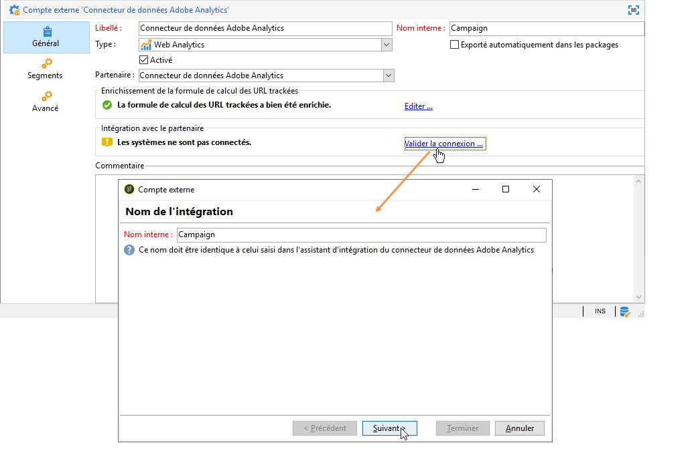

   Make sure the **[!UICONTROL Internal name]** matches the **[!UICONTROL Name]** specified in the Data Connector configuration wizard.

1. Enter the **[!UICONTROL Account ID]** in the Data Connector configuration wizard.

   

1. Suivez les étapes du guide d&#39;assistant du connecteur de données, puis revenez vers le compte externe dans Adobe Campaign.
1. Click **[!UICONTROL Next]** in order for the data exchange to take place between Adobe Campaign and Adobe Analytics - Data connector.

   Une fois la synchronisation terminée, la liste des segments s&#39;affiche.

   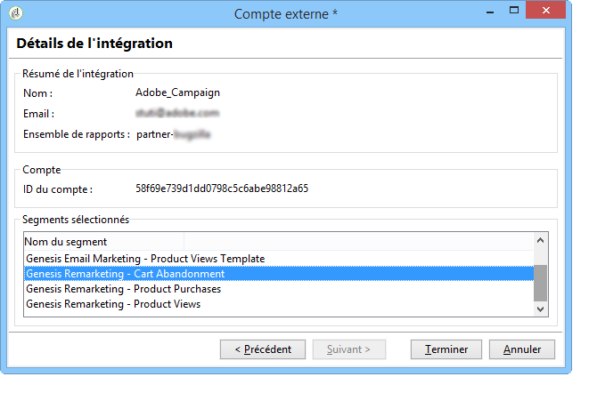

Lorsque la synchronisation des données entre Adobe Campaign et Adobe Analytics - connecteur de données est effective, les trois par défaut définis dans l&#39;assistant du connecteur de données sont récupérés par Adobe Campaign et deviennent accessibles depuis l&#39;onglet **[!UICONTROL Segments]** Segments du compte externe d&#39;Adobe Campaign.

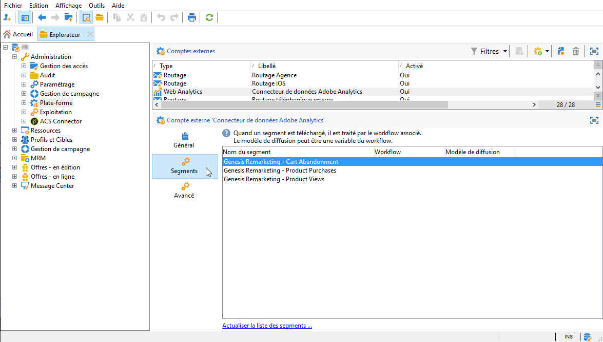

Si d’autres segments ont été configurés dans l’assistant Connecteur de données, vous pouvez les ajouter à  Adobe Campaign. Pour ce faire, cliquez sur le **[!UICONTROL Update segment list]** lien et suivez les étapes décrites dans l’assistant de  de. Une fois l’opération effectuée, les nouveaux segments s’affichent dans le .

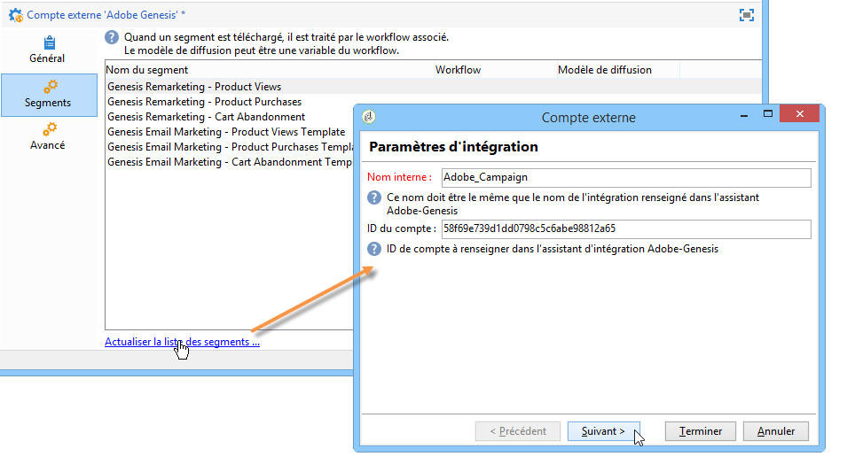

### Workflows techniques des processus Web Analytics {#technical-workflows-of-web-analytics-processes}

L&#39;échange des données entre Adobe Campaign et Adobe Analytics - Data Connector est géré par quatre workflows techniques qui s&#39;exécutent en tâche de fond.

Ils sont disponibles dans l&#39;arborescence Adobe Campaign , sous le **[!UICONTROL Administration > Production > Technical workflows > Web analytics process]** dossier.

* **[!UICONTROL Recovering of web events]**: une fois par heure, ce processus télécharge les segments sur le comportement des utilisateurs sur un site donné, les inclut dans la base de données Adobe Campaign  et, ainsi que le processus de remarketing.
* **[!UICONTROL Event purge]**: ce processus vous permet de supprimer tous les  de la base de données en fonction de la période configurée dans le **[!UICONTROL Lifespan]** champ. Pour plus d’informations à ce sujet, reportez-vous à l’ [étape 2 : Créez le  dans Campaign](#step-2--create-the-external-account-in-campaign).
* **[!UICONTROL Identification of converted contacts]**: du répertoire des qui ont effectué un achat à la suite d’une campagne de re-marketing. Les données collectées par ce flux de travail sont accessibles dans le **[!UICONTROL Re-marketing efficiency]** rapport. Reportez-vous à cette [page](#creating-a-re-marketing-campaign).* **[!UICONTROL Sending of indicators and campaign attributes]**: lets you send email campaign indicators via Adobe Campaign to the Adobe Experience Cloud using Adobe Analytics - Data connector. Ce flux de travaux est déclenché à 4 heures du matin tous les jours et peut prendre 24 heures pour que les données soient envoyées à Analytics.

   Veuillez noter que ce workflow ne devrait pas être redémarré. Dans le cas contraire, il renverrait toutes les données précédentes, ce qui peut fausser les résultats d’Analytics.

   Les indicateurs concernés sont les suivants :

   * **[!UICONTROL Messages to deliver]** (@toDeliver)
   * **[!UICONTROL Processed]** (@processed)
   * **[!UICONTROL Success]** (@success)
   * **[!UICONTROL Total count of opens]** (@totalRecipientOpen)
   * **[!UICONTROL Recipients who have opened]** (@recipientOpen)
   * **[!UICONTROL Total number of recipients who clicked]** (@totalRecipientClick)
   * **[!UICONTROL People who clicked]** (@personClick)
   * **[!UICONTROL Number of distinct clicks]** (@recipientClick)
   * **[!UICONTROL Opt-Out]** (@optOut)
   * **[!UICONTROL Errors]** (@error)
   >[!NOTE]
   >
   >Les données envoyées correspondent au delta basé sur la dernière prise de photo, ce qui peut générer une valeur négative dans les données de mesure.

   Les attributs envoyés sont les suivants :

   * **[!UICONTROL Internal name]** (@internalName)
   * **[!UICONTROL Label]** (@label)
   * **[!UICONTROL Label]** Libellé (operation/@) : uniquement si le package **Campaign** est installé
   * **[!UICONTROL Nature]** (operation/@nature) : uniquement si le package **Campaign** est installé
   * **[!UICONTROL Tag 1]** (webAnalytics/@tag1)
   * **[!UICONTROL Tag 2]** (webAnalytics/@tag2)
   * **[!UICONTROL Tag 3]** (webAnalytics/@tag3)
   * **[!UICONTROL Contact date]** (schedule/@contactDate)

* **Identification des contacts** convertis : du répertoire des qui ont effectué un achat à la suite d’une campagne de re-marketing. Les données collectées par ce flux de travail sont accessibles dans le **[!UICONTROL Re-marketing efficiency]** rapport (reportez-vous à cette [page](../../platform/using/adobe-analytics-data-connector.md#creating-a-re-marketing-campaign)).

## Tracking des diffusions dans Adobe Campaign {#tracking-deliveries-in-adobe-campaign}

Afin qu&#39;Adobe Experience Cloud puisse suivre l&#39;activité sur les sites après l&#39;envoi de diffusions par Adobe Campaign, il est nécessaire de référencer le connecteur correspondant dans les propriétés de la diffusion. Pour cela, procédez comme suit :

1. Ouvrez la diffusion de la campagne destinée à être trackée.

   

1. Ouvrez les propriétés de la diffusion.
1. Go to the **[!UICONTROL Web Analytics]** tab and select the previously created external account. Refer to [Step 2: Create the external account in Campaign](#step-2--create-the-external-account-in-campaign)).

   

1. Vous pouvez maintenant envoyer votre diffusion et accéder au rapport correspondant dans Adobe Analytics.

## Créer une opération de remarketing {#creating-a-re-marketing-campaign}

Pour préparer votre campagne de remarketing, vous devez créer des modèles de diffusion qui seront ensuite utilisés dans les opérations de type remarketing. Vous devez ensuite paramétrer votre opération de remarketing et lui associer un segment. A chaque segment doit correspondre une opération de remarketing différente.

Les campagnes de remarketing sont automatiquement lancées lorsque Adobe Campaign a récupéré les données analysant le comportement des personnes ciblées par la campagne initiale. En cas d&#39;abandon de panier ou de visualisation de produits sans achat, une diffusion est envoyée aux personnes concernées afin que leur navigation sur le site débouche sur un achat.

Adobe Campaign met à votre disposition des modèles de diffusion personnalisés que vous pouvez utiliser ou dont vous pouvez vous inspirer pour préparer vos campagnes.

1. A partir de **[!UICONTROL Explorer]**, accédez au **[!UICONTROL Resources > Templates > Delivery templates]** dossier de l&#39;arborescence  Adobe Campaign.
1. Duplicate the **[!UICONTROL Email delivery (re-marketing)]** template or the re-marketing template examples offered by Adobe Campaign.
1. Personnalisez le modèle selon vos besoins, puis enregistrez-le.

   

1. Create a new campaign and select the **[!UICONTROL Re-marketing campaign]** template from the drop-down list.

   

1. Click the **[!UICONTROL Configure...]** link to specify the segment and delivery template linked to the campaign.
1. Sélectionnez le compte externe paramétré précédemment.

   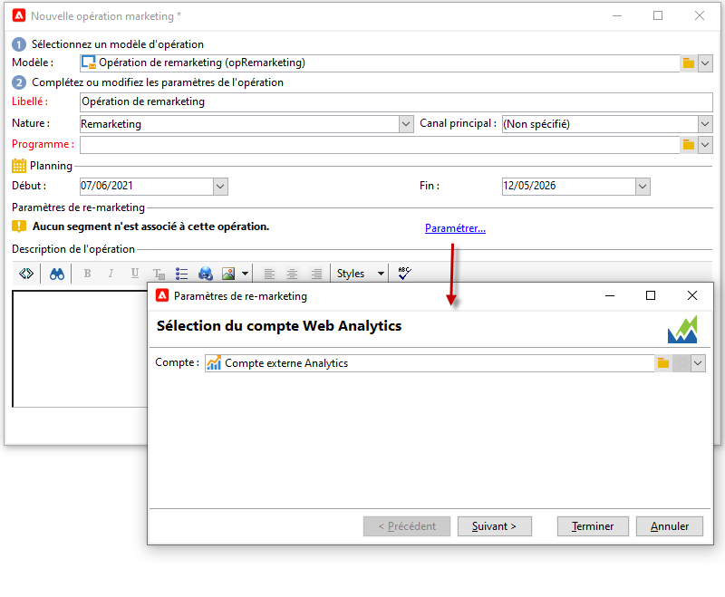

1. Sélectionnez le segment concerné.

   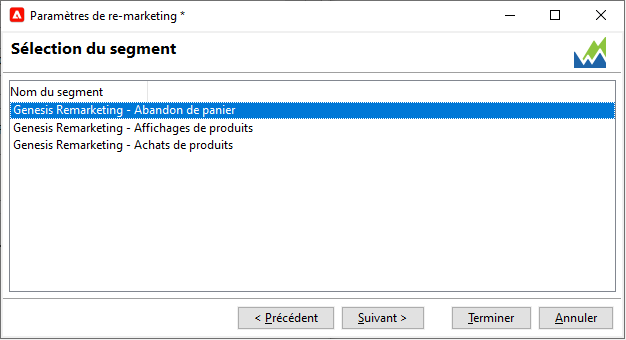

1. Select the delivery template to be used for this re-marketing campaign, then click **[!UICONTROL Finish]** to close the window.

   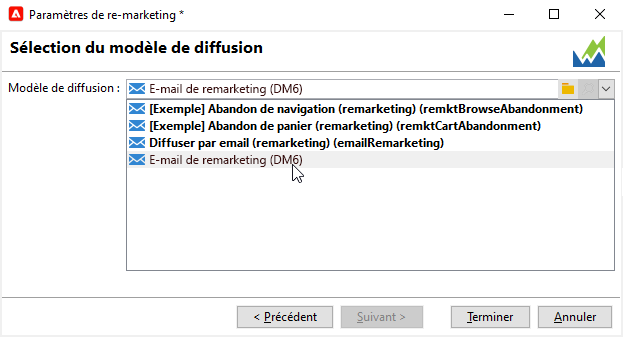

1. Cliquez sur **[!UICONTROL OK]** pour fermer la fenêtre de l&#39;opération.

Le **[!UICONTROL Re-marketing efficiency]** rapport est accessible via la page des rapports globaux. Il vous permet de  le nombre de contacts convertis (c.-à-d. ayant acheté quelque chose) par rapport au nombre d&#39;abandons de panier après la campagne de  marketing de relance. Le  de est calculé par semaine, par mois ou depuis le de synchronisation entre les outils d&#39;analyse Web et d&#39;analyse de  Web.

