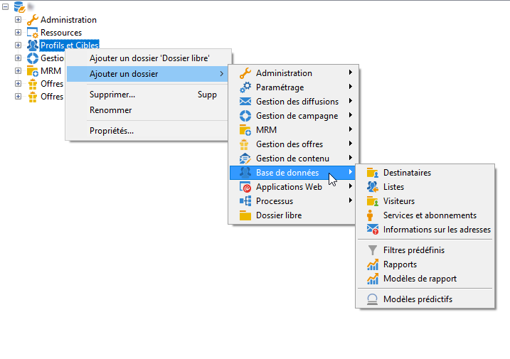

# Utilisation de l’explorateur Adobe Campaign {#using-adobe-campaign-explorer}

L&#39;explorateur Adobe Campaign est accessible à partir de l&#39;icône de la barre d&#39;outils. Il permet d&#39;accéder à l&#39;ensemble des fonctions d&#39;Adobe Campaign, aux écrans de paramétrage et à une vue plus détaillée de certains éléments de la plateforme.

L&#39;espace de travail **[!UICONTROL Explorateur]** est divisé en trois zones :

**1 - Arborescence** : vous pouvez personnaliser le contenu de l’arborescence (ajouter, déplacer ou supprimer des nœuds). Cette procédure est réservée aux utilisateurs expérimentés. Pour plus d’informations à ce sujet, consultez [cette section](#about-navigation-hierarchy).).

**2 - Liste** : vous pouvez filtrer cette liste, lancer des recherches, ajouter des informations ou trier les données. [En savoir plus](adobe-campaign-ui-lists.md).

**3 - Détails** : vous pouvez afficher les détails de l’élément sélectionné. L’icône située dans la section supérieure droite permet d’afficher ces informations en plein écran.

## Dossiers et arborescence de navigation{#about-navigation-hierarchy}

L’arborescence de navigation fonctionne comme un explorateur de fichiers (par exemple, l’Explorateur Windows). Les dossiers peuvent contenir des sous-dossiers. La sélection d’un nœud affiche la vue correspondante.

La vue affichée est une liste associée à un schéma et à un formulaire de saisie pour l&#39;édition de la ligne sélectionnée.

Pour ajouter un nouveau dossier dans l&#39;arborescence, cliquez avec le bouton droit sur le dossier dans la branche duquel vous souhaitez insérer un dossier et choisissez **[!UICONTROL Ajouter un dossier]**. Dans le menu contextuel, sélectionnez le type de dossier à créer.

Découvrez comment configurer l’arborescence de navigation de Campaign [dans cette section](../../configuration/using/configuration.md).

Découvrez comment définir des autorisations sur les dossiers [dans cette section](access-management-folders.md).

## Bonnes pratiques relatives à la configuration des dossiers

* **Utilisation de dossiers natifs**

   L’utilisation des dossiers natifs facilite l’utilisation, la maintenance et le dépannage de l’application pour les personnes qui ne sont pas impliquées dans le projet. Vous ne devez pas créer de structures de dossiers personnalisées pour les destinataires, les listes, les diffusions et autres, mais utiliser les dossiers standard comme Administration, Profils et cibles, Gestion de campagnes.

* **Création de sous-dossiers**

   Placez les workflows techniques dans le dossier standard : Administration / Production / Workflows techniques. Créez ensuite des sous-répertoires par type de workflow.

* **Définition d’une convention de nommage**

   Par exemple, vous pouvez nommer les workflows par ordre alphabétique, de sorte qu’ils s’affichent dans l’ordre d’exécution.

   Par exemple :

   * A1 - import des destinataires, démarre à 10 h ;
   * A2 - import des tickets, démarre à 11 h.

* **Création de modèles pour permettre aux utilisateurs de commencer**

   Créez des modèles de diffusion, de workflow ou de campagnes spécifiques aux utilisateurs. Cette structure permet de gagner du temps et de s’assurer que le mappage et les typologies de diffusion appropriés sont utilisés pour chaque utilisateur.

## Résolution d&#39;écran {#screen-resolution}

Pour une navigation et une convivialité optimales, Adobe recommande l&#39;utilisation d&#39;une résolution d&#39;écran minimale de 1 600 x 900 pixels.

>[!CAUTION]
>
>Les résolutions inférieures à 1 600 x 900 pixels ne sont pas prises en charge par Adobe Campaign.

Dans l’espace de travail de l’**[!UICONTROL Explorateur]**, si certaines parties de la zone **[!UICONTROL Détails]** semblent tronquées, développez-la à l’aide de la flèche située en haut de la zone ou cliquez sur le bouton **[!UICONTROL Agrandir]**.

## Parcours et personnalisation des listes {#browsing-lists}

Découvrez comment parcourir, gérer et personnaliser les listes [dans cette section](adobe-campaign-ui-lists.md).
