# Gestion et personnalisation de listes{#manage-and-customize-lists}

Vous pouvez accéder aux listes des enregistrements de la base de données Campaign à l’aide de l’Explorateur. Vous pouvez filtrer ces listes, lancer des recherches, ajouter des informations, filtrer et trier les données.

## Comptage des enregistrements {#counting-records}

Par défaut, Adobe Campaign charge en mémoire les 200 premiers enregistrements d&#39;une liste. Par conséquent, l&#39;affichage ne propose pas nécessairement l&#39;intégralité des enregistrements de la table dont vous affichez le contenu. Vous pouvez lancer un décompte du nombre d&#39;enregistrements de la liste et déclencher le chargement en mémoire d&#39;enregistrements supplémentaires.

En bas à droite de l&#39;écran de liste, un **[!UICONTROL compteur]** indique le nombre d&#39;enregistrements chargés en mémoire par rapport au nombre total d&#39;enregistrements dans la base (après application de tous les filtres éventuels) :

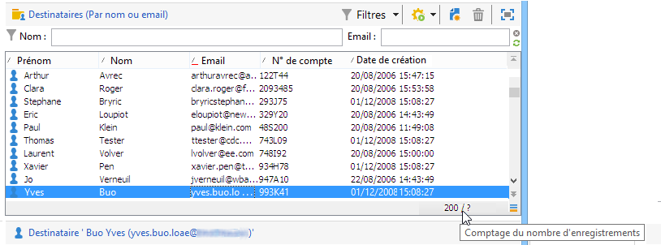

Si « **?** » apparaît plutôt que le nombre sur la droite, cliquez sur le compteur pour lancer le calcul.

### Chargement d’enregistrements supplémentaires {#loading-more-records}

Pour charger (et donc afficher) des enregistrements supplémentaires (par défaut, 200 lignes), cliquez sur le bouton **[!UICONTROL Continuer le chargement]**.

Si vous souhaitez charger l&#39;intégralité des enregistrements, cliquez dans la liste avec le bouton droit et sélectionnez **[!UICONTROL Tout charger]**.

>[!CAUTION]
>
>La durée du chargement de la liste entière peut être longue, selon le nombre d&#39;enregistrements.

### Modifier le nombre d&#39;enregistrements par défaut {#change-default-number-of-records}

Pour modifier le nombre d&#39;enregistrements chargés par défaut, cliquez sur le bouton **[!UICONTROL Configurer la liste]**, en bas à droite de la liste.

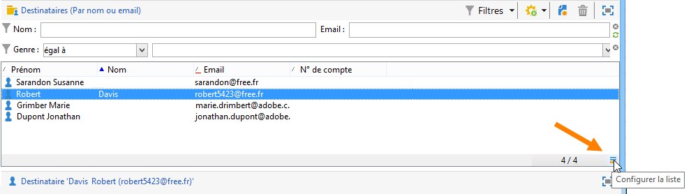

Dans la fenêtre de configuration de la liste, cliquez sur **[!UICONTROL Paramètres avancés]** (en bas à gauche) et modifiez le nombre de lignes à récupérer.

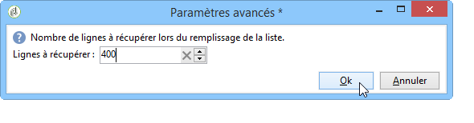

## Configuration de listes {#configuring-lists}

### Ajouter des colonnes {#add-columns}

Deux méthodes permettent d&#39;ajouter une colonne à une liste.

Vous pouvez ajouter rapidement une colonne à une liste à partir du détail d’un enregistrement. Pour cela :

1. Depuis un écran de détail, cliquez avec le bouton droit sur le champ à afficher dans une colonne.
1. Sélectionnez **[!UICONTROL Ajouter dans la liste]**.

   La colonne est ajoutée à droite des colonnes déjà affichées.

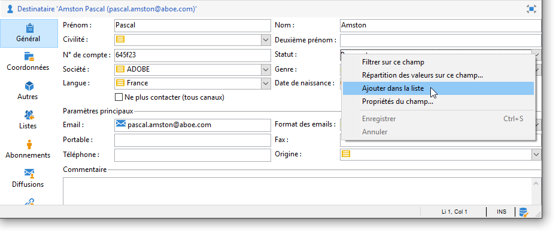

Une autre méthode pour ajouter des colonnes, lorsque vous souhaitez afficher des données qui ne sont pas affichées sur l&#39;écran de détail, consiste à utiliser la fenêtre de configuration de liste. Pour cela :

1. Cliquez sur **[!UICONTROL Configurer la liste]** en bas à droite de la liste.

   

1. Dans la liste **[!UICONTROL Champs disponibles]** de la fenêtre de configuration de la liste, double-cliquez sur un champ pour l’ajouter à la zone **[!UICONTROL Colonnes de sortie]**.

   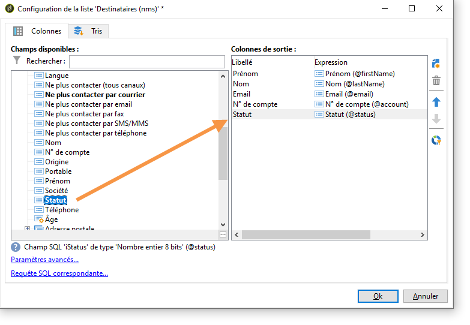

   >[!NOTE]
   >
   >Par défaut, les champs avancés ne sont pas affichés. Pour les afficher, cliquez sur l&#39;icône **Afficher les champs avancés**, située en bas à droite de la liste des champs disponibles.
   >
   >Les libellés sont affichés par table puis par ordre alphabétique.
   >
   >Pour lancer une recherche dans les champs disponibles, utilisez le champ **Rechercher**. Pour plus d’informations, consultez [cette section](#sorting-a-list).
   >
   >Les champs sont identifiés par des icônes spécifiques : champs SQL, tables liées, champs calculés, etc. Pour chaque champ sélectionné, la description est affichée sous la liste des champs disponibles. [En savoir plus](#configuring-lists).
   >
   >Vous pouvez également trier et filtrer les données. Consultez [cette section](../../platform/using/filtering-options.md).

1. Répétez la procédure pour chaque colonne à afficher.
1. Utilisez les flèches pour modifier l&#39;**ordre d&#39;affichage**. La colonne la plus haute sera la plus à gauche dans la liste des enregistrements.

   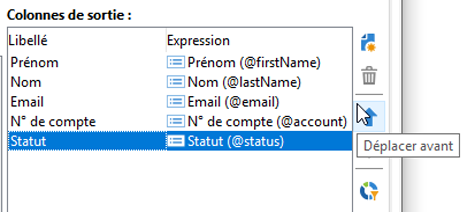

1. Au besoin, vous pouvez cliquer sur **[!UICONTROL Répartition des valeurs]** pour visualiser la répartition des valeurs du champ sélectionné dans le dossier courant.

   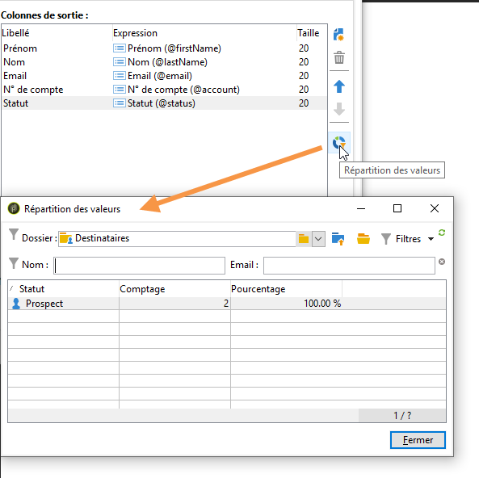

1. Cliquez sur **[!UICONTROL OK]** pour valider la configuration et visualiser le résultat.

### Créer une nouvelle colonne {#create-a-new-column}

Vous pouvez créer de nouvelles colonnes pour afficher des champs supplémentaires dans la liste. Pour cela :

1. Cliquez sur **[!UICONTROL Configurer la liste]** en bas à droite de la liste.
1. Cliquez sur **[!UICONTROL Ajouter]** pour afficher un nouveau champ dans la liste.

### Retirer une colonne {#remove-a-column}

Vous pouvez masquer une ou plusieurs colonnes dans une liste d&#39;enregistrements via le bouton **[!UICONTROL Configurer la liste]** situé en bas à droite de la liste.

Dans la fenêtre de configuration de la liste, sélectionnez la colonne à masquer dans la zone **[!UICONTROL Colonnes de sortie]** et cliquez sur le bouton de suppression.

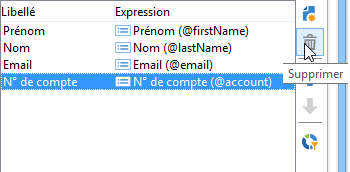

Répétez l&#39;opération pour chaque colonne à masquer. Cliquez sur **[!UICONTROL OK]** pour valider la configuration et visualiser le résultat.

### Ajuster la largeur des colonnes {#adjust-column-width}

Lorsque la liste est active, c’est-à-dire lorsqu’au moins une ligne est sélectionnée, la touche F9 permet d’ajuster la largeur des colonnes afin d’afficher toutes les colonnes à l’écran.

### Affichage des données dans des sous-dossiers {#display-sub-folders-records}

Les listes peuvent afficher :

* soit les enregistrements contenus dans le dossier sélectionné uniquement,
* soit les enregistrements du dossier sélectionné ET ceux de ses sous-dossiers.

Pour basculer d&#39;un mode d&#39;affichage à l&#39;autre, cliquez sur l&#39;icône **[!UICONTROL Afficher les fils]** dans la barre d&#39;outils.

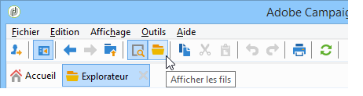

## Enregistrement d’une configuration de liste {#saving-a-list-configuration}

La configuration des listes s’applique localement, sur le poste de travail. Lorsque le cache local est vidé, les configurations locales sont désactivées.

Les paramétrages d&#39;affichage définis s&#39;appliquent par défaut à toutes les listes, pour le type de dossier correspondant. Ainsi, lorsque vous modifiez l&#39;affichage de la liste des destinataires à partir d&#39;un dossier, cette configuration est appliquée à tous les autres dossiers de destinataires.

Toutefois, il est possible d&#39;enregistrer un ou plusieurs paramétrages afin de les appliquer à différents dossiers du même type. Le paramétrage est sauvegardé dans les propriétés du dossier qui contient les données et peut être réappliqué.

Par exemple, pour un dossier de diffusions, il est possible de paramétrer l&#39;affichage suivant :

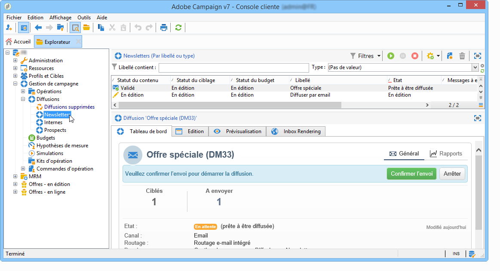

Pour enregistrer cette configuration de liste en vue de la réutiliser, procédez comme suit :

1. Cliquez avec le bouton droit sur le dossier contenant les données affichées.
1. Sélectionnez **[!UICONTROL Propriétés]**.
1. Cliquez sur **[!UICONTROL Paramètres avancés]** et indiquez un nom dans le champ **[!UICONTROL Configuration]**.

   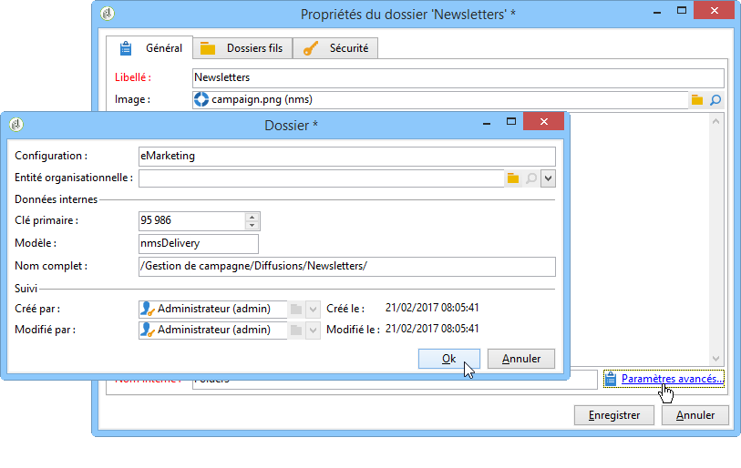

1. Cliquez sur **[!UICONTROL OK]**, puis sur **[!UICONTROL Enregistrer]**.

Vous pouvez ensuite appliquer cette configuration à un autre dossier de type **Diffusions** :

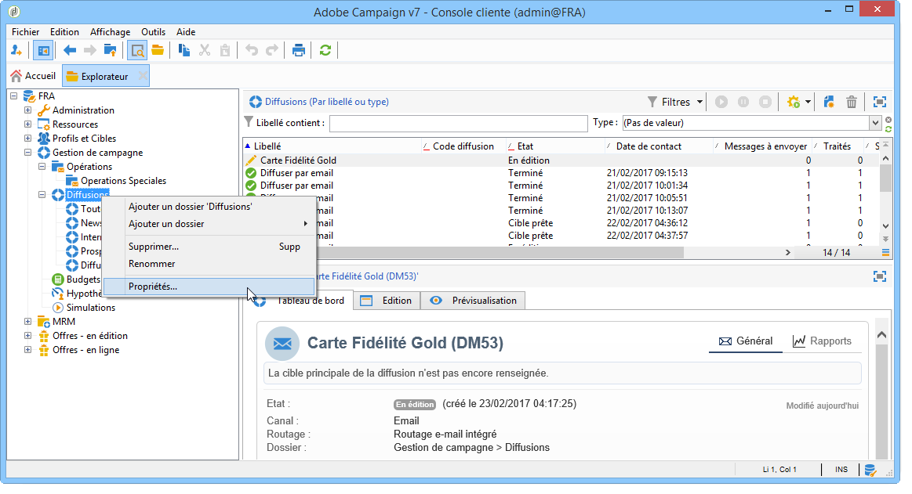

Cliquez sur **[!UICONTROL Enregistrer]** dans la fenêtre des propriétés du dossier. L&#39;affichage de la liste est modifié pour correspondre à la configuration indiquée :

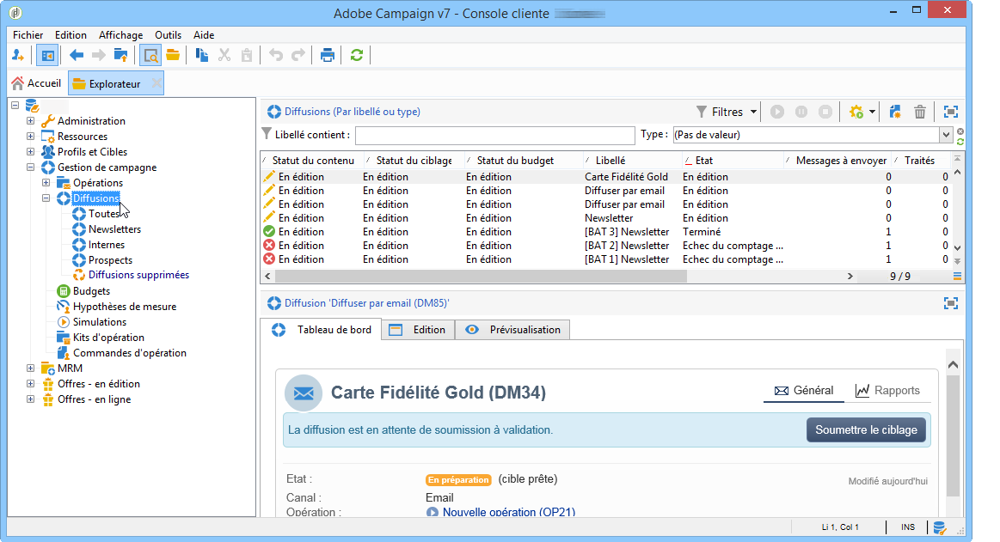

## Exporter une liste {#exporting-a-list}

Pour exporter les données d’une liste, vous devez utiliser un assistant d’export. Pour y accéder, sélectionnez les éléments de la liste à exporter, cliquez avec le bouton droit de la souris et choisissez **[!UICONTROL Exporter...]**.

L&#39;utilisation des fonctions d&#39;importation et d&#39;exportation est expliquée dans la section [Imports et exports génériques](../../platform/using/about-generic-imports-exports.md).

>[!CAUTION]
>
>Les éléments d’une liste ne doivent pas être exportés via la fonction Copier/Coller.

## Tri d’une liste {#sorting-a-list}

Les listes peuvent contenir un grand nombre de données. Vous pouvez trier ces données ou appliquer des filtres simples ou avancés. Le tri permet d&#39;afficher les données dans un ordre ascendant ou descendant, tandis que les filtres permettent de définir et de combiner des critères afin de n&#39;afficher qu&#39;une sélection de données.

Cliquez sur l&#39;en-tête de la colonne pour appliquer un tri ascendant, un tri descendant ou annuler le tri des données. Une flèche bleue devant le libellé de la colonne indique qu&#39;un tri est actif et l&#39;ordre du tri. Un tiret rouge devant le libellé de la colonne indique que le tri est appliqué à des données indexées depuis la base de données. Ce mode de tri permet d&#39;optimiser les actions de tri.

Vous pouvez également paramétrer le tri ou combiner les critères de tri. Pour cela, procédez comme suit :

1. Cliquez sur **[!UICONTROL Configurer la liste]** en bas à droite de la liste.

   

1. Dans la fenêtre de configuration de la liste, cliquez sur l&#39;onglet **[!UICONTROL Tris]**.
1. Sélectionnez les champs à trier et le sens du tri (ascendant/descendant).

   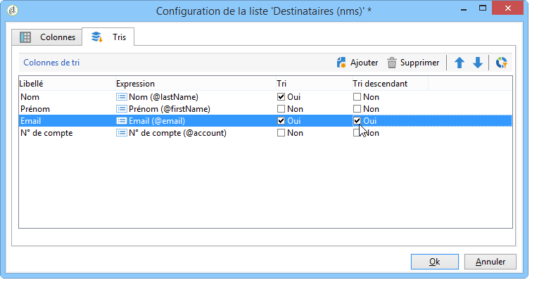

1. La priorité du tri est définie par l&#39;ordre des colonnes de tri. Pour changer la priorité, modifiez l&#39;ordre des colonnes à partir des icônes correspondantes.

   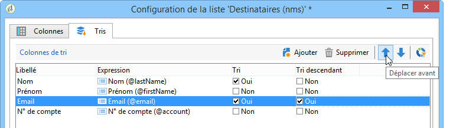

   La priorité du tri n&#39;a aucune incidence sur l&#39;affichage des colonnes de la liste.

1. Cliquez sur **[!UICONTROL OK]** pour valider ce paramétrage et visualiser le résultat dans la liste.

### Recherche d&#39;éléments {#running-a-search}

Vous pouvez lancer une recherche parmi les champs disponibles dans un éditeur à l’aide du champ **[!UICONTROL Rechercher]** situé au-dessus de la liste des champs. Appuyez sur la touche **Entrée** du clavier ou parcourez la liste. Les libellés des champs correspondant à votre recherche apparaissent en gras.

>[!NOTE]
>
>Vous pouvez créer des filtres pour n&#39;afficher qu&#39;une partie des données d&#39;une liste. [En savoir plus](../../platform/using/creating-filters.md).
