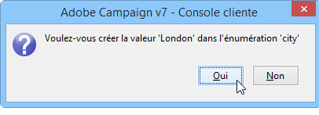

# Espace de travail Adobe Campaign{#adobe-campaign-workspace}

## Exploration de l’interface Adobe Campaign {#about-adobe-campaign-interface}

Une fois connecté à la base de données, vous accédez à la page d&#39;accueil d&#39;Adobe Campaign. Celle-ci se présente sous la forme d&#39;un tableau de bord : il est composé de liens et de raccourcis qui vous permettent d&#39;accéder aux fonctions disponibles selon votre installation et aux paramétrages généraux de la plateforme.

Depuis la section centrale de la page d&#39;accueil, vous pouvez utiliser les liens pour accéder au portail de la documentation en ligne, au forum et au site web d&#39;assistance de Campaign.

[ Découvrir l’espace de travail Campaign en vidéo](#video)

>[!NOTE]
>
>Les fonctions Adobe Campaign disponibles sur votre instance dépendent des modules et composants additionnels installés. Selon vos autorisations et configurations spécifiques, certaines d&#39;entre elles peuvent ne pas être disponibles.
>
>Avant d’installer un module ou un composant additionnel, vous devez vérifier votre contrat de licence ou contacter votre chargé de compte Adobe.

### Accès console et accès web {#console-and-web-access}

La plateforme Adobe Campaign est accessible via une console ou par le biais d’un navigateur Internet. Consultez les navigateurs compatibles dans la section relative à la [matrice de compatibilité](../../rn/using/compatibility-matrix.md#Browsers).

L’interface d’accès web est similaire à l’interface de la console. Depuis un navigateur, vous pouvez utiliser les mêmes fonctionnalités de navigation et d’affichage que dans la console, mais vous ne pouvez exécuter qu’un ensemble réduit d’actions sur les campagnes. Par exemple, vous pouvez afficher et annuler des campagnes, mais vous ne pouvez pas les modifier. Pour un même opérateur, une campagne sera affichée dans la console avec les options suivantes :

Dans le contexte d’un accès web, les options seront en revanche principalement consultatives :

En savoir plus sur l’[utilisation de l’interface web.](../../campaign/using/accessing-marketing-campaigns.md#using-the-web-interface-).

### Langues {#languages}

La langue est sélectionnée lors de l&#39;installation de votre instance Adobe Campaign Classic.

Cinq langues sont disponibles :

* Anglais (Royaume-Uni)
* Anglais (États-Unis)
* Français
* Allemand
* Japonais

La langue choisie pour votre instance Adobe Campaign Classic peut avoir une incidence sur les formats de date et d’heure. Voir à ce propos cette [section](../../platform/using/adobe-campaign-workspace.md#date-and-time).

Pour plus d’informations sur la création d’une instance, consultez cette [page](../../installation/using/creating-an-instance-and-logging-on.md).

>[!CAUTION]
>
>La langue ne peut pas être modifiée après la création de l&#39;instance.

## Notions de base relatives à la navigation {#navigation-basics}

### Navigation sur les pages {#browsing-pages}

Les différentes fonctionnalités de la plateforme sont réparties dans les fonctions principales : utilisez les liens proposés dans le bandeau supérieur de l&#39;interface pour y accéder.

La liste des fonctions principales auxquelles vous pouvez accéder dépend des packages et des composants additionnels installés, ainsi que de vos droits d&#39;accès.

Chaque fonction propose un ensemble de fonctionnalités, organisé selon les besoins métiers relatifs au contexte d&#39;utilisation. Ainsi, le lien **[!UICONTROL Profils et cibles]** vous permet d’accéder aux listes de destinataires, aux services d’abonnement, aux workflows de ciblage existants et aux raccourcis pour créer ces éléments.

Ainsi, les listes sont accessibles à partir du lien **[!UICONTROL Listes]** proposé dans la section gauche de l&#39;interface **[!UICONTROL Profils et cibles]**.

### Utilisation des onglets {#using-tabs}

* Lorsque vous cliquez sur une fonction principale ou un lien, la page correspondante vient remplacer la page courante. Pour retourner sur la page précédente, utilisez le bouton **[!UICONTROL Retour]** de la barre d&#39;outils. Pour revenir à la page d&#39;accueil, cliquez sur le bouton **[!UICONTROL Accueil]**.

  

* Dans le cas d&#39;un menu ou d&#39;un raccourci vers un écran terminal (tel qu&#39;une application web, un programme, une diffusion, un rapport, une tâche, etc.), la page correspondante est affichée sous un nouvel onglet. Ainsi, vous pouvez naviguer d&#39;une page à l&#39;autre en cliquant sur l&#39;onglet correspondant.

  

### Création d’un élément {#creating-an-element}

Dans chaque section des fonctions principales, vous pouvez naviguer parmi les éléments disponibles. Pour cela, utilisez les raccourcis proposés dans la section **[!UICONTROL Navigation]**. Le lien **[!UICONTROL Autres choix]** permet d&#39;accéder à toutes les autres pages, indépendamment de celles de la fonction courante.

Vous pouvez créer un nouvel élément (diffusion, application web, workflow, etc.) à l’aide des raccourcis de la section **[!UICONTROL Créer]** dans la partie gauche de l’écran. Utilisez le bouton **[!UICONTROL Créer]** situé au-dessus de la liste pour ajouter de nouveaux éléments à la liste.

Par exemple, au niveau de la page des diffusions, utilisez le bouton **[!UICONTROL Créer]** pour créer une nouvelle diffusion.

## Formats et unités {#formats-and-units}

### Date et heure {#date-and-time}

La langue de votre instance Adobe Campaign Classic a un impact sur les formats de date et d’heure.

La langue est sélectionnée lors de l’installation de Campaign et ne peut plus être modifiée par la suite. Vous pouvez sélectionner : Anglais (US), Anglais (UK), Français, Allemand ou Japonais. Pour plus d’informations, consultez [cette page](../../installation/using/creating-an-instance-and-logging-on.md).

Les principales différences entre l&#39;anglais américain et l&#39;anglais britannique sont les suivantes :

<table> 
 <thead> 
  <tr> 
   <th> Formats  </th> 
   <th> Anglais (États-Unis)  </th> 
   <th> Anglais (UK)  </th> 
  </tr> 
 </thead> 
 <tbody> 
  <tr> 
   <td> Date  </td> 
   <td> La semaine commence le dimanche  </td> 
   <td> La semaine commence le lundi  </td> 
  </tr> 
  <tr> 
   <td> Date courte  </td> 
   <td> 
%2M/%2D/%4Y

<strong>ex : 09/25/2018</strong>
 </td> 
   <td> 
%2D/%2M/%4Y

<strong>ex : 25/09/2018</strong>
 </td> 
  </tr> 
  <tr> 
   <td> Date courte avec heure  </td> 
   <td> 
%2M/%2D/%4Y %I:%2N:%2S %P

<strong>ex : 09/25/2018 10:47:25 PM</strong>
 </td> 
   <td> 
%2D/%2M/%4Y %2H:%2N:%2S

<strong>ex : 25/09/2018 22:47:25</strong>
 </td> 
  </tr> 
 </tbody> 
</table>

### Ajouter des valeurs dans une énumération {#add-values-in-an-enumeration}

Lorsque vous utilisez des champs de saisie avec une liste déroulante, vous pouvez saisir une valeur d’énumération qui peut être stockée et proposée comme option dans la liste déroulante. Par exemple, dans le champ **[!UICONTROL Ville]** de l’onglet **[!UICONTROL Général]** d’un profil de destinataire, vous pouvez saisir Londres. Lorsque vous appuyez sur Entrée pour confirmer cette valeur, un message vous demande si vous souhaitez l’enregistrer pour l’énumération associée au champ.

Si vous cliquez sur **[!UICONTROL Oui]**, cette valeur sera disponible dans la liste déroulante du champ correspondant (ici : **[!UICONTROL Londres]**).

>[!NOTE]
>
>Les énumérations sont gérées par l&#39;administrateur via la section **[!UICONTROL Administration > Plateforme > Enumérations]**. Pour plus d&#39;informations, consultez la section [Gestion des énumérations](../../platform/using/managing-enumerations.md).

### Unités par défaut {#default-units}

Dans les champs qui expriment une durée (par exemple : période de validité des ressources d&#39;une diffusion, délai de validation d&#39;une tâche, etc.), la valeur peut être exprimée dans les **unités** suivantes :

* **[!UICONTROL s]** pour les secondes,
* **[!UICONTROL mn]** pour les minutes,
* **[!UICONTROL h]** pour les heures,
* **[!UICONTROL j]** pour les jours.

## Tutoriel vidéo {#video}

Cette vidéo présente l‘espace de travail de Campaign Classic.

>[!VIDEO](https://video.tv.adobe.com/v/35130?quality=12)

D’autres vidéos pratiques sur Campaign Classic sont disponibles [ici](https://experienceleague.adobe.com/docs/campaign-classic-learn/tutorials/overview.html?lang=fr).
