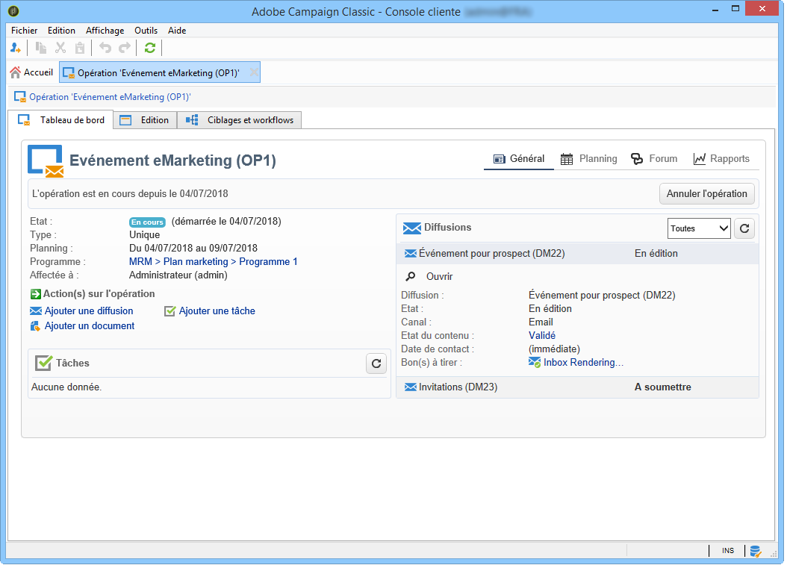
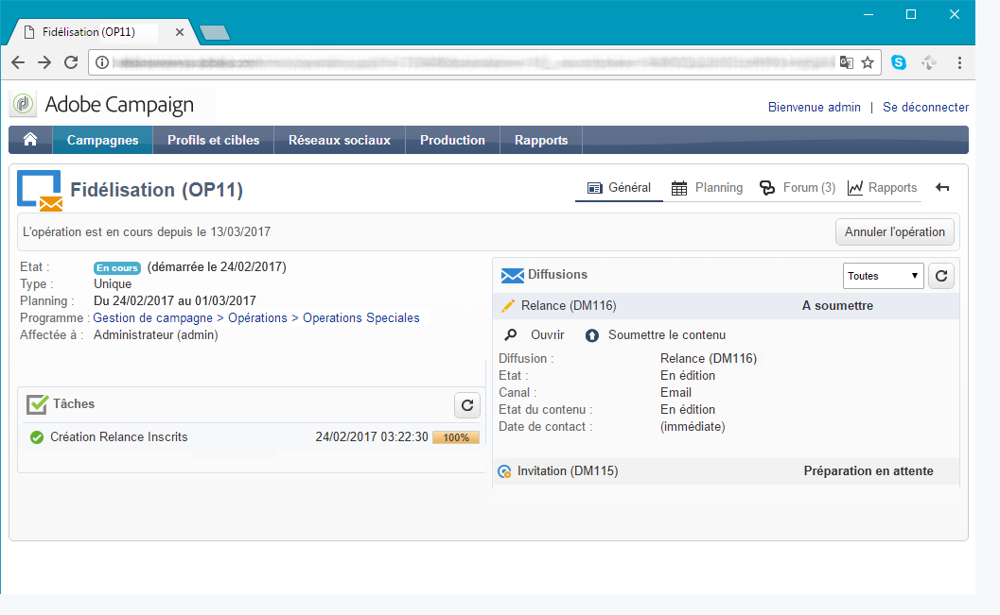
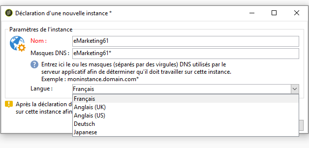
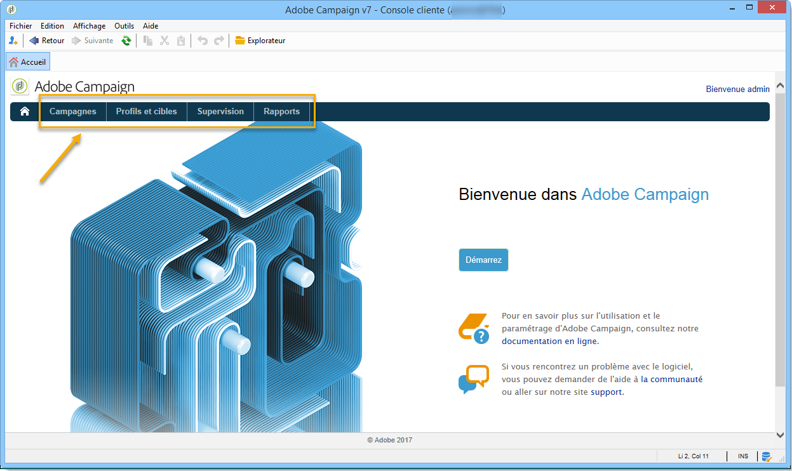
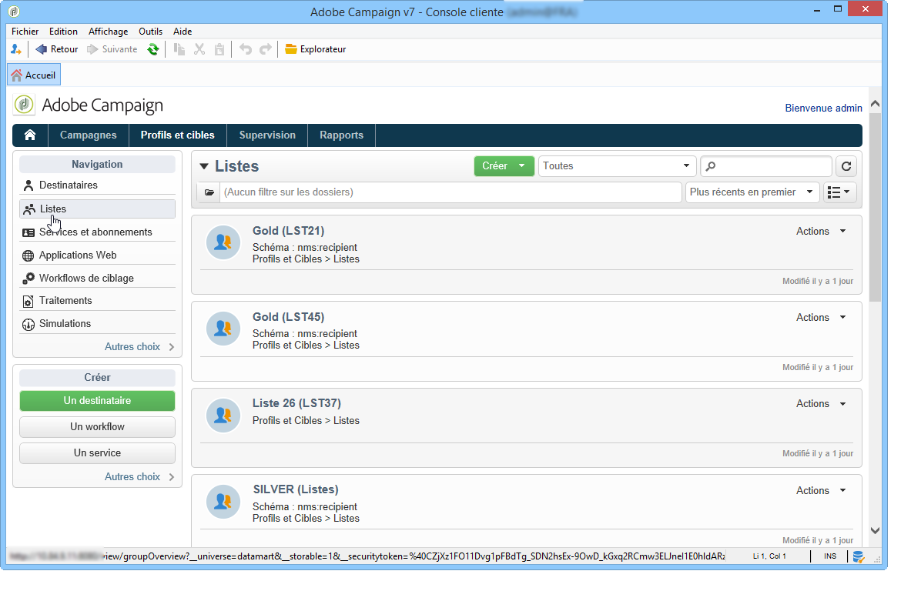
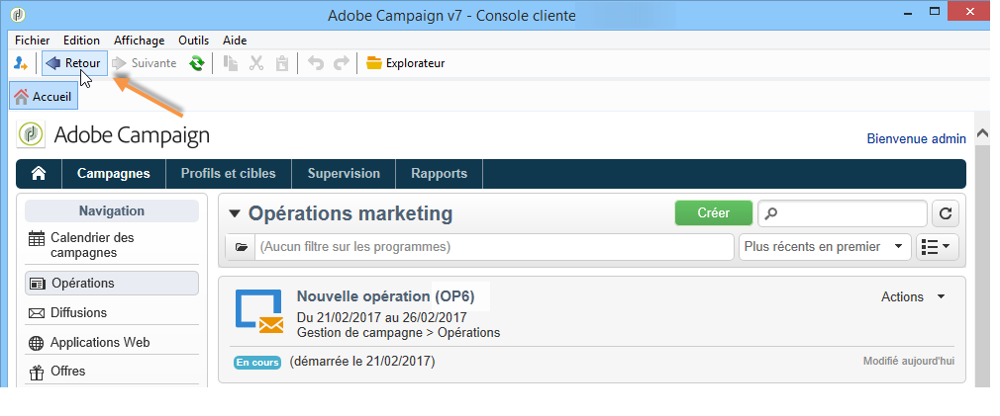
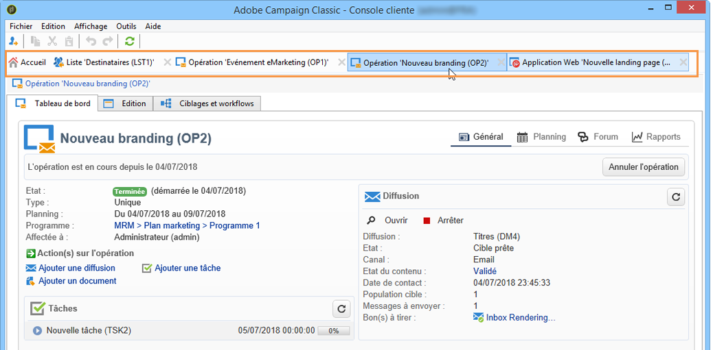
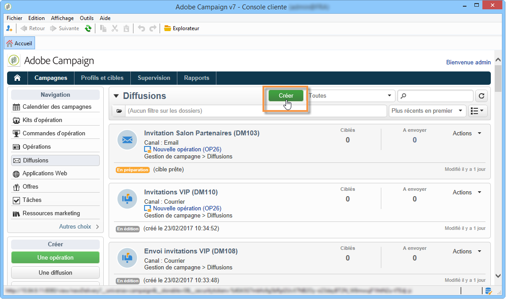
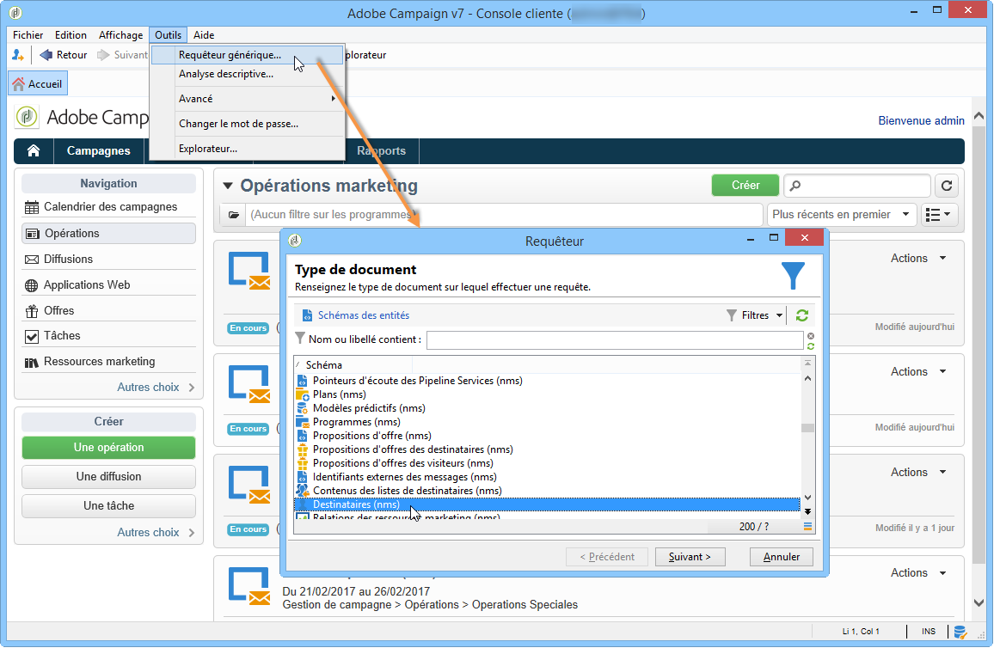

# Espace de travail Adobe Campaign {#adobe-campaign-workspace}

## Exploration de l’interface Adobe Campaign {#about-adobe-campaign-interface}

Une fois votre connexion à la base de données établie, vous accédez à la page d’accueil d’Adobe Campaign. Cette page est votre tableau de bord : elle est composée de liens et de raccourcis qui vous permettent d’accéder aux différentes fonctionnalités, en fonction de votre installation et des configurations générales de la plateforme.

À partir de la section centrale de la page d’accueil, vous pouvez utiliser les liens pour accéder au portail de la documentation de Campaign, à la communauté Campaign et au site web de l’assistance clientèle d’Adobe.

[ Découvrir l’espace de travail Campaign en vidéo](#video)

>[!NOTE]
>
>Les fonctions Adobe Campaign disponibles sur votre instance dépendent des modules et composants additionnels installés. Selon vos autorisations et configurations spécifiques, certaines d&#39;entre elles peuvent ne pas être disponibles.
>
>Avant d’installer un module ou un composant additionnel, vous devez vérifier votre contrat de licence ou contacter votre chargé de compte Adobe.

### Accès console et accès web {#console-and-web-access}

La plateforme Adobe Campaign est accessible via une console ou par le biais d’un navigateur Internet. Consultez les navigateurs compatibles dans la section relative à la [matrice de compatibilité](../../rn/using/compatibility-matrix.md#Browsers).

L’interface d’accès web est similaire à l’interface de la console. Depuis un navigateur, vous pouvez utiliser les mêmes fonctionnalités de navigation et d’affichage que dans la console, mais vous ne pouvez exécuter qu’un ensemble réduit d’actions sur les campagnes. Par exemple, vous pouvez afficher et annuler des campagnes, mais vous ne pouvez pas les modifier. Pour un même opérateur, une campagne sera affichée dans la console avec les options suivantes :

Dans le contexte d’un accès web, les options seront en revanche principalement consultatives :

En savoir plus sur l’utilisation de l’interface web dans la [documentation de Campaign v8](https://experienceleague.adobe.com/docs/campaign/automation/campaign-orchestration/marketing-campaign-create.html?lang=fr#use-the-web-interface-){target=_blank}.

### Langues {#languages}

La langue est sélectionnée lors de l’installation de votre instance Adobe Campaign Classic.

Vous pouvez choisir parmi les langues suivantes :

* Anglais (Royaume-Uni)
* Anglais (États-Unis)
* Français
* Allemand
* Japonais

La langue choisie pour votre instance Adobe Campaign Classic peut avoir une incidence sur les formats de date et d’heure. Pour plus d’informations à ce sujet, consultez la [documentation de Campaign v8 (console)](https://experienceleague.adobe.com/fr/docs/campaign/campaign-v8/new/campaign-ui){target=_blank}.

Pour plus d’informations sur la création d’une instance, consultez cette [page](../../installation/using/creating-an-instance-and-logging-on.md).

>[!CAUTION]
>
>La langue ne peut pas être modifiée après la création de l&#39;instance.

## Notions de base relatives à la navigation {#navigation-basics}

Les différentes fonctionnalités de la plateforme sont réparties dans les fonctions principales : utilisez les liens proposés dans le bandeau supérieur de l&#39;interface pour y accéder.

La liste des fonctions principales auxquelles vous pouvez accéder dépend des packages et des composants additionnels installés, ainsi que de vos droits d&#39;accès.

### Navigation sur les pages {#browsing-pages}

Chaque fonction propose un ensemble de fonctionnalités, organisé selon les besoins métiers relatifs au contexte d&#39;utilisation. Ainsi, le lien **[!UICONTROL Profils et cibles]** vous permet d’accéder aux listes de destinataires, aux services d’abonnement, aux workflows de ciblage existants et aux raccourcis pour créer ces éléments.

Ainsi, les listes sont accessibles à partir du lien **[!UICONTROL Listes]** proposé dans la section gauche de l&#39;interface **[!UICONTROL Profils et cibles]**.

### Utilisation des onglets {#using-tabs}

* Lorsque vous cliquez sur une fonction principale ou un lien, la page correspondante vient remplacer la page courante. Pour revenir à la page précédente, cliquez sur le bouton **[!UICONTROL Retour]** de la barre d’outils. Pour revenir à la page d&#39;accueil, cliquez sur le bouton **[!UICONTROL Accueil]**.

  

* Dans le cas d&#39;un menu ou d&#39;un raccourci vers un écran terminal (tel qu&#39;une application web, un programme, une diffusion, un rapport, une tâche, etc.), la page correspondante est affichée sous un nouvel onglet. Ainsi, vous pouvez naviguer d&#39;une page à l&#39;autre en cliquant sur l&#39;onglet correspondant.

  

### Création d’un élément {#creating-an-element}

Dans chaque section des fonctions principales, vous pouvez naviguer parmi les éléments disponibles. Pour cela, utilisez les raccourcis proposés dans la section **[!UICONTROL Navigation]**. Le lien **[!UICONTROL Autres choix]** permet d&#39;accéder à toutes les autres pages, indépendamment de celles de la fonction courante.

Vous pouvez créer un nouvel élément (diffusion, application web, workflow, etc.) à l’aide des raccourcis dans la section **[!UICONTROL Créer]** sur la gauche de l’écran. Utilisez le bouton **[!UICONTROL Créer]** situé au-dessus de la liste pour ajouter de nouveaux éléments à la liste.

Par exemple, au niveau de la page des diffusions, utilisez le bouton **[!UICONTROL Créer]** pour créer une nouvelle diffusion.

## Utilisation de l’explorateur Adobe Campaign {#using-adobe-campaign-explorer}

L&#39;explorateur Adobe Campaign est accessible à partir de l&#39;icône de la barre d&#39;outils. Il permet d’accéder à l’ensemble des fonctionnalités d’Adobe Campaign, aux écrans de configuration et à une vue plus détaillée de certains éléments de la plateforme.

Pour en savoir plus sur l’explorateur d’Adobe Campaign, consultez les pages suivantes dans la **documentation de Campaign v8 (console)** :

* [Vue d’ensemble de l’interface d’utilisation de Campaign](https://experienceleague.adobe.com/fr/docs/campaign/campaign-v8/new/campaign-ui){target=_blank}

* [Paramètres de l’interface d’utilisation de Campaign](https://experienceleague.adobe.com/fr/docs/campaign/campaign-v8/config/configuration/ui-settings){target=_blank}

* [Gestion des dossiers et des vues dans l’explorateur](https://experienceleague.adobe.com/fr/docs/campaign/campaign-v8/config/configuration/folders-and-views){target=_blank}

## Utilisation des données {#work-with-data}

### Filtrer des données {#filters}

Le filtrage des données consiste à réduire un jeu de données aux enregistrements qui correspondent à des critères spécifiques. Ce sous-ensemble peut ensuite être utilisé pour des actions ciblées (telles que des mises à jour ou la création d’audiences) ou pour des analyses.

Lorsque vous naviguez dans Campaign, les données sont affichées dans des listes. Vous pouvez appliquer des filtres intégrés pour accéder rapidement à un sous-ensemble défini, tel que des adresses en quarantaine, des personnes destinataires non ciblées ou des enregistrements avec une plage d’âge spécifique ou une date de création spécifique. Vous pouvez également créer des filtres personnalisés, les enregistrer pour une utilisation ultérieure ou les partager avec d’autres utilisateurs et utilisatrices de Campaign.

Découvrez comment **accéder aux filtres, les concevoir et les partager** dans la documentation de [Campaign v8 (console)](https://experienceleague.adobe.com/fr/docs/campaign/campaign-v8/audience/create-filters){target=_blank}.

### Interrogation de la base de données{#about-queries-in-campaign}

L’outil de requête est disponible à différents niveaux dans l’application et peut être utilisé pour définir des populations cibles, segmenter la clientèle, extraire et filtrer des journaux de suivi, créer des filtres, etc.

+++À propos du requêteur générique

Il fournit un assistant dédié, le requêteur générique, accessible à partir du menu **[!UICONTROL Outils > Requêteur générique…]**. Ce requêteur permet aux requêtes de base de données d’extraire, d’organiser, de regrouper et de trier des informations. Il peut, par exemple, récupérer les destinataires ayant cliqué plus de n fois sur un lien de newsletter au cours d’une période donnée.

Le requêteur générique centralise toutes les fonctionnalités de requête. Il permet la création et le stockage de filtres de restriction, qui peuvent ensuite être réutilisés dans d’autres contextes, tels que la zone Requête d’un workflow de ciblage.

+++

>[!BEGINTABS]

>[!TAB Interroger la base de données avec une requête]

Les étapes de création d’une requête sont détaillées dans la **[documentation de Campaign v8 (console)](https://experienceleague.adobe.com/fr/docs/campaign/campaign-v8/data/query/query-editor){target=_blank}**.

{target=_blank}

>[!TAB Ajouter une requête dans un workflow]

Découvrez les principales étapes relatives à la création de requêtes dans le contexte d’un workflow via la documentation de **[Campaign v8](https://experienceleague.adobe.com/fr/docs/campaign/automation/workflows/wf-activities/targeting-activities/query){target=_blank}**.

{target=_blank}

>[!TAB Conditions de filtrage]

Pour concevoir votre requête, vous devez sélectionner les conditions de filtrage dans le requêteur. Les fonctionnalités disponibles et les cas d’utilisation sont détaillés dans la **[documentation de Campaign v8](https://experienceleague.adobe.com/fr/docs/campaign/campaign-v8/data/query/filter-conditions){target=_blank}**.

{target=_blank}

>[!ENDTABS]

### Gestion des listes {#manage-and-customize-lists}

Dans la console cliente Campaign, les données sont affichées dans des listes. Vous pouvez adapter ces listes à vos besoins. Vous pouvez par exemple ajouter des colonnes, filtrer les données, comptabiliser les enregistrements, enregistrer et partager vos paramètres.

Découvrez comment **gérer et personnaliser des listes** dans la [documentation de Campaign v8 (console)](https://experienceleague.adobe.com/fr/docs/campaign/campaign-v8/config/configuration/ui-settings#customize-lists){target=_blank}.

### Gérer les énumérations{#managing-enumerations}

Une énumération (également appelée liste détaillée) est une liste prédéfinie de valeurs que vous pouvez utiliser pour renseigner certains champs. Les énumérations permettent de normaliser les valeurs de champ, de rendre la saisie de données plus cohérente et de simplifier les requêtes.

Une fois définies, les valeurs sont affichées dans une liste déroulante. Une valeur peut être sélectionnée directement ou saisie à l’aide d’une entrée prédictive, qui suggère et complète les entrées correspondantes. Certains champs contiennent des énumérations prédéfinies. Des énumérations supplémentaires peuvent être créées si nécessaire.

Découvrez comment **utiliser les énumérations** dans la [documentation d’Adobe Campaign v8 (console)](https://experienceleague.adobe.com/fr/docs/campaign/campaign-v8/config/settings/enumerations){target=_blank}.

## Tutoriel vidéo {#video}

Cette vidéo présente l’espace de travail de Campaign Classic.

>[!VIDEO](https://video.tv.adobe.com/v/35130?quality=12)
