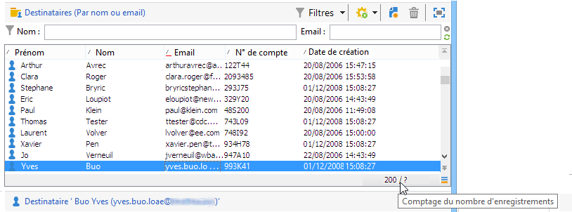
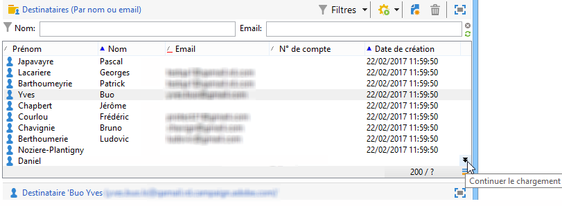
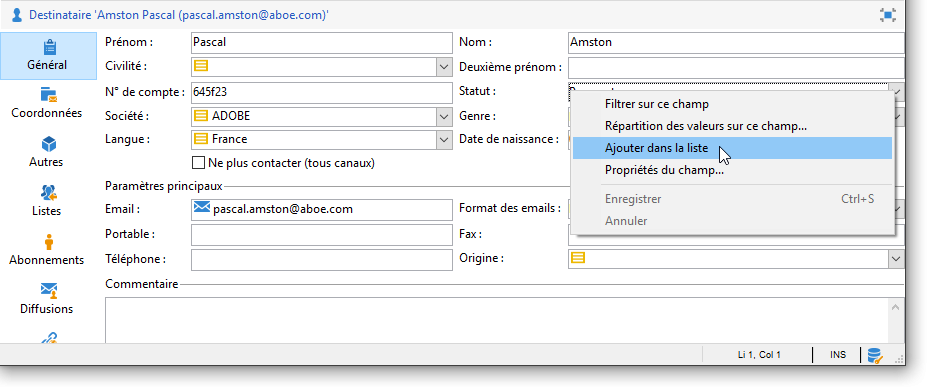
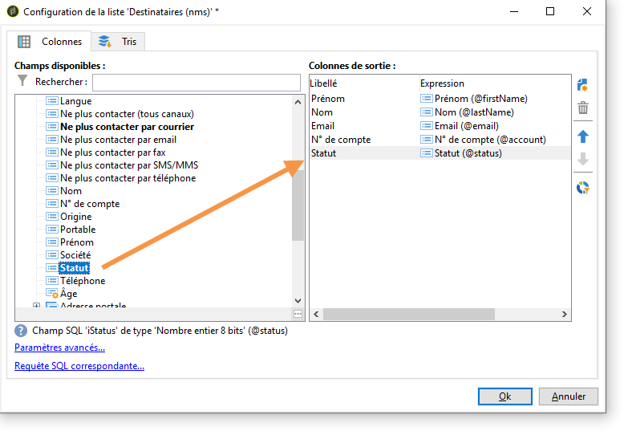
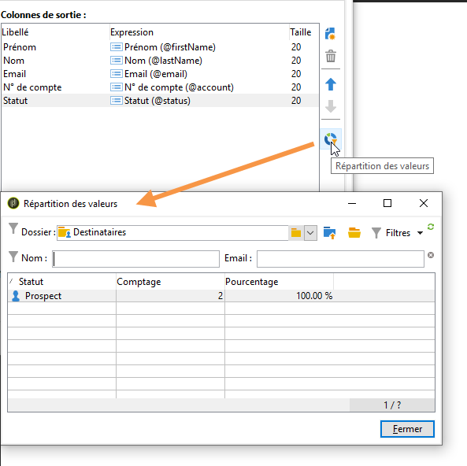
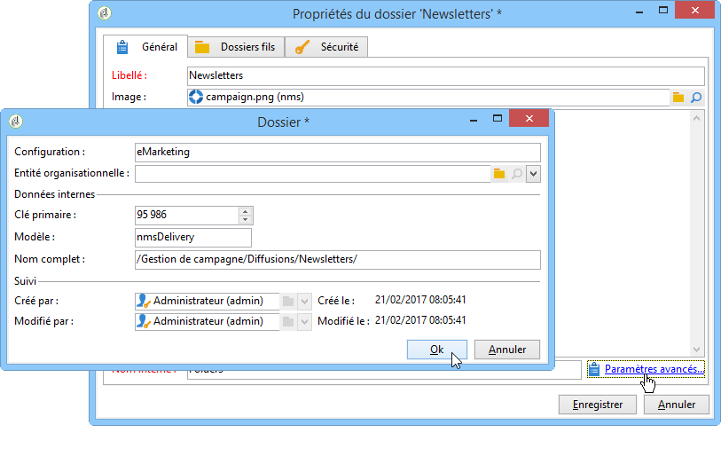
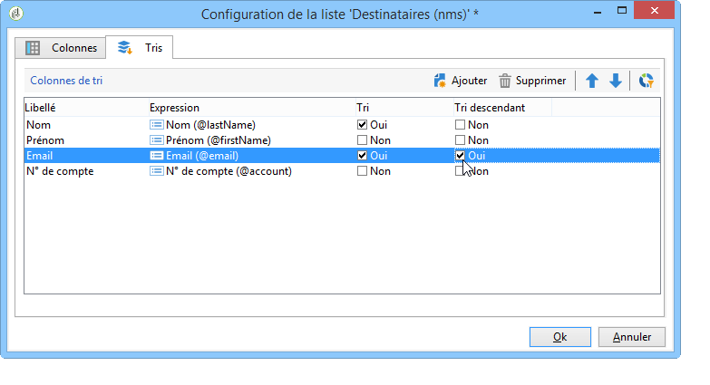
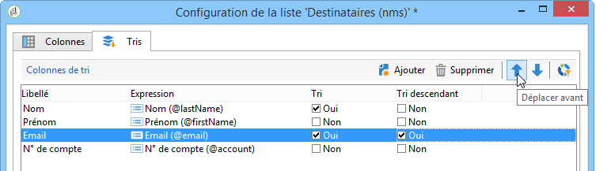

# Espace de travail Adobe Campaign{#adobe-campaign-workspace}

## A propos de l&#39;interface Adobe Campaign {#about-adobe-campaign-interface}

Une fois connecté à la base de données, vous accédez à la page d&#39;accueil d&#39;Adobe Campaign. Celle-ci se présente sous la forme d&#39;un tableau de bord : il est composé de liens et de raccourcis qui vous permettent d&#39;accéder aux fonctions disponibles selon votre installation et aux paramétrages généraux de la plate-forme.

Depuis la section centrale de la page d&#39;accueil, vous pouvez utiliser les liens pour accéder au portail de la documentation en ligne, au forum et au site web d&#39;assistance de Campaign.

La capture d&#39;écran ci-dessus est un exemple de page d&#39;accueil pour un utilisateur Adobe Campaign. Regardez à ce propos [la vidéo de présentation de l&#39;interface](https://docs.adobe.com/content/help/en/campaign-learn/campaign-classic-tutorials/getting-started/interface-overview.html).

>[!NOTE]
>
>Les fonctions Adobe Campaign disponibles sur votre instance dépendent des modules et composants additionnels installés. Selon vos permissions et configurations spécifiques, certaines d&#39;entre elles peuvent ne pas être disponibles.
>
>Avant d’installer un module ou un composant additionnel, vous devez vérifier votre contrat de licence ou contacter votre chargé de compte Adobe.

### Accès console et accès web {#console-and-web-access}

La plate-forme Adobe Campaign est accessible via une console ou par le biais d&#39;un navigateur Internet.

L&#39;accès web présente une interface similaire à celle de la console, mais permet d&#39;accéder à un jeu de fonctionnalités réduit.

Par exemple, pour un même opérateur, une opération sera affichée dans la console avec les options suivantes :

Tandis que, dans le contexte d&#39;un accès Web, les options seront principalement consultatives :

### Langues {#languages}

La langue est sélectionnée lors de l’installation de votre instance  Adobe Campaign Classic et ne peut plus être modifiée par la suite. For more information on how to create an instance, refer to this [page](../../installation/using/creating-an-instance-and-logging-on.md).

Vous pouvez choisir entre cinq langues différentes :

* Anglais (US)
* Anglais (UK)
* Français
* Allemand
* Japonais

La langue choisie pour votre instance  Adobe Campaign Classic peut avoir une incidence sur les formats de date et d’heure. Voir à ce propos cette [section](../../platform/using/adobe-campaign-workspace.md#date-and-time).

## Principes de navigation {#navigation-basics}

### Parcourir les pages {#browsing-pages}

Les différentes fonctionnalités de la plate-forme sont réparties dans les fonctions principales : utilisez les liens proposés dans le bandeau supérieur de l&#39;interface pour y accéder.

La liste des fonctions principales auxquelles vous pouvez accéder dépend des packages et des composants additionnels installés, ainsi que de vos droits d&#39;accès.

Chaque fonctionnalité comprend un ensemble de fonctionnalités basées sur les besoins et le contexte d’utilisation liés aux . Par exemple, le **[!UICONTROL Profiles and targets]** lien vous conduit au de, à la , aux  de ciblage existants et aux raccourcis pour créer ces éléments.

The lists are available via the **[!UICONTROL Lists]** link in the left-hand section of the **[!UICONTROL Profiles and Targets]** interface.

### Utiliser les onglets {#using-tabs}

* Lorsque vous cliquez sur une fonctionnalité principale ou sur un lien, la page appropriée remplace la page active. Pour revenir à la page précédente, cliquez sur le **[!UICONTROL Back]** bouton de la barre d’outils. Pour revenir au , cliquez sur le **[!UICONTROL Home]** bouton.

   

* Dans le cas d&#39;un menu ou d&#39;un raccourci vers un écran terminal (tel qu&#39;une application web, un programme, une diffusion, un rapport, une tâche, etc.), la page correspondante est affichée sous un nouvel onglet. Ainsi, vous pouvez naviguer d&#39;une page à l&#39;autre en cliquant sur l&#39;onglet correspondant.

   

### Créer un élément {#creating-an-element}

Chaque section de fonctionnalités principales vous permet de parcourir les éléments disponibles. Pour ce faire, utilisez les raccourcis de la **[!UICONTROL Browsing]** section. Le **[!UICONTROL Other choices]** lien vous permet d’accéder à toutes les autres pages, quel que soit  .

Vous pouvez créer un nouvel élément (, , flux de travail, etc.) à l’aide des raccourcis de la **[!UICONTROL Create]** section située à gauche de l’écran. Utilisez le **[!UICONTROL Create]** bouton au-dessus du  pour ajouter de nouveaux éléments au .

For example, on the delivery page, use the **[!UICONTROL Create]** button to create a new delivery.

## Utiliser l&#39;explorateur Adobe Campaign {#using-adobe-campaign-explorer}

### A propos de l&#39;explorateur Adobe Campaign {#about-adobe-campaign-explorer}

L&#39;explorateur Adobe Campaign est accessible à partir de l&#39;icône de la barre d&#39;outils. Il permet d&#39;accéder à l&#39;ensemble des fonctions d&#39;Adobe Campaign, aux écrans de paramétrage et à une vue plus détaillée de certains éléments de la plate-forme.

The **[!UICONTROL Explorer]** workspace is divided into three zones:

**1 - Arborescence** : vous pouvez personnaliser le contenu de l&#39;arborescence (ajouter, déplacer, supprimer des nœuds). Cette opération est réservée à des utilisateurs experts. Pour plus d&#39;informations, consultez [cette page](../../configuration/using/about-navigation-hierarchy.md).

**2 - Liste** : vous pouvez filtrer cette liste, lancer des recherches, ajouter des informations ou trier les données.

**3 - Détails** : vous pouvez afficher le détail de l&#39;élément sélectionné. L&#39;icône située dans la section supérieure droite permet d&#39;afficher ces informations en plein écran.

### Résolution d&#39;écran {#screen-resolution}

Pour une navigation et une convivialité optimales, Adobe recommande l&#39;utilisation d&#39;une résolution d&#39;écran minimale de 1 600x900 pixels.

>[!CAUTION]
>
>Les résolutions inférieures à 1 600x900 pixels peuvent ne pas être prises en charge par Adobe Campaign.

In the **[!UICONTROL Explorer]** workspace, if some parts of the **[!UICONTROL Details]** zone appear to be truncated, expand it using the arrow on top of the zone or click the **[!UICONTROL Enlarge]** button.

### Naviguer dans les listes {#browsing-lists}

Pour naviguer dans une liste, vous pouvez utiliser **les ascenseurs** (barres de défilement horizontal et vertical) afin de faire défiler la liste sans changer d&#39;enregistrement sélectionné, **la molette de la souris**, ou **les flèches du clavier**.

>[!NOTE]
>
>Configuration and personalization of list content are presented in [Configuring lists](#configuring-lists).
>
>Vous pouvez également trier et filtrer les données. Voir Options [de](../../platform/using/filtering-options.md)filtrage.

### Compter les enregistrements {#counting-records}

Par défaut, Adobe Campaign charge en mémoire les 200 premiers enregistrements d&#39;une liste. Par conséquent, l&#39;affichage ne propose pas nécessairement l&#39;intégralité des enregistrements de la table dont vous affichez le contenu. Vous pouvez lancer un décompte du nombre d&#39;enregistrements de la liste et déclencher le chargement en mémoire d&#39;enregistrements supplémentaires.

In the lower right-hand part of the list screen, a **[!UICONTROL counter]** shows how many records have been loaded and the total number of records in the database (after applying any filters):

Si un &quot;**?**&quot; apparaît à la place du nombre de droite, cliquez sur le compteur pour lancer le calcul.

### Charger d&#39;autres enregistrements {#loading-more-records}

To load (and therefore display) additional records (200 lines by default) click **[!UICONTROL Continue loading]**.

To load all the records, right-click the list and select **[!UICONTROL Load all]**.

>[!CAUTION]
>
>La durée du chargement de la liste entière peut être longue, selon le nombre d&#39;enregistrements.

### Modifier le nombre d&#39;enregistrements par défaut {#change-default-number-of-records}

To change the default number of records loaded, click **[!UICONTROL Configure list]** in the bottom right-hand corner of the list.

Dans la fenêtre de configuration de la liste, cliquez sur le lien &quot;Paramètres avancés&quot; (en bas à gauche) et modifiez le nombre de lignes à récupérer.

### Configurer les listes {#configuring-lists}

#### Ajouter des colonnes {#add-columns}

Deux méthodes permettent d&#39;ajouter une colonne à une liste.

Vous pouvez ajouter rapidement une colonne à une liste à partir du détail d’un enregistrement. Pour cela :

1. Depuis un écran de détail, cliquez avec le bouton droit sur le champ à afficher dans une colonne.
1. Sélectionner **[!UICONTROL Add in the list]**.

   La colonne est ajoutée à droite des colonnes déjà affichées.

Une autre méthode pour ajouter des colonnes, lorsque vous souhaitez afficher des données qui ne sont pas affichées sur l&#39;écran de détail, consiste à utiliser la fenêtre de configuration de liste. Pour cela :

1. Click **[!UICONTROL Configure list]** below and to the right of the list.

   

1. In the list configuration window, double-click the field to be added in the **[!UICONTROL Available fields]** list in order to add it to the **[!UICONTROL Output columns]**.

   

   >[!NOTE]
   >
   >Par défaut, les champs avancés ne sont pas affichés. Pour les afficher, cliquez sur l&#39;icône **Afficher les champs avancés**, située en bas à droite de la liste des champs disponibles.
   >
   >Les libellés sont affichés par table puis par ordre alphabétique.
   >
   >Use the **Search** field to run a search in the available fields. Pour plus d’informations, voir [Tri d’un](#sorting-a-list).
   >
   >Les champs sont identifiés par des icônes spécifiques : champs SQL, tables liées, champs calculés, etc. Pour chaque champ sélectionné, la description est affichée sous la liste des champs disponibles.
   [Configurer les listes](#configuring-lists).
   >
   >Vous pouvez également trier et filtrer les données. Voir Options [de](../../platform/using/filtering-options.md)filtrage.

1. Répétez la procédure pour chaque colonne à afficher.
1. Utilisez les flèches pour modifier l&#39;**ordre d&#39;affichage**. La colonne la plus haute sera la plus à gauche dans la liste des enregistrements.

   

1. If you need, you can click **[!UICONTROL Distribution of values]** to view the repartition of values for the selected field in the current folder.

   

1. Cliquez sur **[!UICONTROL OK]** pour valider la configuration et visualiser le résultat.

#### Créer une nouvelle colonne {#create-a-new-column}

Vous pouvez créer de nouvelles colonnes pour afficher des champs supplémentaires dans la liste. Pour cela :

1. Click **[!UICONTROL Configure the list]** at below and to the right of the list.
1. Click **[!UICONTROL Add]** to display a new field in the list.

#### Retirer une colonne {#remove-a-column}

You can mask one or more columns in a list of records using **[!UICONTROL Configure list]** located below and to the right of the list.

In the list configuration window, select the column to be masked from the **[!UICONTROL Output columns]** zone, and click the delete button.

Répétez cette opération pour chaque colonne à masquer. Cliquez sur **[!UICONTROL OK]** pour valider la configuration et visualiser le résultat.

#### Ajuster la largeur des colonnes {#adjust-column-width}

Lorsque la liste est active, c’est-à-dire lorsqu’au moins une ligne est sélectionnée, la touche F9 permet d’ajuster la largeur des colonnes afin d’afficher toutes les colonnes à l’écran.

#### Afficher les enregistrements des sous-dossiers {#display-sub-folders-records}

Les listes peuvent afficher :

* soit les enregistrements contenus dans le dossier sélectionné uniquement,
* soit les enregistrements du dossier sélectionné ET ceux de ses sous-dossiers.

To switch from one display mode to the other, click **[!UICONTROL Display sub-levels]** in the toolbar.

### Enregistrer une configuration de liste {#saving-a-list-configuration}

La configuration des listes est locale au poste de travail. Lorsque le cache local est vidé, les configurations locales sont désactivées.

Les paramétrages d&#39;affichage définis s&#39;appliquent par défaut à toutes les listes, pour le type de dossier correspondant. Ainsi, lorsque vous modifiez l&#39;affichage de la liste des destinataires à partir d&#39;un dossier, cette configuration sera appliquée à tous les autres dossiers de destinataires.

Toutefois, il est possible d&#39;enregistrer un ou plusieurs paramétrages afin de les appliquer à différents dossiers du même type. Le paramétrage est sauvegardé dans les propriétés du dossier qui contient les données et peut être réappliqué.

Par exemple, pour un dossier de diffusions, il est possible de paramétrer l&#39;affichage suivant :

Pour enregistrer cette configuration de liste en vue de la réutiliser, procédez comme suit :

1. Cliquez avec le bouton droit sur le dossier contenant les données affichées.
1. Sélectionner **[!UICONTROL Properties]**.
1. Click **[!UICONTROL Advanced settings]** and then specify a name in the **[!UICONTROL Configuration]** field.

   

1. Cliquez sur **[!UICONTROL OK]** , puis sur **[!UICONTROL Save]**.

Vous pouvez ensuite appliquer cette configuration à un autre dossier de type **Diffusions** :

Cliquez sur **[!UICONTROL Save]** dans la fenêtre des propriétés du dossier. L’affichage du  est modifié pour correspondre à la configuration spécifiée :

### Exporter une liste {#exporting-a-list}

To export data from a list, you must use an export wizard. To access it, select the elements to be exported from the list, right-click and select **[!UICONTROL Export...]**.

L&#39;utilisation des fonctions d&#39;importation et d&#39;exportation est expliquée dans la rubrique Importations et exportations [génériques](../../platform/using/generic-imports-and-exports.md).

>[!CAUTION]
>
>Les éléments d&#39;une liste ne doivent pas être exportés via la fonction Copier/Coller.

### Trier une liste {#sorting-a-list}

Les listes peuvent contenir un grand nombre de données. Vous pouvez trier ces données ou appliquer des filtres simples ou avancés. Le tri permet d&#39;afficher les données dans un ordre ascendant ou descendant, tandis que les filtres permettent de définir et de combiner des critères afin de n&#39;afficher qu&#39;une sélection de données.

Cliquez sur l&#39;en-tête de la colonne pour appliquer un tri ascendant, un tri descendant ou annuler le tri des données. Une flèche bleue devant le libellé de la colonne indique qu&#39;un tri est actif et l&#39;ordre du tri. Un tiret rouge devant le libellé de la colonne indique que le tri est appliqué à des données indexées depuis la base de données. Ce mode de tri permet d&#39;optimiser les actions de tri.

Vous pouvez également paramétrer le tri ou combiner les critères de tri. Pour cela, procédez comme suit :

1. **[!UICONTROL Configure list]** en bas et à droite de la .

   

1. In the list configuration window, click the **[!UICONTROL Sorting]** tab.
1. Sélectionnez les champs à trier et le sens du tri (ascendant/descendant).

   

1. La priorité du tri est définie par l&#39;ordre des colonnes de tri. Pour changer la priorité, modifiez l&#39;ordre des colonnes à partir des icônes correspondantes.

   

   La priorité du tri n&#39;a aucune incidence sur l&#39;affichage des colonnes de la liste.

1. Cliquez sur **[!UICONTROL Ok]** pour valider ce paramétrage et visualiser le résultat dans la liste.

### Lancer une recherche {#running-a-search}

Vous pouvez exécuter une recherche des champs disponibles dans un éditeur à l’aide du **[!UICONTROL Search]** champ situé au-dessus du  des champs. Appuyez sur **Entrée** sur le clavier ou parcourez le . Les champs correspondant à votre recherche auront des libellés en gras.

>[!NOTE]
>
>Vous pouvez créer des  pour n’afficher que certaines données dans un  de. Voir [Création de](../../platform/using/creating-filters.md).

## Formats et unités {#formats-and-units}

### Date et heure {#date-and-time}

La langue de votre instance Adobe Campaign Classic a un impact sur les formats de date et d’heure.

La langue est sélectionnée lors de l’installation de Campaign et ne peut plus être modifiée par la suite. Vous pouvez sélectionner : anglais (US), anglais (UK), français, allemand ou japonais. Voir à ce propos [cette page](../../installation/using/creating-an-instance-and-logging-on.md).

Les principales différences entre l&#39;anglais américain et l&#39;anglais britannique sont les suivantes :

<table> 
 <thead> 
  <tr> 
   <th> Formats  </th> 
   <th> Anglais (US)  </th> 
   <th> Anglais (UK)  </th> 
  </tr> 
 </thead> 
 <tbody> 
  <tr> 
   <td> Date  </td> 
   <td> La semaine commence le dimanche  </td> 
   <td> La semaine commence le lundi  </td> 
  </tr> 
  <tr> 
   <td> Date courte  </td> 
   <td> 
%2M/%2D/%4Y

<strong>ex : 09/25/2018</strong>
 </td> 
   <td> 
%2D/%2M/%4Y

<strong>ex : 25/09/2018</strong>
 </td> 
  </tr> 
  <tr> 
   <td> Date courte avec heure  </td> 
   <td> 
%2M/%2D/%4Y %I:%2N:%2S %P

<strong>ex : 09/25/2018 10:47:25 PM</strong>
 </td> 
   <td> 
%2D/%2M/%4Y %2H:%2N:%2S

<strong>ex : 25/09/2018 22:47:25</strong>
 </td> 
  </tr> 
 </tbody> 
</table>

### Ajouter des valeurs dans une énumération {#add-values-in-an-enumeration}

A l’aide des champs d’entrée avec un  déroulant, vous pouvez saisir une valeur de, qui peut être stockée puis proposée en option dans leformulaire dedemande. Par exemple, dans le **[!UICONTROL City]** champ de l’ **[!UICONTROL General]** onglet d’un, vous pouvez entrer dans Londres. Lorsque vous appuyez sur Entrée pour confirmer cette valeur, un message vous demande si vous souhaitez enregistrer cette valeur pour le associé au champ.

If you click **[!UICONTROL Yes]**, this value will be available in the combo box of the relevant field (in this case: **[!UICONTROL London]**).

>[!NOTE]
>
>Les  de (également appelés &quot;triés&quot;) sont gérées par l’administrateur via la **[!UICONTROL Administration > Platform > Enumerations]** section. For more on this, refer to [Managing enumerations](../../platform/using/managing-enumerations.md).

### Unités par défaut {#default-units}

Dans les champs qui expriment une durée (par exemple : période de validité des ressources d&#39;une diffusion, délai de validation d&#39;une tâche, etc.), la valeur peut être exprimée dans les **unités** suivantes :

* **[!UICONTROL s]** pendant les secondes,
* **[!UICONTROL mn]** pendant quelques minutes,
* **[!UICONTROL h]** pendant des heures,
* **[!UICONTROL d]** pendant des jours.

