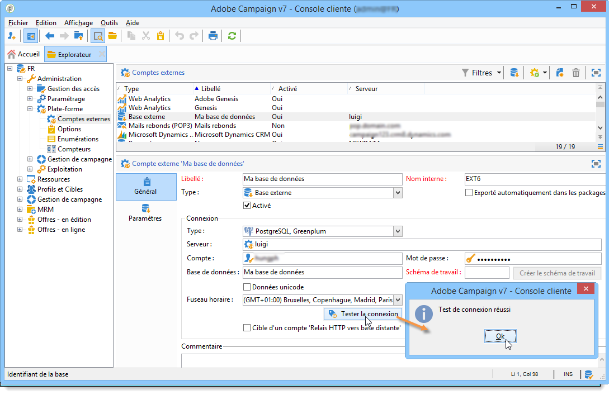
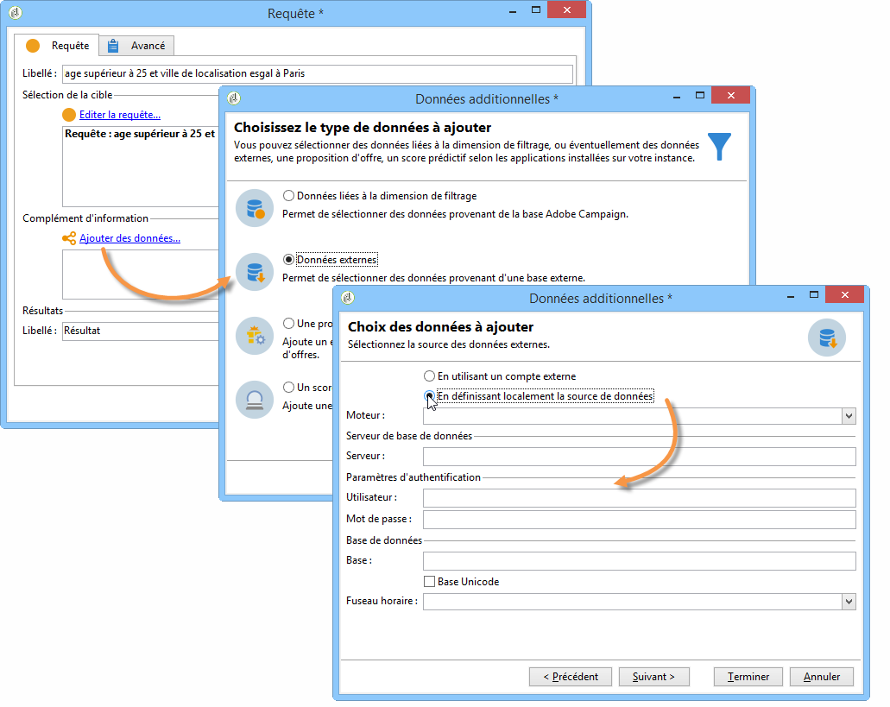
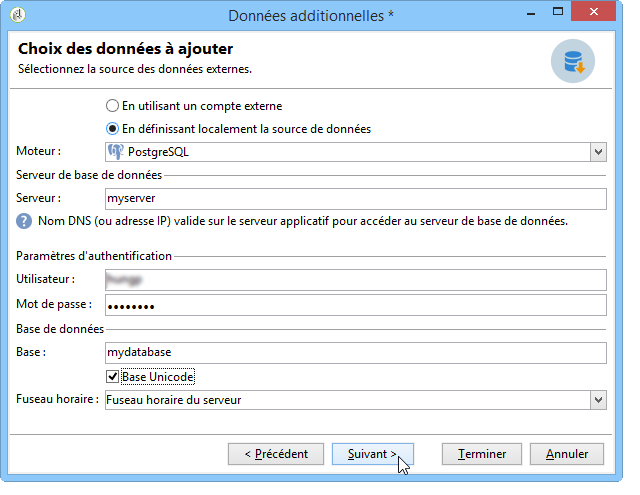
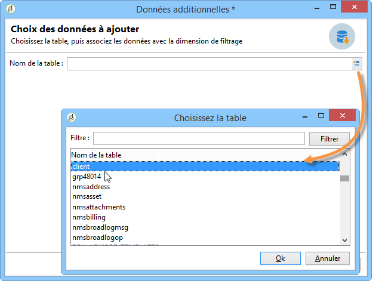
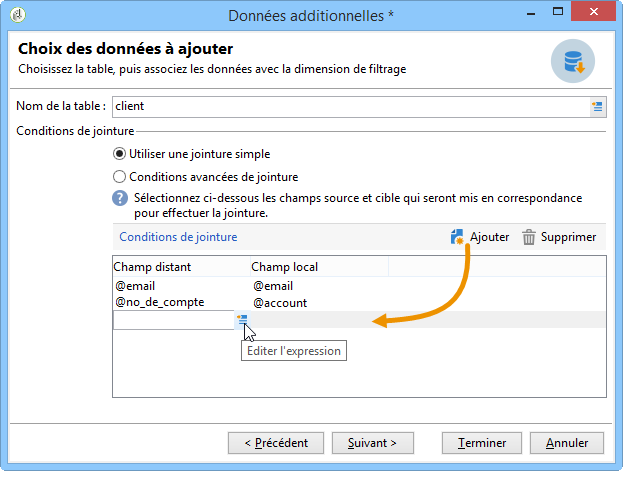
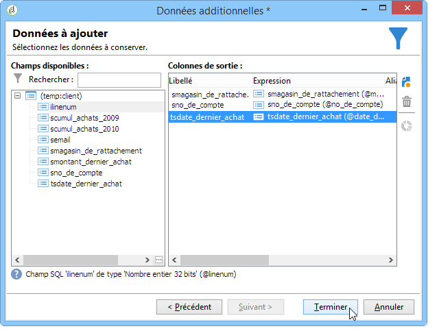

# Connexion à la base de données {#connecting-to-the-database}

Pour permettre la connexion à la base de données externe, vous devez indiquer les paramètres de connexion, c&#39;est-à-dire la source de données visée et le nom de la table dont les données doivent être chargées.

>[!CAUTION]
>
>L’utilisateur d’Adobe Campaign a besoin de droits spécifiques pour la base de données externe et le serveur d’applications Adobe Campaign afin de traiter les données d’une base de données externe. Pour plus d’informations, reportez-vous à la section Droits [d’accès à la base de données](../../platform/using/remote-database-access-rights.md) distante.
>
>Pour éviter tout dysfonctionnement, les opérateurs qui accèdent à des données distantes communes doivent évoluer dans des espaces de travail disjoints.

## Créer une connexion partagée {#creating-a-shared-connection}

Pour activer une connexion à une base de données externe partagée, tant que cette connexion est active, la base de données est accessible via Adobe Campaign.

1. La configuration doit être définie au préalable via le **[!UICONTROL Administration > Platform > External accounts]** noeud.
1. Cliquez sur le **[!UICONTROL New]** bouton et sélectionnez le **[!UICONTROL External database]** type.
1. Define the **[!UICONTROL Connection]** parameters of the external database.

   For connections to an **ODBC** type database the **[!UICONTROL Server]** field must contain the name of the ODBC data source and not the server name. En outre, certaines configurations supplémentaires peuvent être nécessaires selon les bases de données utilisées. Reportez-vous à la section Configurations [spécifiques par type](../../platform/using/specific-configuration-database.md) de base de données.

1. Once the parameters are entered, click the **[!UICONTROL Test the connection]** button to approve them.

   

1. If necessary, uncheck the **[!UICONTROL Enabled]** option to disable access to this database without deleting its configuration.
1. Pour autoriser Adobe Campaign à accéder à cette base de données, vous devez déployer les fonctions SQL. Cliquez sur l’ **[!UICONTROL Parameters]** onglet puis sur le **[!UICONTROL Deploy functions]** bouton.

   

You can define specific work tablespaces for the tables and for the index in the **[!UICONTROL Parameters]** tab.

## Créer une connexion ponctuelle {#creating-a-temporary-connection}

Vous pouvez directement définir une connexion à une base de données externe à partir des activités du processus. Dans ce cas, il sera stocké dans une base de données externe locale, réservée pour être utilisée dans un flux de travaux en cours : il ne sera pas enregistré sur les comptes externes. Ce type de connexion ponctuelle peut être créé sur différentes activités du flux de travaux, en particulier **[!UICONTROL Query]**, le **[!UICONTROL Data loading (RDBMS)]**, l’ **[!UICONTROL Enrichment]** activité ou l’ **[!UICONTROL Split]** activité.

>[!CAUTION]
>
>Ce type de paramétrage n&#39;est pas recommandé mais peut être utilisé ponctuellement pour collecter des données. Toutefois, privilégiez la création d&#39;un compte externe, comme présenté dans la section [Créer une connexion partagée](#creating-a-shared-connection).

Par exemple, dans l&#39;activité de requête, les étapes sont les suivantes pour créer une connexion ponctuelle à une base externe :

1. Cliquez sur le bouton **[!UICONTROL Add data...]** et sélectionnez les **[!UICONTROL External data]** options.
1. Select the **[!UICONTROL Locally defining the data source]** option.

   

1. Sélectionnez le moteur de la base de données cible dans la liste déroulante. Saisissez le nom du server et renseignez les paramètres d&#39;authentification.

   Indiquez également le nom de la base externe.

   

   Cliquez sur le **[!UICONTROL Next]** bouton.

1. Sélectionnez la table où sont stockées les données.

   Vous pouvez saisir le nom de la table directement dans le champ correspondant ou cliquer sur l&#39;icône d&#39;édition pour accéder à la liste des tables de la base de données.

   

1. Cliquez sur le **[!UICONTROL Add]** bouton pour définir un ou plusieurs champs de réconciliation entre les données de base de données externes et les données de la base de données Adobe Campaign. Les **[!UICONTROL Edit expression]** icônes du **[!UICONTROL Remote field]** et **[!UICONTROL Local field]** vous donnent accès à la liste des champs de chacun des tableaux.

   

1. Au besoin, indiquez une condition de filtrage et le mode de tri des données.
1. Select the additional data to be collected in the external database. To do this, double click on the fields(s) that you want to add to display them in the **[!UICONTROL Output columns]**.

   

   Click **[!UICONTROL Finish]** to confirm this configuration.

## Connexion sécurisée {#secure-connection}

>[!NOTE]
>
>La connexion sécurisée est uniquement disponible pour PostgreSQL.

Vous pouvez sécuriser l&#39;accès à une base externe lors du paramétrage d&#39;un compte externe FDA.

Pour cela, ajoutez &quot;**:ssl**&quot; à la suite de l&#39;adresse du serveur et du port utilisé. Par exemple : **192.168.0.52:4501:ssl**.

Les données seront ainsi envoyées via le protocole sécurisé SSL.

## Paramétrages additionnels {#additional-configurations}

Au besoin, vous pouvez créer le schéma nécessaire à l&#39;exploitation des données contenues dans une base externe. De même, Adobe Campaign permet de définir un mapping sur les données d&#39;une table externe. Ces paramétrages sont généraux et ne s&#39;appliquent pas exclusivement au contexte des workflows.

>[!NOTE]
>
>Pour plus d&#39;informations sur la création de schémas dans Adobe Campaign et la définition d&#39;un nouveau mapping des données, consultez [cette page](../../configuration/using/about-schema-edition.md).