# Création et gestion de listes{#creating-and-managing-lists}

## Qu’est-ce qu’une liste ?  {#about-lists-in-adobe-campaign}

Une liste est un ensemble statique de profils qui peut être ciblé dans les actions de diffusion ou mis à jour lors d’opérations d’import ou lors de l’exécution d’un workflow. Par exemple, une population extraite de la base via une requête peut alimenter une liste.

Les listes sont créées et gérées à partir du lien **[!UICONTROL Listes]** dans l&#39;onglet **[!UICONTROL Profils et cibles]**.

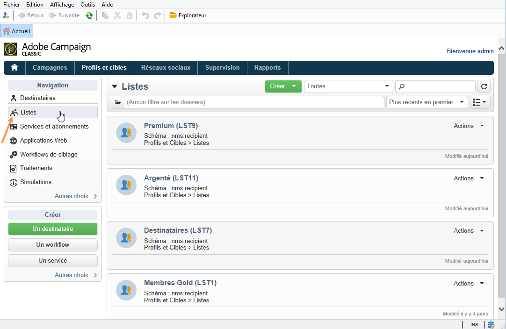

Dans Adobe Campaign, deux types de listes sont disponibles :

* Type **[!UICONTROL Groupe]** : les listes de type **[!UICONTROL Groupe]** appartiennent à une liste **statique** de personnes sélectionnées selon des critères précis. La liste est comme un instantané d&#39;un ensemble de profils. En cas d&#39;ajouts de profils à la base de données, le contenu de la liste n&#39;est pas automatiquement mis à jour.

   Pour plus d&#39;informations sur la création d&#39;une liste de type **[!UICONTROL Groupe]**, consultez cette [page](#creating-a-profile-list-from-a-group).

* Type **[!UICONTROL Liste]** : les listes de type **[!UICONTROL Liste]** permettent d&#39;utiliser des workflows afin de créer et gérer des listes. Il s&#39;agit alors de listes spécifiques, issues d&#39;un import de données, et qui peuvent faire l&#39;objet d&#39;une mise à jour automatique via l&#39;activité de workflow dédiée **[!UICONTROL Mise à jour de liste]**.

   Contrairement à la liste de type **[!UICONTROL Groupe]**, ce type de liste peut être automatiquement mis à jour avec une activité **[!UICONTROL Planificateur]**. Pour obtenir un exemple de création de listes de type **[!UICONTROL Liste]**, consultez [cette page](../../workflow/using/list-update.md).

 [Découvrez cette fonctionnalité en vidéo](#create-list-video)

## Création d’une liste de profils à partir d’un groupe {#creating-a-profile-list-from-a-group}

Les listes de type **[!UICONTROL Groupe]** créées via le lien **[!UICONTROL Profils et cibles]** doivent être basées sur la table des profils par défaut d&#39;Adobe Campaign (nms:recipient).

>[!NOTE]
>
>Pour créer des listes contenant d&#39;autres types de données, vous devez passer par un workflow. Par exemple, en utilisant une requête sur la table des visiteurs puis une mise à jour de liste, vous pouvez créer une liste de visiteurs. Pour plus d&#39;informations sur les workflows, consultez [cette section](../../workflow/using/about-workflows.md).

Pour créer une liste de type **[!UICONTROL Groupe]**, procédez comme suit :

1. Cliquez sur le bouton **[!UICONTROL Créer]** et choisissez **[!UICONTROL Nouvelle liste]**.

   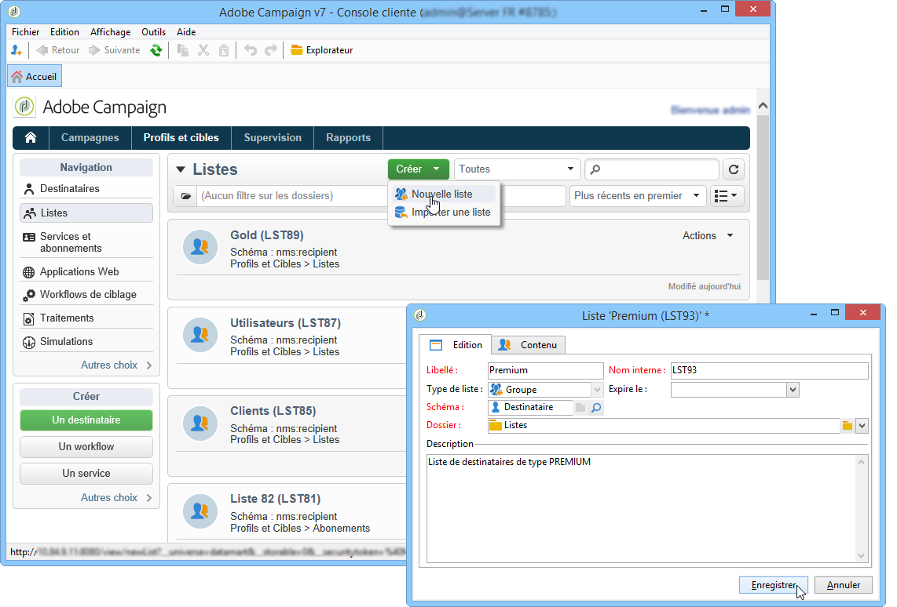

1. Renseignez les informations dans l&#39;onglet **[!UICONTROL Edition]** de la fenêtre de création de la liste.

   * Saisissez le nom de la liste dans le champ **[!UICONTROL Libellé]** et, au besoin, modifiez le nom interne.
   * Ajoutez une description pour cette liste.
   * Vous pouvez définir une date d&#39;expiration : lorsque cette date est atteinte, la liste est purgée et automatiquement supprimée.

      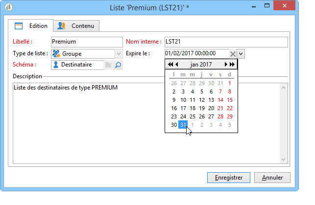

1. Dans l&#39;onglet **[!UICONTROL Contenu]**, cliquez sur **[!UICONTROL Ajouter]** pour sélectionner les profils appartenant à la liste.

   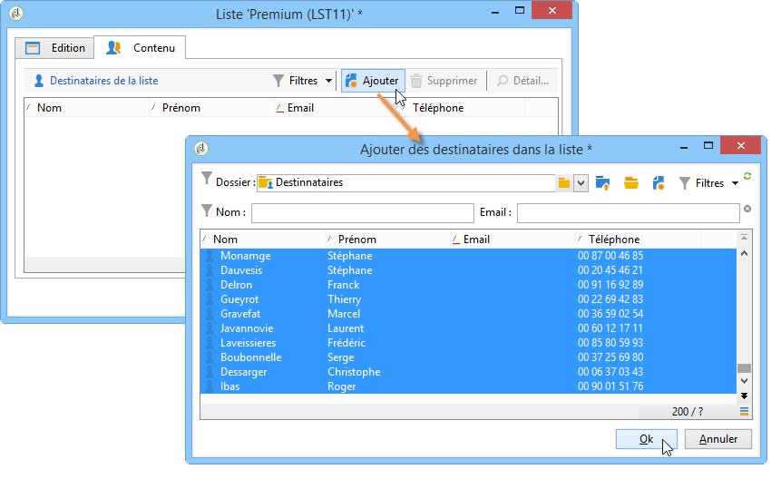

1. Cliquez sur le bouton **[!UICONTROL Enregistrer]** pour enregistrer cette liste. Elle est alors ajoutée dans la vue d&#39;ensemble des listes.

Vous pouvez créer de nouveaux profils directement depuis la fenêtre d&#39;ajout de profils en cliquant sur le bouton **[!UICONTROL Créer]**. Le profil sera ajouté à la base.

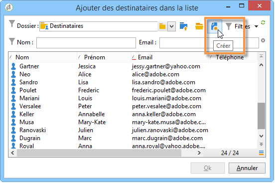

La liste des profils est configurable, au même titre que les autres listes. Consultez [cette section](../../platform/using/adobe-campaign-workspace.md#configuring-lists).

## Associer les données à une liste {#linking-data-to-a-list}

>[!NOTE]
>
>L&#39;association de données à une liste ne peut être effectuée qu&#39;avec une liste de type **[!UICONTROL Groupe]**.

Les profils d&#39;un ensemble de profils peuvent être filtrés puis associés à une liste. Des actions de diffusions pourront alors être menées sur cette liste afin de cibler les profils. Pour regrouper les profils :

1. Sélectionnez les profils et cliquez avec le bouton droit de la souris.
1. Sélectionnez **[!UICONTROL Actions > Associer la sélection à une liste...]**.

   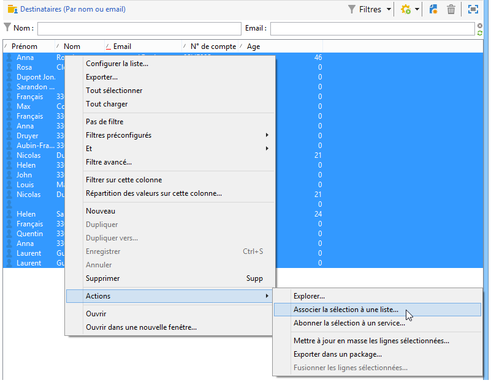

1. Sélectionnez la liste visée ou créez une nouvelle liste à partir du bouton **[!UICONTROL Créer]**, et cliquez sur **[!UICONTROL Suivant]**.

   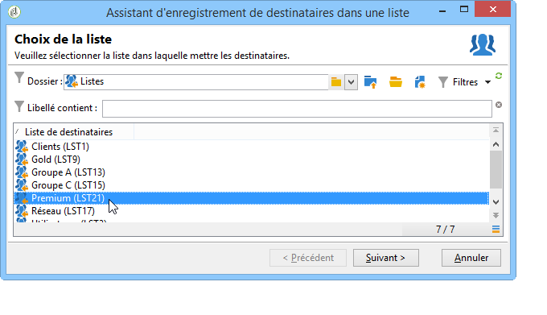

1. Cliquez sur le bouton **[!UICONTROL Démarrer]** pour lancer l&#39;opération.

   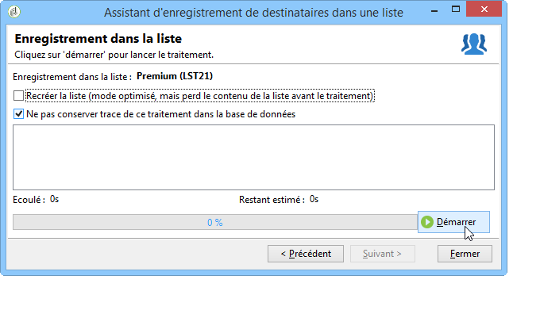

L&#39;option **[!UICONTROL Recréer la liste]** supprime le contenu antérieur de la liste. Ce mode est le mode optimisé car aucune requête n&#39;est nécessaire pour vérifier si les profils sont déjà associés à la liste.

Si vous décochez l&#39;option **[!UICONTROL Ne pas conserver trace de ce traitement dans la base de données]**, vous pouvez sélectionner (ou créer) le dossier d&#39;exécution où seront stockées les informations relatives à ce traitement.

La section supérieure de la fenêtre vous permet de suivre l&#39;exécution. Le bouton **[!UICONTROL Arrêter]** vous permet de stopper l&#39;opération. Les contacts déjà traités seront toutefois associés à la liste.

Vous pouvez suivre le traitement depuis l&#39;onglet **[!UICONTROL Listes]** des profils concernés par cette opération :

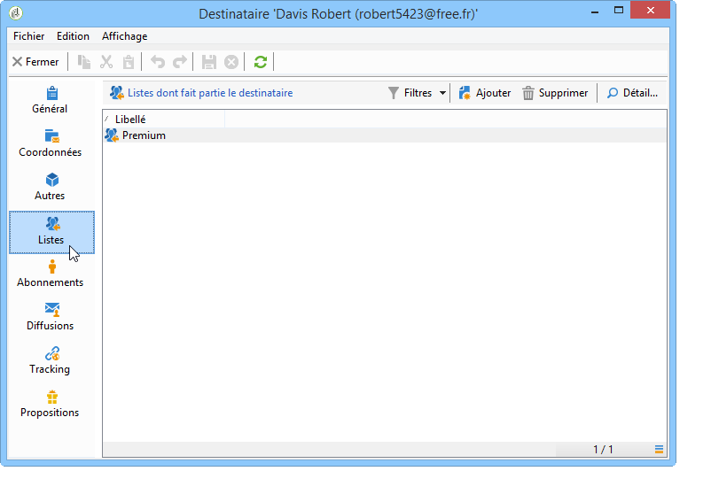

Vous pouvez également éditer la liste depuis la page d&#39;accueil d&#39;Adobe Campaign : cliquez sur le menu **[!UICONTROL Profils et Cibles > Listes]** et sélectionnez la liste concernée. L&#39;onglet **[!UICONTROL Contenu]** affiche les profils associés à cette liste.

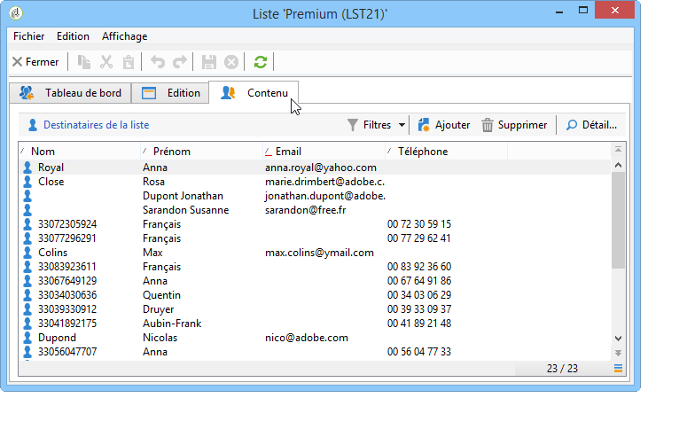

## Retirer un profil d’une liste {#removing-a-profile-from-a-list}

Pour supprimer un profil d&#39;une liste, vous pouvez :

* Editer la liste, sélectionner le profil dans l&#39;onglet **[!UICONTROL Contenu]**, puis cliquer sur l&#39;icône **[!UICONTROL Supprimer]**.

   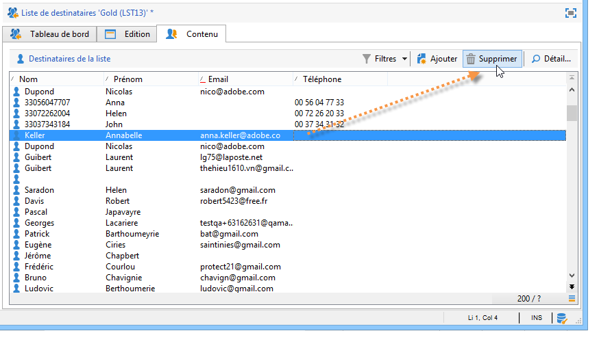

* Editer le profil, cliquer sur l&#39;onglet **[!UICONTROL Liste]**, puis sur l&#39;icône **[!UICONTROL Supprimer]**.

   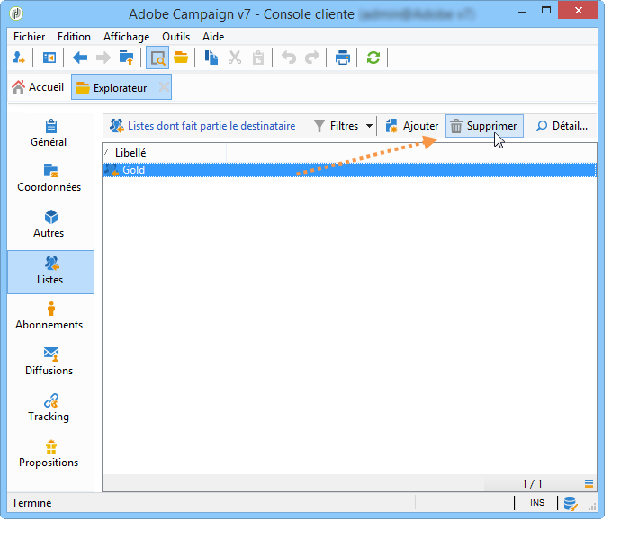

## Supprimer une liste de profils {#deleting-a-list-of-profiles}

Vous pouvez supprimer une ou plusieurs listes à partir de la liste des groupes de l&#39;arborescence d&#39;Adobe Campaign. Pour cela, éditez l&#39;arborescence à partir du lien **[!UICONTROL Avancé > Explorateur]** de la page d&#39;accueil d&#39;Adobe Campaign. Sélectionnez le ou les groupes visés et cliquez sur le bouton droit de la souris : choisissez **[!UICONTROL Supprimer]**. Un message d&#39;avertissement vous demande de confirmer la suppression.

>[!NOTE]
>
>Lorsque vous supprimez une liste, les profils qui appartenaient à cette liste ne sont pas affectés. Les données de leur profil seront toutefois mises à jour.

## Tutoriel vidéo {#create-list-video}

### Comment créer une liste de destinataires

Une liste est un ensemble statique de destinataires qui peut être ciblé dans des actions de diffusion ou mis à jour pendant des opérations d’import ou lors de l’exécution d’un workflow. Une liste de destinataires est également appelée audience.

Découvrez comment créer une audience en configurant une liste de destinataires à partir de l&#39;Explorateur.

>[!VIDEO](https://video.tv.adobe.com/v/25602/quality=12)

### Utilisation d’un processus pour créer une liste de destinataires {#create-list-in-a-wf-video}

Découvrez comment créer un workflow pour cibler des destinataires, et comment le rendre récurrent avant d’utiliser la liste dans une cible d’email.

>[!VIDEO](https://video.tv.adobe.com/v/25603?quality=12)

D’autres vidéos pratiques sur Campaign Classic sont disponibles [ici](https://experienceleague.adobe.com/docs/campaign-classic-learn/tutorials/overview.html?lang=fr).
