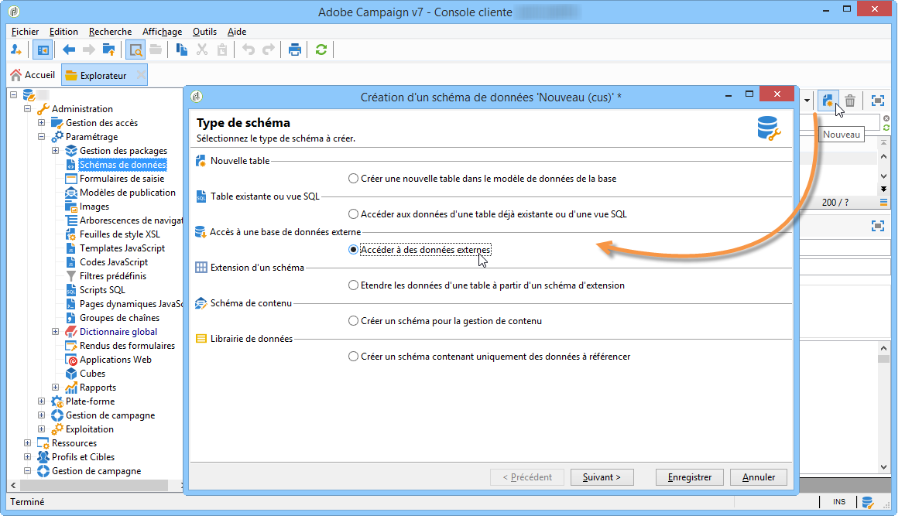
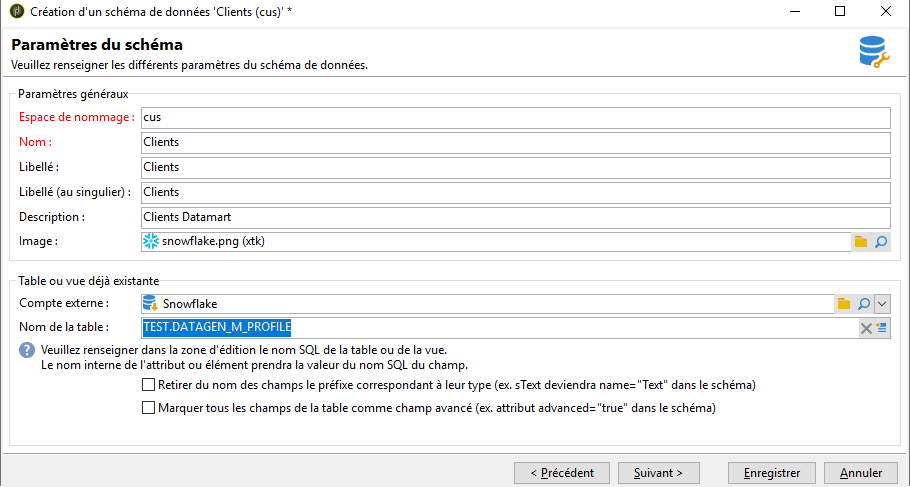
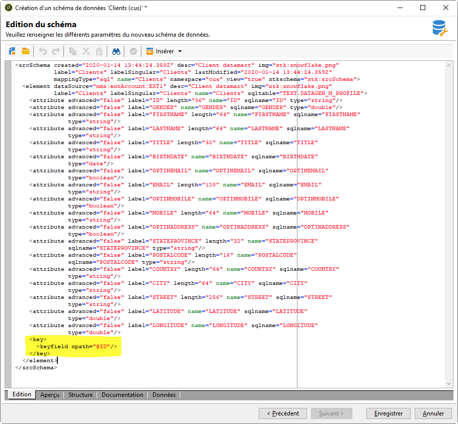

# Créer le schéma des données {#creating-the-data-schema}

Pour créer un schéma sur une base de données externe :

1. Cliquez sur le bouton **[!UICONTROL Nouveau]** au-dessus de la liste des schémas de données et choisissez **[!UICONTROL Accéder aux données]** externes.

   

1. Saisissez le nom du schéma et sa description et sélectionnez le compte externe permettant la connexion à la base de données. Vous avez ainsi accès à la liste des tables disponibles dans la base externe. Sélectionnez la table contenant les données à collecter.

   

1. Cliquez sur **[!UICONTROL Ok]** pour valider. Adobe Campaign détecte automatiquement la structure de la table sélectionnée et génère le schéma logique. Notez qu’Adobe Campaign ne génère pas de liens.

1. Cliquez sur **[!UICONTROL Enregistrer]** pour en valider la création.

   >[!CAUTION]
   >
   >Avec Snowflake, une clé primaire est obligatoire.

   

Les index sont crées automatiquement lors d&#39;un mapping de table (mapping standard ou FDA).
