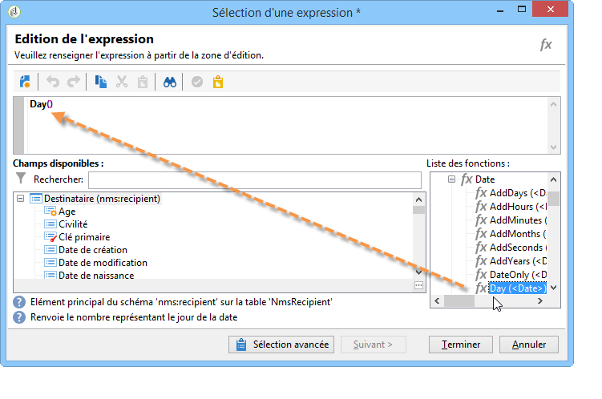
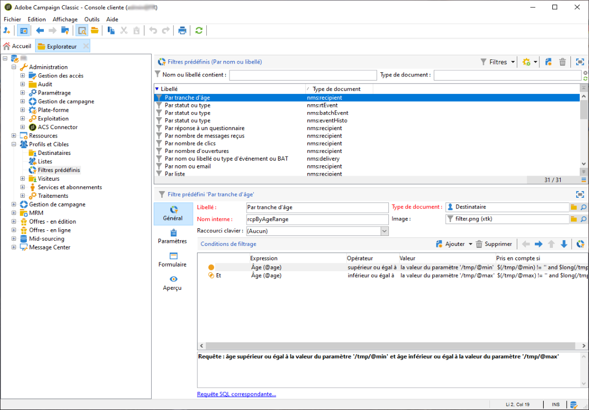

# Création de filtres{#creating-filters}

Lorsque vous naviguez dans l’arborescence d’Adobe Campaign (à partir du menu **[!UICONTROL Explorateur]** de la page d’accueil), les informations contenues dans la base de données sont affichées sous forme de listes. Ces listes sont paramétrables afin de filtrer les données et de n’afficher que les éléments utiles à l’opérateur. Des actions peuvent ensuite être lancées sur les données issues du résultat du filtre. Le paramétrage des filtres permet de sélectionner les données d’une liste de façon **[!UICONTROL dynamique]**. En cas de modification des données, les données filtrées sont mises à jour.

>[!NOTE]
>
>Les paramètres de configuration de l’interface utilisateur sont définis localement pour le périphérique. Il peut parfois être nécessaire de nettoyer ces données, en particulier si des problèmes surviennent lors de leur actualisation. Pour ce faire, utilisez le menu **[!UICONTROL Fichier > Vider le cache local]**.

## Typologie des filtres disponibles {#typology-of-available-filters}

Adobe Campaign permet d&#39;appliquer des filtres sur les listes de données.

Ces filtres peuvent être utilisés ponctuellement ou enregistrés pour être réutilisés. Vous pouvez appliquer plusieurs filtres simultanément.

Les types de filtres disponibles dans Adobe Campaign sont les suivants :

* **Filtres par défaut**

   Le **filtre par défaut** est accessible depuis les champs situés au-dessus des listes. Il permet de filtrer sur des champs prédéfinis (par défaut, pour les profils de destinataires, le nom et l&#39;email). Les champs permettent de saisir les caractères sur lesquels porte le filtre ou de sélectionner les conditions de filtrage dans une liste déroulante.

   
<!--
  >[!NOTE]
  >
  >The **%** character replaces any character string. For example, the string `%@yahoo.com` lets you display all the profiles with an email address in the domain "yahoo.com".
-->
Vous pouvez modifier le filtre par défaut d’une liste. Pour plus d’informations, voir la section [Modifier le filtre par défaut](#altering-the-default-filter).

* **Filtres simples**

   Les **filtres simples** sont des filtres ponctuels sur les colonnes. Ils sont définis avec un ou plusieurs critères de recherche simple sur les colonnes affichées.

   Vous pouvez conjuguer plusieurs filtres simples sur une même liste de données pour affiner votre recherche. Les champs de filtrage s&#39;affichent les uns en-dessous des autres. Ils peuvent être supprimés indépendamment les uns des autres.

   

   Les filtres simples sont détaillés dans la section [Créer un filtre simple](#creating-a-simple-filter).

* **Filtres avancés**

   Les **filtres avancés** sont créés à partir d’une requête ou d’une combinaison de requêtes sur les données.

   Pour plus d’informations sur la création d’un filtre avancé, voir la section [Créer un filtre avancé](#creating-an-advanced-filter).

   Vous pouvez utiliser des fonctions pour définir le contenu du filtre. Pour plus d’informations à ce sujet, consultez la section [Créer un filtre avancé avec fonctions](#creating-an-advanced-filter-with-functions).

   >[!NOTE]
   >
   >Pour plus d’informations sur la construction des requêtes dans Adobe Campaign, reportez-vous à [cette section](../../platform/using/about-queries-in-campaign.md).

* **Filtres utilisateurs**

   Un **filtre applicatif** est un filtre avancé qui a été enregistré afin d&#39;en conserver le paramétrage et le partager avec les autres opérateurs.

   Le bouton **[!UICONTROL Filtres]**, situé au-dessus des listes, propose un ensemble de filtres d’application pouvant être combinés pour affiner le filtrage. La méthode de création de ces filtres est présentée dans la section [Enregistrer un filtre](#saving-a-filter).

## Modifier le filtre par défaut {#altering-the-default-filter}

Pour modifier le filtre par défaut pour une liste de destinataires, cliquez sur le noeud **[!UICONTROL Profils et Cibles > Filtres prédéfinis]** de l&#39;arborescence.

Pour tout autre type de données, configurez le filtre par défaut à partir du noeud **[!UICONTROL Administration > Paramétrage > Filtres prédéfinis]**.

Les étapes sont les suivantes :

1. Dans la liste des filtres, sélectionnez le filtre que vous souhaitez voir proposé par défaut.
1. Cliquez sur l&#39;onglet **[!UICONTROL Paramètres]** et cochez l&#39;option **[!UICONTROL Filtre par défaut pour le type de document associé]**.

   

   >[!CAUTION]
   >
   >Si un filtre est déjà appliqué par défaut à la liste visée, vous devez d&#39;abord le désactiver avant d&#39;appliquer un nouveau filtre. Pour cela, cliquez sur la croix rouge située à droite des champs de filtrage.

1. Cliquez sur le bouton **[!UICONTROL Enregistrer]** pour appliquer ce filtre.

   >[!NOTE]
   >
   >La fenêtre de définition des filtres est présentée dans les sections [Créer un filtre avancé](#creating-an-advanced-filter) et [Enregistrer un filtre](#saving-a-filter).

## Créer un filtre simple {#creating-a-simple-filter}

Pour créer un **filtre simple**, respectez les étapes suivantes :

1. Cliquez avec le bouton droit sur le champ sur lequel vous souhaitez filtrer les données et choisissez **[!UICONTROL Filtrer sur ce champ]**.

   

   Les champs de filtrage par défaut s&#39;affichent au-dessus de la liste.

1. Sélectionnez dans la liste déroulante l&#39;option de filtrage ou saisissez les critères de filtrage à appliquer (le mode de sélection ou de saisie des critères dépend du type de champ : texte, énuméré, etc.).

   

1. Tapez sur la touche Entrée du clavier ou cliquez sur la flèche verte située à droite des champs de filtrage pour activer le filtre.

Si le champ sur lequel vous souhaitez filtrer les données n&#39;est pas affiché dans le formulaire du profil, vous pouvez l&#39;ajouter dans les colonnes affichées, puis filtrer sur cette colonne. Pour cela :

1. Cliquez sur l&#39;icône **[!UICONTROL Configurer la liste]**.

   

1. Sélectionnez la colonne à afficher, par exemple l&#39;âge des destinataires.

   

1. Puis cliquez avec le bouton droit dans la liste des destinataires, dans la colonne **Age**, et choisissez **[!UICONTROL Filtrer sur cette colonne]**.

   

   Vous pouvez alors sélectionner les options de filtrage sur l&#39;âge.

   

## Créer un filtre avancé {#creating-an-advanced-filter}

Pour créer un **filtre avancé**, respectez les étapes suivantes :

1. Cliquez sur le bouton **[!UICONTROL Filtres]** et choisissez **[!UICONTROL Filtre avancé...]**.

   

   Vous pouvez également cliquer avec le bouton droit dans la liste de données à filtrer et choisir **[!UICONTROL Filtre avancé...]**.

   La fenêtre de définition des conditions de filtrage s&#39;affiche à l&#39;écran.

1. Cliquez dans la colonne **[!UICONTROL Expression]** pour définir la valeur d&#39;entrée.
1. Cliquez sur l&#39;icône **[!UICONTROL Editer l&#39;expression]** pour sélectionner le champ sur lequel porte le filtre.

   

1. Sélectionnez dans la liste le champ sur lequel les données seront filtrées. Cliquez sur **[!UICONTROL Terminer]** pour valider.
1. Cliquez dans la colonne **[!UICONTROL Opérateur]** et sélectionnez dans la liste déroulante l&#39;opérateur à appliquer.
1. Sélectionnez une valeur attendue dans la colonne **[!UICONTROL Valeur]**. Vous pouvez combiner plusieurs filtres pour affiner votre requête. Pour ajouter un critère de filtrage, cliquez sur le bouton **[!UICONTROL Ajouter]**.

   

1. Vous pouvez hiérarchiser les expressions ou modifier l&#39;ordre des expressions de la requête en utilisant les flèches de la barre d&#39;outils.
1. L&#39;opérateur par défaut entre les expressions est le **Et**, mais vous pouvez le modifier en cliquant dans le champ. Vous pouvez choisir un opérateur **Ou**.

   

1. Cliquez sur **[!UICONTROL OK]** pour valider la création de ce filtre et l&#39;appliquer à la liste.

Le filtre appliqué est affiché au-dessus de la liste.

Pour éditer ou modifier ce filtre, cliquez sur son libellé.

Pour annuler ce filtre, cliquez sur l&#39;icône **[!UICONTROL Supprimer ce filtre]** située à droite du filtre.

Vous pouvez enregistrer un filtre avancé afin de le conserver pour une utilisation ultérieure. Pour plus d’informations sur ce type de filtre, voir la section [Enregistrer un filtre](#saving-a-filter).

### Créer un filtre avancé avec fonctions {#creating-an-advanced-filter-with-functions}

Les filtres avancés peuvent utiliser des fonctions : les **filtres avec fonctions** sont créés à partir d&#39;un éditeur d&#39;expressions qui permet de créer des formules qui utilisent les données de la base et des fonctions avancées. Pour créer un filtre avec fonctions, répétez les étapes 1, 2 et 3 de création d&#39;un filtre avancé puis procédez comme suit :

1. Dans la fenêtre de sélection du champ, cliquez sur le bouton **[!UICONTROL Sélection avancée]**.
1. Sélectionnez le type de formule à utiliser : agrégat, filtre utilisateur existant ou expression.

   

   Les options disponibles sont les suivantes :

   * **[!UICONTROL Champ simple]** pour sélectionner un champ. Il s&#39;agit du mode par défaut.
   * **[!UICONTROL Agrégat]** pour sélectionner la formule d&#39;agrégat à utiliser (comptage, somme, moyenne, maximum, minimum).
   * **[!UICONTROL Filtre utilisateur]** pour sélectionner l’un des filtres utilisateur existants. Les filtres utilisateur sont présentés dans la section [Enregistrer un filtre](#saving-a-filter).
   * **[!UICONTROL Expression]** pour accéder à l&#39;éditeur d&#39;expressions

      L&#39;éditeur d&#39;expression permet de définir un filtre avancé. Il se présente comme suit :

      

      Il vous permet de sélectionner des champs dans les tables de base de données et de leur associer des fonctions avancées : sélectionnez la fonction à utiliser dans la **[!UICONTROL liste des fonctions]**. Les fonctions disponibles sont présentées dans la [liste des fonctions](../../platform/using/defining-filter-conditions.md#list-of-functions). Ensuite, sélectionnez les champs concernés par les fonctions et cliquez sur **[!UICONTROL OK]** pour valider l’expression.

      >[!NOTE]
      >
      >Un exemple de création de filtre à partir d’une expression est présenté dans [cette section](../../workflow/using/sending-a-birthday-email.md#identifying-recipients-whose-birthday-it-is).

## Enregistrer un filtre {#saving-a-filter}

Les filtres sont spécifiques à chaque opérateur et sont réinitialisés à chaque fois que l&#39;opérateur vide le cache de la console cliente.

Vous pouvez créer un **filtre applicatif** en enregistrant un filtre avancé : ainsi enregistré, le filtre pourra être réutilisé depuis le bouton droit de la souris dans n&#39;importe quelle liste ou à partir du bouton **[!UICONTROL Filtres]** situé au-dessus des listes.

Ces filtres sont également accessibles directement depuis l&#39;assistant de diffusion, dans l&#39;étape de sélection de la cible (consultez [cette section](../../delivery/using/creating-an-email-delivery.md) pour plus d&#39;informations sur la création de diffusions). Pour créer un filtre applicatif, vous pouvez :

* Transformer un filtre avancé en filtre applicatif : pour cela, vous devez cliquer sur **[!UICONTROL Enregistrer]** avant de fermer l&#39;éditeur de filtres avancés.

   

* Créer ce filtre applicatif depuis le noeud **[!UICONTROL Administration > Paramétrage > Filtres prédéfinis]** (ou **[!UICONTROL Profils et Cibles > Filtres prédéfinis]** pour les destinataires). Pour cela, cliquez avec le bouton droit de la souris dans la liste des filtres et choisissez **[!UICONTROL Nouveau...]**. La procédure est la même que pour créer des filtres avancés.

   Le champ **[!UICONTROL Libellé]** vous permet de nommer ce filtre. Ce nom apparaîtra dans la liste déroulante du bouton **[!UICONTROL Filtres...]**.

   

Vous pouvez supprimer l&#39;ensemble des filtres sur la liste en cours à partir de l&#39;option **[!UICONTROL Pas de filtre]** accessible depuis le bouton droit de la souris ou l&#39;icône **[!UICONTROL Filtres]**, située au-dessus de la liste.

Vous pouvez combiner des filtres en utilisant le menu **[!UICONTROL Et...]** accessible à partir du bouton **[!UICONTROL Filtres]**.

## Filtrer les destinataires {#filtering-recipients}

Les filtres prédéfinis (voir la section [Enregistrer un filtre](#saving-a-filter)) vous permettent de filtrer les profils des destinataires contenus dans la base de données. Vous pouvez modifier des filtres à partir du nœud **[!UICONTROL Profils et Cibles > Filtres prédéfinis]** de l’arborescence. Les filtres sont répertoriés dans la section supérieure de l’espace de travail, via le bouton **[!UICONTROL Filtres]**.

Sélectionnez un filtre pour en afficher la définition et accéder à un aperçu des données filtrées.

>[!NOTE]
>
>Un exemple détaillé de création de filtre prédéfini est proposé dans la section [Cas pratique](../../platform/using/use-case.md).

Les filtres prédéfinis sont les suivants :

<table> 
 <tbody> 
  <tr> 
   <td> <strong>Libellé</strong>  </td> 
   <td> <strong>Requête</strong>  </td> 
  </tr> 
  <tr> 
   <td> Ayant ouvert  </td> 
   <td> Sélection des destinataires qui ont ouvert une diffusion.  </td> 
  </tr> 
  <tr> 
   <td> Ayant ouvert mais pas cliqué  </td> 
   <td> Sélection des destinataires qui ont ouvert une diffusion mais n'ont pas cliqué sur un lien.  </td> 
  </tr> 
  <tr> 
   <td> Destinataires inactifs  </td> 
   <td> Sélection des destinataires qui n'ont pas ouvert une diffusion depuis X mois.  </td> 
  </tr> 
  <tr> 
   <td> Dernière activité par type d'appareil  </td> 
   <td> Sélection des destinataires qui ont cliqué ou ouvert une diffusion Y depuis un appareil de type X dans les Z derniers jours.  </td> 
  </tr> 
  <tr> 
   <td> Dernière activité par type d'appareil (Tracking)  </td> 
   <td> Sélection des destinataires qui ont cliqué ou ouvert une diffusion Y depuis un appareil de type X dans les Z derniers jours.  </td> 
  </tr> 
  <tr> 
   <td> Destinataires non ciblés  </td> 
   <td> Sélection des destinataires qui n'ont jamais été ciblés sur un canal Y depuis X mois.  </td> 
  </tr> 
  <tr> 
   <td> Destinataires très actifs  </td> 
   <td> Sélection des destinataires qui ont cliqué dans une diffusion au moins X fois dans les Y derniers mois.  </td> 
  </tr> 
  <tr> 
 <td> Adresse email sur liste bloquée  </td> 
    <td> Sélectionne les destinataires dont l'adresse email se trouve sur la liste bloquée.  </td>
  </tr> 
  <tr> 
   <td> Email en quarantaine  </td> 
   <td> Sélection des destinataires dont l'email est en quarantaine.  </td> 
  </tr> 
  <tr> 
   <td> Emails dupliqués dans le dossier  </td> 
   <td> Sélection des destinataires dont l'email est dupliqué dans le dossier.  </td> 
  </tr> 
  <tr> 
   <td> N'ayant ni ouvert ni cliqué  </td> 
   <td> Sélection des destinataires qui n'ont ni ouvert une diffusion, ni cliqué dans une diffusion.  </td> 
  </tr> 
  <tr> 
   <td> Nouveaux destinataires (jours)  </td> 
   <td> Sélection des destinataires qui ont été créés dans les X derniers jours.  </td> 
  </tr> 
  <tr> 
   <td> Nouveaux destinataires (minutes)  </td> 
   <td> Sélection des destinataires qui ont été créés dans les X dernières minutes.  </td> 
  </tr> 
  <tr> 
   <td> Nouveaux destinataires (mois)  </td> 
   <td> Sélection des destinataires qui ont été créés dans les X derniers mois.  </td> 
  </tr> 
  <tr> 
   <td> Par abonnement  </td> 
   <td> Sélection des destinataires par abonnements.  </td> 
  </tr> 
  <tr> 
   <td> Par clic sur une URL spécifique  </td> 
   <td> Sélection des destinataires qui ont cliqué sur une URL particulière dans une diffusion.  </td> 
  </tr> 
  <tr> 
   <td> Par comportement après une diffusion  </td> 
   <td> Sélection des destinataires en fonction de leur comportement après la réception d'une diffusion.  </td> 
  </tr> 
  <tr> 
   <td> Par date de création  </td> 
   <td> Sélection des destinataires par date de création, sur une période entre X mois (date courante moins n mois) et Y mois (date courante moins n mois).  </td> 
  </tr> 
  <tr> 
   <td> Par liste  </td> 
   <td> Sélection des destinataires par liste.  </td> 
  </tr> 
  <tr> 
   <td> Par nombre de clics  </td> 
   <td> Sélection des destinataires qui ont cliqué dans une diffusion dans les X derniers mois.  </td> 
  </tr> 
  <tr> 
   <td> Par nombre de messages reçus  </td> 
   <td> Sélection des destinataires en fonction du nombre de messages qu'ils ont reçus.  </td> 
  </tr> 
  <tr> 
   <td> Par nombre d'ouvertures  </td> 
   <td> Sélection des destinataires qui ont ouvert entre X et Y diffusions dans une période de temps Z.  </td> 
  </tr> 
  <tr> 
   <td> Par nom ou email  </td> 
   <td> Sélection des destinataires en fonction de leur nom ou de leur email.  </td> 
  </tr> 
  <tr> 
   <td> Par tranche d'âge  </td> 
   <td> Sélection des destinataires en fonction de leur âge.  </td> 
  </tr> 
 </tbody> 
</table>

>[!NOTE]
>
>Toutes les comparaisons de comptage et de période sont au sens large (les bornes sont incluses dans la comparaison).

Exemples de comptage :

* Sélection des destinataires de moins de 30 ans :

   

* Sélection des destinataires de 18 ans et plus :

   

* Sélection des destinataires qui ont entre 18 et 30 ans :

   

## Paramètres avancés des filtres sur les données {#advanced-settings-for-data-filters}

Cliquez sur l&#39;onglet **[!UICONTROL Paramètres]** pour accéder aux options suivantes :

* **[!UICONTROL Filtre par défaut pour le type de document associé]** : cette option permet de proposer ce filtre par défaut dans l&#39;éditeur des listes concernées par le tri.

   Par exemple, le filtre **[!UICONTROL Par nom ou login]** est appliqué aux opérateurs. Cette option est sélectionnée donc le filtre est systématiquement proposé sur toutes les listes d&#39;opérateurs.

* **[!UICONTROL Filtre partagé avec les autres opérateurs]** : cette option permet de rendre ce filtre disponible pour tous les autres opérateurs sur la base courante.
* **[!UICONTROL Utilisation d&#39;un formulaire de saisie des paramètres]** : cette option permet de définir le ou les champs de filtrage qui s&#39;afficheront au-dessus de la liste lorsque ce filtre sera sélectionné. Ces champs permettent de définir les paramètres du filtre. Ce formulaire doit alors être saisi au format XML depuis le bouton **[!UICONTROL Formulaire]**. Par exemple, le filtre préconfiguré **[!UICONTROL Ayant ouvert]**, disponible dans la liste des destinataires, affiche un champ de filtrage permettant de sélectionner la diffusion visée par le filtre.

   Le bouton **[!UICONTROL Aperçu]** permet de visualiser le résultat du filtre choisi.

* Le lien **[!UICONTROL Paramètres avancés]** permet de définir des paramétrages complémentaires, et notamment d&#39;associer à ce filtre une table SQL afin de le rendre commun à tous les éditeurs qui partagent cette table.

   Cochez l&#39;option **[!UICONTROL Ne pas restreindre le filtre]** si vous souhaitez interdire à l&#39;utilisateur de surcharger ce filtre.

   Cette option est par exemple activée pour les filtres &quot;Destinataires d&#39;une diffusion&quot; et &quot;Destinataires des diffusions appartenant à un dossier&quot; proposés dans l&#39;assistant de diffusion et qui ne peuvent pas être surchargés.

   
