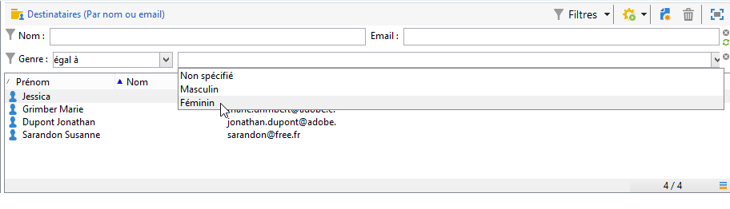
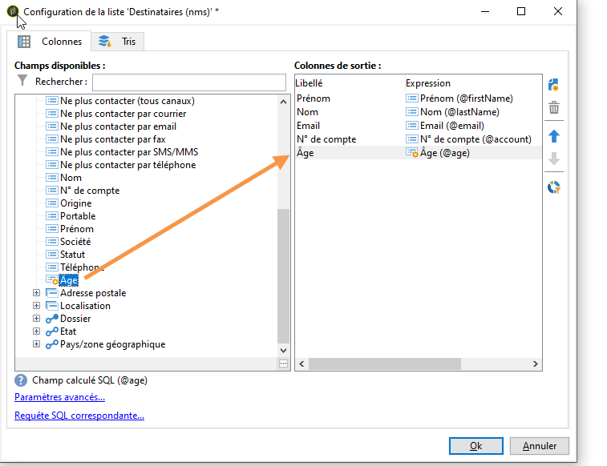
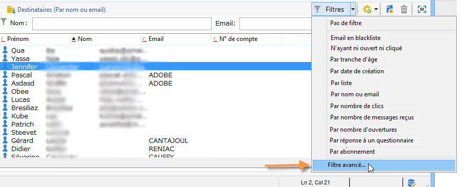
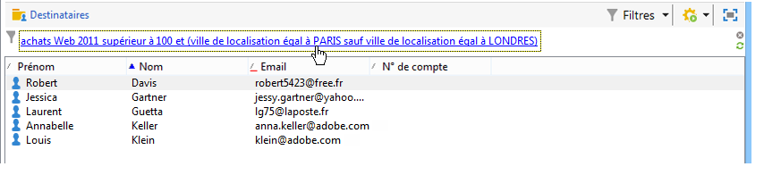

# Création de filtres{#creating-filters}

## Introduction {#introduction}

Lorsque vous naviguez dans l’arborescence d’Adobe Campaign (à partir du **[!UICONTROL Explorer]** menu de la page d’accueil), les données contenues dans la base de données sont affichées dans des listes. Ces listes peuvent être configurées pour afficher uniquement les données requises par l’opérateur. Des actions peuvent alors être lancées sur les données filtrées. La configuration du filtre vous permet de sélectionner des données dans une liste **[!UICONTROL dynamically]**. Si les données sont modifiées, les données filtrées sont mises à jour.

>[!NOTE]
>
>La configuration de l&#39;affichage est définie localement au niveau du poste de travail. Il est stocké dans des fichiers cachés et il peut être nécessaire de nettoyer ces données, en particulier si des problèmes surviennent lors de l’actualisation des données. Pour ce faire, utilisez **[!UICONTROL File > Clear the local cache]** menu.

## Typologie des filtres disponibles {#typology-of-available-filters}

Adobe Campaign permet d&#39;appliquer des filtres sur les listes de données.

Ces filtres peuvent être utilisés ponctuellement ou enregistrés pour être réutilisés. Vous pouvez appliquer plusieurs filtres simultanément.

Les types de filtres disponibles dans Adobe Campaign sont les suivants :

* Filtres par défaut

   Le **filtre par défaut** est accessible depuis les champs situés au-dessus des listes. Il permet de filtrer sur des champs prédéfinis (par défaut, pour les profils de destinataires, le nom et l&#39;email). Les champs permettent de saisir les caractères sur lesquels porte le filtre ou de sélectionner les conditions de filtrage dans une liste déroulante.

   
<!--
  >[!NOTE]
  >
  >The **%** character replaces any character string. For example, the string `%@yahoo.com` lets you display all the profiles with an e-mail address in the domain "yahoo.com".
-->
Vous pouvez modifier le filtre par défaut d’une liste. Pour plus d’informations, voir [Modification du filtre](#altering-the-default-filter)par défaut.

* Les filtres simples

   Les **filtres simples** sont des filtres ponctuels sur les colonnes. Ils sont définis avec un ou plusieurs critères de recherche simple sur les colonnes affichées.

   Vous pouvez conjuguer plusieurs filtres simples sur une même liste de données pour affiner votre recherche. Les champs de filtrage s&#39;affichent les uns en-dessous des autres. Ils peuvent être supprimés indépendamment les uns des autres.

   

   Les filtres simples sont détaillés dans [Création d’un filtre](#creating-a-simple-filter)simple.

* Les filtres avancés

   Les **filtres avancés** sont créés à partir d&#39;une requête ou d&#39;une combinaison de requêtes sur les données.

   Pour plus d’informations sur la création d’un filtre avancé, voir [Création d’un filtre](#creating-an-advanced-filter)avancé.

   Vous pouvez utiliser des fonctions pour définir le contenu du filtre. Pour plus d’informations, reportez-vous à la section [Création d’un filtre avancé avec des fonctions](#creating-an-advanced-filter-with-functions).

   >[!NOTE]
   >
   >Pour plus d&#39;informations sur la construction des requêtes dans Adobe Campaign, reportez-vous à [cette section](../../platform/using/about-queries-in-campaign.md).

* Les filtres utilisateurs

   Un **filtre applicatif** est un filtre avancé qui a été enregistré afin d&#39;en conserver le paramétrage et le partager avec les autres opérateurs.

   Le **[!UICONTROL Filters]** bouton situé au-dessus des listes propose un ensemble de filtres d’application pouvant être combinés pour affiner le filtrage. La méthode de création de ces filtres est présentée dans [Enregistrement d’un filtre](#saving-a-filter).

## Modifier le filtre par défaut {#altering-the-default-filter}

Pour modifier le filtre par défaut d’une liste de destinataires, cliquez sur le **[!UICONTROL Profiles and Targets > Pre-defined filters]** noeud de l’arborescence.

For all other types of data, configure the default filter via the **[!UICONTROL Administration > Configuration > Predefined filters]** node.

Les étapes sont les suivantes :

1. Dans la liste des filtres, sélectionnez le filtre que vous souhaitez voir proposé par défaut.
1. Cliquez sur l’ **[!UICONTROL Parameters]** onglet et sélectionnez **[!UICONTROL Default filter for the associated document type]**.

   

   >[!CAUTION]
   >
   >Si un filtre est déjà appliqué par défaut à la liste visée, vous devez d&#39;abord le désactiver avant d&#39;appliquer un nouveau filtre. Pour cela, cliquez sur la croix rouge située à droite des champs de filtrage.

1. Click **[!UICONTROL Save]** to apply the filter.

   >[!NOTE]
   >
   >La fenêtre de définition de filtre est détaillée dans [Création d’un filtre](#creating-an-advanced-filter) avancé et [Enregistrement d’un filtre](#saving-a-filter).

## Créer un filtre simple {#creating-a-simple-filter}

Pour créer un **filtre simple**, respectez les étapes suivantes :

1. Cliquez avec le bouton droit sur le champ à filtrer et sélectionnez **[!UICONTROL Filter on this field]**.

   

   Les champs de filtrage par défaut s&#39;affichent au-dessus de la liste.

1. Sélectionnez dans la liste déroulante l&#39;option de filtrage ou saisissez les critères de filtrage à appliquer (le mode de sélection ou de saisie des critères dépend du type de champ : texte, énuméré, etc.).

   

1. Tapez sur la touche Entrée du clavier ou cliquez sur la flèche verte située à droite des champs de filtrage pour activer le filtre.

Si le champ sur lequel vous souhaitez filtrer les données n&#39;est pas affiché dans le formulaire du profil, vous pouvez l&#39;ajouter dans les colonnes affichées, puis filtrer sur cette colonne. Pour cela :

1. Cliquez sur l’ **[!UICONTROL Configure the list]** icône .

   

1. Sélectionnez la colonne à afficher, par exemple l&#39;âge des destinataires.

   

1. Cliquez avec le bouton droit sur la colonne **Age** dans la liste des destinataires, puis sélectionnez **[!UICONTROL Filter on this column]**.

   

   Vous pouvez alors sélectionner les options de filtrage sur l&#39;âge.

   

## Créer un filtre avancé {#creating-an-advanced-filter}

Pour créer un **filtre avancé**, respectez les étapes suivantes :

1. Cliquez sur le **[!UICONTROL Filters]** bouton et sélectionnez **[!UICONTROL Advanced filter...]**.

   

   You can also right-click the list of data to filter and select **[!UICONTROL Advanced filter...]**.

   La fenêtre de définition des conditions de filtrage s&#39;affiche à l&#39;écran.

1. Cliquez dans la colonne **[!UICONTROL Expression]** pour définir la valeur d&#39;entrée.
1. Click **[!UICONTROL Edit expression]** to select the field to which the filter will be applied.

   

1. Dans la liste, sélectionnez le champ sur lequel les données seront filtrées. Cliquez sur **[!UICONTROL Finish]** pour confirmer.
1. Click the **[!UICONTROL Operator]** column and select the operator to be applied from the drop-down list.
1. Sélectionnez une valeur attendue dans la **[!UICONTROL Value]** colonne. Vous pouvez combiner plusieurs filtres pour affiner votre requête. Pour ajouter une condition de filtre, cliquez sur **[!UICONTROL Add]**.

   

1. Vous pouvez hiérarchiser les expressions ou modifier l&#39;ordre des expressions de la requête en utilisant les flèches de la barre d&#39;outils.
1. L&#39;opérateur par défaut entre les expressions est le **Et**, mais vous pouvez le modifier en cliquant dans le champ. Vous pouvez choisir un opérateur **Ou**.

   

1. Cliquez sur **[!UICONTROL OK]** pour valider la création de ce filtre et l&#39;appliquer à la liste.

Le filtre appliqué est affiché au-dessus de la liste.

Pour éditer ou modifier ce filtre, cliquez sur son libellé.

To cancel this filter, click the **[!UICONTROL Remove this filter]** icon to the right of the filter.

Vous pouvez enregistrer un filtre avancé afin de le conserver pour une utilisation ultérieure. Pour plus d’informations sur ce type de filtre, voir [Enregistrement d’un filtre](#saving-a-filter).

### Créer un filtre avancé avec fonctions {#creating-an-advanced-filter-with-functions}

Les filtres avancés peuvent utiliser des fonctions : les **filtres avec fonctions** sont créés à partir d&#39;un éditeur d&#39;expressions qui permet de créer des formules qui utilisent les données de la base et des fonctions avancées. Pour créer un filtre avec fonctions, répétez les étapes 1, 2 et 3 de création d&#39;un filtre avancé puis procédez comme suit :

1. In the field selection window, click **[!UICONTROL Advanced selection]**.
1. Sélectionnez le type de formule à utiliser : agrégat, filtre utilisateur existant ou expression.

   

   Les options disponibles sont les suivantes :

   * **[!UICONTROL Field only]** pour sélectionner un champ. Il s’agit du mode par défaut.
   * **[!UICONTROL Aggregate]** pour sélectionner la formule agrégée à utiliser (décomptes, somme, moyenne, maximum, minimum).
   * **[!UICONTROL User filter]** pour sélectionner l’un des filtres utilisateur existants. Les filtres utilisateur sont détaillés dans [Enregistrement d’un filtre](#saving-a-filter).
   * **[!UICONTROL Expression]** pour accéder à l&#39;éditeur d&#39;expressions

      L&#39;éditeur d&#39;expression permet de définir un filtre avancé. Il se présente comme suit :

      

      Il vous permet de sélectionner des champs dans les tables de base de données et de leur associer des fonctions avancées : Sélectionnez la fonction à utiliser dans le **[!UICONTROL List of functions]**. Les fonctions disponibles sont détaillées dans [Liste des fonctions](../../platform/using/defining-filter-conditions.md#list-of-functions). Ensuite, sélectionnez le ou les champs concernés par les fonctions et cliquez sur **[!UICONTROL OK]** pour approuver l’expression.

      >[!NOTE]
      >
      >Un exemple de création de filtre à partir d&#39;une expression est présenté dans la section [Identification des destinataires dont c&#39;est l&#39;anniversaire](../../workflow/using/sending-a-birthday-email.md#identifying-recipients-whose-birthday-it-is).

## Enregistrer un filtre {#saving-a-filter}

Les filtres sont spécifiques à chaque opérateur et sont réinitialisés à chaque fois que l&#39;opérateur vide le cache de la console cliente.

You can create an **application filter** by saving an advanced filter: it can be re-used by right-clicking in any list or via the **[!UICONTROL Filters]** button located above the lists.

Ces filtres sont également accessibles directement depuis l&#39;assistant de diffusion, dans l&#39;étape de sélection de la cible (consultez [cette section](../../delivery/using/creating-an-email-delivery.md) pour plus d&#39;informations sur la création de diffusions). Pour créer un filtre applicatif, vous pouvez :

* Convertissez un filtre avancé en filtre d’application. Pour ce faire, cliquez **[!UICONTROL Save]** avant de fermer l’éditeur de filtre avancé.

   

* Créez ce filtre d’application via le noeud **[!UICONTROL Administration > Configuration > Predefined filters]** (ou **[!UICONTROL Profiles and targets > Predefined filters]** pour les destinataires) de l’arborescence. Pour ce faire, cliquez avec le bouton droit sur la liste des filtres, puis sélectionnez **[!UICONTROL New...]**. La procédure est la même que pour la création de filtres avancés.

   Le **[!UICONTROL Label]** champ vous permet de nommer ce filtre. Ce nom apparaît dans la zone de liste déroulante du **[!UICONTROL Filters...]** bouton.

   

You can delete all filters on the current list by right-clicking and selecting **[!UICONTROL No filter]** or via the **[!UICONTROL Filters]** icon located above the list.

You can combine filters by clicking the **[!UICONTROL Filters]** button and using the **[!UICONTROL And...]** menu.

## Filtrer les destinataires {#filtering-recipients}

Les filtres prédéfinis (voir [Enregistrement d’un filtre](#saving-a-filter)) vous permettent de filtrer les profils des destinataires contenus dans la base de données. Vous pouvez modifier les filtres à partir du **[!UICONTROL Profiles and Targets > Predefined filters]** noeud de l’arborescence. Les filtres sont répertoriés dans la section supérieure de l’espace de travail, via le **[!UICONTROL Filters]** bouton.

Sélectionnez un filtre pour en afficher la définition et accéder à un aperçu des données filtrées.

>[!NOTE]
>
>For a detailed example of predefined filter creation, refer to [Use case](../../platform/using/use-case.md).

Les filtres prédéfinis sont les suivants :

<table> 
 <tbody> 
  <tr> 
   <td> <strong>Libellé</strong>  </td> 
   <td> <strong>Requête</strong>  </td> 
  </tr> 
  <tr> 
   <td> Ayant ouvert  </td> 
   <td> Sélection des destinataires qui ont ouvert une diffusion.  </td> 
  </tr> 
  <tr> 
   <td> Ayant ouvert mais pas cliqué  </td> 
   <td> Sélection des destinataires qui ont ouvert une diffusion mais n'ont pas cliqué sur un lien.  </td> 
  </tr> 
  <tr> 
   <td> Destinataires inactifs  </td> 
   <td> Sélection des destinataires qui n'ont pas ouvert une diffusion depuis X mois.  </td> 
  </tr> 
  <tr> 
   <td> Dernière activité par type d'appareil  </td> 
   <td> Sélection des destinataires qui ont cliqué ou ouvert une diffusion Y depuis un appareil de type X dans les Z derniers jours.  </td> 
  </tr> 
  <tr> 
   <td> Dernière activité par type d'appareil (Tracking)  </td> 
   <td> Sélection des destinataires qui ont cliqué ou ouvert une diffusion Y depuis un appareil de type X dans les Z derniers jours.  </td> 
  </tr> 
  <tr> 
   <td> Destinataires non ciblés  </td> 
   <td> Sélection des destinataires qui n'ont jamais été ciblés sur un canal Y depuis X mois.  </td> 
  </tr> 
  <tr> 
   <td> Destinataires très actifs  </td> 
   <td> Sélection des destinataires qui ont cliqué dans une diffusion au moins X fois dans les Y derniers mois.  </td> 
  </tr> 
  <tr> 
   <td> Email en blackliste  </td> 
   <td> Sélection des destinataires dont l'email est blacklisté.  </td> 
  </tr> 
  <tr> 
   <td> Email en quarantaine  </td> 
   <td> Sélection des destinataires dont l'email est en quarantaine.  </td> 
  </tr> 
  <tr> 
   <td> Emails dupliqués dans le dossier  </td> 
   <td> Sélection des destinataires dont l'email est dupliqué dans le dossier.  </td> 
  </tr> 
  <tr> 
   <td> N'ayant ni ouvert ni cliqué  </td> 
   <td> Sélection des destinataires qui n'ont ni ouvert une diffusion, ni cliqué dans une diffusion.  </td> 
  </tr> 
  <tr> 
   <td> Nouveaux destinataires (jours)  </td> 
   <td> Sélection des destinataires qui ont été créés dans les X derniers jours.  </td> 
  </tr> 
  <tr> 
   <td> Nouveaux destinataires (minutes)  </td> 
   <td> Sélection des destinataires qui ont été créés dans les X dernières minutes.  </td> 
  </tr> 
  <tr> 
   <td> Nouveaux destinataires (mois)  </td> 
   <td> Sélection des destinataires qui ont été créés dans les X derniers mois.  </td> 
  </tr> 
  <tr> 
   <td> Par abonnement  </td> 
   <td> Sélection des destinataires par abonnements.  </td> 
  </tr> 
  <tr> 
   <td> Par clic sur une URL spécifique  </td> 
   <td> Sélection des destinataires qui ont cliqué sur une URL particulière dans une diffusion.  </td> 
  </tr> 
  <tr> 
   <td> Par comportement après une diffusion  </td> 
   <td> Sélection des destinataires en fonction de leur comportement après la réception d'une diffusion.  </td> 
  </tr> 
  <tr> 
   <td> Par date de création  </td> 
   <td> Sélection des destinataires par date de création, sur une période entre X mois (date courante moins n mois) et Y mois (date courante moins n mois).  </td> 
  </tr> 
  <tr> 
   <td> Par liste  </td> 
   <td> Sélection des destinataires par liste.  </td> 
  </tr> 
  <tr> 
   <td> Par nombre de clics  </td> 
   <td> Sélection des destinataires qui ont cliqué dans une diffusion dans les X derniers mois.  </td> 
  </tr> 
  <tr> 
   <td> Par nombre de messages reçus  </td> 
   <td> Sélection des destinataires en fonction du nombre de messages qu'ils ont reçus.  </td> 
  </tr> 
  <tr> 
   <td> Par nombre d'ouvertures  </td> 
   <td> Sélection des destinataires qui ont ouvert entre X et Y diffusions dans une période de temps Z.  </td> 
  </tr> 
  <tr> 
   <td> Par nom ou email  </td> 
   <td> Sélection des destinataires en fonction de leur nom ou de leur email.  </td> 
  </tr> 
  <tr> 
   <td> Par tranche d'âge  </td> 
   <td> Sélection des destinataires en fonction de leur âge.  </td> 
  </tr> 
 </tbody> 
</table>

>[!NOTE]
>
>Toutes les comparaisons de comptage et de période sont au sens large (les bornes sont incluses dans la comparaison).

Exemples de comptage :

* Sélection des destinataires de moins de 30 ans :

   

* Sélection des destinataires de 18 ans et plus :

   

* Sélection des destinataires qui ont entre 18 et 30 ans :

   

## Paramètres avancés des filtres sur les données {#advanced-settings-for-data-filters}

Click the **[!UICONTROL Settings]** tab to access the following options:

* **[!UICONTROL Default filter for the associated document type]**: cette option vous permet de suggérer ce filtre par défaut dans l’éditeur des listes concernées par le tri.

   Par exemple, le **[!UICONTROL By name or login]** filtre est appliqué aux opérateurs. Cette option est sélectionnée. Le filtre est donc toujours proposé sur toutes les listes d’opérateurs.

* **[!UICONTROL Filter shared with other operators]**: cette option vous permet de rendre le filtre disponible pour tous les autres opérateurs de la base de données active.
* **[!UICONTROL Use parameter entry form]**: cette option vous permet de définir le ou les champs de filtre à afficher au-dessus de la liste lorsque ce filtre est sélectionné. Ces champs vous permettent de définir les paramètres de filtre. Ce formulaire doit être entré au format XML via le **[!UICONTROL Form]** bouton. Par exemple, le filtre préconfiguré **[!UICONTROL Recipients who have opened]**, disponible dans la liste des destinataires, affiche un champ de filtre qui vous permet de sélectionner la diffusion à laquelle le filtre est destiné.

   The **[!UICONTROL Preview]** button displays the result of the selected filter.

* Le **[!UICONTROL Advanced parameters]** lien vous permet de définir des paramètres supplémentaires. En particulier, vous pouvez associer une table SQL au filtre pour la rendre commune à tous les éditeurs qui partagent la table.

   Sélectionnez l’ **[!UICONTROL Do not restrict the filter]** option si vous souhaitez empêcher l’utilisateur de remplacer ce filtre.

   Cette option est par exemple activée pour les filtres &quot;Destinataires d&#39;une diffusion&quot; et &quot;Destinataires des diffusions appartenant à un dossier&quot; proposés dans l&#39;assistant de diffusion et qui ne peuvent pas être surchargés.

   

