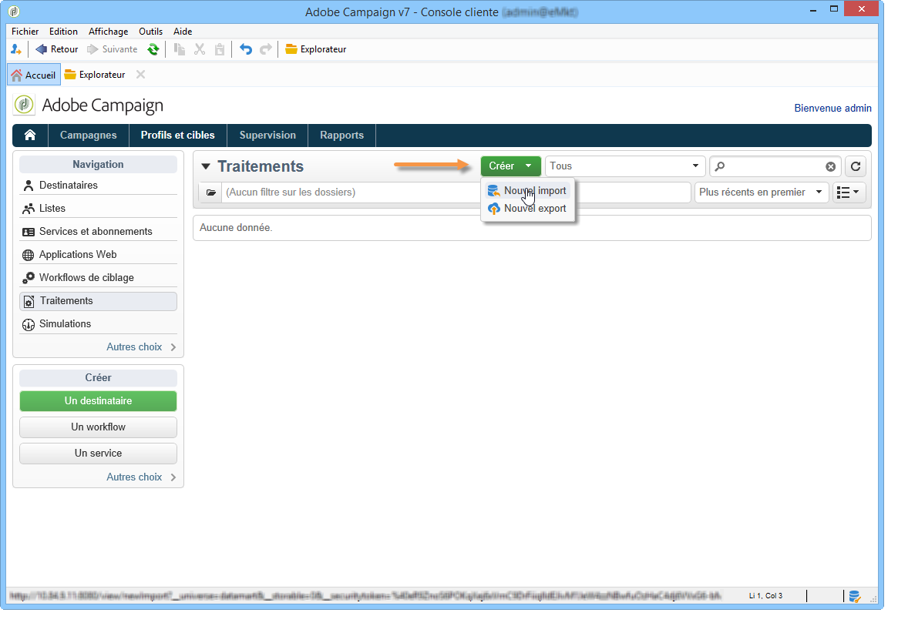
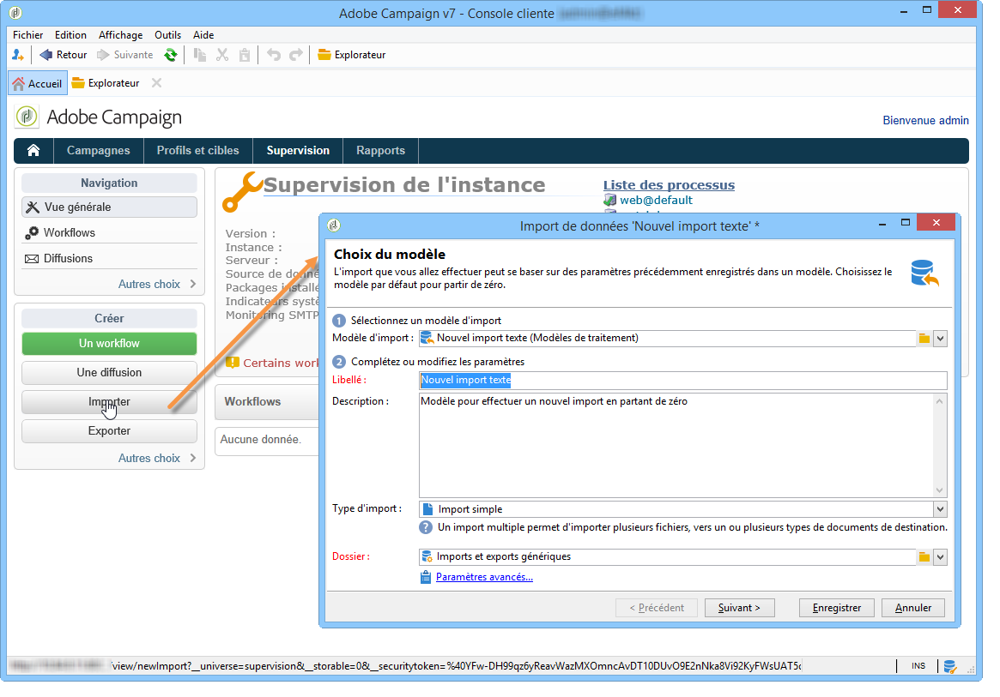
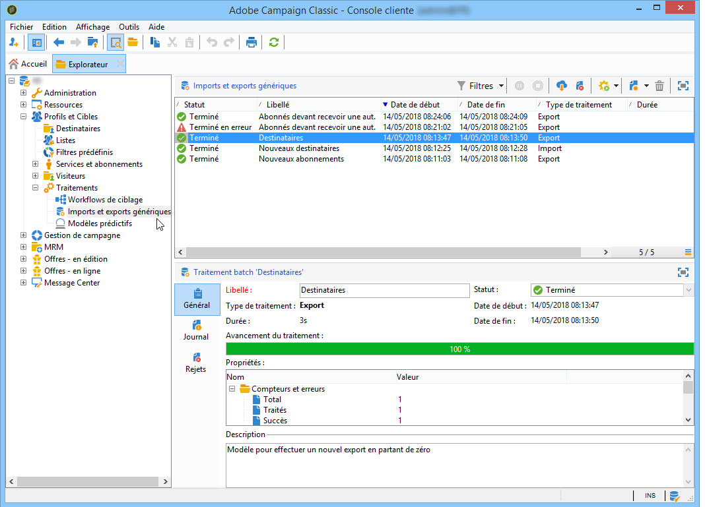

# Création de traitements d’import et d’export {#creating-import-export-jobs}

Une fois les modèles paramétrés, les opérations d&#39;import et d&#39;export peuvent être lancées dans plusieurs contextes sous Adobe Campaign.

* Dans la section **[!UICONTROL Profils et cibles]** de l&#39;espace de travail d&#39;Adobe Campaign, cliquez sur le lien **[!UICONTROL Traitements]** : vous accédez alors à la liste des imports et exports existants.

  Cliquez sur le bouton **[!UICONTROL Créer]** et choisissez le type de traitement que vous souhaitez réaliser.

  

* Vous pouvez également lancer les imports et exports depuis la section **[!UICONTROL Surveillance]** de l&#39;espace de travail : deux liens dédiés vous permettent de démarrer directement l&#39;import ou l&#39;export.

  

* Enfin, les imports et exports peuvent être lancés à partir de l&#39;explorateur Adobe Campaign.

  

Toutes ces actions ouvrent les assistants d&#39;export ou d&#39;import de données. Ils sont détaillés dans les sections suivantes :

* [Configuration d’un traitement d’import](../../platform/using/executing-import-jobs.md)
* [Configuration d’un traitement d’export](../../platform/using/executing-export-jobs.md)
