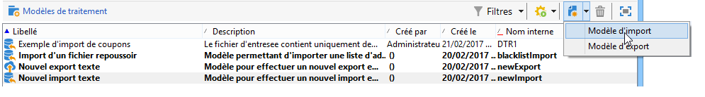

# Création de modèles d’import et d’export {#creating-import-export-templates}

Les modèles d&#39;import et d&#39;export sont stockés dans le répertoire **[!UICONTROL Ressources > Modèles > Modèles de traitement]** de l&#39;arborescence d&#39;Adobe Campaign.

Par défaut, trois modèles d&#39;import et un modèle d&#39;export sont présents dans ce répertoire. Ils ne doivent pas être modifiés.

* Le modèle natif **[!UICONTROL Importer la liste bloquée]** est déjà configuré pour importer une liste des adresses email ajoutées à la liste bloquée.

* Les modèles **[!UICONTROL Nouvel import texte]** et **[!UICONTROL Nouvel export texte]** permettent de paramétrer un import ou un export en partant de zéro.

Vous pouvez dupliquer des modèles existants pour créer vos propres modèles ou créer un nouveau modèle dans le menu **[!UICONTROL Nouveau > Modèle d&#39;import]** / **[!UICONTROL Modèle d&#39;export]**.

Le processus de configuration d&#39;un modèle est alors identique à celui présenté dans les sections suivantes :

* [Configuration d’un traitement d’import](../../platform/using/executing-import-jobs.md)
* [Configuration d’un traitement d’export](../../platform/using/executing-export-jobs.md)
