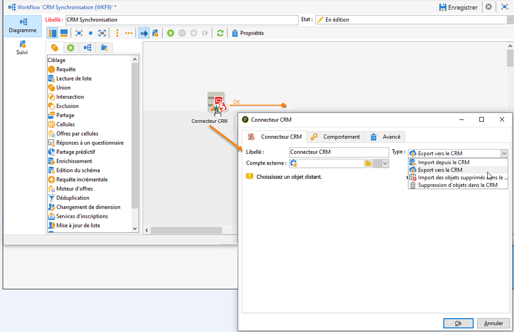

# Connecteurs CRM{#crm-connectors}

## Commencer avec les connecteurs CRM {#about-crm-connectors}

Adobe Campaign propose différents connecteurs CRM pour relier votre plateforme Adobe Campaign à vos systèmes tiers. Ces connecteurs CRM permettent par exemple de synchroniser les contacts, les comptes, les commandes, les achats, etc. Ils simplifient l&#39;intégration de votre application avec vos différentes applications tierces et métiers.

Ces connecteurs permettent d&#39;intégrer rapidement et simplement les données : Adobe Campaign propose un assistant dédié pour collecter et sélectionner parmi les tables disponibles dans le CRM. Ils permettent une synchronisation bidirectionnelle des informations afin que les données client soient à jour simultanément sur les différents systèmes.

>[!NOTE]
>
>Cette fonctionnalité est disponible dans Adobe Campaign via le package **Connecteurs CRM** dédié.

### Systèmes compatibles {#compatible-crm-systems-and-limitations}

La gestion de la relation client et les versions prises en charge sont détaillées dans la [matrice de compatibilité](../../rn/using/compatibility-matrix.md) Campaign.

>[!NOTE]
>
>Les connecteurs CRM fonctionnent seulement avec une URL sécurisée (https).

### Etapes de mise en oeuvre {#crm-implementation-steps}

Découvrez la procédure pas à pas pour connecter Campaign et Microsoft Dynamics [dans cette section](../../platform/using/crm-ms-dynamics.md)

En général, pour utiliser des connecteurs CRM en Adobe Campaign, procédez comme suit :

1. Créez un compte externe à partir du nœud **[!UICONTROL Administration > Plateforme > Comptes externes]** de l&#39;arborescence d&#39;Adobe Campaign.
1. Sélectionnez le système de gestion de la relation client auquel vous devez connecter Campaign.
1. Entrez les paramètres pour activer la connexion.
1. Exécutez l’assistant de configuration pour générer la table CRM disponible : l&#39;assistant de configuration vous permet de collecter des tables et de créer le schéma correspondant.

   Exemple de l&#39;Assistant de configuration **Salesforce** :

   

   >[!NOTE]
   >
   >Pour valider la configuration, vous devez procéder à une déconnexion/reconnexion à la console Adobe Campaign.

1. Vérifiez le schéma généré dans Adobe Campaign, sous le noeud **[!UICONTROL Administration > Paramétrage > Schéma de données]**.

   Exemple pour le schéma **Salesforce** :

   

1. Une fois le schéma créé, vous pouvez synchroniser automatiquement les énumérations depuis le CRM vers Adobe Campaign.

   Pour cela, cliquez sur le lien **[!UICONTROL Synchroniser des énumérations...]** et choisissez l&#39;énumération d&#39;Adobe Campaign correspondant à l&#39;énumération du CRM.

   >[!NOTE]
   >
   >Vous pouvez remplacer toutes les valeurs d&#39;une énumération Adobe Campaign par celles du CRM : pour cela, sélectionnez **[!UICONTROL Oui]** dans la colonne **[!UICONTROL Remplacer]**.

   Exemple de énumérations **Salesforce** :

   

   Cliquez sur **[!UICONTROL Suivant]** puis **[!UICONTROL Démarrer]** pour lancer l&#39;import de la liste.

1. Vérifiez les valeurs importées sous le menu **[!UICONTROL Administration > Plateforme > Enumérations]**.

   

   >[!NOTE]
   >
   > Plusieurs énumérations de sélection dans Salesforce ne sont pas prises en charge.

1. Pour synchroniser les données entre les données Adobe Campaign et le système de gestion de la relation client, vous devez créer un processus et utiliser l’activité **[!UICONTROL Connecteur de gestion de la relation client]**.

   

   Pour en savoir plus sur la synchronisation des données [dans cette page](../../platform/using/crm-data-sync.md).
