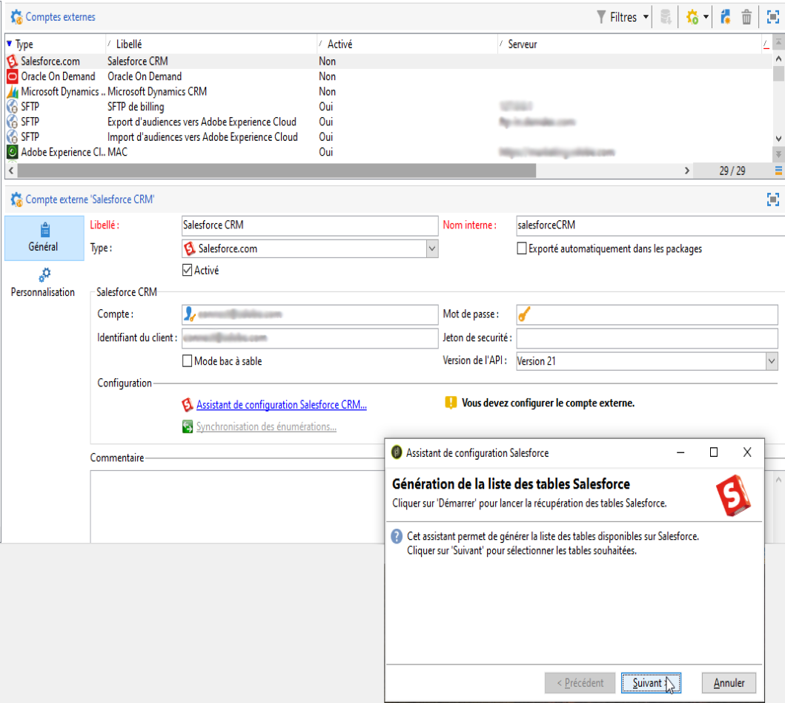
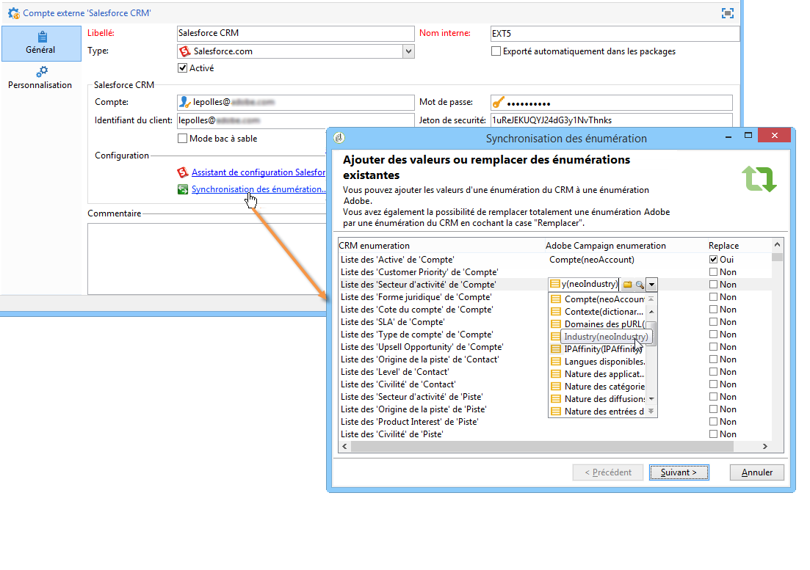
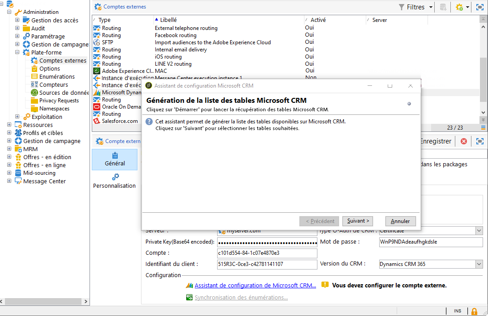
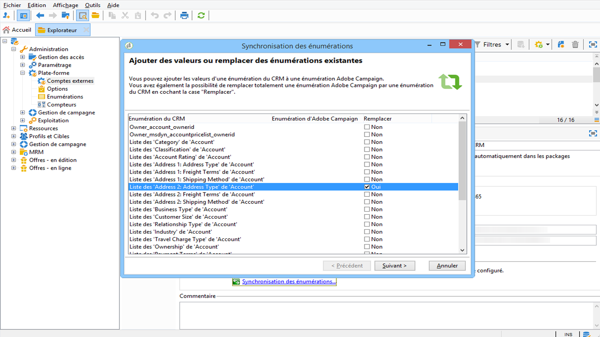

# Connecteurs CRM{#crm-connectors}

## A propos des connecteurs CRM {#about-crm-connectors}

Adobe Campaign propose différents connecteurs CRM pour relier votre plateforme Adobe Campaign à vos systèmes tiers. Ces connecteurs CRM permettent par exemple de synchroniser les contacts, les comptes, les commandes, les achats, etc. Ils simplifient l&#39;intégration de votre application avec vos différentes applications tierces et métiers.

Ces connecteurs permettent d&#39;intégrer rapidement et simplement les données : Adobe Campaign propose un assistant dédié pour collecter et sélectionner parmi les tables disponibles dans le CRM. Ils permettent une synchronisation bidirectionnelle des informations afin que les données client soient à jour simultanément sur les différents systèmes.

>[!NOTE]
>
>Cette fonctionnalité est disponible dans Adobe Campaign via le package **Connecteurs CRM** dédié.

La connexion aux CRM s&#39;effectue via des activités de workflow dédiées. Ces activités sont détaillées dans le chapitre présenté dans cette [section](../../workflow/using/crm-connector.md).

### Systèmes CRM compatibles et limitations {#compatible-crm-systems-and-limitations}

Les CRM répertoriés ci-après peuvent être intégrés à Adobe Campaign.

Les versions prises en charge sont présentées dans la [matrice de compatibilité](https://helpx.adobe.com/campaign/kb/compatibility-matrix.html).

* **Salesforce.com**

   Pour découvrir comment configurer la connexion à Salesforce.com, consultez [cette section](#example-for-salesforce-com).

   >[!CAUTION]
   >
   >Lors de la connexion d&#39;Adobe Campaign à Salesforce.com, les limitations sont les suivantes :
   >
   >    
   >    
   >    * Les instances de production et de test sont supportées.
   >    * Les règles d&#39;assignation sont supportées.
   >    * Les énumérations à sélection multiple ne sont pas supportées par Adobe Campaign.

* **Oracle On Demand**

   Pour découvrir comment configurer la connexion à Oracle On Demand, consultez [cette section](#example-for-oracle-on-demand).

   >[!CAUTION]
   >
   >Lors de la connexion d&#39;Adobe Campaign à Oracle On Demand, les limitations sont les suivantes :
   >
   >    
   >    
   >    * Adobe Campaign peut synchroniser n&#39;importe quel objet parmi ceux disponibles dans le modèle standard d&#39;Oracle On Demand. Si vous avez ajouté des tables personnalisées dans Oracle On Demand, celles-ci ne pourront pas être récupérées dans Adobe Campaign.
   >    * L&#39;API version v1.0 permet de trier ou filtrer les données lors d&#39;une requête, mais ne permet pas d&#39;effectuer ces deux actions simultanément.
   >    * Les dates envoyées par Oracle On Demand ne contiennent pas d&#39;informations sur le fuseau horaire.
   >    * Les énumérations à sélection multiple ne sont pas supportées par Adobe Campaign.

* **MS Dynamics CRM** et **MS Dynamics Online**

   Pour découvrir comment configurer la connexion à Microsoft Dynamics, consultez [cette section](#example-for-microsoft-dynamics).

   Découvrez les cas pratiques d&#39;intégration d&#39;Adobe Campaign et Microsoft Dynamics dans [cette vidéo](https://helpx.adobe.com/campaign/kt/acc/using/acc-integrate-dynamics365-with-acc-feature-video-set-up.html).

   >[!CAUTION]
   >
   >Lors de la connexion d&#39;Adobe Campaign à Microsoft Dynamics, les limitations sont les suivantes :
   >
   >    
   >    
   >    * L&#39;installation de plug-ins peut modifier le comportement du CRM, ce qui peut entraîner des problèmes de compatibilité avec Adobe Campaign.
   >    * Les énumérations à sélection multiple ne sont pas supportées par Adobe Campaign.

## Configurer la connexion {#setting-up-the-connection}

Pour utiliser les connecteurs CRM dans Adobe Campaign, les étapes sont les suivantes :

1. Création du compte externe
1. Collecte des tables CRM
1. Synchronisation des énumérations
1. Création du workflow de synchronisation

>[!NOTE]
>
>Les connecteurs CRM fonctionnent seulement avec une URL sécurisée (https).

### Exemple pour Salesforce.com {#example-for-salesforce-com}

Pour configurer le connecteur **Salesforce.com** avec Adobe Campaign, procédez comme suit :

1. Créez un compte externe à partir du nœud **[!UICONTROL Administration > Plate-forme > Comptes externes]** de l&#39;arborescence d&#39;Adobe Campaign.
1. Lancez l&#39;assistant de configuration pour générer les tables CRM disponibles.

   

   L&#39;assistant de configuration permet de collecter les tables et créer le schéma correspondant.

   Cliquez sur **[!UICONTROL Démarrer]** pour lancer l&#39;exécution.

   

   >[!NOTE]
   >
   >Pour valider la configuration, vous devez procéder à une déconnexion/reconnexion à la console Adobe Campaign.

1. Vérifiez le schéma généré dans Adobe Campaign, sous le noeud **[!UICONTROL Administration > Paramétrage > Schéma de données]**.

   

1. Une fois le schéma créé, vous pouvez synchroniser automatiquement les énumérations depuis le CRM vers Adobe Campaign.

   Pour cela, cliquez sur le lien **[!UICONTROL Synchroniser des énumérations...]** et choisissez l&#39;énumération d&#39;Adobe Campaign correspondant à l&#39;énumération du CRM.

   Vous pouvez remplacer toutes les valeurs d&#39;une énumération Adobe Campaign par celles du CRM : pour cela, sélectionnez **[!UICONTROL Oui]** dans la colonne **[!UICONTROL Remplacer]**.

   

   Cliquez sur **[!UICONTROL Suivant]** puis **[!UICONTROL Démarrer]** pour lancer l&#39;import de la liste.

1. Vérifiez les valeurs importées sous le menu **[!UICONTROL Administration > Plate-forme > Enumérations]**.

   

1. Pour importer les données Salesforce, ou exporter les données d&#39;Adobe Campaign vers Salesforce, vous devez créer un workflow et utiliser l&#39;activité **[!UICONTROL Connecteur CRM]**.

   

### Exemple pour Oracle On Demand {#example-for-oracle-on-demand}

Les étapes de paramétrage pour configurer le connecteur **Oracle On Demand** avec Adobe Campaign sont les suivantes :

1. Créez un compte externe à partir du nœud **[!UICONTROL Administration > Plate-forme > Comptes externes]** de l&#39;arborescence d&#39;Adobe Campaign.

   

1. Ouvrez l&#39;assistant de configuration : Adobe Campaign découvre automatiquement les tables du modèle de données Oracle. Sélectionnez les tables à collecter.

   

1. Cliquez sur **[!UICONTROL Suivant]** et lancez la création du schéma correspondant.

   Le schéma de données correspondant est alors accessible dans Adobe Campaign.

   

1. Lancez la synchronisation des énumérations entre Adobe Campaign et Oracle On Demand.

   

1. Pour importer les données Oracle On Demand dans Adobe Campaign, créez un workflow du type suivant :

   

   Ce workflow importe les contacts depuis Oracle On Demand, les synchronise avec les données Adobe Campaign existantes, déduplique les contacts et met à jour la base de données Adobe Campaign.

   L&#39;activité **[!UICONTROL Connecteur CRM]** doit être configurée comme dans l&#39;exemple suivant :

   

1. Pour exporter les données Adobe Campaign vers Oracle On Demand, créez un workflow comme ci-dessous :

   

   Ce workflow collecte les données utiles via des requêtes, puis exporte ces données dans la table des contacts d&#39;Oracle On Demand.

### Exemple pour Microsoft Dynamics {#example-for-microsoft-dynamics}

Les étapes de paramétrage pour configurer le connecteur Microsoft Dynamics sont les suivantes :

1. Créez un compte externe à partir du nœud **[!UICONTROL Administration > Plate-forme > Comptes externes]** de l&#39;arborescence d&#39;Adobe Campaign.

   

1. Sélectionnez le **Type de déploiement** : **[!UICONTROL On-premise]**, **[!UICONTROL Office 365]** ou **[!UICONTROL API Web]**, selon le connecteur à paramétrer.

   Adobe Campaign Classic prend en charge l’interface Dynamics 365 REST avec le protocole OAuth pour l’authentification.

   Si vous choisissez un type de déploiement **[!UICONTROL WebAPI]**, vous devez inscrire une application dans le répertoire Azure et obtenir le **clientId** du répertoire Azure. Cette inscription est documentée dans [cette page](https://msdn.microsoft.com/en-us/library/mt622431.aspx).

   >[!NOTE]
   >
   >Le paramètre redirectURL n&#39;est pas requis par Adobe Campaign Classic.

   La valeur **clientId** est utilisée avec le nom d&#39;utilisateur/mot de passe pour récupérer le jeton du porteur à l&#39;aide d&#39;un mot de passe de type d&#39;autorisation. Il s&#39;agit de l&#39;**autorisation des informations d&#39;identification de mot de passe du propriétaire des ressources**. Voir à ce propos [cette page](https://blogs.msdn.microsoft.com/wushuai/2016/09/25/resource-owner-password-credentials-grant-in-azure-ad-oauth/).

   

   Pour plus d&#39;informations sur la compatibilité des versions CRM, consultez la [Matrice de compatibilité](https://helpx.adobe.com/campaign/kb/compatibility-matrix.html).

1. Ouvrez l&#39;assistant de configuration : Adobe Campaign découvre automatiquement les tables du modèle de données Microsoft Dynamics.

   

   Sélectionnez les tables à collecter.

   

1. Cliquez sur **[!UICONTROL Suivant]** et lancez la création du schéma correspondant.

   

   >[!NOTE]
   >
   >Pour valider la configuration, vous devez vous déconnecter/reconnecter à la console Adobe Campaign.

   Le schéma de données correspondant est alors accessible dans Adobe Campaign.

   

1. Lancez la synchronisation des énumérations entre Adobe Campaign et Microsoft Dynamics.

   

1. Pour importer les données Microsoft Dynamics dans Adobe Campaign, créez un workflow du type suivant :

   

   Ce workflow importe les contacts depuis Microsoft Dynamics, les sychronise avec les données Adobe Campaign existantes, déduplique les contacts et met à jour la base de données Adobe Campaign.

   L&#39;activité **[!UICONTROL Connecteur CRM]** doit être configurée comme ci-dessous :

   

## Synchronisation des données {#data-synchronization}

La synchronisation entre Adobe Campaign et le CRM est réalisée à travers une activité de workflow dédiée : [connecteur CRM](../../workflow/using/crm-connector.md).

Cette activité permet de :

* Importation à partir de la gestion de la relation client (voir [Importation à partir de la gestion de la relation client](#importing-from-the-crm)),
* Exportation vers CRM (voir [Exportation vers CRM](#exporting-to-the-crm)),
* Importer des objets supprimés dans la gestion de la relation client (voir [Importation d&#39;objets supprimés dans la gestion de la relation client](#importing-objects-deleted-in-the-crm)),
* Supprimez des objets dans la gestion de la relation client (voir [Suppression d’objets dans la gestion de la relation client](#deleting-objects-in-the-crm)).

Sélectionnez le compte externe correspondant au CRM avec lequel vous souhaitez paramétrer une synchronisation puis choisissez l&#39;objet à synchroniser (comptes, opportunités, leads, contacts, etc.).

La configuration de cette activité dépend ensuite du traitement à réaliser. Les différents types de paramétrages sont présentés ci-après.

### Import depuis le CRM {#importing-from-the-crm}

Pour importer des données depuis le CRM dans Adobe Campaign, vous devez réaliser un workflow du type :

Pour un import, les étapes de paramétrage de l&#39;activité **Connecteur CRM** sont les suivantes :

1. Sélectionnez une opération de type **[!UICONTROL Import depuis le CRM]**.
1. Dans la liste déroulante **[!UICONTROL Objet distant]**, sélectionnez l&#39;objet concerné par le traitement. Cet objet correspond à l&#39;une des tables créées dans Adobe Campaign lors de la configuration du connecteur.
1. Dans la section **[!UICONTROL Champs distants]**, indiquez les champs à importer.

   Pour ajouter un champ, cliquez sur le bouton **[!UICONTROL Ajouter]** de la barre d&#39;outils puis sur l&#39;icône **[!UICONTROL Editer l&#39;expression]**.

   

   Si nécessaire, modifiez le format des données dans la liste déroulante des colonnes **[!UICONTROL Conversion]** . Les types de conversion possibles sont détaillés dans le format [Data](#data-format).

   >[!CAUTION]
   >
   >L&#39;identifiant de l&#39;enregistrement dans le CRM est obligatoire pour relier les objets côté CRM et côté Adobe Campaign. Il est automatiquement ajouté lors de la validation de la boîte.
   >
   >La date de la dernière modification côté CRM est également requise pour permettre l&#39;import incrémental des données.

1. Vous pouvez également filtrer les données à importer selon vos besoins. Pour cela, cliquez sur le lien **[!UICONTROL Editer le filtre...]**.

   Dans l&#39;exemple suivant, Adobe Campaign n&#39;importera que les contact ayant eu une activité après le 1er novembre 2012.

   

   >[!CAUTION]
   >
   >The limitations linked to data filtering modes are detailed in [Filtering data](#filtering-data).

1. L&#39;option **[!UICONTROL Utiliser l&#39;index automatique...]** permet de gérer automatiquement la synchronisation incrémentale des objets entre le CRM et Adobe Campaign, selon la date de leur dernière modification.

   For more on this, refer to [Variable management](#variable-management).

#### Gestion des variables {#variable-management}

L&#39;activation de l&#39;option **[!UICONTROL Index automatique]** permet de ne collecter que les objets modifiés depuis la dernière exécution de l&#39;import.

La date de la dernière synchronisation est stockée dans l&#39;option indiquée dans la fenêtre de paramétrage, par défaut : **LASTIMPORT_&lt;%=instance.internalName%>_&lt;%=activityName%>**.

>[!NOTE]
>
>Cette note s&#39;applique uniquement à l&#39;activité **[!UICONTROL Connecteur CRM]** générique. Pour les autres activités CRM, le processus est automatique.
>
>Cette option doit être créée et renseignée manuellement dans **[!UICONTROL Administration]** > **[!UICONTROL Plate-forme]** > **[!UICONTROL Options]**. Il doit s&#39;agir d&#39;une option texte. De plus, sa valeur doit correspondre au format suivant : **aaaa/MM/jj hh:mm:ss**.
> 
>Pour tout autre import, vous devez mettre à jour manuellement cette option.

Vous pouvez indiquer le champ CRM distant à prendre en compte pour identifier les modifications les plus récentes.

Par défaut, les champs suivants sont utilisés (dans l&#39;ordre indiqué) :

* Pour Microsoft Dynamics : **modifiedon**,
* Pour Oracle On Demand : **LastUpdated**, **ModifiedDate**, **LastLoggedIn**,
* Pour Salesforce.com : **LastModifiedDate**, **SystemModstamp**.

L&#39;activation de l&#39;option **[!UICONTROL Index automatique]** génère trois variables, qui pourront être exploitées dans le workflow de synchronisation, via une activité de type **[!UICONTROL Code JavaScript]**. Ces variables sont les suivantes :

* **vars.crmOptionName** : représente le nom de l&#39;option contenant la date du dernier import.
* **vars.crmStartImport** : représente la date de début (incluse) de la dernière récupération des données.
* **vars.crmEndDate** : représente la date de fin (exclue) de la dernière récupération des données.

   >[!NOTE]
   >
   >Ces dates sont exprimées au format **yyyy/MM/dd hh:mm:ss**.

#### Filtrer les données {#filtering-data}

Afin d&#39;assurer un bon fonctionnement avec les différents CRM, les filtres doivent être créés selon les règles suivantes :

* Chaque niveau de filtrage ne peut utiliser qu&#39;un seul type d&#39;opérateur.
* L&#39;opérateur AND NOT n&#39;est pas supporté.
* Les comparaisons ne peuvent porter que sur des valeurs nulles (de type &#39;est vide&#39;/&#39;n&#39;est pas vide&#39;) ou des nombres. Lorsque la colonne Valeur (colonne de droite) est évaluée, le résultat de cette évaluation doit être une valeur numérique.
* Les données de la colonne Valeur sont évaluées en JavaScript.
* Les comparaisons de type JOIN ne sont pas supportées.
* L&#39;expression indiquée dans la colonne de gauche doit nécessairement être un champ. Elle ne peut pas être une combinaison de plusieurs expressions, un nombre, etc.

Par exemple, la condition de filtrage suivante ne sera PAS valide dans le cadre d&#39;un import CRM, car l&#39;opérateur OU est placé au même niveau que les opérateurs ET :

* l&#39;opérateur OU est placé au même niveau que les opérateurs ET
* des comparaisons portent sur des chaînes de texte.

#### Ordre de tri {#order-by}

Sous Microsoft Dynamics et Salesforce.com, vous pouvez trier les champs distants à importer, par ordre descendant ou ascendant.

Pour cela, cliquez sur le lien **[!UICONTROL Ordre de tri]** et ajoutez les colonnes dans la liste.

L&#39;ordre des colonnes dans la liste indique l&#39;ordre de tri :

#### Identification des enregistrements {#record-identification}

Plutôt que d&#39;importer directement des éléments contenus (et éventuellement filtrés) dans le CRM, vous pouvez utiliser une population calculée en amont dans le workflow.

Pour cela, sélectionnez l&#39;option **[!UICONTROL Utiliser la population calculée en amont]** et indiquez le champ contenant l&#39;identifiant distant.

Sélectionnez ensuite les champs à importer depuis la population entrante, comme dans l&#39;exemple ci-dessous :

### Export vers le CRM {#exporting-to-the-crm}

L&#39;export de données Adobe Campaign dans le CRM permet de copier l&#39;intégralité d&#39;un contenu vers une base CRM.

Pour exporter des données vers le CRM, vous devez réaliser un workflow du type :

Pour un export, les étapes de paramétrage de l&#39;activité **Connecteur CRM** sont les suivantes :

1. Sélectionnez une opération de type **[!UICONTROL Exporter vers le CRM]**.
1. Dans la liste déroulante **[!UICONTROL Objet distant]**, sélectionnez l&#39;objet concerné par le traitement. Cet objet correspond à l&#39;une des tables créées dans Adobe Campaign lors de la configuration du connecteur.

   >[!CAUTION]
   >
   >La fonction d&#39;export de l&#39;activité **Connecteurs CRM** peut insérer ou mettre à jour les champs côté CRM. Pour permettre la mise à jour des champs dans le CRM, vous devez indiquer la clé primaire de la table distante. Si cette clé est absente, les données sont alors insérées (et non pas mises à jour).

1. Dans la section **[!UICONTROL Correspondance]**, indiquez les champs à exporter et leur correspondance dans le CRM.

   

   Pour ajouter un champ, cliquez sur le bouton **[!UICONTROL Ajouter]** de la barre d&#39;outils puis sur l&#39;icône **[!UICONTROL Editer l&#39;expression]**.

   >[!NOTE]
   >
   >Pour un champ, si aucune correspondance n&#39;est définie côté CRM, alors les valeurs ne peuvent pas être mises à jour : elle seront directement insérées dans le CRM.

   Si nécessaire, modifiez le format des données dans la liste déroulante des colonnes **[!UICONTROL Conversion]** . Les types de conversion possibles sont détaillés dans le format [Data](#data-format).

   >[!NOTE]
   >
   >La liste des enregistrements à exporter et le résultat de l&#39;export sont conservés dans un fichier temporaire qui reste accessible tant que le workflow n&#39;est pas terminé ou redémarré, ce qui permet de reprendre le traitement en cas d&#39;erreur, sans risquer d&#39;exporter plusieurs fois le même enregistrement et sans perte de données.

### Paramétrages additionnels {#additional-configurations}

#### Sur le format des données saisies {#data-format}

Vous pouvez convertir à la volée le format des données lors de leur import depuis le CRM ou lors de leur export vers le CRM.

Pour cela, sélectionnez la conversion à appliquer dans la colonne correspondante.

Le mode **[!UICONTROL par défaut]** applique une conversion automatique des données, qui correspond dans la plupart des cas, à un copier/coller des données. Toutefois, la gestion des fuseaux horaires est appliquée.

Les autres conversions possibles sont les suivantes :

* **[!UICONTROL Date seulement]** : ce mode supprime les heures des champs de type Date + Heure.
* **[!UICONTROL Sans décalage]** : ce mode annule la gestion des fuseaux horaires appliquée dans le mode par défaut.
* **[!UICONTROL Copié/collé]** : ce mode utilise les données brutes comme des chaînes (pas de conversion).

#### Traitement des erreurs {#error-processing}

Dans le cadre d&#39;un import ou d&#39;un export de données, il est possible d&#39;appliquer un traitement spécifique aux erreurs et rejets. Pour cela, sélectionnez les options **[!UICONTROL Traiter les rejets]** et **[!UICONTROL Traiter les erreurs]**, dans l&#39;onglet **[!UICONTROL Comportement]**.

Ces options positionnent les transitions sortantes correspondantes.

Positionnez ensuite les activités relatives aux traitements à appliquer.

Pour traiter les erreurs, vous pouvez par exemple positionner une boîte d&#39;attente puis planifier des reprises.

Les rejets sont collectés avec leur code d&#39;erreur et le message correspondant, vous pouvez donc mettre en place un tracking des rejets afin d&#39;optimiser vos processus de synchronisation.

>[!NOTE]
>
>Même lorsque l&#39;option **[!UICONTROL Traiter les rejets]** n&#39;est pas activée, un avertissement est généré pour chaque colonne rejetée, avec le code erreur et le message correspondant.

La transition sortante **[!UICONTROL Rejet]** permet d&#39;accéder au schéma de sortie qui contient les colonnes spécifiques relatives aux codes et messages d&#39;erreur. Ces colonnes sont les suivantes :

* Pour Oracle On Demand : **errorLogFilename** (nom du fichier de log côté Oracle), **errorCode** (code erreur), **errorSymbol** (symbole erreur, différent du code erreur), **errorMessage** (description du contexte de l&#39;erreur).
* Pour Salesforce.com : **errorSymbol** (symbole erreur, différent du code erreur), **errorMessage** (description du contexte de l&#39;erreur).

### Import des objets supprimés dans le CRM {#importing-objects-deleted-in-the-crm}

Afin de permettre la mise en place d&#39;un processus exhaustif de synchronisation des données, vous pouvez importer dans Adobe Campaign les objets supprimés côté CRM.

Pour cela, les étapes sont les suivantes :

1. Sélectionnez une opération de type **[!UICONTROL Import des objets supprimés dans le CRM]**.
1. Dans la liste déroulante **[!UICONTROL Objet distant]**, sélectionnez l&#39;objet concerné par le traitement. Cet objet correspond à l&#39;une des tables créées dans Adobe Campaign lors de la configuration du connecteur.
1. Indiquez la période de suppression à prendre en compte dans les champs **[!UICONTROL Date de début]** et **[!UICONTROL Date de fin]**. Ces dates seront incluses dans la période.

   

   >[!CAUTION]
   >
   >La période de suppression des éléments à récupérer doit correspondre aux limitations propres au CRM. Ainsi, par exemple, pour Salesforce.com, les éléments dont la suppression remonte à plus de 30 jours ne peuvent pas être récupérés.

### Suppression d&#39;objets dans le CRM {#deleting-objects-in-the-crm}

Pour supprimer des objets côté CRM, vous devez indiquer la clé primaire des éléments distants à effacer.

The **[!UICONTROL Behavior]** tab lets you enable the processing of rejects. This option generates a second output transition for the **[!UICONTROL CRM connector]** activity. For more on this, refer to [Error processing](#error-processing).

>[!NOTE]
>
>Même lorsque l&#39;option **[!UICONTROL Traiter les rejets]** n&#39;est pas activée, un avertissement est généré pour chaque colonne rejetée.

