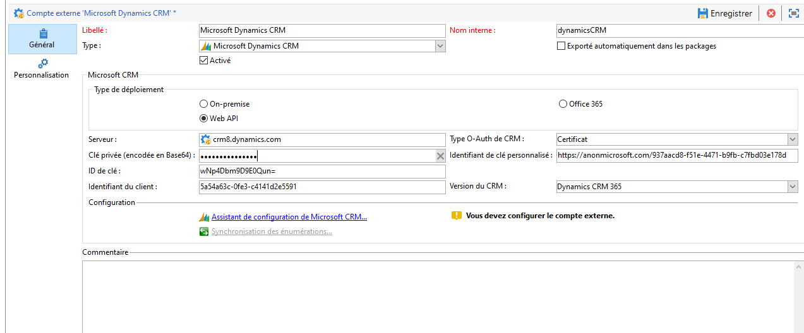
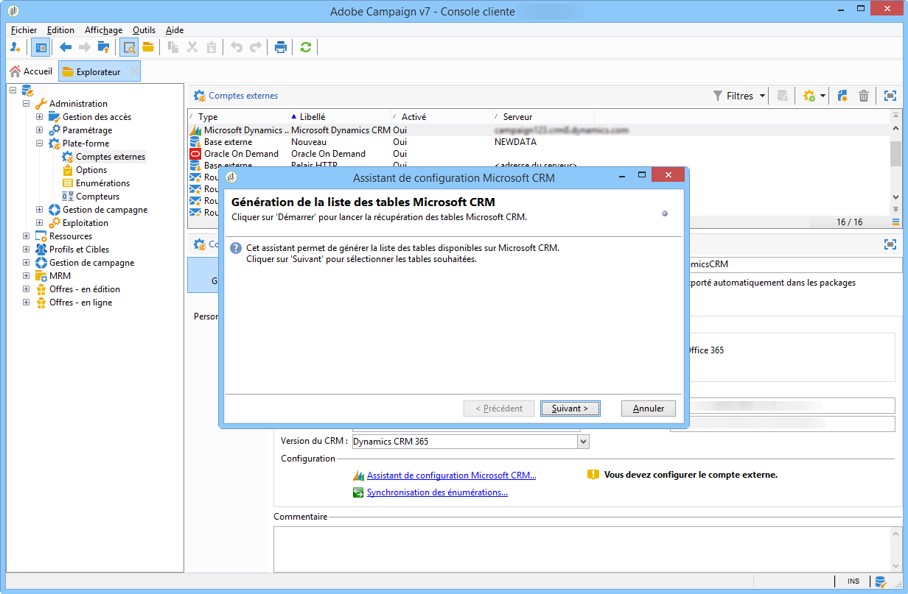
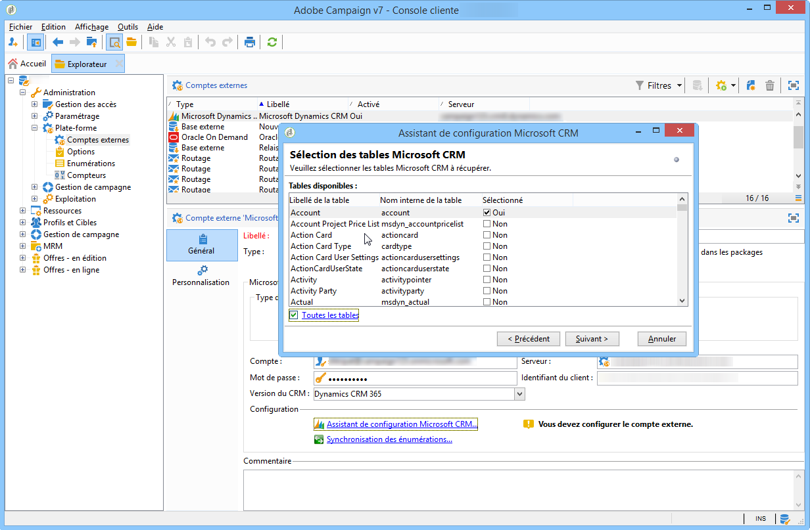
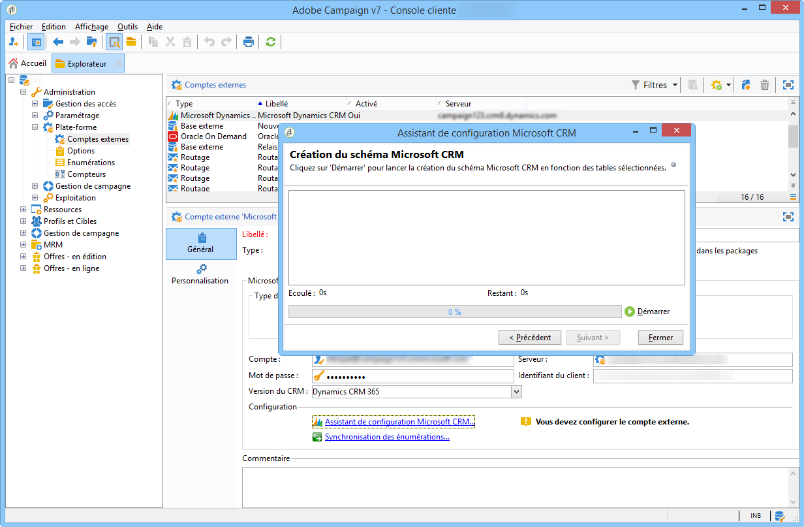
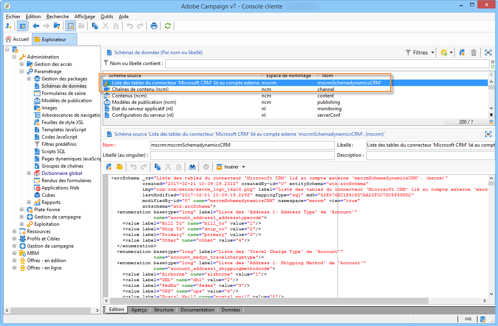
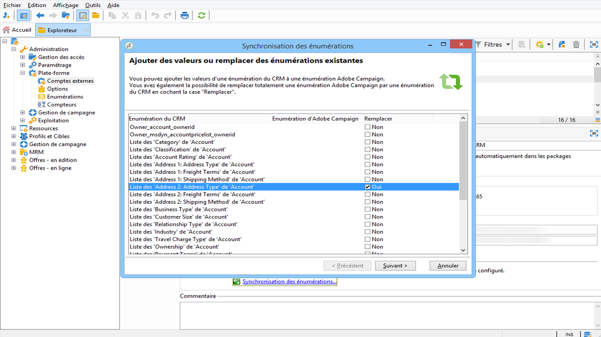

# Connecter Campaign et Microsoft Dynamics 365{#connect-to-msdyn}

Dans cette page, vous apprendrez comment connecter Campaign Classic à **Microsoft Dynamics CRM 365**.

Les déploiements possibles sont les suivants :

* via **Web API** (recommandé). Pour découvrir comment configurer la connexion à Microsoft Dynamics, consultez [la section ci-dessous](#microsoft-dynamics-implementation-step).
* avec **Office 365**. Consultez [cette vidéo](#microsoft-dynamics-office-365) pour connaître les étapes clés de la configuration de cette intégration.
* pour un déploiement **On-premise**, appliquez les étapes clés d&#39;Office 365.

La synchronisation des données s&#39;effectue via une activité de workflow dédiée. [En savoir plus](../../platform/using/crm-data-sync.md).

## Étapes de mise en œuvre{#microsoft-dynamics-implementation-steps}

Pour connecter Microsoft Dynamics 365 à Adobe Campaign via **Web API**, vous devez appliquer les étapes suivantes :

Dans Microsoft Dynamics CRM :
1. Obtention de l&#39;identifiant du client Microsoft Dynamics
1. Génération d&#39;un secret du client Microsoft Dynamics
1. Configuration des autorisations
1. Création d&#39;un utilisateur d&#39;application
1. Codage de la clé privée

[En savoir plus dans cette section](#config-crm-microsoft)

Dans Campaign Classic :
1. Création d&#39;un nouveau compte externe
1. Configuration du compte externe avec les paramètres Microsoft Dynamics
1. Utilisation de l&#39;assistant de configuration pour mapper des tables et synchroniser des énumérations
1. Création du workflow de synchronisation

[En savoir plus dans cette section](#configure-acc-for-microsoft)


>[!CAUTION]
> Lors de la connexion d&#39;Adobe Campaign à Microsoft Dynamics, vous ne pouvez pas :
> * Installer de plug-in qui peut modifier le comportement du CRM, ce qui peut entraîner des problèmes de compatibilité avec Adobe Campaign
> * Sélectionner plusieurs énumérations

>


## Configurer Microsoft Dynamics CRM {#config-crm-microsoft}

Pour générer le jeton d&#39;accès et les clés de configuration du compte, vous devez vous connecter à [Microsoft Azure Directory](https://portal.azure.com) à l&#39;aide d&#39;informations de connexion d&#39;**administrateur global**. Suivez ensuite les étapes décrites ci-dessous.

### Obtention de l&#39;identifiant du client Microsoft Dynamics {#get-client-id-microsoft}

Pour obtenir l&#39;identifiant du client, vous devez enregistrer une application dans Azure Active Directory. L&#39;identifiant du client est identique à l&#39;ID de l&#39;application.

1. Accédez à **Azure Active Directory > Enregistrements des applications**, puis cliquez sur **Nouvel enregistrement d&#39;application**.
1. Donnez un nom unique qui peut aider à identifier une instance, par exemple **adobecamcampaign`<instance identifier>`**.
1. Sélectionnez **Type d&#39;application** comme **application Web/API**.
1. Utilisez `http://localhost` comme **URL de connexion**.

Une fois que vous avez enregistré vos données, vous obtenez un **ID de l&#39;application** qui est l&#39;identifiant du client pour Campaign.

En savoir plus sur [cette page](https://docs.microsoft.com/fr-fr/powerapps/developer/common-data-service/walkthrough-register-app-azure-active-directory).

### Génération d&#39;un secret client Microsoft Dynamics {#config-client-secret-microsoft}

Le secret client est la clé qui est unique à l&#39;identifiant du client. Pour obtenir l&#39;identifiant de clé de certificat, procédez comme suit :

1. Accédez à **Azure Active Directory > Enregistrements des applications** et sélectionnez l&#39;application qui a été créée précédemment.
1. Cliquez sur **Certificats et secret**.
1. Cliquez sur **Télécharger le certificat**, puis recherchez et téléchargez le certificat public généré.
1. Pour générer le certificat, vous pouvez utiliser openssl.

   Par exemple :

   ```
   - openssl req -x509 -sha256 -nodes -days 365 -newkey rsa:2048 -keyout '<'private key name'>' -out '<'public certificate name'>
   ```

1. Cliquez sur le lien **manifest** pour obtenir l&#39;**identifiant de clé de certificat** et l&#39;**ID de clé**.

### Paramétrage des autorisations {#config-permissions-microsoft}

Vous devez configurer les **autorisations obligatoires** pour l&#39;application qui a été créée.

1. Accédez à **Azure Active Directory > Enregistrements des applications** et sélectionnez l&#39;application qui a été créée précédemment.
1. Cliquez sur **Paramètres** en haut à gauche.
1. Sur **Autorisations obligatoires**, cliquez sur **Ajouter** et **Sélectionner une API > Dynamics CRM Online**.
1. Cliquez ensuite sur **Sélectionner**, activez **Accéder à Dynamics 365 en tant qu&#39;utilisateurs de l&#39;organisation** et cliquez sur **Sélectionner**.

### Création d&#39;un utilisateur d&#39;application {#create-app-user-microsoft}

L&#39;utilisateur de l&#39;application est l&#39;utilisateur que l&#39;application enregistrée ci-dessus utilisera. Toute modification apportée à Microsoft Dynamics à l&#39;aide de l&#39;application enregistrée ci-dessus sera effectuée via cet utilisateur.

**Étape 1** : Création d&#39;un utilisateur non interactif sur Azure Active Directory

1. Cliquez sur **Azure Active Directory > Utilisateurs** et sur **Nouvel utilisateur**.
1. Donnez un nom adapté que vous souhaitez utiliser et le nom d&#39;utilisateur doit être au format d&#39;un email.
1. Sélectionnez **Administrateur Dynamics 365** dans le **Rôle de répertoire**.

**Étape 2** : Attribuer une licence appropriée à l&#39;utilisateur créé

1. Dans [Microsoft Azure](https://portal.azure.com), cliquez sur **Application d&#39;administration**.
1. Accédez à **Utilisateurs > Utilisateurs actifs** et cliquez sur l&#39;utilisateur qui vient d&#39;être créé.
1. Cliquez sur **Modifier les licences de produit** et sélectionnez **Dynamics 365 Customer Engagement Plan**.
1. Cliquez sur **Fermer**.

**Étape 3** : Création d&#39;un utilisateur d&#39;application sur Dynamics CRM

1. Depuis [Microsoft Azure](https://portal.azure.com), accédez à **Paramètres > Sécurité > Utilisateurs**.
1. Cliquez dans la liste déroulante, sélectionnez **Utilisateurs de l&#39;application** et cliquez sur **Nouveau**.
1. Utilisez le même nom d&#39;utilisateur que celui créé dans Active Directory ci-dessus

   >[!NOTE]
   >
   >L&#39;utilisation du même nom génère une erreur de clé de duplicata. Aussi, tant que nous n&#39;obtenons pas de confirmation indiquant que cette étape est nécessaire, utilisez un autre nom d&#39;utilisateur et continuez.

1. Affectez l&#39;**ID de l&#39;application** à [l&#39;application que vous avez créée précédemment](#get-client-id-microsoft).
1. Cliquez sur **Gérer les rôles** et sélectionnez le rôle **Administrateur système** pour l&#39;utilisateur.

## Configuration de Campaign {#configure-acc-for-microsoft}

Pour connecter Microsoft Dynamics 365 et Campaign, vous devez créer et configurer un compte externe dédié dans Campaign.

1. Accédez à **[!UICONTROL Administration > Plateforme > Comptes externes]**.

1. Créez un nouveau compte externe, sélectionnez le type **[!UICONTROL Microsoft Dynamics CRM]** et l&#39;option **[!UICONTROL Activer]**.

1. Sélectionnez le type de déploiement **[!UICONTROL Web API]** :

   Adobe Campaign Classic prend en charge l&#39;interface REST de Dynamics 365 avec le protocole OAuth pour l&#39;authentification avec un **[!UICONTROL certificat]** ou des **[!UICONTROL mots de passe]**.

   Utilisez les paramètres [définis précédemment](#get-client-id-microsoft) dans Azure Directory pour configurer le compte externe.

   

   >[!NOTE]
   >
   >La configuration du compte externe Microsoft Dynamics CRM est détaillée [dans cette section](../../installation/using/external-accounts.md#microsoft-dynamics-crm-external-account).

1. Cliquez sur le lien de l&#39;**[!UICONTROL assistant de configuration Microsoft CRM...]** : Adobe Campaign découvre automatiquement les tables du modèle de données Microsoft Dynamics.

   

1. Sélectionnez les tables à collecter.

   

1. Cliquez sur **[!UICONTROL Suivant]** pour lancer la création du schéma correspondant.

   

   >[!NOTE]
   >
   >Pour valider la configuration, vous devez vous déconnecter/reconnecter à la console Adobe Campaign.

   Vous pouvez vérifier que le schéma de données correspondant est disponible dans Adobe Campaign.

   

1. Cliquez sur le lien **[!UICONTROL Synchronisation des énumérations...]** pour lancer la synchronisation des énumérations entre Adobe Campaign et Microsoft Dynamics.

   

Campaign et Microsoft Dynamics sont maintenant connectés. Vous pouvez configurer la synchronisation des données entre les deux systèmes. Pour en savoir plus, consultez la section [Synchronisation des données](../../platform/using/crm-data-sync.md).

## Configuration de l&#39;intégration de Microsoft Dynamics CRM Office 365{#microsoft-dynamics-office-365}

Regardez cette vidéo pour découvrir comment intégrer Dynamics 365 à Adobe Campaign Classic, dans le contexte d&#39;un déploiement Office 365.

>[!VIDEO](https://video.tv.adobe.com/v/23837?quality=12)


## Types de données de champ pris en charge {#ms-dyn-supported-types}

Pour Microsoft Dynamics 365, les types d&#39;attribut pris en charge/non pris en charge sont répertoriés ci-dessous :


| Type d&#39;attribut | Pris en charge |
| --------------------------------------------------------------------------------- | --------- |
| Types simples : booléen, date et heure, nombre décimal, nombre à virgule flottante, doublon, nombre entier, entier long, chaîne | Oui |
| Devise (en tant que doublon) | Oui |
| mémo, nom de l&#39;entité, clé primaire, identifiant unique (en tant que chaînes) | Oui |
| Statut, liste de sélection (les valeurs possibles sont stockées dans des énumérations), état (chaîne) | Oui |
| propriétaire (comme chaîne) | Oui |
| Recherche (seules les recherches de référence d&#39;entité unique) | Oui |
| client | Non |
| Concernant | Non |
| PartyList | Non |
| ManagedProperty | Non |
