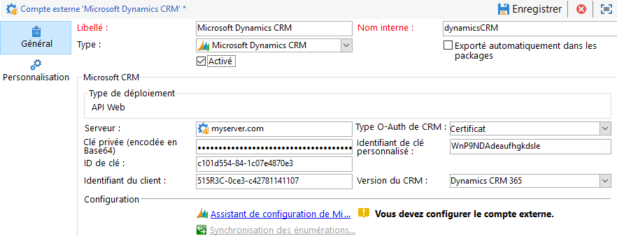
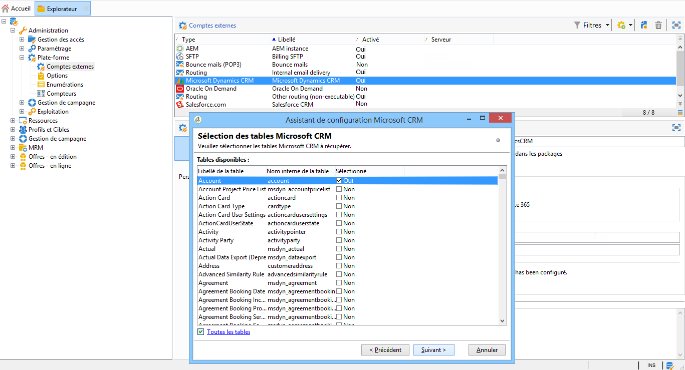
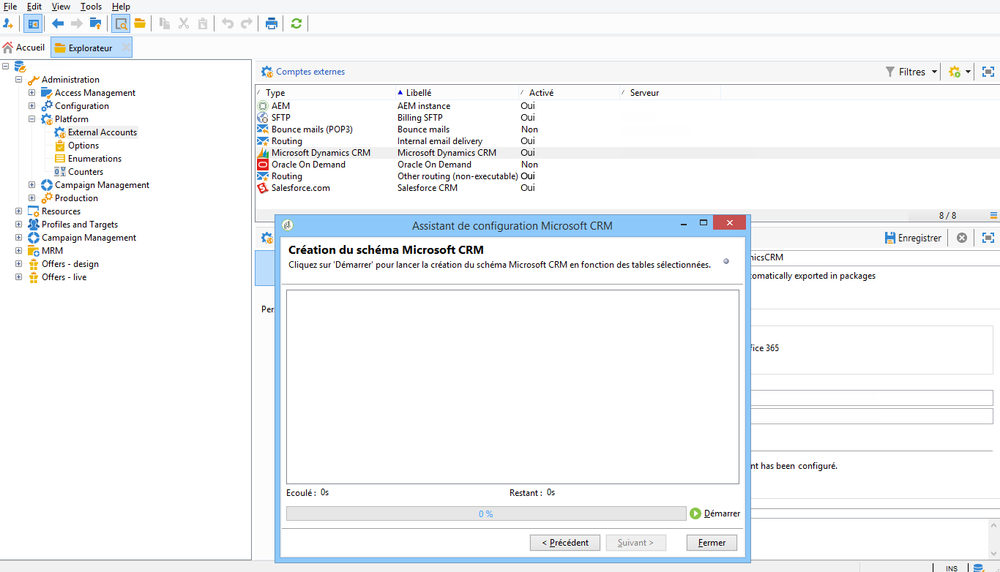
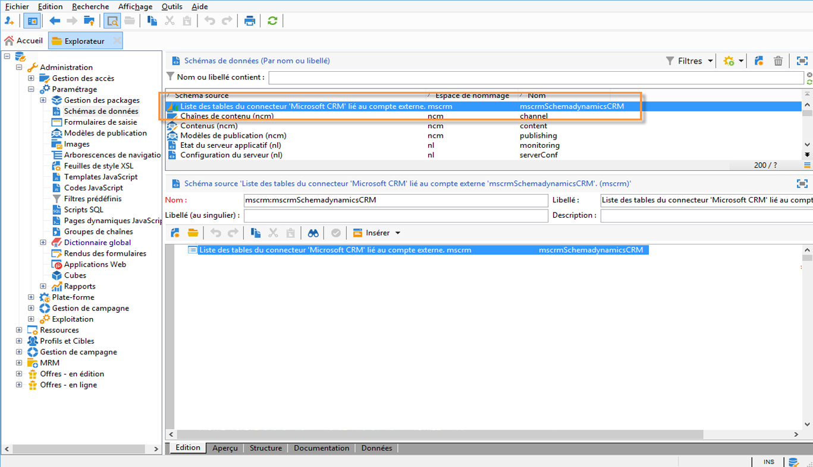

# Connectez Campaign et Microsoft Dynamics 365{#connect-to-msdyn}

Dans cette page, vous apprendrez comment connecter le Campaign Classic à **Microsoft Dynamics CRM 365**.

Les déploiements possibles sont les suivants :

* via **Web API** (recommandé). Reportez-vous à [la section ci-dessous](#microsoft-dynamics-implementation-step) pour connaître les étapes de configuration de la connexion avec Microsoft Dynamics.
* avec **Office 365**. Reportez-vous à [cette vidéo](#microsoft-dynamics-office-365) pour connaître les étapes clés pour configurer cette intégration.
* pour un déploiement **sur site**, appliquez les étapes clés d&#39;Office 365.

La synchronisation des données est effectuée via une activité de processus dédiée. [En savoir plus](../../platform/using/crm-data-sync.md).


>[!NOTE]
>
> La version des systèmes CRM compatibles avec Campaign est répertoriée dans la [matrice de compatibilité](../../rn/using/compatibility-matrix.md#CRMconnectors).


## Etapes de mise en oeuvre{#microsoft-dynamics-implementation-steps}

Pour connecter Microsoft Dynamics 365 à Adobe Campaign via **l&#39;API Web**, vous devez appliquer les étapes suivantes :

Dans Microsoft Dynamics CRM :
1. Obtenir l&#39;ID client Microsoft Dynamics
1. Générer une clé secrète client Microsoft Dynamics
1. Configuration des autorisations
1. Création d’un utilisateur d’application
1. Coder la clé privée

[En savoir plus dans cette section](#config-crm-microsoft)

En Campaign Classic :
1. Créer un compte externe
1. Configuration du compte externe avec les paramètres Microsoft Dynamics
1. Utilisation de l’assistant de configuration pour mapper des tables et synchroniser des énumérations
1. Création du workflow de synchronisation

[En savoir plus dans cette section](#configure-acc-for-microsoft)


>[!CAUTION]
> Lorsque vous connectez Adobe Campaign à Microsoft Dynamics, vous ne pouvez pas :
> * Installez des plug-ins susceptibles de modifier le comportement de la gestion de la relation client et d’entraîner des problèmes de compatibilité avec Adobe Campaign.
> * Sélectionner plusieurs énumérations

>


## Configurer Microsoft Dynamics CRM {#config-crm-microsoft}

Pour générer le jeton d&#39;accès et les clés de configuration du compte, vous devez vous connecter à [Microsoft Azure Directory](https://portal.azure.com) à l&#39;aide d&#39;une **identification d&#39;administrateur global**. Suivez ensuite les étapes décrites ci-dessous.

### Obtenir l&#39;ID client Microsoft Dynamics {#get-client-id-microsoft}

Pour obtenir l&#39;ID client, vous devez enregistrer une application dans Azure Principale Directory. ID client est identique à ID de l&#39;application.

1. Accédez à **Azure Principale Directory > Inscriptions d&#39;application**, puis cliquez sur **Nouvelle inscription d&#39;application**.
1. Donnez un nom unique qui peut aider à identifier une instance, par exemple **adobecamcampaign`<instance identifier>`**.
1. Sélectionnez **Type d&#39;application** comme **application Web / API**.
1. Utilisez `http://localhost` pour **URL de connexion**.

Une fois que vous avez enregistré, vous obtenez un **ID de l&#39;application** qui est l&#39;identifiant client pour Campaign.

En savoir plus sur [cette page](https://docs.microsoft.com/fr-fr/powerapps/developer/common-data-service/walkthrough-register-app-azure-active-directory).

### Générer la clé secrète client Microsoft Dynamics {#config-client-secret-microsoft}

Le secret client est la clé qui est unique à l’ID client. Pour obtenir l’identifiant de clé de certificat, procédez comme suit :

1. Accédez à **Azure Principale Directory > Inscriptions d&#39;application** et sélectionnez l&#39;application qui a été créée précédemment.
1. Cliquez sur **Certificats et Secret**.
1. Cliquez sur **Télécharger le certificat**, puis recherchez et téléchargez le certificat public généré.
1. Pour générer le certificat, vous pouvez utiliser openssl.

   par exemple :

   ```
   - openssl req -x509 -sha256 -nodes -days 365 -newkey rsa:2048 -keyout '<'private key name'>' -out '<'public certificate name'>
   ```

1. Cliquez sur le lien **manifest** pour obtenir l&#39;**identifiant de clé de certificat** et l&#39;**identifiant de clé**.

### Configurer les autorisations {#config-permissions-microsoft}

Vous devez configurer les **Autorisations requises** pour l’application qui a été créée.

1. Accédez à **Azure Principale Directory > Inscriptions d&#39;application** et sélectionnez l&#39;application qui a été créée précédemment.
1. Cliquez sur **Paramètres** en haut à gauche.
1. Sur **Autorisations requises**, cliquez sur **Ajouter** et **sélectionnez une API > Dynamics CRM Online**.
1. Cliquez ensuite sur **Sélectionner**, activez **Accéder à Dynamics 365 en tant qu&#39;utilisateurs de l&#39;organisation** et cliquez sur **Sélectionner**.

### Créer un utilisateur d’application {#create-app-user-microsoft}

L’utilisateur de l’application est l’utilisateur que l’application enregistrée ci-dessus utilisera. Toute modification apportée à Microsoft Dynamics à l&#39;aide de l&#39;application enregistrée ci-dessus sera effectuée via cet utilisateur.

**Étape 1** : Création d’un utilisateur non interactif sur un répertoire principal azure

1. Cliquez sur **Azure Principale Directory > Users** et sur **New User**.
1. Donnez un nom correct que vous souhaitez utiliser et le nom d&#39;utilisateur doit être un format d&#39;un email.
1. Sélectionnez **Administrateur Dynamics 365** dans le **Rôle d&#39;annuaire**.

**Étape 2** : Attribuer une licence appropriée à l’utilisateur créé

1. Dans [Microsoft Azure](https://portal.azure.com), cliquez sur **Application d&#39;administration**.
1. Accédez à **Utilisateurs > Utilisateurs Principaux** et cliquez sur l’utilisateur nouvellement créé.
1. Cliquez sur **Modifier les licences de produit** et sélectionnez le **plan d&#39;engagement client de Dynamics 365**.
1. Cliquez sur **Fermer**.

**Étape 3** : Création d’un utilisateur d’application sur Dynamics CRM

1. A partir de [Microsoft Azure](https://portal.azure.com), accédez à **Paramètres > Sécurité > Utilisateurs**.
1. Cliquez dans la liste déroulante, sélectionnez **Utilisateurs de l&#39;application** et cliquez sur **Nouveau**.
1. Utiliser le même nom d&#39;utilisateur que celui créé dans le répertoire principal ci-dessus

   >[!NOTE]
   >
   >L’utilisation du même nom génère une erreur de clé de duplicata. Aussi, jusqu’à ce que nous obtenions une confirmation indiquant si cette étape est nécessaire, utilisez un autre nom d’utilisateur et continuez.

1. Affectez le **ID de l&#39;application** pour [l&#39;application que vous avez créée précédemment](#get-client-id-microsoft).
1. Cliquez sur **Gérer les rôles** et sélectionnez le rôle **Administrateur système** pour l&#39;utilisateur.

## Configurer Campaign {#configure-acc-for-microsoft}

Pour connecter Microsoft Dynamics 365 et Campaign, vous devez créer et configurer un Compte externe dédié dans Campaign.

1. Accédez à **[!UICONTROL Administration > Plateforme > Comptes externes]**.

1. Créez un nouveau compte externe, sélectionnez le type **[!UICONTROL Microsoft Dynamics CRM]** et l&#39;option **[!UICONTROL Activer]**.

1. Sélectionnez le type de déploiement **[!UICONTROL API Web]** :

   Adobe Campaign Classic prend en charge l&#39;interface REST de Dynamics 365 avec le protocole OAuth pour l&#39;authentification avec un **[!UICONTROL Certificat]** ou **[!UICONTROL Informations d&#39;identification du mot de passe]**.

   Utilisez les paramètres [définis précédemment](#get-client-id-microsoft) dans Azure Directory pour configurer le compte externe.

   

   >[!NOTE]
   >
   >La configuration du Compte externe Microsoft Dynamics CRM est détaillée [dans cette section](../../installation/using/external-accounts.md#microsoft-dynamics-crm-external-account).

1. Cliquez sur l&#39;**[!UICONTROL Assistant de configuration Microsoft CRM...Lien]** : Adobe Campaign détecte automatiquement les tables du modèle de données Microsoft Dynamics.

   

1. Sélectionnez les tables à collecter.

   

1. Cliquez sur **[!UICONTROL Suivant]** pour début en créant le schéma correspondant.

   

   >[!NOTE]
   >
   >Pour valider la configuration, vous devez vous déconnecter/reconnecter à la console Adobe Campaign.

   Vous pouvez vérifier que le schéma de données correspondant est disponible dans Adobe Campaign.

   

1. Cliquez sur **[!UICONTROL Synchronisation des énumérations...]** lien vers le début de synchronisation des énumérations entre Adobe Campaign et Microsoft Dynamics.

   

Campaign et Microsoft Dynamics sont maintenant connectés. Vous pouvez configurer la synchronisation des données entre les deux systèmes. Pour en savoir plus, consultez la section [Synchronisation des données](../../platform/using/crm-data-sync.md).

## Configurer l&#39;intégration de Microsoft Dynamics CRM Office 365{#microsoft-dynamics-office-365}

Regardez cette vidéo pour découvrir comment intégrer Dynamics 365 à Adobe Campaign Classic, dans le contexte d&#39;un déploiement Office 365.

>[!VIDEO](https://video.tv.adobe.com/v/23837?quality=12)


## Types de données de champ pris en charge {#ms-dyn-supported-types}

Pour Microsoft Dynamics 365, les types d&#39;attribut pris en charge/non pris en charge sont répertoriés ci-dessous :


| Type d’attribut | Pris en charge |
| --------------------------------------------------------------------------------- | --------- |
| Types de base : booléen, datetime, decimal, flottante, doublon, integer, bigint, string | Oui |
| Argent (comme doublon) | Oui |
| memo, entityname, primarykey, uniqueidentifier (en tant que chaînes) | Oui |
| Etat, liste de sélection (les valeurs possibles sont stockées dans des énumérations), état (chaîne) | Oui |
| owner (as string) | Oui |
| Recherche (seules les recherches de référence d&#39;entité unique) | Oui |
| customer | Non |
| Concernant | Non |
| PartyList | Non |
| ManagedProperty | Non |
