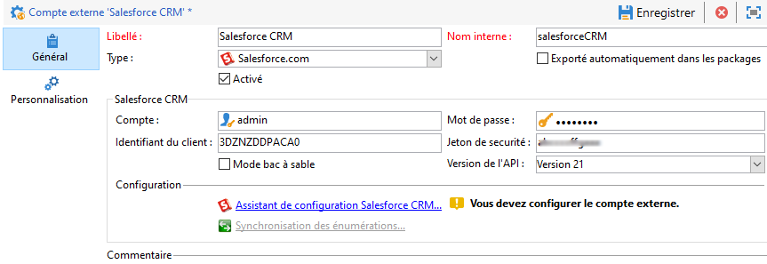
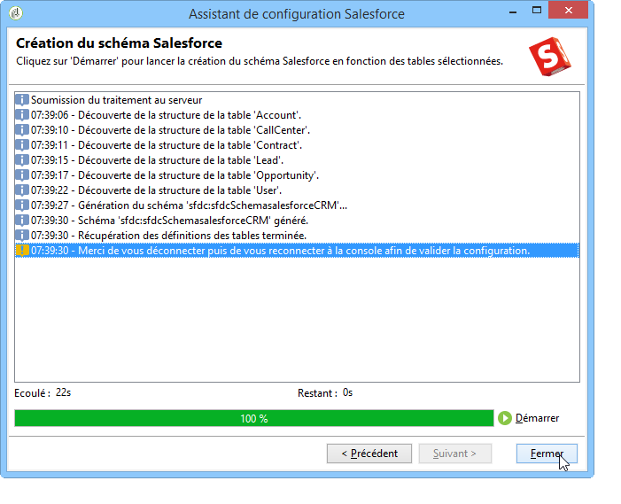
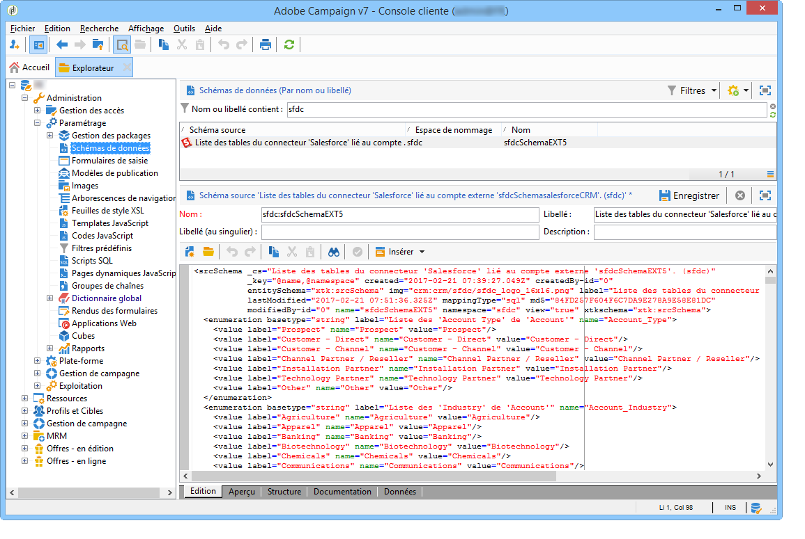
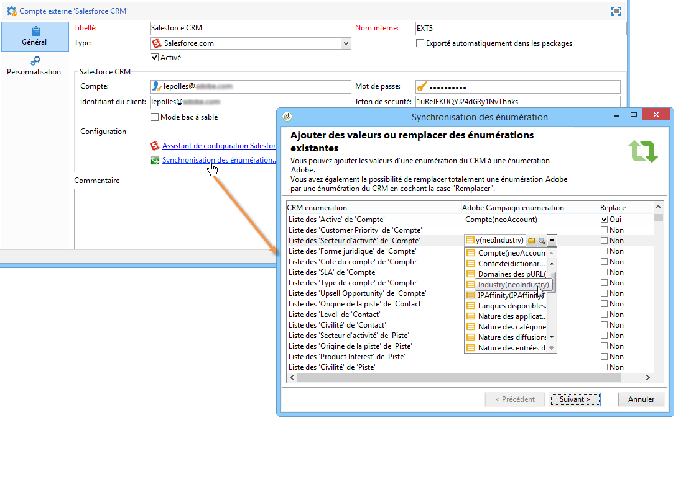
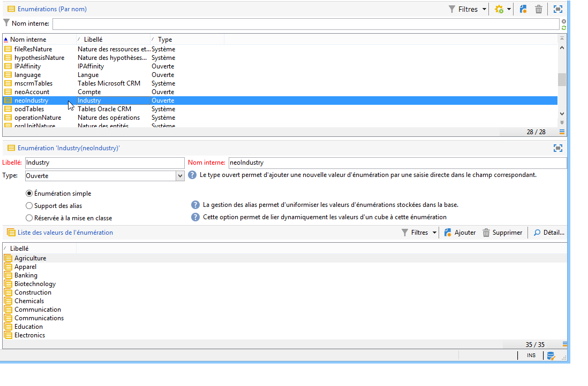
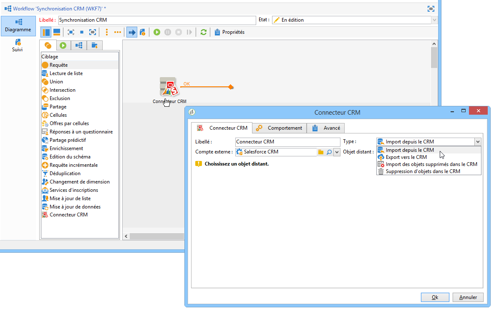

# Connecter Campaign et Salesforce.com{#connect-to-sfdc}

Sur cette page, vous allez découvrir comment connecter Campaign Classic à **Salesforce**.

La synchronisation des données s&#39;effectue via une activité de workflow dédiée. [En savoir plus](../../platform/using/crm-data-sync.md).

Le compte externe vous permet d’importer et d’exporter des données Salesforce vers Adobe Campaign.
Pour configurer le connecteur CRM pour Salesforce, procédez comme suit :

1. Créez un compte externe à partir du nœud **[!UICONTROL Administration > Plateforme > Comptes externes]** de l’arborescence d’Adobe Campaign.
1. Sélectionnez **[!UICONTROL Salesforce.com]**.
1. Saisissez les paramètres pour activer la connexion.

   

   Pour configurer le compte externe Salesforce CRM afin de l’utiliser avec Adobe Campaign, vous devez fournir les détails suivants :

   * **[!UICONTROL Compte]**
Compte utilisé pour se connecter à Salesforce CRM

   * **[!UICONTROL Mot de passe]**
Mot de passe utilisé pour se connecter à Salesforce CRM.

   * **[!UICONTROL Identifiant du client]**
Pour savoir où trouver l’identifiant du client, consultez [cette page](https://help.salesforce.com/articleView?id=000205876&amp;type=1).

   * **[!UICONTROL Jeton de sécurité]**
Pour savoir où trouver le jeton de sécurité, consultez [cette page](https://help.salesforce.com/articleView?id=000205876&amp;type=1).

   * **[!UICONTROL Version de l’API]**
Sélectionnez la version de l’API.
1. Exécutez l’assistant de configuration pour générer le tableau CRM disponible : l’assistant de configuration vous permet de collecter des tableaux et de créer le schéma correspondant.

   

   >[!NOTE]
   >
   >Pour valider la configuration, vous devez procéder à une déconnexion/reconnexion à la console Adobe Campaign.

1. Vérifiez le schéma généré dans Adobe Campaign, sous le noeud **[!UICONTROL Administration > Paramétrage > Schéma de données]**.

   Exemple pour le schéma **Salesforce** :

   

1. Une fois le schéma créé, vous pouvez synchroniser automatiquement les énumérations entre Salesforce et Adobe Campaign.

   Pour cela, cliquez sur le lien **[!UICONTROL Synchronisation des énumérations...]** et choisissez l’énumération d’Adobe Campaign correspondant à celle de Salesforce.

   

   >[!NOTE]
   >
   >Vous pouvez remplacer toutes les valeurs d&#39;une énumération Adobe Campaign par celles du CRM : pour cela, sélectionnez **[!UICONTROL Oui]** dans la colonne **[!UICONTROL Remplacer]**.

   Cliquez sur **[!UICONTROL Suivant]** puis **[!UICONTROL Démarrer]** pour lancer l&#39;import de la liste.

1. Vérifiez les valeurs importées sous le menu **[!UICONTROL Administration > Plateforme > Enumérations]**.

   

   >[!NOTE]
   >
   > La sélection multiple d’énumérations n’est pas prise en charge.

Campaign et Salesforce.com sont maintenant connectés. Vous pouvez configurer la synchronisation des données entre les deux systèmes.

Pour synchroniser les données entre Adobe Campaign et SFDC, vous devez créer un workflow et utiliser l’activité **[!UICONTROL Connecteur CRM]**.

Pour en savoir plus sur la synchronisation des données, consultez [cette page](../../platform/using/crm-data-sync.md).
