# Définition des conditions de filtre{#defining-filter-conditions}

## Sélectionner l’opérateur {#choosing-the-operator}

Dans une condition de filtrage, il faut lier deux valeurs grâce à un opérateur.

Voici une liste descriptive des opérateurs disponibles :

<table> 
 <thead> 
  <tr> 
   <th> Opérateur  </th> 
   <th> Intérêt  </th> 
   <th> Exemple  </th> 
  </tr> 
 </thead> 
 <tbody> 
  <tr> 
   <td> Egal à   </td> 
   <td> Retrouver un résultat rigoureusement identique à ce qui est entré dans la seconde colonne Valeur.  </td> 
   <td> <strong>Nom (@lastName) égal à 'Martin'</strong>. Ici ne seront retournés que les destinataires dont le nom est 'Martin', avec les seuls caractères indiqués.  </td> 
  </tr> 
  <tr> 
   <td> Supérieur à   </td> 
   <td> Obtenir un résultat supérieur à la valeur indiquée.  </td> 
   <td> <strong>Age (@age) supérieur à '50'</strong> pour retourner toutes les valeurs supérieures à '50', donc '51', '52', etc.  </td> 
  </tr> 
  <tr> 
   <td> Inférieur à   </td> 
   <td> Obtenir un résultat inférieur à la valeur indiquée.  </td> 
   <td> <strong>Date de création (@created) strictement plus tôt que 'DaysAgo(100)'</strong> afin de retrouver tous les destinataires créés dans la base il y a moins de 100 jours.  </td> 
  </tr> 
  <tr> 
   <td> Supérieur ou égal à   </td> 
   <td> Obtenir un résultat rigoureusement égal ou supérieur à la valeur renseignée.  </td> 
   <td> <strong>Age (@age) supérieur ou égal à '30'</strong>, afin de retrouver les destinataires dont l'âge est de 30 ans, 31 ans, etc.  </td> 
  </tr> 
  <tr> 
   <td> Inférieur ou égal à   </td> 
   <td> Obtenir un résultat rigoureusement égal ou inférieur à la valeur renseignée.  </td> 
   <td> <strong>Age (@age) inférieur ou égal à '60'</strong> pour retrouver les destinataires dont l'âge est de 60 ans ou moins.  </td> 
  </tr> 
  <tr> 
   <td> Différent de   </td> 
   <td> Le résultat retourné ne doit pas être identique à la valeur renseignée.  </td> 
   <td> <strong>Langue (@language) différent de 'Anglais'</strong>.  </td> 
  </tr> 
  <tr> 
   <td> Commence par   </td> 
   <td> Obtenir des résultats commençant par la valeur indiquée.  </td> 
   <td> <strong>N° de compte (@account) commence par '32010'.</strong>  </td> 
  </tr> 
  <tr> 
   <td> Ne commence pas par   </td> 
   <td> Obtenir des résultats qui ne commencent pas par la valeur renseignée  </td> 
   <td> <strong>N° de compte (@account) ne commence pas par '20'</strong>.  </td> 
  </tr> 
  <tr> 
   <td> Contient   </td> 
   <td> Obtenir un résultat comportant au moins la valeur qui est renseignée.  </td> 
   <td> <strong>Domaine de l'email (@domain) contient 'mail'</strong>. Ici, tous les noms de domaine comportant la valeur 'mail' seront retournés en résultat. Par conséquent, le nom de domaine 'gmail.com' fera partie des résultats retournés.  </td> 
  </tr> 
  <tr> 
   <td> Ne contient pas   </td> 
   <td> Ne pas obtenir de résultats contenant au moins la valeur renseignée.  </td> 
   <td> <strong>Domaine de l'email (@domain) ne contient pas 'vo'</strong>. Dans ce cas, les noms de domaine contenant la valeur 'vo' ne seront pas proposés dans les résultats. Ainsi, le nom de domaine 'voila.fr' ne sera pas proposé dans les résultats.  </td> 
  </tr> 
  <tr> 
   <td> Comme   </td> 
   <td> Comme est quasiment identique à l'opérateur Contient.  Il vous permet d’insérer un caractère joker % dans la valeur.  </td> 
   <td> <strong>Nom (@lastName) comme 'Mart%n</strong>'. Ici, le caractère de substitution sert de "joker" afin de retrouver le nom "Martin" dans le cas très hypothétique où l'opérateur aurait oublié quelle est la lettre située entre les lettre 't' et 'n' (un 'i' en l'occurrence...).  </td> 
  </tr> 
  <tr> 
   <td> Pas comme   </td> 
   <td> Similaire à Comme. Permet de ne pas obtenir la valeur renseignée. La valeur renseignée doit ici aussi comporter le caractère joker %.  </td> 
   <td> <strong>Nom (@lastName) pas comme 'Smi%h'</strong>. Ici, les destinataires répondant au nom de 'Smi%h' ne seront pas retournés en résultat.  </td> 
  </tr> 
  <tr> 
   <td> Est vide   </td> 
   <td> Dans ce cas, le résultat recherché correspond à une valeur vide dans la seconde colonne Valeur.  </td> 
   <td> <strong>Portable (@mobilePhone) est vide</strong> afin de retrouver tous les destinataires ne disposant pas d'un numéro de téléphone mobile.  </td> 
  </tr> 
  <tr> 
   <td> N'est pas vide   </td> 
   <td> Est contraire à l'opérateur Est vide. Il n'est pas non plus nécessaire d'entrer de données dans la seconde colonne Valeur.  </td> 
   <td> <strong>Email (@email) n'est pas vide</strong>.  </td> 
  </tr> 
  <tr> 
   <td> Est compris dans   </td> 
   <td> Obtenir les résultats compris dans les valeurs indiquées. Ces valeurs doivent toujours être séparées par une virgule.  </td> 
   <td> <strong>Code Postal (location/@zipCode) est compris dans '75014, 75015'</strong>. Si des destinataires sont recherchés, la requête retrouvera ceux dont le code postal égal à 75014 et 75015.   </td> 
  </tr> 
  <tr> 
   <td> N'est pas compris dans   </td> 
   <td> Le principe est le même qu'avec l'opérateur Est compris dans. Ici, il s'agit d'exclure les destinataires en fonction des valeurs indiquées.  </td> 
   <td> <strong>Code Postal (location/@zipCode) n'est pas compris dans '75013, 75015,75016,75019'</strong>. Contrairement à l'exemple précédent, les destinataires avec un code postal égal à 75013, 75015, 75016 et 75019 ne seront pas retournés.  </td> 
  </tr> 
 </tbody> 
</table>

## Utiliser ET, OU, SAUF {#using-and--or--except}

Dans les requêtes utilisant plus d&#39;un critère de filtrage, vous devez définir les liens entre conditions. Il y a trois liens possibles :

* **[!UICONTROL Et]** permet de cumuler deux conditions de filtrage,
* **[!UICONTROL Ou]** sert à proposer une alternative,
* **[!UICONTROL Sauf]** sert à définir une exception.

Cliquez sur le **[!UICONTROL Et]** (proposé par défaut) et faites votre choix dans la liste déroulante.

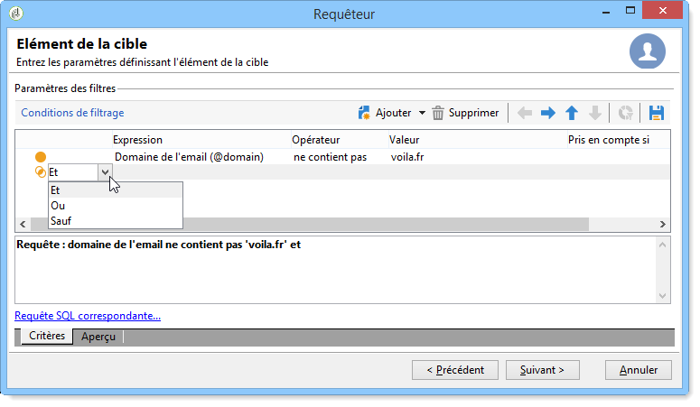

* **[!UICONTROL Et]** : ajoute une condition en plus de la précédente et permet de surfiltrer.
* **[!UICONTROL Ou]** : permet de prendre en compte au moins un résultat par rapport aux conditions définies.

  L&#39;exemple ci-dessous permet de retrouver des destinataires dont le domaine d&#39;email contient &quot;voila.fr&quot; OU dont le code postal commence par le chiffre &quot;49&quot;.

  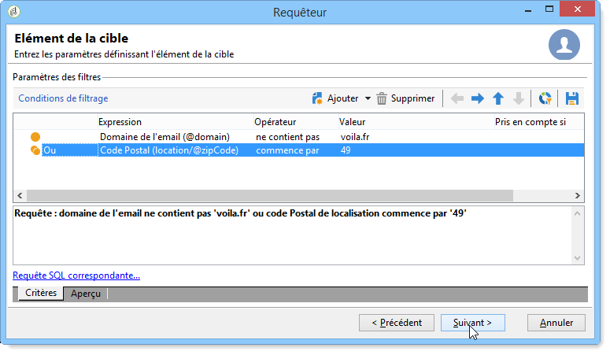

* **[!UICONTROL Sauf]** : si vous avez deux filtres et que le premier permet de ne pas obtenir de valeur, une relation de ce type crée une exception.

  Dans l&#39;exemple ci-dessous, on recherche des destinataires dont le domaine d&#39;email contient &quot;voila.fr&quot; SAUF si le nom de famille des destinataires correspond à la valeur &quot;Smith&quot;.

  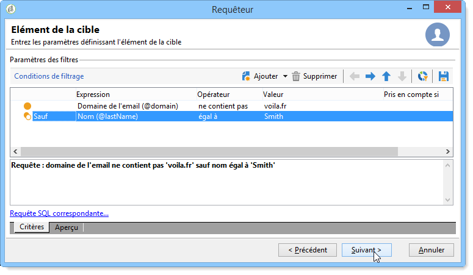

Cet autre exemple montre un filtre permettant d&#39;afficher : les destinataires de langue espagnole OU les femmes dont le numéro de téléphone mobile est renseigné OU les destinataires qui n&#39;ont pas renseigné leur numéro de compte et dont le nom de société commence &quot;N&quot;.

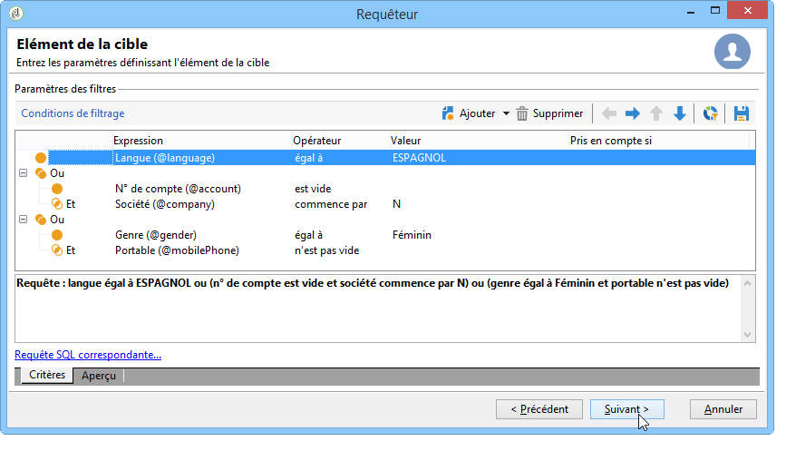

## Hiérarchiser les conditions {#prioritizing-conditions}

Cette section explique comment hiérarchiser les conditions. Ceci est possible grâce aux flèches bleues situées dans la barre d&#39;outils.

* La flèche pointant vers la droite permet d&#39;ajouter un niveau de parenthèses au filtrage.
* La flèche pointant vers la gauche permet de supprimer un niveau de parenthèses.

  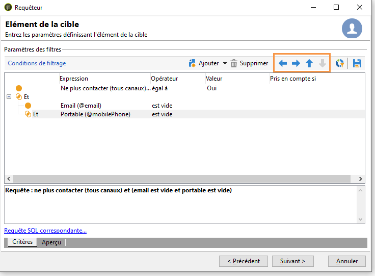

* Les flèches pointant vers le haut et vers le bas permettent de déplacer une condition. Cela modifie l&#39;ordre d&#39;exécution des filtres.

L&#39;exemple qui suit montre le comportement de la flèche servant à supprimer le niveau de parenthèse. La condition de filtrage de base est : **[!UICONTROL Ville égale à Saumur OU genre égal à masculin et numéro de téléphone mobile non renseigné OU numéro de compte commence par &quot;95&quot; et dont nom de société commence par &quot;A&quot;]**.

Pointez votre curseur sur la condition de filtrage **[!UICONTROL Gender (@gender) égal à Masculin]** puis cliquez sur la flèche **[!UICONTROL Supprimer un niveau de parenthèses]**.

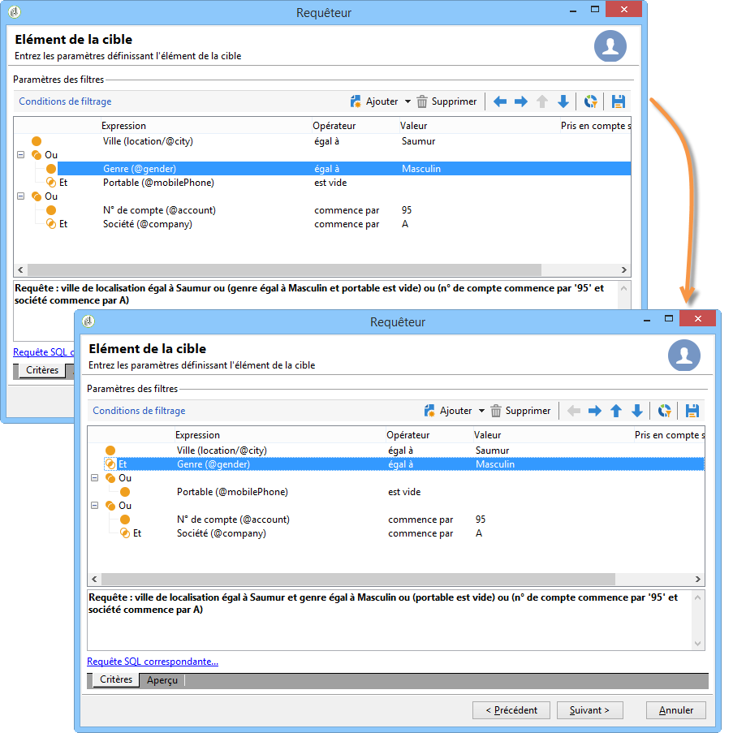

La condition **[!UICONTROL Gender (@gender) égal à Masculin]** vient d&#39;être extraite de sa parenthèse. Elle se situe désormais au même niveau que la condition &quot;Ville égale à Saumur&quot;. Ces deux conditions sont liées par un **[!UICONTROL Et]**.

## Sélectionner les données à extraire {#selecting-data-to-extract}

Les champs disponibles varient d&#39;une table à l&#39;autre. Tous les champs sont stockés dans un nœud principal, nommé **[!UICONTROL Elément principal]**. Les champs de l&#39;exemple ci-dessous sont ceux de la table des destinataires (nms:recipient). Les champs sont toujours ordonnés alphabétiquement.

Le détail du champ sélectionné est visible au bas de la fenêtre. Par exemple, le champ **[!UICONTROL Domaine de l&#39;email]** est un **[!UICONTROL Champ calculé SQL]**. Le reste de son appellation est **[!UICONTROL (@domain)]**.

>[!NOTE]
>
>Utilisez la section **[!UICONTROL Rechercher]** pour retrouver un champ disponible.

Double-cliquez sur un champ disponible pour l&#39;ajouter aux colonnes de sortie. En fin de requête, chaque champ sélectionné correspond à une colonne dans la fenêtre **[!UICONTROL Prévisualisation des données]**.

Les champs avancés ne sont pas affichés par défaut. Cliquez sur **[!UICONTROL Afficher les champs avancés]**, en bas à droite des champs disponibles pour les afficher. Cette fonction affiche le nom complet des champs.

Par exemple, dans la table des destinataires, les champs avancés sont **Booléen 1**, **[!UICONTROL Booléen 2]**, **[!UICONTROL Booléen 3]**, **[!UICONTROL Clé étrangère du lien &quot;Dossier&quot;]**, etc.

L&#39;exemple ci-dessous montre les champs avancés de la table des destinataires.

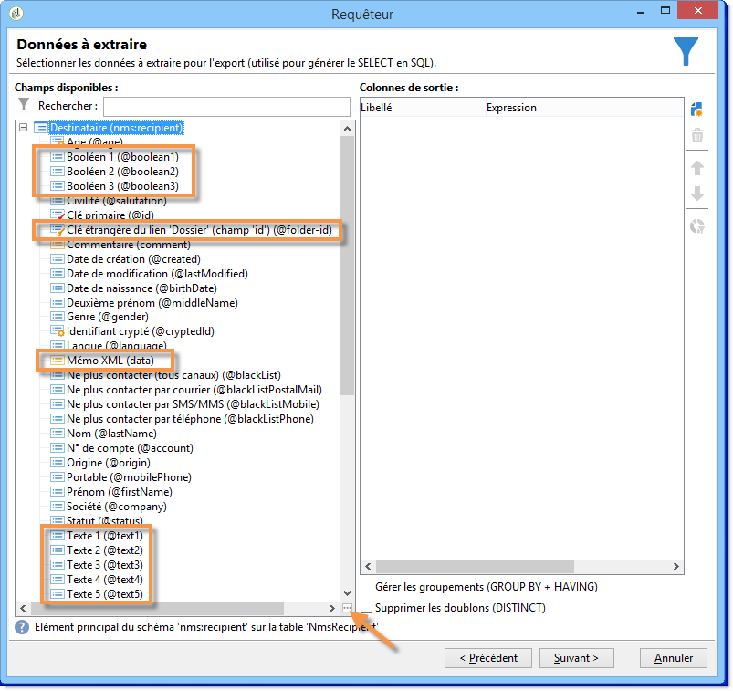

Les différentes catégories de champs :

<table> 
 <thead> 
  <tr> 
   <th> Icône  </th> 
   <th> Description  </th> 
   <th> Exemples  </th> 
  </tr> 
 </thead> 
 <tbody> 
  <tr> 
   <td>  </td> 
   <td> Champ simple  </td> 
   <td> Civilité, email, genre, etc.  </td> 
  </tr> 
  <tr> 
   <td>  </td> 
   <td> Clé primaire. Ce champ SQL sert à identifier de manière unique un enregistrement dans une table.  </td> 
   <td> L'identifiant d'un destinataire est une clé primaire et un identifiant est unique par définition.  </td> 
  </tr> 
  <tr> 
   <td>  </td> 
   <td> Clé étrangère. Sert de lien vers une autre table.  </td> 
   <td> Clé étrangère du destinataire, clé étrangère du service, etc.  </td> 
  </tr> 
  <tr> 
   <td>  </td> 
   <td> Champ calculé. Ce type de champ est calculé à la demande, à partir de valeurs stockées en base.  </td> 
   <td> Âge, domaine d'email, etc.  </td> 
  </tr> 
  <tr> 
   <td>  </td> 
   <td> Champ contenant des textes longs.  </td> 
   <td> Commentaire, Adresse complète, etc.  </td> 
  </tr> 
  <tr> 
   <td>  </td> 
   <td> Champ SQL indexé.   </td> 
   <td> Nom complet, Code ISO, etc.   </td> 
  </tr> 
 </tbody> 
</table>

Liens vers une table et éléments de collection :

<table> 
 <thead> 
  <tr> 
   <th> Icône  </th> 
   <th> Description  </th> 
   <th> Exemple  </th> 
  </tr> 
 </thead> 
 <tbody> 
  <tr> 
   <td>  </td> 
   <td> Liens vers une table en particulier. Ils correspondent à des associations de type 1-1. A une occurrence de la table source peut correspondre au plus une occurrence de la table cible. Un seul et même destinataire sera associé à un pays par exemple.  </td> 
   <td> Dossier, Etat, Pays, etc.   </td> 
  </tr> 
  <tr> 
   <td>  </td> 
   <td> Eléments de collection sur une table spécifique. Ils correspondent à des associations de type 1-N. A une occurrence de la table source peuvent correspondre plusieurs occurrences de la table cible, mais à une occurrence de la table cible peut correspondre au plus une seule occurrence de la table source. Par exemple, un seul destinataire peut être inscrit à 'n' lettres d'abonnements.  </td> 
   <td> Abonnements, listes, logs d'exclusion, etc.  </td> 
  </tr> 
 </tbody> 
</table>

>[!NOTE]
>
>* Utilisez le bouton **[!UICONTROL Ajouter]** (au-dessus de la barre d’icônes latérale) pour ajouter une colonne de sortie dans laquelle vous souhaitez modifier l’expression. Pour plus d’informations sur la modification d’une expression, voir [cette section](#building-expressions).
>* Supprimez une colonne de sortie en cliquant sur la croix rouge **Supprimer**.
>* Modifiez l&#39;ordre des colonnes de sortie grâce aux flèches.
>* L’icône **[!UICONTROL Répartition des valeurs]** sert à visualiser la répartition des valeurs du champ sélectionné (par exemple, les répartitions liées aux villes des destinataires, à la langue des destinataires, etc.).

## Créer des champs calculés {#creating-calculated-fields}

Au besoin, ajoutez une colonne lors du formatage des données. Un champ calculé rajoute une colonne dans la fenêtre de prévisualisation des données. Cliquez sur **[!UICONTROL Ajouter un champ calculé]**.

Quatre types de champ calculé sont proposés :

* **[!UICONTROL Chaîne fixe]** : pour ajouter une chaîne de caractères.

  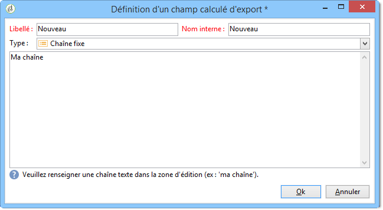

* **[!UICONTROL Chaîne avec fusion JavaScript]** : la valeur du champ calculé combine une chaîne de caractères à des directives JavaScript.

  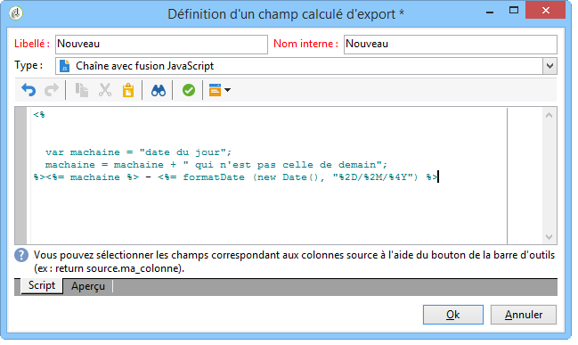

* **[!UICONTROL Expression JavaScript]** : la valeur du champ calculé est le résultat de l&#39;évaluation d&#39;une fonction JavaScript. La valeur retournée peut être typée (nombre, date, etc.).

  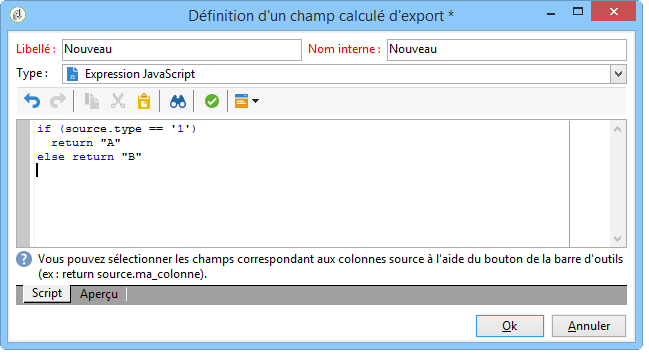

* **[!UICONTROL Enumérations]**. Ce type de champ permet d&#39;utiliser/transformer le contenu d&#39;une des colonnes de sortie dans une nouvelle colonne.

  On peut utiliser la valeur source d&#39;une colonne et lui donner une valeur de destination. Cette valeur de destination sera affichée dans la nouvelle colonne de sortie.

  Un exemple d&#39;ajout de champ calculé de type **[!UICONTROL Enumérations]** est disponible. Reportez-vous à [cette section](../../workflow/using/adding-enumeration-type-calculated-field.md).

  

  Le champ calculé de type **[!UICONTROL Enumérations]** peut comporter quatre conditions :

   * **[!UICONTROL Conserver la valeur source]** restitue la valeur de la source, sans transformation dans la cible.
   * **[!UICONTROL Utiliser la valeur suivante]** sert à saisir une valeur de destination par défaut, pour les valeurs sources non définies.
   * **[!UICONTROL Générer un avertissement et continuer]** avertit l&#39;utilisateur que la valeur source ne peut être transformée.
   * **[!UICONTROL Générer une erreur et rejeter la ligne]** empêche le calcul de la ligne et son export.

Cliquez sur la loupe **[!UICONTROL Détail du champ calculé]** pour visualiser le champ inséré en détail.

Pour retirer le champ, cliquez sur la croix rouge **[!UICONTROL Enlever le champ calculé]**.

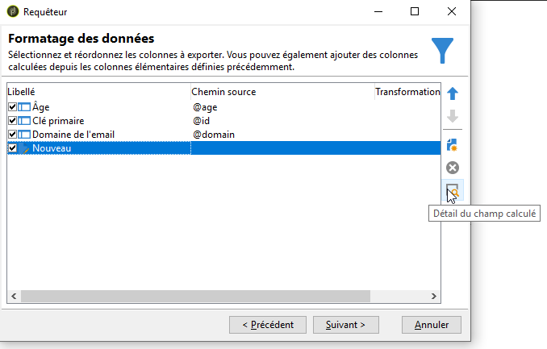

## Créer des expressions {#building-expressions}

L&#39;outil d&#39;édition d&#39;une expression sert à calculer des agrégats, générer une fonction ou éditer une formule à partir d&#39;une expression.

L&#39;exemple ci-dessous présente comment faire un comptage sur une clé primaire.

Les étapes sont les suivantes :

1. Cliquez sur **[!UICONTROL Ajouter]** dans la fenêtre **[!UICONTROL Données à extraire]**. Dans la fenêtre **[!UICONTROL Type de formule]**, sélectionnez un type de formule pour renseigner votre expression.

   Plusieurs types de formules sont disponibles : **[!UICONTROL Champ simple]**, **[!UICONTROL Agrégat]**, **[!UICONTROL Expression]**.

   Sélectionnez **[!UICONTROL Traitement sur une fonction d&#39;agrégat]** puis **[!UICONTROL Comptage]**. Cliquez sur **[!UICONTROL Suivant]**.

   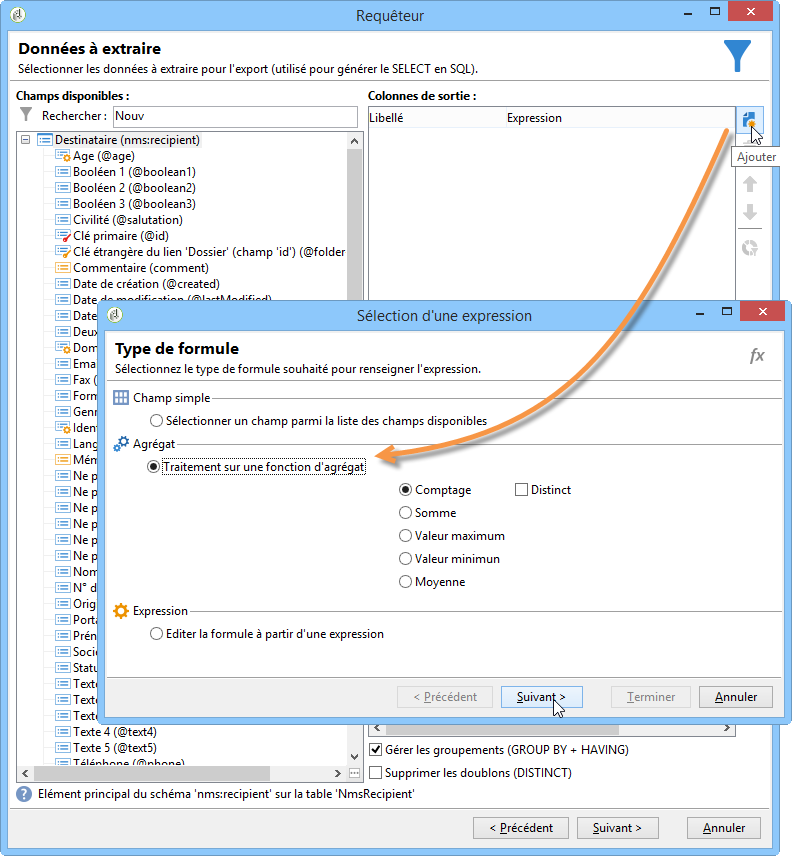

1. Le calcul de la clé primaire est effectué.

   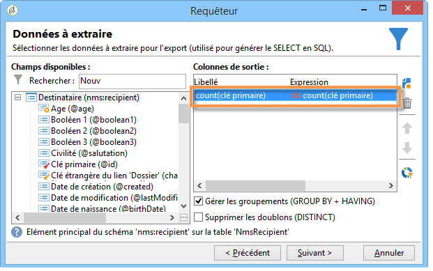

Voici le détail des choix de la fenêtre **[!UICONTROL Types de formules]** :

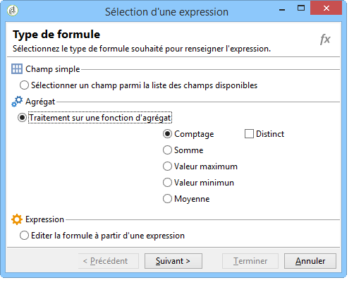

1. **[!UICONTROL Champ simple]** permet de revenir à la fenêtre **[!UICONTROL Champ à sélectionner]**.
1. **[!UICONTROL Agrégat (Traitement sur une fonction d&#39;agrégat)]**. Voici des exemples d&#39;utilisation des agrégats :

   * **[!UICONTROL Comptage]** permet d&#39;effectuer un comptage de clé primaire.
   * **[!UICONTROL Somme]** sert à totaliser tous les achats d&#39;un prospect sur une année.
   * **[!UICONTROL Valeur maximum]** pour retrouver des clients qui ont acheté un maximum de &quot;n&quot; produits.
   * **[!UICONTROL Valeur minimum]** permet d&#39;obtenir parmi des clients, ceux qui ont souscrit à une offre le plus récemment.
   * **[!UICONTROL Moyenne]**. Cette fonction permet de calculer l&#39;âge moyen des destinataires.

     La case **[!UICONTROL Distinct]** permet de récupérer les valeurs uniques et non nulles d&#39;une colonne. On peut ainsi récupérer les logs de tracking d&#39;un destinataire qui seront ramenés à la valeur 1 car il s&#39;agit d&#39;un seul destinataire.

1. **[!UICONTROL Expression]** ouvre la fenêtre **[!UICONTROL Edition de l&#39;expression]**. Par exemple, une expression pourra détecter les numéros de téléphone de plus de 10 chiffres, synonymes de possibles erreurs de saisie.

   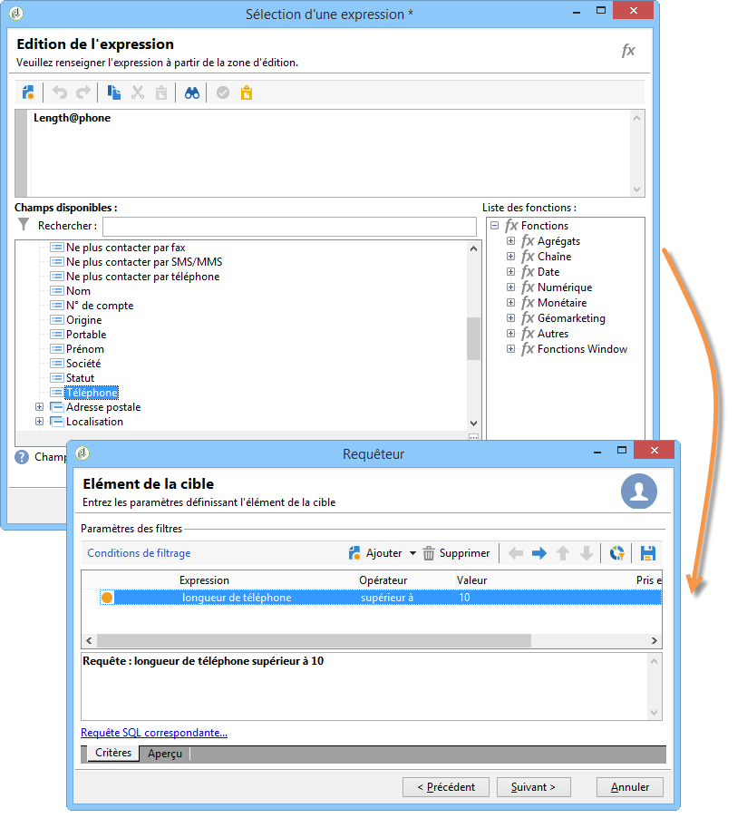

   Pour une liste complète des fonctions disponibles, voir la section [Liste des fonctions](#list-of-functions).

## Liste des fonctions {#list-of-functions}

Dans le cas où une formule de type **[!UICONTROL Expression]** est choisie, vous vous retrouvez dans la fenêtre édition de l&#39;expression. Différentes catégories de fonctions sont à associer aux champs disponibles : **[!UICONTROL Agrégats]**, **[!UICONTROL Chaine]**, **[!UICONTROL Date]**, **[!UICONTROL Numérique]**, **[!UICONTROL Monétaire]**, **[!UICONTROL Géomarketing]**, **[!UICONTROL Autres]** et **[!UICONTROL Fonctions Windows]**.

L&#39;éditeur d&#39;expression se présente comme suit :

Il permet de sélectionner des champs dans les tables de la base de données et de leur adjoindre des fonctions avancées. Les fonctions disponibles sont les suivantes :

**Agrégats**

<table> 
 <tbody> 
  <tr> 
   <td> <strong>Nom</strong>  </td> 
   <td> <strong>Description</strong>  </td> 
   <td> <strong>Syntaxe</strong>  </td> 
  </tr> 
  <tr> 
   <td> <strong>Avg</strong>  </td> 
   <td> Renvoie la moyenne d'une colonne de type numérique  </td> 
   <td> Avg(&lt;valeur&gt;) </td> 
  </tr> 
  <tr> 
   <td> <strong>Count</strong>  </td> 
   <td> Compte les valeurs non nulles d'une colonne  </td> 
   <td> Count(&lt;valeur&gt;) </td>  
  </tr> 
  <tr> 
   <td> <strong>CountAll</strong>  </td> 
   <td> Compte les valeurs retournées (tous champs confondus)  </td> 
   <td> CountAll()  </td> 
  </tr> 
  <tr> 
   <td> <strong>Countdistinct</strong>  </td> 
   <td> Compte les valeurs distinctes non nulles d'une colonne  </td> 
   <td> Countdistinct(&lt;valeur&gt;) </td> 
  </tr> 
  <tr> 
   <td> <strong>Max</strong>  </td> 
   <td> Renvoie la valeur maximum d'une colonne de type nombre, chaîne ou date  </td> 
   <td> Max(&lt;valeur&gt;) </td>  
  </tr> 
  <tr> 
   <td> <strong>Min</strong>  </td> 
   <td> Renvoie la valeur minimum d'une colonne de type nombre, chaîne ou date  </td> 
   <td> Min(&lt;valeur&gt;) </td> 
  </tr> 
  <tr> 
   <td> <strong>StdDev</strong>  </td> 
   <td> Renvoie l'écart type d'une colonne de type nombre  </td> 
   <td> StdDev(&lt;valeur&gt;) </td> 
  </tr> 
  <tr> 
   <td> <strong>Sum</strong>  </td> 
   <td> Renvoie la somme des valeurs d'une colonne de type nombre, chaîne ou date  </td> 
   <td> Sum(&lt;valeur&gt;) </td> 
  </tr> 
 </tbody> 
</table>

**Chaîne**

<table> 
 <tbody> 
  <tr> 
   <td> <strong>Nom</strong>  </td> 
   <td> <strong>Description</strong>  </td> 
   <td> <strong>Syntaxe</strong>  </td> 
  </tr> 
  <tr> 
   <td> <strong>AllNonNull2</strong>  </td> 
   <td> Indique si tous les paramètres sont non nuls et non vides  </td> 
   <td> AllNonNull2(&lt;chaîne&gt;, &lt;chaîne&gt;) </td> 
  </tr> 
  <tr> 
   <td> <strong>AllNonNull3</strong>  </td> 
   <td> Indique si tous les paramètres sont non nuls et non vides  </td> 
   <td> AllNonNull3(&lt;chaîne&gt;, &lt;chaîne&gt;, &lt;chaîne&gt;) </td> 
  </tr> 
  <tr> 
   <td> <strong>Ascii</strong>  </td> 
   <td> Renvoie la valeur ascii du premier caractère de la chaîne.  </td> 
   <td> Ascii(&lt;chaîne&gt;) </td> 
  </tr> 
  <tr> 
   <td> <strong>Char</strong>  </td> 
   <td> Renvoie le caractère de code ascii n  </td> 
   <td> Char(&lt;nombre&gt;) </td>  
  </tr> 
  <tr> 
   <td> <strong>Charindex</strong>  </td> 
   <td> Retourne la position de la chaîne 2 dans la chaîne 1.  </td> 
   <td> Charindex(&lt;chaîne&gt;, &lt;chaîne&gt;) </td> 
  </tr> 
  <tr> 
   <td> <strong>GetLine</strong>  </td> 
   <td> Renvoie la nième (de 1 à n) ligne de la chaîne  </td> 
   <td> GetLine(&lt;chaîne&gt;) </td> 
  </tr> 
  <tr> 
   <td> <strong>IfEquals</strong>  </td> 
   <td> Renvoie le troisième paramètre si les deux premiers paramètres sont égaux sinon renvoie le dernier paramètre  </td> 
   <td> IfEquals(&lt;chaîne&gt;, &lt;chaîne&gt;, &lt;chaîne&gt;, &lt;chaîne&gt;) </td> 
  </tr> 
  <tr> 
   <td> <strong>IsMemoNull</strong>  </td> 
   <td> Indique si le memo passé en paramètre est nul  </td> 
   <td> IsMemoNull(&lt;memo&gt;) </td> 
  </tr> 
  <tr> 
   <td> <strong>JuxtWords</strong>  </td> 
   <td> Concatène les trois chaînes passées en paramètres. Ajoute des espaces entre les chaînes si nécessaire.  </td> 
   <td> JuxtWords(&lt;chaîne&gt;, &lt;chaîne&gt;) </td> 
  </tr> 
  <tr> 
   <td> <strong>JuxtWords3</strong>  </td> 
   <td> Concatène les trois chaînes passées en paramètres. Ajoute des espaces entre les chaînes si nécessaire  </td> 
   <td> JuxtWords3(&lt;chaîne&gt;, &lt;chaîne&gt;, &lt;chaîne&gt;) </td>  
  </tr> 
  <tr> 
   <td> <strong>LPad</strong>  </td> 
   <td> Renvoie la chaîne complétée à gauche  </td> 
   <td> LPad(&lt;chaîne&gt;, &lt;nombre&gt;, &lt;caractère&gt;) </td> 
  </tr> 
  <tr> 
   <td> <strong>Left</strong>  </td> 
   <td> Renvoie les n premiers caractères de la chaîne  </td> 
   <td> Left(&lt;chaîne&gt;, &lt;nombre&gt;) </td> 
  </tr> 
  <tr> 
   <td> <strong>Length</strong>  </td> 
   <td> Renvoie la longueur de la chaîne  </td> 
   <td> Length(&lt;chaîne&gt;) </td> 
  </tr> 
  <tr> 
   <td> <strong>Lower</strong>  </td> 
   <td> Renvoie la chaîne en minuscules  </td> 
   <td> Lower(&lt;chaîne&gt;) </td> 
  </tr> 
  <tr> 
   <td> <strong>Ltrim</strong>  </td> 
   <td> Ote les espaces à gauche de la chaîne  </td> 
   <td> Ltrim(&lt;chaîne&gt;) </td> 
  </tr> 
  <tr> 
   <td> <strong>Md5Digest</strong>  </td> 
   <td> Renvoie une représentation hexadécimale de la clé MD5 d'une chaîne  </td> 
   <td> Md5Digest(&lt;chaîne&gt;) </td> 
  </tr> 
  <tr> 
   <td> <strong>MemoContains</strong>  </td> 
   <td> Indique si le mémo contient la chaîne passée en paramètre  </td> 
   <td> MemoContains(&lt;memo&gt;, &lt;chaîne&gt;) </td> 
  </tr> 
  <tr> 
   <td> <strong>RPad</strong>  </td> 
   <td> Renvoie la chaîne complétée à droite  </td> 
   <td> RPad(&lt;chaîne&gt;, &lt;nombre&gt;, &lt;caractère&gt;) </td> 
  </tr> 
  <tr> 
   <td> <strong>Right</strong>  </td> 
   <td> Renvoie les n derniers caractères de la chaîne  </td> 
   <td> Right(&lt;chaîne&gt;)  </td> 
  </tr> 
  <tr> 
   <td> <strong>Rtrim</strong>  </td> 
   <td> Ote les espaces à droite de la chaîne  </td> 
   <td> Rtrim(&lt;chaîne&gt;)  </td> 
  </tr> 
  <tr> 
   <td> <strong>Smart</strong>  </td> 
   <td> Renvoie la chaîne avec la première lettre de chaque mot en majuscule  </td> 
   <td> Smart(&lt;chaîne&gt;)  </td> 
  </tr> 
  <tr> 
   <td> <strong>Substring</strong>  </td> 
   <td> Extrait la sous-chaîne débutant au caractère n1 de la chaîne et de longueur n2  </td> 
   <td> Substring(&lt;chaîne&gt;, &lt;départ&gt;, &lt;longueur&gt;)  </td>  
  </tr> 
  <tr> 
   <td> <strong>ToString</strong>  </td> 
   <td> Convertit le nombre en chaîne  </td> 
   <td> ToString(&lt;nombre&gt;, &lt;nombre&gt;)  </td>  
  </tr> 
  <tr> 
   <td> <strong>Upper</strong>  </td> 
   <td> Renvoie la chaîne en majuscules  </td> 
   <td> Upper(&lt;chaîne&gt;)  </td>  
  </tr> 
  <tr> 
   <td> <strong>VirtualLink</strong>  </td> 
   <td> Renvoie la clé étrangère d'un lien passée en premier paramètre, si les deux autres paramètres sont égaux  </td> 
   <td> VirtualLink(&lt;nombre&gt;, &lt;nombre&gt;, &lt;nombre&gt;)  </td>  
  </tr> 
  <tr> 
   <td> <strong>VirtualLinkStr</strong>  </td> 
   <td> Renvoie la clé étrangère (texte) d'un lien passée en premier paramètre, si les deux autres paramètres sont égaux  </td> 
   <td> VirtualLinkStr(&lt;chaîne&gt;, &lt;nombre&gt;, &lt;nombre&gt;)  </td>  
  </tr> 
  <tr> 
   <td> <strong>dataLength</strong>  </td> 
   <td> Renvoie la taille de la chaîne  </td> 
   <td> dataLength(&lt;chaîne&gt;)  </td>  
  </tr> 
 </tbody> 
</table>

**Date**

<table> 
 <tbody> 
  <tr> 
   <td> <strong>Nom</strong>  </td> 
   <td> <strong>Description</strong>  </td> 
   <td> <strong>Syntaxe</strong>  </td> 
  </tr> 
  <tr> 
   <td> <strong>AddDays</strong>  </td> 
   <td> Ajoute un nombre de jours à une date  </td> 
   <td> AddDays(&lt;date&gt;, &lt;nombre&gt;)  </td>  
  </tr> 
  <tr> 
   <td> <strong>AddHours</strong>  </td> 
   <td> Ajoute un nombre d'heures à une date  </td> 
   <td> AddHours(&lt;date&gt;, &lt;nombre&gt;)  </td>  
  </tr> 
  <tr> 
   <td> <strong>AddMinutes</strong>  </td> 
   <td> Ajoute un nombre de minutes à une date  </td> 
   <td> AddMinutes(&lt;date&gt;, &lt;nombre&gt;)  </td>  
  </tr> 
  <tr> 
   <td> <strong>AddMonths</strong>  </td> 
   <td> Ajoute un nombre de mois à une date  </td> 
   <td> AddMonths(&lt;date&gt;, &lt;nombre&gt;)  </td>  
  </tr> 
  <tr> 
   <td> <strong>AddSeconds</strong>  </td> 
   <td> Ajoute un nombre de secondes à une date  </td> 
   <td> AddSeconds(&lt;date&gt;, &lt;nombre&gt;)  </td>  
  </tr> 
  <tr> 
   <td> <strong>AddYears</strong>  </td> 
   <td> Ajoute un nombre d'années à une date  </td> 
   <td> AddYears(&lt;date&gt;, &lt;nombre&gt;)  </td>  
  </tr> 
  <tr> 
   <td> <strong>DateOnly</strong>  </td> 
   <td> Renvoie la date uniquement (avec heure à zéro)*  </td> 
   <td> DateOnly(&lt;date&gt;)  </td>  
  </tr> 
  <tr> 
   <td> <strong>Jour</strong>  </td> 
   <td> Renvoie le nombre représentant le jour de la date  </td> 
   <td> Day(&lt;date&gt;)  </td>  
  </tr> 
  <tr> 
   <td> <strong>DayOfYear</strong>  </td> 
   <td> Renvoie le numéro du jour dans l'année de la date  </td> 
   <td> DayOfYear(&lt;date&gt;)  </td>  
  </tr> 
  <tr> 
   <td> <strong>DaysAgo</strong>  </td> 
   <td> Renvoie la date correspondant à la date courante moins n jours  </td> 
   <td> DaysAgo(&lt;nombre&gt;)  </td>  
  </tr> 
  <tr> 
   <td> <strong>DaysAgoInt</strong>  </td> 
   <td> Renvoie la date (entier aaaammjj) correspondant à la date courante moins n jours  </td> 
   <td> DaysAgoInt(&lt;nombre&gt;)  </td>  
  </tr> 
  <tr> 
   <td> <strong>DaysDiff</strong>  </td> 
   <td> Nombre de jours entre deux dates  </td> 
   <td> DaysDiff(&lt;date de fin&gt;, &lt;date de début&gt;)  </td>  
  </tr> 
  <tr> 
   <td> <strong>DaysOld</strong>  </td> 
   <td> Renvoie l'ancienneté en jours d'une date  </td> 
   <td> DaysOld(&lt;date&gt;)  </td>  
  </tr> 
  <tr> 
   <td> <strong>GetDate</strong>  </td> 
   <td> Renvoie la date système courante du serveur  </td> 
   <td> GetDate()  </td> 
  </tr> 
  <tr> 
   <td> <strong>Hour</strong>  </td> 
   <td> Renvoie l'heure de la date  </td> 
   <td> Hour(&lt;date&gt;)  </td>  
  </tr> 
  <tr> 
   <td> <strong>HoursDiff</strong>  </td> 
   <td> Renvoie le nombre d'heures entre deux dates  </td> 
   <td> HoursDiff(&lt;date de fin&gt;, &lt;date de début&gt;)  </td>  
  </tr> 
  <tr> 
   <td> <strong>Minute</strong>  </td> 
   <td> Renvoie les minutes de la date  </td> 
   <td> Minute(&lt;date&gt;)  </td>  
  </tr> 
  <tr> 
   <td> <strong>MinutesDiff</strong>  </td> 
   <td> Renvoie le nombre de minutes entre deux dates  </td> 
   <td> MinutesDiff(&lt;date de fin&gt;, &lt;date de début&gt;)  </td>  
  </tr> 
  <tr> 
   <td> <strong>Month</strong>  </td> 
   <td> Renvoie le nombre représentant le mois de la date  </td> 
   <td> Month(&lt;date&gt;)  </td>  
  </tr> 
  <tr> 
   <td> <strong>MonthsAgo</strong>  </td> 
   <td> Renvoie la date correspondant à la date courante moins n mois  </td> 
   <td> MonthsAgo(&lt;nombre&gt;)  </td>  
  </tr> 
  <tr> 
   <td> <strong>MonthsDiff</strong>  </td> 
   <td> Renvoie le nombre de mois entre deux dates  </td> 
   <td> MonthsDiff(&lt;date de fin&gt;, &lt;date de début&gt;)  </td>  
  </tr> 
  <tr> 
   <td> <strong>MonthsOld</strong>  </td> 
   <td> Renvoie l'ancienneté en mois d'une date  </td> 
   <td> MonthsOld(&lt;date&gt;)  </td>  
  </tr> 
  <tr> 
   <td> <strong>Second</strong>  </td> 
   <td> Renvoie les secondes de la date  </td> 
   <td> Second(&lt;date&gt;)  </td>  
  </tr> 
  <tr> 
   <td> <strong>SecondsDiff</strong>  </td> 
   <td> Renvoie le nombre de secondes entre deux dates  </td> 
   <td> SecondsDiff(&lt;date de fin&gt;, &lt;date de début&gt;)  </td>  
  </tr> 
  <tr> 
   <td> <strong>SubDays</strong>  </td> 
   <td> Enlève un nombre de jours à une date  </td> 
   <td> SubDays(&lt;date&gt;, &lt;nombre&gt;)  </td>  
  </tr> 
  <tr> 
   <td> <strong>SubHours</strong>  </td> 
   <td> Enlève un nombre d'heures à une date  </td> 
   <td> SubHours(&lt;date&gt;, &lt;nombre&gt;)  </td>  
  </tr> 
  <tr> 
   <td> <strong>SubMinutes</strong>  </td> 
   <td> Enlève un nombre de minutes à une date  </td> 
   <td> SubMinutes(&lt;date&gt;, &lt;nombre&gt;)  </td>  
  </tr> 
  <tr> 
   <td> <strong>SubMonths</strong>  </td> 
   <td> Enlève un nombre de mois à une date  </td> 
   <td> SubMonths(&lt;date&gt;, &lt;nombre&gt;)  </td>  
  </tr> 
  <tr> 
   <td> <strong>SubSeconds</strong>  </td> 
   <td> Enlève un nombre de secondes à une date  </td> 
   <td> SubSeconds(&lt;date&gt;, &lt;nombre&gt;)  </td>  
  </tr> 
  <tr> 
   <td> <strong>SubYears</strong>  </td> 
   <td> Enlève un nombre d'années à une date  </td> 
   <td> SubYears(&lt;date&gt;, &lt;nombre&gt;)  </td>  
  </tr> 
  <tr> 
   <td> <strong>ToDate</strong>  </td> 
   <td> Convertit une date + heure en date seule  </td> 
   <td> ToDate(&lt;date + heure&gt;)  </td>  
  </tr> 
  <tr> 
   <td> <strong>ToDateTime</strong>  </td> 
   <td> Convertit une chaîne en date + heure  </td> 
   <td> ToDateTime(&lt;chaîne&gt;)  </td>  
  </tr> 
  <tr> 
   <td> <strong>TruncDate</strong>  </td> 
   <td> Arrondit une date + heure à la seconde  </td> 
   <td> TruncDate(@lastModified, &lt;nombre de secondes&gt;)  </td> 
  </tr> 
  <tr> 
   <td> <strong>TruncDateTZ</strong>  </td> 
   <td> Arrondit une date + heure à la seconde près  </td> 
   <td> TruncDateTZ(&lt;date&gt;, &lt;nombre de secondes&gt;, &lt;fuseau horaire&gt;)  </td> 
  </tr> 
  <tr> 
   <td> <strong>TruncQuarter</strong>  </td> 
   <td> Arrondit une date au trimestre  </td> 
   <td> TruncQuarter(&lt;date&gt;)  </td>  
  </tr> 
  <tr> 
   <td> <strong>TruncTime</strong>  </td> 
   <td> Arrondit la partie heure à la seconde  </td> 
   <td> TruncTim(e&lt;date&gt;, &lt;nombre de secondes&gt;)  </td>  
  </tr> 
  <tr> 
   <td> <strong>TruncWeek</strong>  </td> 
   <td> Arrondit une date à la semaine  </td> 
   <td> TruncWeek(&lt;date&gt;)  </td>  
  </tr> 
  <tr> 
   <td> <strong>TruncYear</strong>  </td> 
   <td> Arrondit une date + heure au premier janvier de l'année  </td> 
   <td> TruncYear(&lt;date&gt;)  </td>  
  </tr> 
  <tr> 
   <td> <strong>TruncWeek</strong>  </td> 
   <td> Renvoie le numéro du jour dans la semaine de la date  </td> 
   <td> WeekDay(&lt;date&gt;)  </td>  
  </tr> 
  <tr> 
   <td> <strong>Year</strong>  </td> 
   <td> Renvoie le nombre représentant l'année de la date  </td> 
   <td> Year(&lt;date&gt;)  </td>  
  </tr> 
  <tr> 
   <td> <strong>YearAnd Month</strong>  </td> 
   <td> Renvoie le nombre représentant l'année et le mois de la date  </td> 
   <td> YearAndMonth(&lt;date&gt;)  </td>  
  </tr> 
  <tr> 
   <td> <strong>YearsDiff</strong>  </td> 
   <td> Renvoie le nombre d'années entre deux dates  </td> 
   <td> YearsDiff(&lt;date de fin&gt;, &lt;date de début&gt;)  </td>  
  </tr> 
  <tr> 
   <td> <strong>YearsOld</strong>  </td> 
   <td> Renvoie l'ancienneté en années d'une date  </td> 
   <td> YearsOld(&lt;date&gt;)  </td>  
  </tr> 
 </tbody> 
</table>

>[!NOTE]
>
>Notez que la fonction **Dateonly** prend uniquement le fuseau horaire du serveur, et non celui de l&#39;opérateur.

**Numériques**

<table> 
 <tbody> 
  <tr> 
   <td> <strong>Nom</strong>  </td> 
   <td> <strong>Description</strong>  </td> 
   <td> <strong>Syntaxe</strong>  </td> 
  </tr> 
  <tr> 
   <td> <strong>Abs</strong>  </td> 
   <td> Renvoie la valeur absolue d'un nombre  </td> 
   <td> Abs(&lt;nombre&gt;)  </td>  
  </tr> 
  <tr> 
   <td> <strong>Ceil</strong>  </td> 
   <td> Renvoie le plus petit entier supérieur ou égal à un nombre  </td> 
   <td> Ceil(&lt;nombre&gt;)  </td>  
  </tr> 
  <tr> 
   <td> <strong>Floor</strong>  </td> 
   <td> Renvoie le plus grand entier supérieur ou égal à un nombre  </td> 
   <td> Floor(&lt;nombre&gt;)  </td>  
  </tr> 
  <tr> 
   <td> <strong>Greatest</strong>  </td> 
   <td> Renvoie le plus grand de deux nombres  </td> 
   <td> Greatest(&lt;nombre 1&gt;, &lt;nombre 2&gt;)  </td>  
  </tr> 
  <tr> 
   <td> <strong>Least</strong>  </td> 
   <td> Renvoie le plus petit de deux nombres  </td> 
   <td> Least(&lt;nombre 1&gt;, &lt;nombre 2&gt;)  </td>  
  </tr> 
  <tr> 
   <td> <strong>Mod</strong>  </td> 
   <td> Renvoie le reste de la division entiers de n1 par n2  </td> 
   <td> Mod(&lt;nombre 1&gt;, &lt;nombre 2&gt;)  </td>  
  </tr> 
  <tr> 
   <td> <strong>Percent</strong>  </td> 
   <td> Renvoie la proportion en pourcentage entre deux nombres  </td> 
   <td> Percent(&lt;nombre 1&gt;, &lt;nombre 2&gt;)  </td>  
  </tr> 
  <tr> 
   <td> <strong>Random</strong>  </td> 
   <td> Renvoie une valeur aléatoire  </td> 
   <td> Random()  </td> 
  </tr> 
  <tr> 
   <td> <strong>Round</strong>  </td> 
   <td> Arrondit un nombre à n décimales près  </td> 
   <td> Round(&lt;nombre&gt;, &lt;nombre de décimales&gt;)  </td>  
  </tr> 
  <tr> 
   <td> <strong>Sign</strong>  </td> 
   <td> Renvoie le signe du nombre  </td> 
   <td> Sign(&lt;nombre&gt;)  </td>  
  </tr> 
  <tr> 
   <td> <strong>ToDouble</strong>  </td> 
   <td> Convertit un entier en réel  </td> 
   <td> ToDouble(&lt;nombre&gt;)  </td>  
  </tr> 
  <tr> 
   <td> <strong>ToInt64</strong>  </td> 
   <td> Convertit un réel en entier 64 bits  </td> 
   <td> ToInt64(&lt;nombre&gt;)  </td>  
  </tr> 
  <tr> 
   <td> <strong>ToInteger</strong>  </td> 
   <td> Convertit un réel en entier  </td> 
   <td> ToInteger(&lt;nombre&gt;)  </td>  
  </tr> 
  <tr> 
   <td> <strong>Trunc</strong>  </td> 
   <td> Tronque n1 à n2 décimales  </td> 
   <td> Trunc(&lt;n1&gt;, &lt;n2&gt;)  </td>  
  </tr> 
 </tbody> 
</table>

1. Monétaire

<table> 
 <tbody> 
  <tr> 
   <td> <strong>Nom</strong>  </td> 
   <td> <strong>Description</strong>  </td> 
   <td> <strong>Syntaxe</strong>  </td> 
  </tr> 
  <tr> 
   <td> <strong>ConvertCurrency</strong>  </td> 
   <td> Convertit un montant d'une monnaie source en un montant d'une monnaie cible  </td> 
   <td> ConvertCurrency(&lt;montant&gt;, &lt;monnaie source&gt;, &lt;monnaie cible&gt;, &lt;date de conversion&gt;)  </td>  
  </tr> 
  <tr> 
   <td> <strong>FormatCurrency</strong>  </td> 
   <td> Formate l'affichage d'un montant en fonction des paramètres de la monnaie choisie  </td> 
   <td> FormatCurrency(&lt;montant&gt;, &lt;monnaie&gt;)  </td>  
  </tr> 
 </tbody> 
</table>

**Géomarketing**

<table> 
 <tbody> 
  <tr> 
   <td> <strong>Nom</strong>  </td> 
   <td> <strong>Description</strong>  </td> 
   <td> <strong>Syntaxe</strong>  </td> 
  </tr> 
  <tr> 
   <td> <strong>Distance</strong>  </td> 
   <td> Renvoie la distance entre deux points donnés par leur longitude et leur latitude, exprimées en degrés..  </td> 
   <td> Distance(&lt;Longitude A&gt;, &lt;Latitude A&gt;, &lt;Longitude B&gt;, &lt;Latitude B&gt;)  </td>  
  </tr> 
 </tbody> 
</table>

**Autres**

<table> 
 <tbody> 
  <tr> 
   <td> <strong>Nom</strong>  </td> 
   <td> <strong>Description</strong>  </td> 
   <td> <strong>Syntaxe</strong>  </td> 
  </tr> 
  <tr> 
   <td> <strong>Case</strong>  </td> 
   <td> Renvoie la valeur 1 si la condition est vérifiée. Sinon, renvoie la valeur 2  </td> 
   <td> Case(When(&lt;condition&gt;, &lt;valeur 1&gt;), Else(&lt;valeur 2&gt;))  </td> 
  </tr> 
  <tr> 
   <td> <strong>ClearBit</strong>  </td> 
   <td> Efface le Flag dans la valeur  </td> 
   <td> ClearBit(&lt;identifiant&gt;, &lt;flag&gt;)  </td>  
  </tr> 
  <tr> 
   <td> <strong>Coalesce</strong>  </td> 
   <td> Renvoie la valeur 2 si la valeur 1 est nulle ou vide (null), sinon renvoie la valeur 1  </td> 
   <td> Coalesce(&lt;valeur 1&gt;, &lt;valeur 2&gt;)  </td>  
  </tr> 
  <tr> 
   <td> <strong>Decode</strong>  </td> 
   <td> Renvoie la valeur 3 si valeur 1 = valeur 2, sinon renvoie la valeur 4  </td> 
   <td> Decode(&lt;valeur 1&gt;, &lt;valeur 2&gt;, &lt;valeur 3&gt;, &lt;valeur 4&gt;)  </td>  
  </tr> 
  <tr> 
   <td> <strong>Else</strong>  </td> 
   <td> Renvoie la valeur 1 (ne peut être utilisée qu'en paramètre de la fonction Case)  </td> 
   <td> Else(&lt;valeur 1&gt;, &lt;valeur 2&gt;)  </td>  
  </tr> 
  <tr> 
   <td> <strong>GetEmailDomain</strong>  </td> 
   <td> Extrait le domaine d'une adresse e-mail  </td> 
   <td> GetEmailDomain(&lt;valeur&gt;)  </td>  
  </tr> 
  <tr> 
   <td> <strong>GetMirrorURL</strong>  </td> 
   <td> Récupère l'URL du serveur de page miroir  </td> 
   <td> GetMirrorURL(&lt;valeur&gt;)  </td>  
  </tr> 
  <tr> 
   <td> <strong>Iif</strong>  </td> 
   <td> Renvoie la valeur 1 si l'expression est vraie, sinon renvoie la valeur 2  </td> 
   <td> Iif(&lt;condition&gt;, &lt;valeur 1&gt;, &lt;valeur 2&gt;)  </td>  
  </tr> 
  <tr> 
   <td> <strong>IsBitSet</strong>  </td> 
   <td> Indique si le Flag est présent dans la valeur  </td> 
   <td> IsBitSet(&lt;identifiant&gt;, &lt;flag&gt;)  </td>  
  </tr> 
  <tr> 
   <td> <strong>IsEmptyString</strong>  </td> 
   <td> Renvoie la valeur 2 si la chaîne 1 est vide, sinon renvoie la valeur 3  </td> 
   <td> IsEmptyString(&lt;valeur 1&gt;, &lt;valeur 2&gt;, &lt;valeur 3&gt;)  </td>  
  </tr> 
  <tr> 
   <td> <strong>NoNull</strong>  </td> 
   <td> Renvoie la chaîne vide si l'argument n'a pas de valeur (null)  </td> 
   <td> NoNull(&lt;valeur&gt;)  </td>   
  </tr> 
  <tr> 
   <td> <strong>RowId</strong>  </td> 
   <td> Renvoie le numéro de la ligne  </td> 
   <td> RowId  </td> 
  </tr> 
  <tr> 
   <td> <strong>SetBit</strong>  </td> 
   <td> Force le Flag dans la valeur  </td> 
   <td> SetBit(&lt;identifiant&gt;, &lt;flag&gt;)  </td>  
  </tr> 
  <tr> 
   <td> <strong>ToBoolean</strong>  </td> 
   <td> Convertit un nombre en booléen  </td> 
   <td> ToBoolean(&lt;nombre&gt;)  </td>   
  </tr> 
  <tr> 
   <td> <strong>When</strong>  </td> 
   <td> Renvoie la valeur 1 si l'expression est vérifiée. Sinon, renvoie la valeur 2 (ne peut être utilisée qu'en paramètre de la fonction Case)  </td> 
   <td> When(&lt;condition&gt;, &lt;valeur 1&gt;)  </td>  
  </tr> 
 </tbody> 
</table>

**Fonctions de fenêtrage**

<table> 
 <tbody> 
  <tr> 
   <td> <strong>Nom</strong>  </td> 
   <td> <strong>Description</strong>  </td> 
   <td> <strong>Syntaxe</strong>  </td> 
  </tr> 
  <tr> 
   <td> <strong>Desc</strong>  </td> 
   <td> Applique un tri descendant  </td> 
   <td> Desc(&lt;valeur 1&gt;)  </td>  
  </tr> 
  <tr> 
   <td> <strong>OrderBy</strong>  </td> 
   <td> Trie le résultat au sein de la partition  </td> 
   <td> OrderBy(&lt;valeur 1&gt;)  </td>  
  </tr> 
  <tr> 
   <td> <strong>PartitionBy</strong>  </td> 
   <td> Partitionne le résultat d'une requête sur une table  </td> 
   <td> PartitionBy(&lt;valeur 1&gt;)  </td>  
  </tr> 
  <tr> 
   <td> <strong>RowNum</strong>  </td> 
   <td> Génère un numéro de ligne en fonction de la partition de la table et d'un ordre de tri.  </td> 
   <td> RowNum(PartitionBy(&lt;valeur 1&gt;), OrderBy(&lt;valeur 1&gt;))  </td> 
  </tr> 
 </tbody> 
</table>
