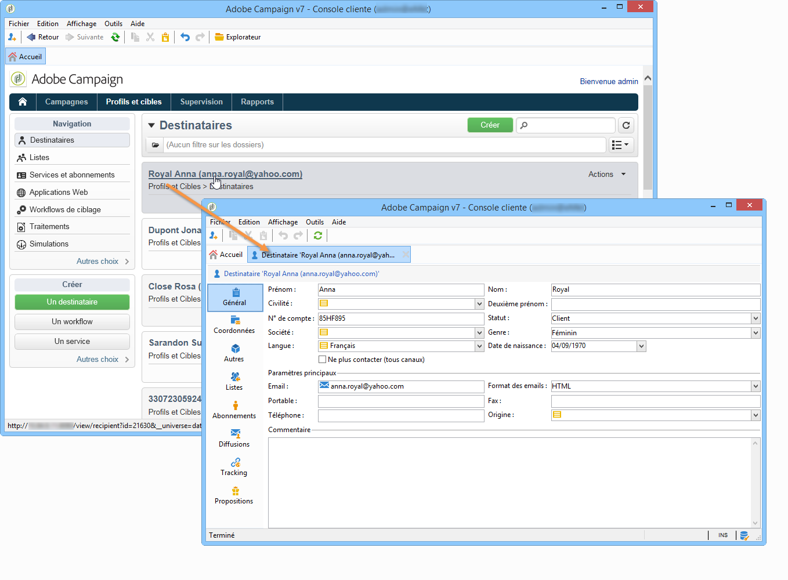
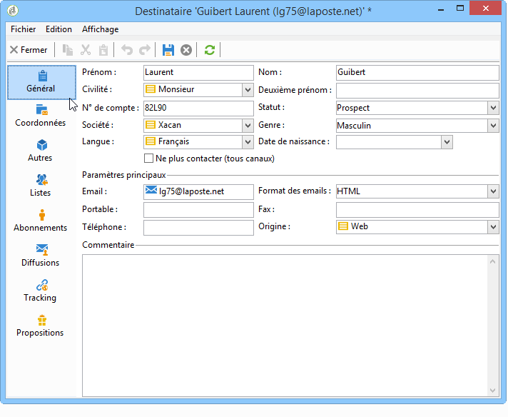
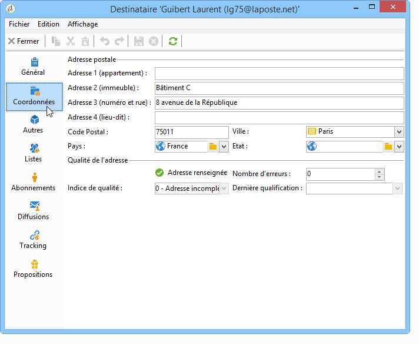
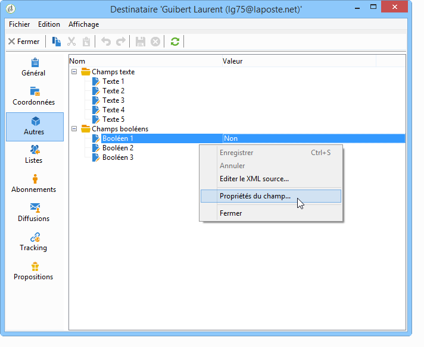
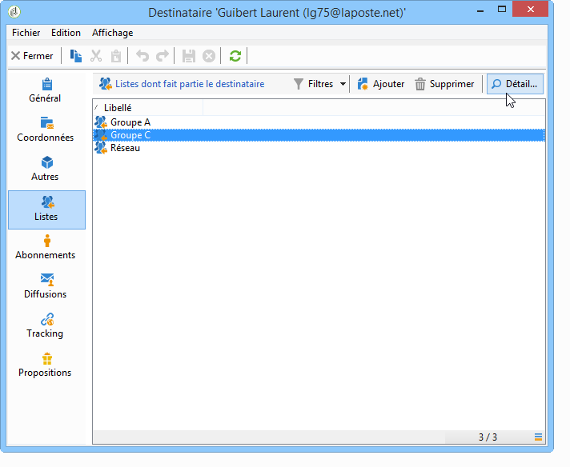
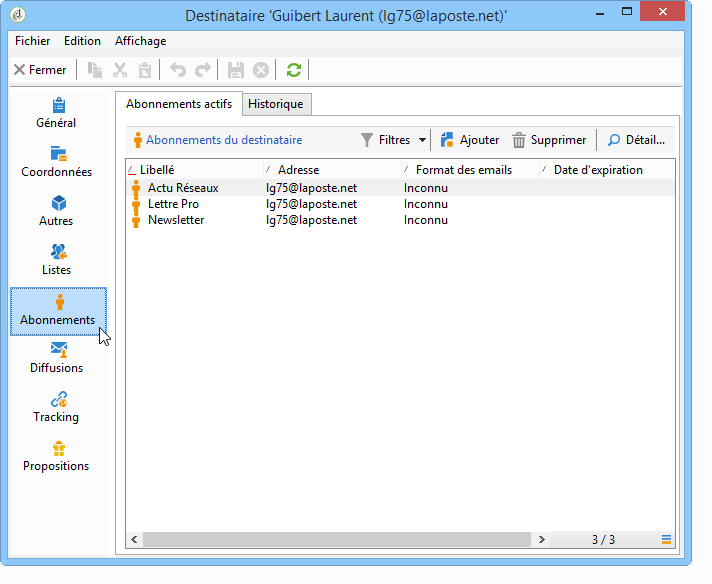
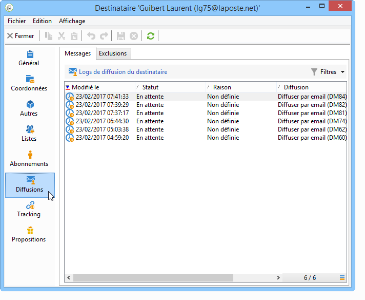
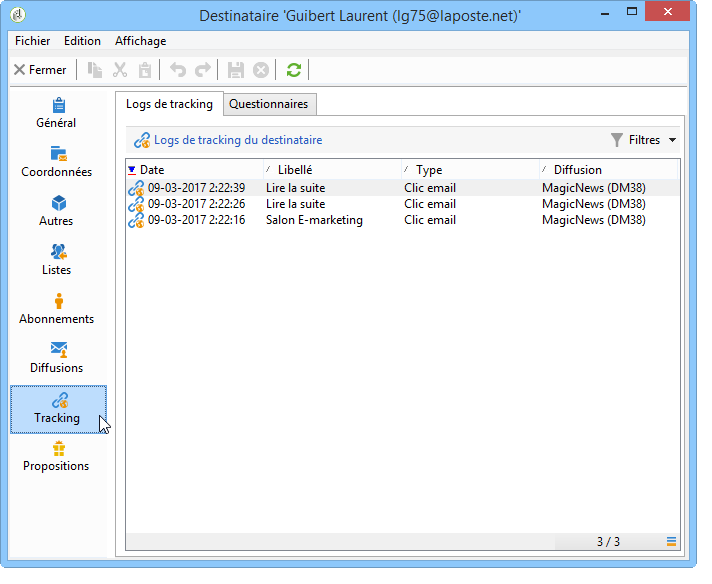

# Modification d’un profil{#editing-a-profile}

Pour consulter les informations relatives à un profil, cliquez sur son nom dans la liste des profils.

Le détail du profil est alors affiché dans un nouvel onglet.

Les données relatives à un profil sont regroupées dans des onglets.

Les onglets et leur contenu dépendent de votre configuration et des packages installés.

>[!CAUTION]
>
>Le schéma XML et le formulaire relatifs aux champs de la table des profils sont accessibles depuis le nœud **[!UICONTROL Administration > Paramétrage > Schémas de données]** de l&#39;arborescence d&#39;Adobe Campaign. La modification de ces schémas est réservée à des utilisateurs experts.
>
>Voir à ce propos [cette page](../../configuration/using/about-schema-edition.md).

## Onglet Général {#general-tab}

Cet écran contient toutes les informations générales relatives au profil sélectionné. Il contient notamment son nom, son prénom, son adresse email, le format de réception de ses emails, etc. Il se présente comme suit :

>[!NOTE]
>
>Lorsque l&#39;option **[!UICONTROL Ne plus contacter (tous canaux)]** est sélectionnée, le profil est sur la liste bloquée, c&#39;est-à-dire qu&#39;il a exprimé le souhait de ne pas être contacté (par exemple, en cliquant sur un lien de désinscription dans une newsletter). Il ne sera plus ciblé par des diffusions sur un canal quelconque (email, courrier, etc.). Voir à ce propos [cette page](../../delivery/using/understanding-quarantine-management.md).

## Onglet Coordonnées {#contact-information-tab}

Cet écran contient les coordonnées postales du profil sélectionné. Il se présente comme suit :

L&#39;indice de qualité de cette adresse est reporté dans cet écran, ainsi que le nombre d&#39;erreurs sur l&#39;adresse. Ces informations sont directement implémentées par le prestataire de courrier en fonction du nombre d&#39;erreur rencontrées lors des précédentes diffusions. Elles ne peuvent pas être modifiées manuellement.

## Onglet Autres {#other-tab}

Cet écran contient des champs libres qui peuvent être personnalisés en fonction des besoins. Vous pouvez ainsi modifier l&#39;intitulé des champs et en définir le format, via le menu **[!UICONTROL Propriétés du champ...]**, comme dans l&#39;exemple suivant :

>[!NOTE]
>
>Pour plus d&#39;informations sur les propriétés des champs et l&#39;ajout de champs, consultez [cette page](../../configuration/using/new-field-wizard.md).

## Onglet Listes {#lists-tab}

Cet écran permet d&#39;afficher le ou les groupes auxquels appartient le profil sélectionné. Cliquez sur le bouton **[!UICONTROL Ajouter]** pour inscrire le profil dans une liste. Cliquez sur le bouton **[!UICONTROL Détail]** pour afficher la description et la totalité des profils de la liste sélectionnée.

Voir à ce sujet la section [Créer et gérer des listes](../../platform/using/creating-and-managing-lists.md).

## Onglet Abonnements {#subscriptions-tab}

Cet écran contient les services d&#39;information auxquels s&#39;est abonné le profil.

Le bouton **[!UICONTROL Détail]** affiche les propriétés de l&#39;abonnement sélectionné. Le bouton **[!UICONTROL Ajouter]** permet d&#39;ajouter manuellement un nouvel abonnement.

Pour plus d’informations, consultez [cette page](../../delivery/using/managing-subscriptions.md).

## Onglet Diffusions {#deliveries-tab}

Cet écran permet de visualiser les logs de diffusion du profil sélectionné. Vous pouvez ainsi visualiser les libellés, dates et statuts des actions de diffusion adressées au profil, tous canaux confondus.

## Onglet Tracking {#tracking-tab}

Cet écran est utilisé pour consulter les logs de tracking du profil sélectionné. Ces informations permettent de suivre le comportement du profil suite aux diffusions.

Cet onglet présente le cumul de toutes les URL trackées dans les diffusions.

La liste est paramétrable et contient typiquement : l&#39;URL cliquée, la date et l&#39;heure du clic, le document dans lequel l&#39;URL figurait.

>[!NOTE]
>
>Pour plus d&#39;informations sur les fonctionnalités de mise en œuvre du tracking, consultez [cette page](../../delivery/using/delivery-dashboard.md).
