# Configuration des traitements d’export {#executing-export-jobs}

Les traitements d&#39;export vous permettent d&#39;accéder à la base de données et d&#39;en extraire les données : contacts, clients, listes, segments, etc.

Par exemple, il peut s&#39;avérer utile d&#39;utiliser les données de tracking des campagnes (historique de tracking, etc.) dans une feuille de calcul. Les données de sortie peuvent être au format txt, CSV, TAB ou XML.

L&#39;assistant d&#39;export vous permet de paramétrer un export, de définir ses options et de lancer son exécution. Il s&#39;agit d&#39;une série d&#39;écrans dont le contenu dépend du type d&#39;export (simple ou multiple) et des droits de l&#39;opérateur.

L’assistant d’export s’affiche après la création d’un nouveau traitement d’export (voir la section [Création de traitements d’import et d’export](../../platform/using/creating-import-export-jobs.md)).

## Etape 1 - Choix du modèle d’export {#step-1---choosing-the-export-template}

Lorsque vous lancez l&#39;assistant d&#39;export, vous devez d&#39;abord sélectionner un modèle. A titre d&#39;exemple, pour configurer l&#39;export des destinataires qui se sont récemment inscrits, procédez comme suit :

1. Sélectionnez le dossier **[!UICONTROL Profils et Cibles > Traitement > Imports et exports génériques]**.
1. Cliquez sur **Nouveau** puis sur **Export** pour créer le modèle d&#39;export.

   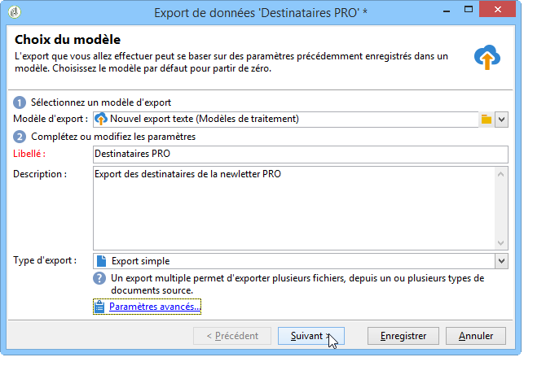

1. Cliquez sur la flèche située à droite du champ **[!UICONTROL Modèle d&#39;export]** pour sélectionner votre modèle, ou cliquez sur l&#39;icône **[!UICONTROL Choisir le lien]** pour parcourir l&#39;arborescence.

   Le modèle natif est **[!UICONTROL Nouvelle exportation de texte]**. Ce modèle ne doit pas être modifié, mais vous pouvez le dupliquer pour configurer un nouveau modèle. Par défaut, les modèles d’exportation sont enregistrés dans la variable **[!UICONTROL Ressources > Modèles > Modèles de tâche]** noeud .

1. Saisissez un nom pour cet export dans le champ **[!UICONTROL Libellé]**. Vous pouvez ajouter une description.
1. Sélectionnez le type d&#39;export. Il existe deux types d&#39;export possibles : **[!UICONTROL Export simple]** pour n’exporter qu’un seul fichier, et **[!UICONTROL Export multiple]** pour exporter plusieurs fichiers en une seule exécution, depuis un ou plusieurs types de documents source.

## Etape 2 - Type de fichier à exporter {#step-2---type-of-file-to-export}

Sélectionnez le type de document à exporter, c&#39;est-à-dire le schéma des données à exporter.

Par défaut, lorsque l’exportation est lancée à partir de la fonction **[!UICONTROL Tâches]** les données proviennent de la table des destinataires. Lorsque l&#39;export est lancé à partir d&#39;une liste de données (à partir de la fonction **[!UICONTROL clic droit > Exporter]** ), le tableau auquel appartiennent les données est automatiquement renseigné dans la variable **[!UICONTROL Type de document]** champ .

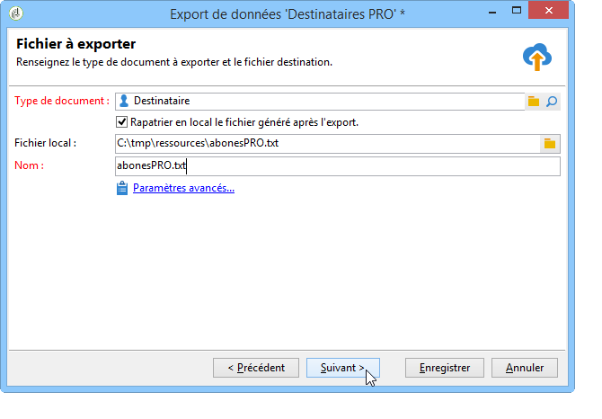

* Par défaut, la variable **[!UICONTROL Téléchargez le fichier généré sur le serveur après l’exportation.]** est sélectionnée. Dans le **[!UICONTROL Fichier local]** , renseignez le nom et le chemin du fichier à créer, ou parcourez votre disque local en cliquant sur le dossier situé à droite du champ. Vous pouvez désélectionner cette option pour saisir le chemin d’accès et le nom du fichier de sortie du serveur.

  >[!NOTE]
  >
  >Les traitements automatiques d&#39;import et d&#39;export sont toujours effectués sur le serveur.
  >
  >Si vous souhaitez n&#39;exporter qu&#39;une partie des données, cliquez sur le lien **[!UICONTROL Paramètres avancés...]** et indiquez le nombre de lignes à exporter dans le champ correspondant.

* Vous pouvez créer un export différentiel afin de n&#39;exporter que les enregistrements modifiés depuis la dernière exécution. Pour ce faire, cliquez sur le bouton **[!UICONTROL Paramètres avancés]** , puis cliquez sur le lien **[!UICONTROL Exportation différentielle]** , puis sélectionnez **[!UICONTROL Activer l&#39;export différentiel]**.

  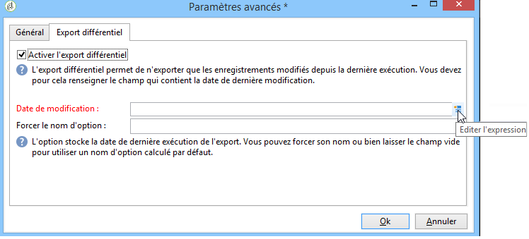

  Vous devez indiquer la date de la dernière modification. Elle peut être récupérée dans un champ ou calculée.

## Etape 3 - Définition du format de sortie {#step-3---defining-the-output-format}

Sélectionnez le format de sortie du fichier exporté. Les formats possibles sont les suivants : Texte, Texte à colonnes fixes, CSV, XML.

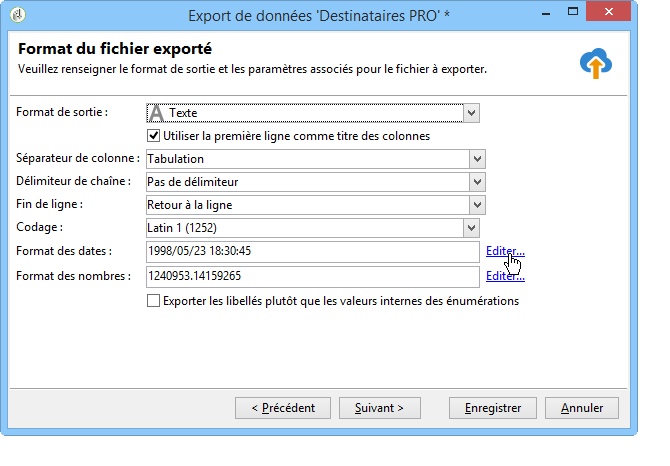

* Pour le format **[!UICONTROL Texte]**, choisissez les délimiteurs à utiliser pour séparer les colonnes (tabulations, virgules, points-virgules, ou personnalisé) et les chaînes (guillemets simples ou doubles, ou aucun).
* Pour les format **[!UICONTROL Texte]** et **[!UICONTROL CSV]**, vous pouvez cocher l&#39;option **[!UICONTROL Utiliser la première ligne comme titre des colonnes]**.
* Indiquez le format de date et le format des nombres. Pour ce faire, cliquez sur le bouton **[!UICONTROL Modifier]** pour le champ concerné et utilisez l&#39;éditeur.
* Pour les champs contenant des valeurs énumérées, vous pouvez sélectionner **[!UICONTROL Exporter des libellés plutôt que des valeurs internes des énumérations]**. Par exemple, le titre peut être stocké dans le formulaire. **1 = M.**, **2=Mademoiselle**, **3 = Mme.**. Si cette option est sélectionnée, **M.**, **Melle** et **Mme** seront exportés.

## Etape 4 - Sélection des données {#step-4---data-selection}

Sélectionnez les champs à exporter. Pour cela :

1. Double-cliquez sur les champs de votre choix dans la liste **[!UICONTROL Champs disponibles]** afin de les ajouter à la section **[!UICONTROL Colonnes de sortie]**.
1. Utilisez les flèches à droite de la liste pour définir l&#39;ordre des champs dans le fichier de sortie.

   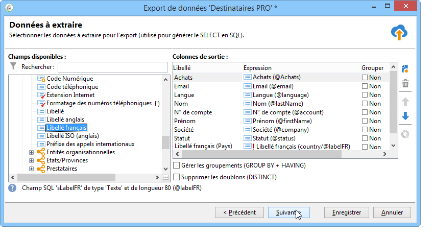

1. Cliquez sur le bouton **[!UICONTROL Ajouter]** pour faire appel à des fonctions. Pour plus d&#39;informations, consultez la section [Liste des fonctions](../../platform/using/defining-filter-conditions.md#list-of-functions).

## Etape 5 - Tri des colonnes {#step-5---sorting-columns}

Sélectionnez l&#39;ordre de tri des colonnes.

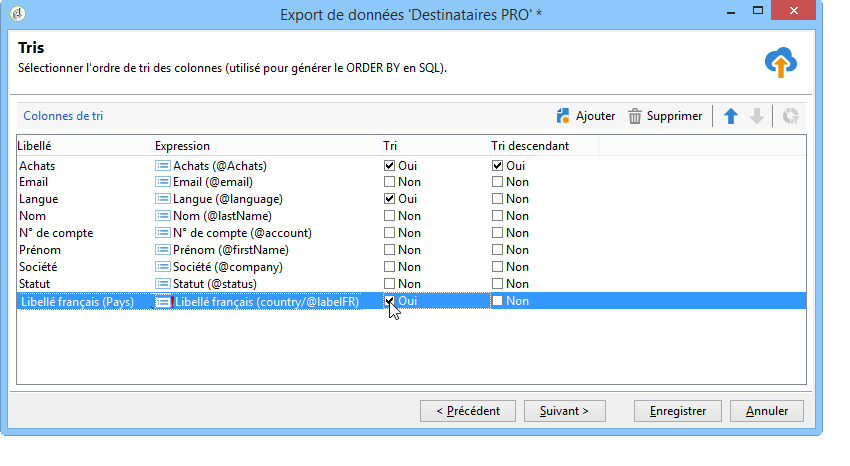

## Etape 6 - Conditions de filtrage {#step-6---filter-conditions-}

Vous pouvez ajouter des conditions de filtrage afin de ne pas exporter toutes les données. Le paramétrage de ce filtrage est le même que le ciblage des destinataires dans l&#39;assistant de diffusion. Pour plus d’informations, consultez [cette page](../../delivery/using/steps-defining-the-target-population.md).

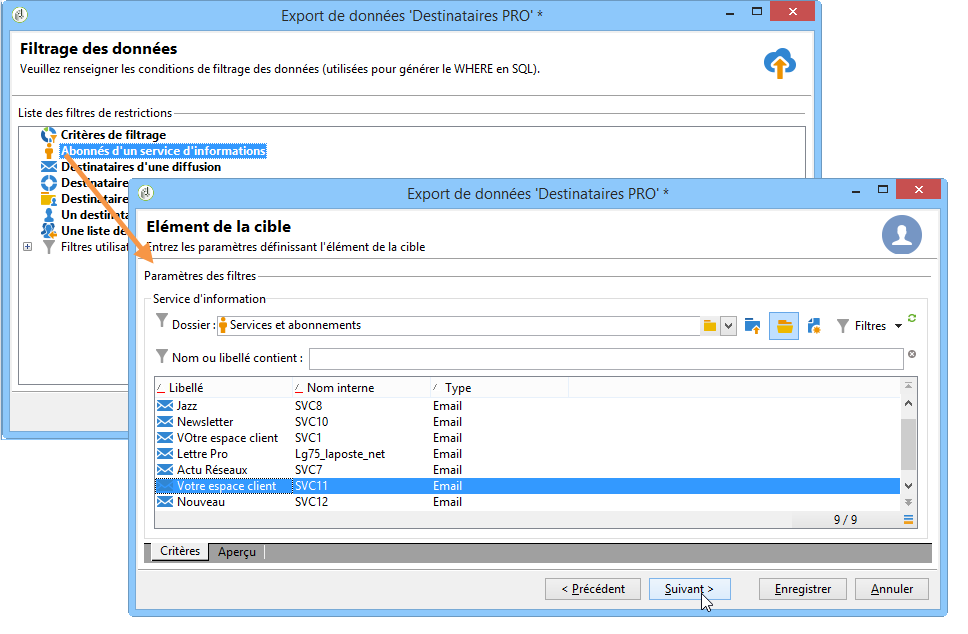

## Etape 7 - Formatage des données {#step-7---data-formatting}

Vous pouvez modifier l&#39;ordre et le libellé des champs pour le fichier de sortie. Vous pouvez également appliquer des transformations aux données sources.

* Pour changer l&#39;ordre des colonnes à exporter, sélectionnez la colonne concernée et utilisez les flèches bleues situées à droite du tableau.
* Pour changer le libellé d&#39;un champ, cliquez dans la cellule de la colonne **[!UICONTROL Libellé]** correspondant au champ à modifier et saisissez le nouveau libellé. Appuyez sur la touche Entrée du clavier pour valider la saisie.
* Pour appliquer une transformation de casse au contenu d&#39;un champ, sélectionnez-la depuis la colonne **[!UICONTROL Transformation]**. Vous pouvez choisir :

   * Passer en majuscules
   * Passer en minuscules
   * Première lettre en majuscule

  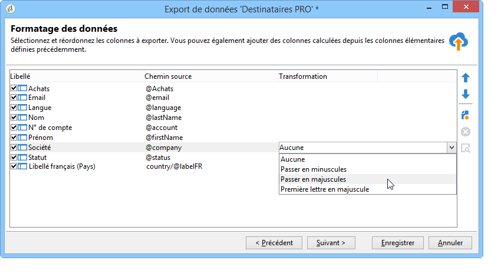

* Cliquez sur l&#39;icône **[!UICONTROL Ajouter un champ calculé]** si vous voulez créer un champ calculé (par exemple, une colonne contenant le nom+le prénom). Voir à ce sujet la section [Champs calculés](../../platform/using/executing-import-jobs.md#calculated-fields).

Si vous exportez une collection d&#39;éléments (par exemple les abonnements des destinataires, les listes auxquelles ils appartiennent, etc.), vous devez indiquer le nombre d&#39;éléments de la collection que vous voulez exporter.

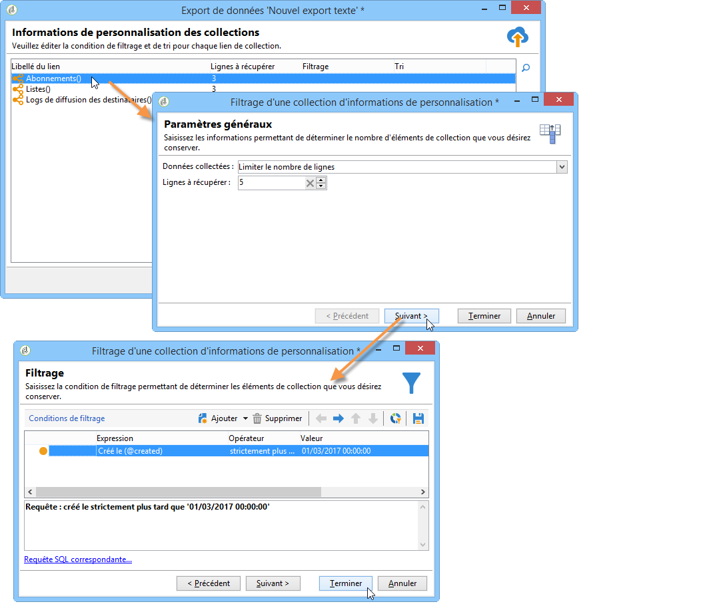

## Etape 8 - Prévisualisation des données {#step-8---data-preview}

Cliquez sur **[!UICONTROL Lancer la prévisualisation des données]** pour un aperçu du résultat de l&#39;export. Par défaut, les 200 premières lignes sont affichées. Pour modifier cette valeur, cliquez sur les flèches situées à droite du champ **[!UICONTROL Lignes à afficher]** champ .

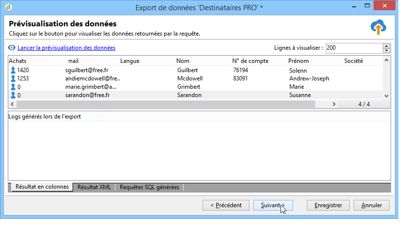

Cliquez sur les onglets en bas de l&#39;assistant pour basculer de l&#39;aperçu du résultat en colonnes, au résultat en XML. Vous pouvez également visualiser les requêtes SQL générées.

## Etape 9 - Lancement de l’export {#step-9---launching-the-export}

Cliquez sur **[!UICONTROL Démarrer]** pour lancer l’export des données.

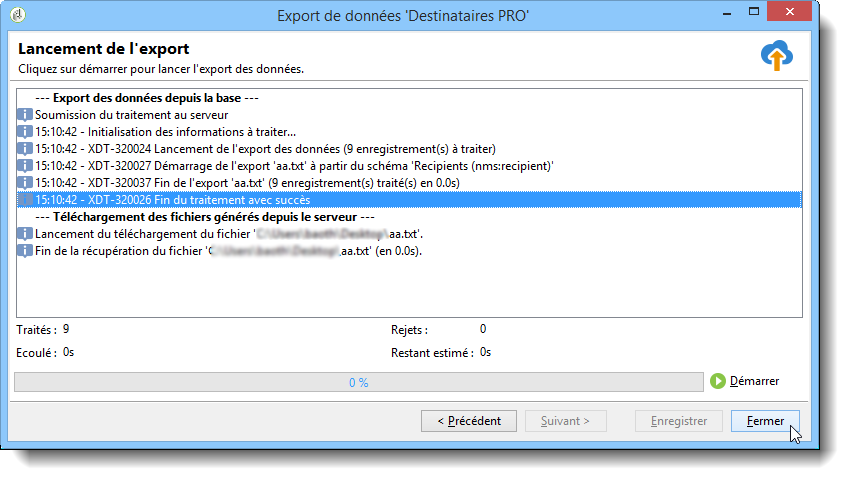

Vous pouvez ensuite surveiller l’exécution du traitement d’import (voir la section [Surveillance de l’exécution des traitements](../../platform/using/monitoring-jobs-execution.md).
