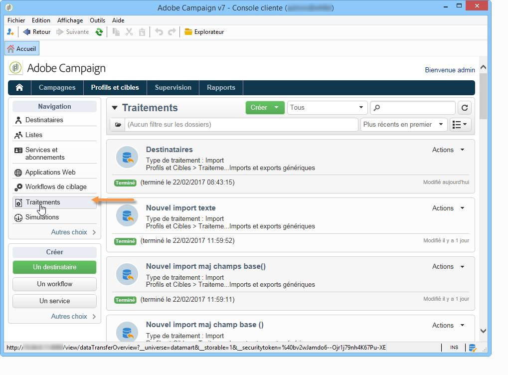

# Importation et exportation de profils{#exporting-and-importing-profiles}

Vous pouvez [utiliser des workflows](#use-workflows) pour importer et exporter des profils de destinataires dans la base de données Adobe Campaign ou pour configurer des [imports ou des exports génériques](#create-jobs).

 [Découvrez cette fonctionnalité en vidéo](#import-profiles-video)

## Utilisation de workflows{#use-workflows}

Les exports et les imports sont configurés dans des modèles dédiés exécutés dans les workflows via des activités d&#39;import et d&#39;export. Ils peuvent être répétés automatiquement selon un planning, par exemple pour automatiser l&#39;échange de données entre plusieurs systèmes d&#39;informations. [En savoir plus](../../platform/using/import-export-workflows.md#best-practices-when-importing-data)

Si nécessaire, vous pouvez créer un traitement d&#39;import ou d&#39;export occasionnel via la fonctionnalité **[!UICONTROL Imports et exports génériques]** décrite ci-dessous.

## Création de traitements{#create-jobs}

Pour paramétrer et exécuter des imports et des exports de données, accédez à l&#39;onglet **[!UICONTROL Profils et cibles]** et cliquez sur le lien **[!UICONTROL Traitements]**. [En savoir plus](../../platform/using/about-generic-imports-exports.md)

## Tutoriel vidéo {#import-profiles-video}

Cette vidéo explique comment importer des profils dans Adobe Campaign pour un import occasionnel.

>[!VIDEO](https://video.tv.adobe.com/v/25608?quality=12)

D&#39;autres vidéos pratiques sur Campaign Classic sont disponibles [ici](https://experienceleague.adobe.com/docs/campaign-classic-learn/tutorials/overview.html?lang=fr).
