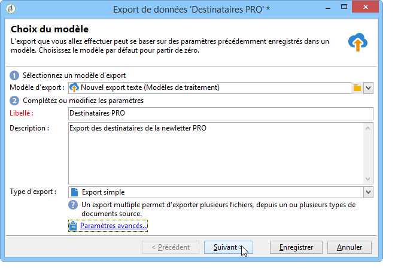
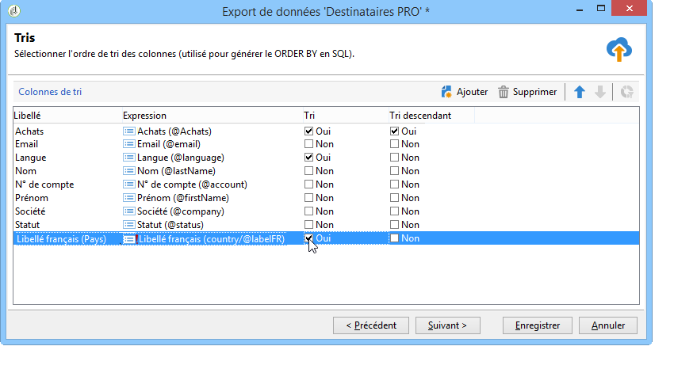
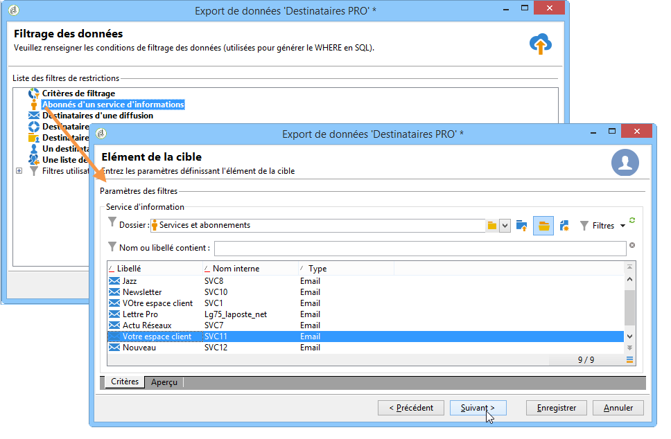

# export des données{#exporting-data}

## Assistant d&#39;export {#export-wizard}

Les paramètres d&#39;export sont enregistrés via un assistant. Le module d&#39;export générique, disponible en standard, permet d&#39;accéder et d&#39;extraire des données de la base : contacts, clients, listes, segments, etc. Il peut, par exemple, être utile d&#39;exploiter dans un tableur les données de suivi d&#39;une campagne (historique de tracking, etc.). Les données en sortie peuvent être au format TXT, CSV, TAB ou XML.

### Etape 1 - Choix du modèle d&#39;export {#step-1---choosing-the-export-template}

Lorsque vous lancez l&#39;assistant d&#39;export, vous devez d&#39;abord sélectionner un modèle. A titre d&#39;exemple, pour configurer l&#39;export des destinataires qui se sont récemment inscrits, procédez comme suit :

1. Sélectionnez le **[!UICONTROL Profiles and Targets > Job > Generic imports and exports]** dossier.
1. Cliquez sur **Nouveau** puis sur **Export** pour créer le modèle d&#39;export.

   

1. Click the arrow to the right of the **[!UICONTROL Export template]** field to select your template, or click **[!UICONTROL Select link]** to browse the tree.

   Le modèle natif est **[!UICONTROL New text export]**. Ce modèle ne doit pas être modifié, mais vous pouvez le dupliquer pour configurer un nouveau modèle. Par défaut, les modèles d’exportation sont enregistrés dans le **[!UICONTROL Resources > Templates > Job templates]** noeud.

1. Entrez un nom pour l’exportation dans le **[!UICONTROL Label]** champ. Vous pouvez ajouter une description.
1. Sélectionnez le type d’exportation. There are two possible types of export: **[!UICONTROL Simple export]** to export only one file, and **[!UICONTROL Multiple export]** to export several files in a single execution, from one or more types of source document.

### Etape 2 - Type de fichier à exporter {#step-2---type-of-file-to-export}

Sélectionnez le type de document à exporter, c’est-à-dire le schéma des données à exporter.

Par défaut, lorsque l’exportation est lancée à partir du **[!UICONTROL Jobs]** noeud, les données proviennent de la table des destinataires. Lorsque l’exportation est lancée à partir d’une liste de données (à partir du **[!UICONTROL right click > Export]** menu), le tableau auquel les données appartiennent est automatiquement rempli dans le **[!UICONTROL Document type]** champ.

* Par défaut, l’ **[!UICONTROL Download the file generated on the server after the export]** option est sélectionnée. Dans le **[!UICONTROL Local file]** champ, renseignez le nom et le chemin du fichier à créer ou parcourez votre disque local en cliquant sur le dossier à droite du champ. Vous pouvez désélectionner cette option pour saisir le chemin d’accès et le nom du fichier de sortie du serveur.

   >[!NOTE]
   >
   >Les traitements automatiques d&#39;import et d&#39;export sont toujours effectués sur le serveur.
   >
   >To export only some of the data, click **[!UICONTROL Advanced parameters]** and enter the number of lines to be exported in the appropriate field.

* Vous pouvez créer une exportation différentielle afin d’exporter uniquement les enregistrements qui ont été modifiés depuis la dernière exécution. Pour ce faire, cliquez sur le **[!UICONTROL Advanced parameters]** lien, puis sur l’ **[!UICONTROL Differential export]** onglet, puis sélectionnez **[!UICONTROL Activate differential export]**.

   

   Vous devez indiquer la date de la dernière modification. Elle peut être récupérée dans un champ ou calculée.

### Etape 3 - Définition du format de sortie {#step-3---defining-the-output-format}

Sélectionnez le format de sortie du fichier exporté. Les formats possibles sont les suivants : Texte, Texte à colonnes fixes, CSV, XML.

* For **[!UICONTROL Text]** format, select the delimiters to separate the columns (tabs, commas, semi-colons, or custom) and the strings (single or double quotes, or none).
* Pour **[!UICONTROL text]** et **[!UICONTROL CSV]**, vous pouvez sélectionner l’option **[!UICONTROL Use first lines as column titles]**.
* Indiquez le format de date et le format de nombre. Pour ce faire, cliquez sur le **[!UICONTROL Edit]** bouton correspondant au champ concerné et utilisez l’éditeur.
* Pour les champs contenant des valeurs énumérées, vous pouvez sélectionner **[!UICONTROL Export labels instead of internal values of enumerations]**. Par exemple, le titre peut être stocké dans le formulaire **1=M.**, **2=Mlle**,** 3=Mme.**. Si cette option est sélectionnée, **Mr.**, **Miss** et **Mme.** seront exportés.

### Etape 4 - Sélection des données {#step-4---data-selection}

Sélectionnez les champs à exporter. Pour cela :

1. Double-click the desired fields in the **[!UICONTROL Available fields]** list in order to add them to the **[!UICONTROL Output columns]** section.
1. Utilisez les flèches à droite de la liste pour définir l&#39;ordre des champs dans le fichier de sortie.

   

1. Cliquez sur le **[!UICONTROL Add]** bouton pour activer des fonctions. Pour plus d&#39;informations, reportez-vous à la [liste des fonctions](../../platform/using/defining-filter-conditions.md#list-of-functions).

### Etape 5 - Tri des colonnes {#step-5---sorting-columns}

Sélectionnez l&#39;ordre de tri des colonnes.

### Etape 6 - Conditions de filtrage {#step-6---filter-conditions-}

Vous pouvez ajouter des conditions de filtrage afin de ne pas exporter toutes les données. Le paramétrage de ce filtrage correspond à celui du ciblage des destinataires dans l&#39;assistant de diffusion. Voir à ce sujet [cette page](../../delivery/using/steps-defining-the-target-population.md).

### Etape 7 - Formatage des données {#step-7---data-formatting}

Vous pouvez modifier l&#39;ordre et le libellé des champs pour le fichier de sortie. Vous pouvez également appliquer des transformations aux données sources.

* Pour changer l&#39;ordre des colonnes à exporter, sélectionnez la colonne concernée et utilisez les flèches bleues situées à droite du tableau.
* To change the label of a field, click in the cell of the **[!UICONTROL Label]** column that matches the field to be modified, and enter the new label. Appuyez sur Entrée sur le clavier pour confirmer.
* To apply a case transformation to the content of a field, select it from the **[!UICONTROL Transformation]** column. Vous pouvez sélectionner :

   * Passer en majuscules
   * Passer en minuscules
   * Première lettre en majuscule
   

* Cliquez sur **[!UICONTROL Add a calculated field]** si vous souhaitez créer un champ calculé (par exemple, une colonne contenant le nom + prénom). For more on this, refer to [Calculated fields](../../platform/using/importing-data.md#calculated-fields).

Si vous exportez une collection d&#39;éléments (par exemple les abonnements des destinataires, les listes auxquelles ils appartiennent, etc.), vous devez indiquer le nombre d&#39;éléments de la collection que vous voulez exporter.

### Etape 8 - Prévisualisation des données {#step-8---data-preview}

Cliquez sur **[!UICONTROL Start the preview of the data]** pour afficher un aperçu du résultat d’exportation. Par défaut, les 200 premières lignes sont affichées. Pour modifier cette valeur, cliquez sur les flèches à droite du **[!UICONTROL Lines to display]** champ.

Cliquez sur les onglets en bas de l&#39;assistant pour basculer de l&#39;aperçu du résultat en colonnes, au résultat en XML. Vous pouvez également visualiser les requêtes SQL générées.

### Etape 9 - Lancement de l&#39;export {#step-9---launching-the-export}

Click **[!UICONTROL Start]** to launch data export.

## Exporter des données avec un workflow {#exporting-data-via-a-workflow}

Les workflows peuvent être utiles pour automatiser certains de vos exports ou exporter des jeux de données précis après avoir utilisé certaines des activités de gestion des données disponibles pour transformer vos données.

Pour plus d’informations sur l’export de données depuis un workflow, consultez [cette section](../../workflow/using/how-to-use-workflow-data.md).
