# Comptes externes{#external-accounts}

Un compte externe est un paramétrage qui permet de configurer et de tester l&#39;accès à un serveur externe à Adobe Campaign. Ces comptes externes peuvent être utilisés dans les workflows de Campaign pour accéder aux données et les gérer.

Vous pouvez configurer les types de comptes externes suivants :

* [Compte externe Routage](#routing-external-account)
* [Compte externe FTP](#ftp-external-account)
* [Compte externe de base de données externe](#external-database-external-account)
* [Compte externe Web Analytics](#web-analytics-external-account)
* [Compte externe Facebook Connect](#facebook-connect-external-account)
* [Compte externe d’instance d’exécution](#execution-instance-external-account)
* [Compte externe Adobe Experience Cloud](#adobe-experience-cloud-external-account)
* [Compte externe SFTP  ](#sftp-external-account)
* [Compte externe Adobe Experience Manager](#adobe-experience-manager-external-account)
* [Compte externe Amazon Simple Storage Service (S3)](#amazon-simple-storage-service--s3--external-account)
* [Compte externe Azure](#azure-external-account)
* [Compte externe Hadoop](#hadoop-external-account)
* [Compte externe Microsoft Dynamics CRM](#microsoft-dynamics-crm-external-account)
* [Compte externe Oracle On Demand](#oracle-on-demand-external-account)
* [Compte externe Salesforce CRM](#salesforce-crm-external-account)

## Création d&#39;un compte externe {#creating-an-external-account}

Adobe Campaign est livré avec un ensemble de comptes externes prédéfinis. Pour configurer des connexions avec des systèmes externes comme des serveurs FTP utilisés pour les transferts de fichiers, vous pouvez créer vos propres comptes externes.

Les comptes externes sont utilisés par des processus techniques, tels que des workflows techniques ou des workflows des opérations. Lors de la configuration d&#39;un transfert de fichier dans un workflow ou d&#39;un échange de données avec une autre application (Adobe Target, Experience Manager, etc.), vous devez sélectionner un compte externe.

1. Dans l’**[!UICONTROL Explorateur]**, développez le menu **[!UICONTROL Administration]**.
1. Développez le menu **[!UICONTROL Plate-forme]** et cliquez sur **[!UICONTROL Comptes externes]**.

   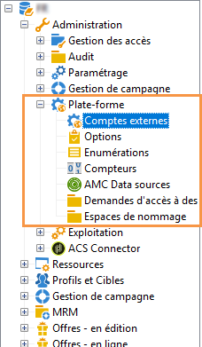

1. Cliquez sur le bouton **[!UICONTROL Nouveau]**.

   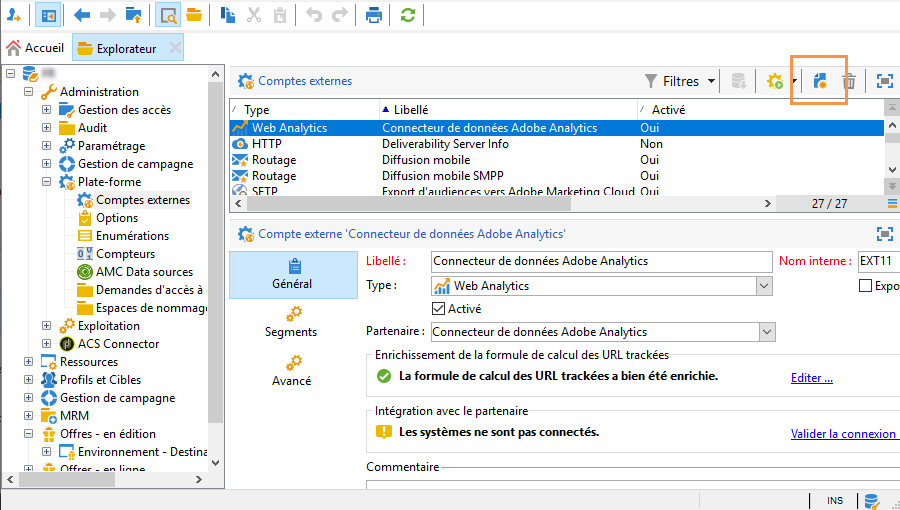

1. Saisissez un **[!UICONTROL Libellé]** et un **[!UICONTROL Nom interne]**. Ils seront utilisés lors de la sélection des comptes externes dans les workflows.
1. Cliquez sur **[!UICONTROL Activé]** si vous voulez activer votre connexion.
1. Sélectionnez le **[!UICONTROL Type]** de compte externe que vous voulez créer.
1. Configurez l’accès au compte en spécifiant les informations de connexion en fonction du type de compte externe choisi.

   Les informations nécessaires sont généralement fournies par le fournisseur du serveur auquel vous vous connectez.

1. Cliquez sur **[!UICONTROL Enregistrer]**.

Le compte externe est créé et ajouté à la liste des comptes externes. Il est maintenant disponible pour vos transferts de données/fichiers ou configurations de routage dans les activités de workflow et les propriétés de diffusion.

## Compte externe Mails rebonds {#bounce-mails-external-account}

Le compte externe **Mails rebonds** spécifie le compte POP3 externe à utiliser pour se connecter au service de messagerie. Pour plus d’informations sur ce compte externe, consultez cette [page](../../workflow/using/inbound-emails.md).

Tous les serveurs configurés pour l’accès POP3 peuvent être utilisés pour recevoir les mails rebonds.

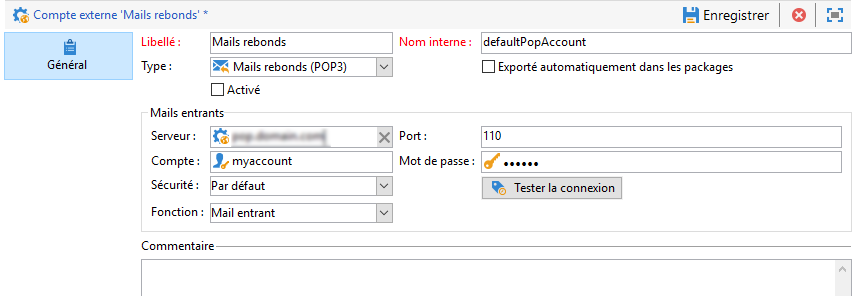

Pour configurer le compte externe **[!UICONTROL Mails rebonds (defaultPopAccount)]** :

* **[!UICONTROL Serveur]**

   URL du serveur POP3.

* **[!UICONTROL Port]**

   Numéro de port de la connexion POP3. Le port par défaut est 110.

* **[!UICONTROL Compte]**

   Nom de l&#39;utilisateur.

* **[!UICONTROL Mot de passe]**

   Mot de passe du compte de l&#39;utilisateur.

* **[!UICONTROL Chiffrement]**

   Type de chiffrement choisi entre **[!UICONTROL Par défaut]**, **[!UICONTROL POP3 + STARTTLS]**, **[!UICONTROL POP3]** ou **[!UICONTROL POP3S]**.

## Compte externe Routage {#routing-external-account}

Le compte externe **[!UICONTROL Routage]** vous permet de configurer chaque canal disponible dans Adobe Campaign en fonction des packages installés.

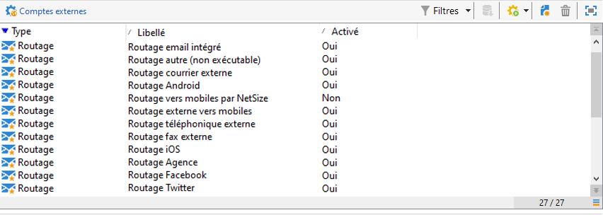

Les canaux suivants peuvent être configurés :

* [Email](../../installation/using/deploying-an-instance.md#email-channel-parameters)
* [Mobile (SMS)](../../delivery/using/sms-channel.md#activating-an-external-account).
* [Phone](../../delivery/using/other-channels.md)
* [Canal Courrier](../../delivery/using/about-direct-mail-channel.md)
* [Agence](../../delivery/using/other-channels.md)
* [Facebook](../../social/using/publishing-on-facebook-walls.md#delegating-write-access-to-adobe-campaign)
* [Twitter](../../social/using/configuring-publishing-on-twitter.md)
* [Canal iOS](../../delivery/using/configuring-the-mobile-application.md#configuring-the-mobile-application-ios)
* [Canal Android](../../delivery/using/configuring-the-mobile-application.md#configuring-the-mobile-application-android)

## Compte externe FTP {#ftp-external-account}

Le compte externe FTP vous permet de configurer et de tester l’accès à un serveur en dehors d’Adobe Campaign. Pour configurer des connexions à des systèmes externes tels que des serveurs FTP 898 utilisés pour les transferts de fichiers, vous pouvez créer vos propres comptes externes. Voir à ce sujet [cette page](../../workflow/using/file-transfer.md).

Pour ce faire, spécifiez dans ce compte externe l’adresse et les informations de connexion utilisées pour établir la connexion au serveur FTP.

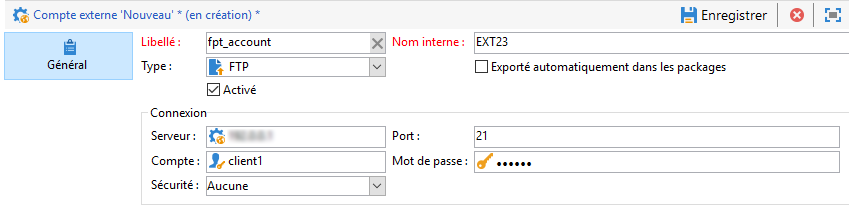

* **[!UICONTROL Serveur]**

   Nom du serveur FTP.

* **[!UICONTROL Port]**

   Numéro de port de la connexion FTP. Le port par défaut est 21.

* **[!UICONTROL Compte]**

   Nom de l&#39;utilisateur.

* **[!UICONTROL Mot de passe]**

   Mot de passe du compte de l&#39;utilisateur.

* **[!UICONTROL Chiffrement]**

   Type de chiffrement choisi entre **[!UICONTROL Aucun]** et **[!UICONTROL SSL]**.

Pour savoir où trouver ces informations de connexion, consultez [cette page](https://help.dreamhost.com/hc/en-us/articles/115000675027-FTP-overview-and-credentials).

## Compte externe de base de données externe {#external-database-external-account}

Adobe Campaign met à votre disposition plusieurs connecteurs permettant de communiquer avec des applications et de se connecter à des moteurs de bases de données externes.


Les types de connexions suivants peuvent être configurés :

* Oracle. Pour plus d&#39;informations, consultez cette [page](../../platform/using/specific-configuration-database.md#configure-access-to-oracle).
* Netezza. Pour plus d&#39;informations, consultez cette [page](../../platform/using/specific-configuration-database.md#configure-access-to-netezza).
* SAP HANA. Pour plus d&#39;informations, consultez cette [page](../../platform/using/specific-configuration-database.md#configure-access-to-sap-hana).
* InfiniDB
* Microsoft SQL Server
* AsterData
* PostgreSQL
* Teradata
* DB2
* Amazon Redshift
* ODBC (Sybase ASE, Sybase IQ)
* Relais HTTP vers base distante

### Compte externe Snowflake {#snowflake-external-account}

Le compte externe **Snowflake** vous permet de connecter votre instance Campaign à votre base de données externe Snowflake. Pour plus d&#39;informations sur la configuration de Campaign Classic avec Snowflake, consultez cette [page](../../platform/using/specific-configuration-database.md#configure-access-to-snowflake).

Pour configurer ce compte externe afin de l’utiliser avec Adobe Campaign, vous devez fournir les détails suivants :

* **[!UICONTROL Serveur]**

       URL du serveur Snowflake.
   
* **[!UICONTROL Compte]**

       Nom de l&#39;utilisateur.
   
* **[!UICONTROL Mot de passe]**

       Mot de passe du compte de l&#39;utilisateur.
   
* **[!UICONTROL Base de données]**

       Nom de votre base de données.
   
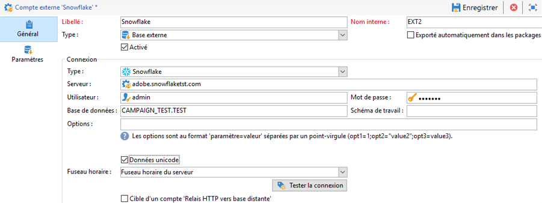

### Compte externe Teradata {#teradata-external-account}

Le compte externe **Teradata** vous permet de connecter votre instance Campaign à votre base de données externe Teradata. Pour plus d&#39;informations sur la configuration de Campaign Classic avec Teradata, consultez cette [page](https://helpx.adobe.com/campaign/kb/campaign_fda_teradata.html) ou cette [section](../../platform/using/specific-configuration-database.md#configure-access-to-teradata).

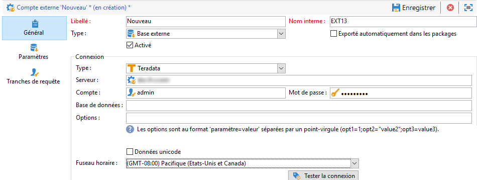

Pour configurer ce compte externe afin de l’utiliser avec Adobe Campaign, vous devez fournir les détails suivants :

* **[!UICONTROL Type]**

   Choisissez le type **[!UICONTROL Teradata]**.

* **[!UICONTROL Serveur]**

   URL ou nom de votre serveur Teradata.

* **[!UICONTROL Compte]**

   Nom du compte utilisé pour accéder à la base de données Teradata.

* **[!UICONTROL Mot de passe]**

   Mot de passe utilisé pour se connecter à la base de données Teradata.

* **[!UICONTROL Base de données]**

   Ce champ peut être vide.

* **[!UICONTROL Options]**

   Options à transmettre via Teradata.

* **[!UICONTROL Fuseau horaire]**

   Fuseau horaire défini dans Teradata.

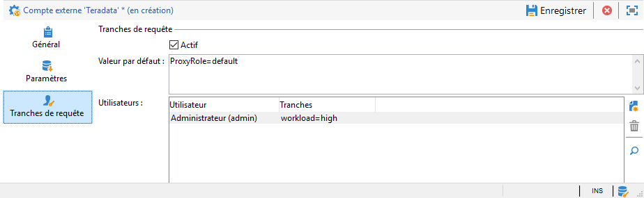

Si plusieurs utilisateurs Adobe Campaign se connectent au même compte externe FDA Teradata, l’onglet **[!UICONTROL Tranches de requête]** vous permet de définir une tranche de requête, c’est-à-dire un ensemble de paires clé/valeur, sur une session.

Chaque fois qu’un utilisateur Campaign réalise une requête sur la base de données Teradata, Adobe Campaign enverra des métadonnées qui se composent d’une liste de clés associées à cet utilisateur. Ces données peuvent ensuite être utilisées par les administrateurs Teradata à des fins d’audit ou de gestion des droits d’accès.

Cochez la case **[!UICONTROL Actif]** pour activer cette fonction.

Le champ **[!UICONTROL Par défaut]** vous permet de saisir une tranche de requête par défaut qui sera utilisée si un utilisateur n’a aucune tranche de requête associée. Si ce champ est vide, les utilisateurs sans tranche de requête ne pourront pas utiliser Teradata.

Le champ **[!UICONTROL Utilisateurs]** vous permet de spécifier une tranche de requête pour chaque utilisateur. Vous pouvez ajouter autant de paires clé/valeur que vous le voulez, par exemple priority=1;workload=high. Si aucune tranche de requête n’est assignée à l’utilisateur, le champ **[!UICONTROL Par défaut]** sera appliqué.

Pour plus d’informations sur les **[!UICONTROL Tranches de requête]**, consultez la [documentation de Teradata](https://docs.teradata.com/reader/cY5B~oeEUFWjgN2kBnH3Vw/a5G1iz~ve68yTMa24kVjVw).

## Compte externe Web Analytics {#web-analytics-external-account}

Le compte externe **[!UICONTROL Web Analytics (Adobe Analytics - Connecteur de données)]** vous permet de transférer des données d’Adobe Analytics à Adobe Campaign sous la forme de segments. Inversement, il envoie des indicateurs et des attributs aux campagnes email diffusées par Adobe Campaign à Adobe Analytics - Connecteur de données.

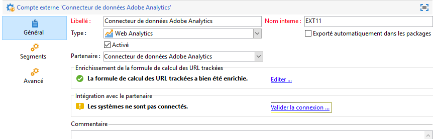

Pour ce compte externe, la formule de calcul pour les URL trackées doit être enrichie, et la connexion entre les deux solutions doit être validée. Voir à ce sujet [cette page](../../platform/using/adobe-analytics-data-connector.md#step-2--create-the-external-account-in-campaign).

## Compte externe Facebook Connect {#facebook-connect-external-account}

Le compte externe **[!UICONTROL Facebook Connect]** vous permet d’afficher du contenu personnalisé dans vos applications Facebook, ce qui facilite l’acquisition de prospects par l’intermédiaire de ce réseau social.

Pour chaque application Facebook, vous devez créer un compte externe de type **[!UICONTROL Facebook Connect]**. Voir à ce sujet [cette page](../../social/using/creating-a-facebook-application.md#configuring-external-accounts).

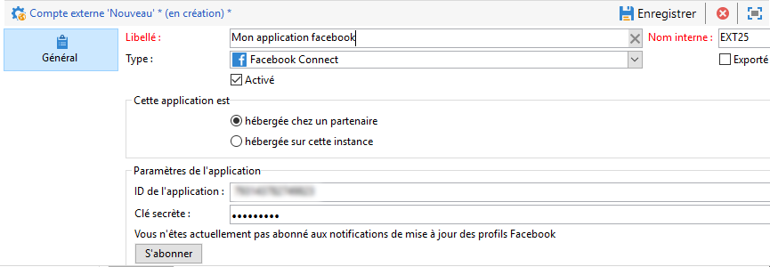

* **[!UICONTROL Mode d’hébergement]**

   Mode d’hébergement de l’application entre **[!UICONTROL hébergée chez un partenaire]** et **[!UICONTROL hébergée sur cette instance]**.

* **[!UICONTROL ID de l’application]**

   ID de l’application de votre application Facebook.

* **[!UICONTROL Clé secrète]**

   Secret d’application de votre application Facebook.

Si vous choisissez le mode Hébergée sur cette instance, vous devez coller l’URL sécurisée du canevas dans le champ **Jeux Web Facebook (https)** sur Facebook.

Pour savoir où trouver ces informations de connexion, consultez [cette page](https://developers.facebook.com/docs/facebook-login/access-tokens).

## Compte externe d’instance d’exécution {#execution-instance-external-account}

Si vous possédez une architecture répartie, vous devez spécifier les instances d’exécution liées à l’instance de contrôle et les connecter. Les modèles de messages transactionnels sont déployés sur l’instance d’exécution.

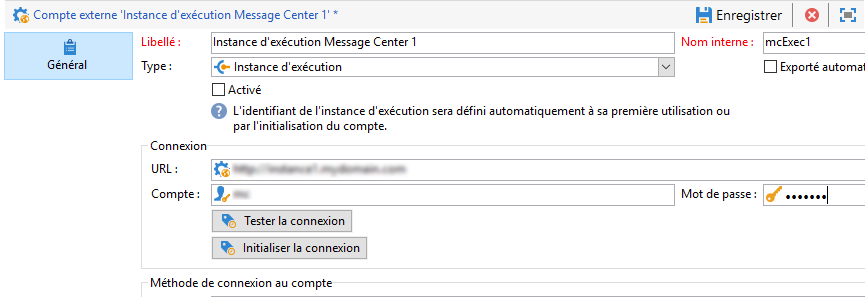

* **[!UICONTROL URL]**

   URL du serveur sur lequel est installée l’instance d’exécution.

* **[!UICONTROL Compte]**

   Nom du compte qui doit correspondre à l’Agent Message Center tel qu’il a été défini dans le dossier de l’opérateur.

* **[!UICONTROL Mot de passe]**

   Mot de passe du compte tel qu’il a été défini dans le dossier de l’opérateur.

Pour plus d’informations sur cette configuration, consultez [cette page](../../message-center/using/creating-a-shared-connection.md#control-instance).

## Compte externe Adobe Experience Cloud {#adobe-experience-cloud-external-account}

Pour vous connecter à la console Adobe Campaign à l’aide d’un Adobe ID, vous devez configurer le compte externe **[!UICONTROL Adobe Experience Cloud (MAC)]**.

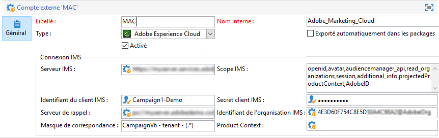

* **[!UICONTROL Serveurs IMS]**

   URL de votre serveur IMS. Assurez-vous que les instances de test et de production pointent sur le même point de terminaison de production IMS.

* **[!UICONTROL Scope IMS]**

   Les périmètres définis ici doivent être un sous-ensemble de ceux provisionnés par IMS.

* **[!UICONTROL Identifiant du client IMS]**

   ID de votre client IMS.

* **[!UICONTROL Secret client IMS]**

   Informations d’identification de votre secret client IMS.

* **[!UICONTROL Serveur de rappel]**

   Accédez à l’URL de votre instance Adobe Campaign.

* **[!UICONTROL Identifiant de l’organisation IMS]**

   Identifiant de votre organisation IMS. Pour trouver votre identifiant d’organisation, consultez cette [page](https://marketing.adobe.com/resources/help/en_US/mcloud/faq.html) (**Où puis-je trouver mon identifiant de l’organisation IMS ?**).

* **[!UICONTROL Masque de correspondance]**

   Syntaxe qui permettra la synchronisation des noms de configuration dans Enterprise Dashboard avec les groupes dans Adobe Campaign.

* **[!UICONTROL Serveur]**

   URL de votre instance Adobe Experience Cloud.

* **[!UICONTROL Tenant]**

   Nom de votre tenant Adobe Experience Cloud.

Pour plus d’informations sur cette configuration, consultez [cette page](../../integrations/using/configuring-ims.md).

## Compte externe SFTP   {#sftp-external-account}

Le compte externe SFTP vous permet de configurer et de tester l’accès à un serveur en dehors d’Adobe Campaign. Pour configurer des connexions à des systèmes externes tels que des serveurs SFTP utilisés pour les transferts de fichiers, vous pouvez créer vos propres comptes externes. Voir à ce sujet [cette page](../../workflow/using/file-transfer.md).


* **[!UICONTROL Serveur]**

   URL du serveur SFTP.

* **[!UICONTROL Port]**

   Numéro de port de connexion FTP. Le port par défaut est 22.

* **[!UICONTROL Compte]**

   Nom du compte utilisé pour se connecter au serveur SFTP.

* **[!UICONTROL Mot de passe]**

   Mot de passe utilisé pour se connecter au serveur SFTP.

## Compte externe Adobe Experience Manager {#adobe-experience-manager-external-account}

Le compte externe **[!UICONTROL AEM (instance AEM)]** vous permet de gérer le contenu de vos diffusions email, ainsi que vos formulaires directement dans Adobe Experience Manager.

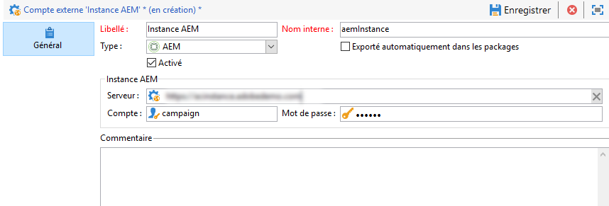

* **[!UICONTROL Serveur]**

   URL du serveur Adobe Experience Manager.

* **[!UICONTROL Port]**

   Nom du compte utilisé pour se connecter à l’instance de création Adobe Experience Manager.

* **[!UICONTROL Mot de passe]**

   Mot de passe utilisé pour se connecter à l’instance de création Adobe Experience Manager.

Voir à ce propos cette [section](../../integrations/using/about-adobe-experience-manager.md).

## Compte externe Amazon Simple Storage Service (S3){#amazon-simple-storage-service--s3--external-account}

Le connecteur Amazon Simple Storage Service (S3) peut être utilisé pour importer ou exporter des données vers Adobe Campaign. Il peut être configuré dans une activité de workflow. Voir à ce sujet [cette page](../../workflow/using/file-transfer.md).

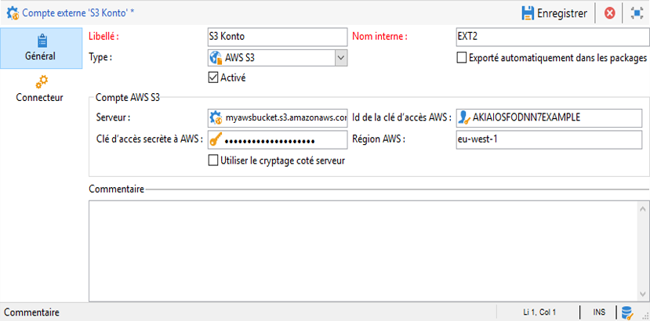

Lors de la configuration de ce nouveau compte externe, vous devez indiquer les informations suivantes :

* **[!UICONTROL Serveur du compte AWS S3]**

   URL du serveur qui doit être renseignée de la manière suivante :

   ```
   <S3bucket name>.s3.amazonaws.com/<s3object path>
   ```

* **[!UICONTROL ID de la clé d’accès AWS]**

   Pour savoir où trouver votre ID de la clé d’accès AWS, consultez [cette page](https://docs.aws.amazon.com/general/latest/gr/aws-sec-cred-types.html#access-keys-and-secret-access-keys) .

* **[!UICONTROL Clé d’accès secrète à AWS]**

   Pour savoir où trouver votre clé d’accès secrète à AWS, consultez [cette page](https://aws.amazon.com/fr/blogs/security/wheres-my-secret-access-key/).

* **[!UICONTROL Région AWS]**

   Pour en savoir plus sur la région AWS, consultez cette [page](https://aws.amazon.com/about-aws/global-infrastructure/regions_az/).

* La case à cocher **[!UICONTROL Utiliser le cryptage coté serveur]** vous permet de stocker votre fichier en mode crypté dans S3.

Pour savoir où trouver l’ID de la clé d’accès et la clé d’accès secrète, consultez la [documentation](https://docs.aws.amazon.com/general/latest/gr/aws-sec-cred-types.html#access-keys-and-secret-access-keys) d’Amazon Web Services .

## Compte externe Azure {#azure-external-account}

Le compte externe **[!UICONTROL Azure]** permet de se connecter à une base de données externe partagée. Tant que cette connexion est active, la base de données est accessible via Adobe Campaign.

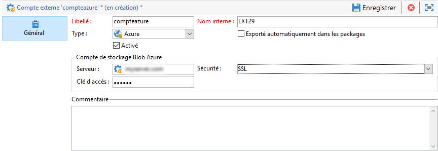

* **[!UICONTROL Serveur]**

   URL du serveur Azure.

* **[!UICONTROL Chiffrement]**

   Type de chiffrement choisi entre **[!UICONTROL Aucun]** et **[!UICONTROL SSL]**.

* **[!UICONTROL Clé d’accès]**

   Pour savoir où trouver votre clé d’accès, consultez [cette page](https://docs.microsoft.com/en-us/azure/storage/common/storage-account-manage) (section **Afficher et copier les clés d’accès**).

## Compte externe Hadoop {#hadoop-external-account}

Le compte externe **[!UICONTROL Hadoop]** permet de se connecter à une base de données externe partagée. Tant que cette connexion est active, la base de données est accessible via Adobe Campaign. For more information on how to configure access to Hadoop, refer to this [section](../../platform/using/specific-configuration-database.md#configure-access-to-hadoop).

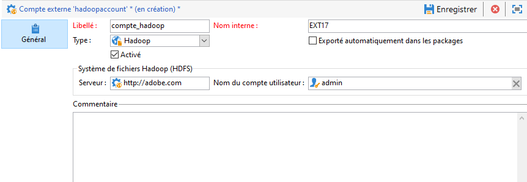

* **[!UICONTROL Serveur]**

   URL du serveur Hadoop.

* **[!UICONTROL Nom du compte utilisateur]**

   Nom du compte utilisé pour accéder à Hadoop.

## Compte externe Microsoft Dynamics CRM {#microsoft-dynamics-crm-external-account}

Le compte externe **[!UICONTROL Microsoft Dynamics CRM]** vous permet d’importer et d’exporter des données Microsoft Dynamics vers Adobe Campaign.

La configuration du connecteur Microsoft Dynamics pour qu’il fonctionne avec Adobe Campaign dépend de votre type de déploiement.
Avec les types de déploiement **[!UICONTROL OnPremise]** et **[!UICONTROL Office 365]** , vous devez fournir les détails suivants :

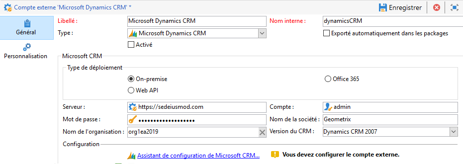

* **[!UICONTROL Compte]**

   Compte utilisé pour se connecter à Microsoft CRM.

* **[!UICONTROL Serveur]**

   URL de votre serveur Microsoft CRM.

* **[!UICONTROL Mot de passe]**

   Mot de passe utilisé pour se connecter à Microsoft CRM.

* **[!UICONTROL Nom de la société]** pour le déploiement on-premise et Office 365

   Nom de votre société.

* **[!UICONTROL Nom de l’organisation]** pour le déploiement on-premise

   Nom de votre organisation.
Nom de l&#39;organisation qui se trouve dans le tableau de bord Ressources des développeurs dans le champ Nom **** unique de Microsoft Dynamics.

* **[!UICONTROL Version]** CRM pour On-Premise

   Version du CRM parmi **[!UICONTROL Dynamics CRM 2007]**, **[!UICONTROL Dynamics CRM 2015]** et **[!UICONTROL Dynamics CRM 2016]**.

Avec le type de déploiement de l’API **** Web et l’authentification des informations d’identification **[!UICONTROL de]** mot de passe, vous devez fournir les détails suivants :

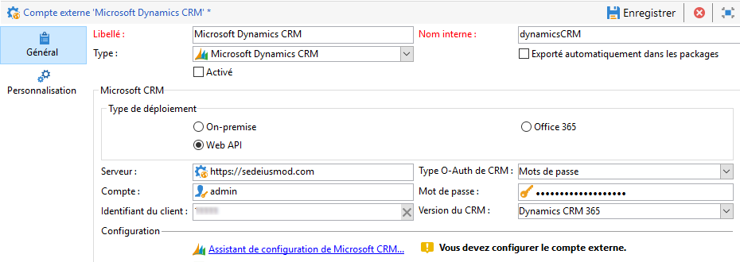

* **[!UICONTROL Compte]**

   Compte utilisé pour se connecter à Microsoft CRM.

* **[!UICONTROL Serveur]**

   URL de votre serveur Microsoft CRM.

* **[!UICONTROL Identifiant du client]**

   ID du client qui se trouve sur le portail de gestion Microsoft Azure au niveau de la catégorie **[!UICONTROL Mettre à jour votre code]**, dans le champ **[!UICONTROL ID du client]**.

* **[!UICONTROL Version CRM]**

   Version du CRM parmi **[!UICONTROL Dynamics CRM 2007]**, **[!UICONTROL Dynamics CRM 2015]** et **[!UICONTROL Dynamics CRM 2016]**.

Avec le type de déploiement API **** Web et l’authentification de **[!UICONTROL certificat]** , vous devez fournir les détails suivants :

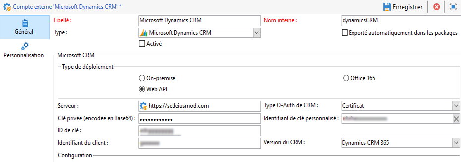

* **[!UICONTROL Serveur]**

   URL de votre serveur Microsoft CRM.

* **[!UICONTROL Clé privée (encodée en Base64)]**

   Clé privée codée en Base64

* **[!UICONTROL Identifiant de clé personnalisé]**


* **[!UICONTROL ID de clé]**

* **[!UICONTROL Identifiant du client]**

   ID du client qui se trouve sur le portail de gestion Microsoft Azure au niveau de la catégorie **[!UICONTROL Mettre à jour votre code]**, dans le champ **[!UICONTROL ID du client]**.

* **[!UICONTROL Version CRM]**

   Version du CRM parmi **[!UICONTROL Dynamics CRM 2007]**, **[!UICONTROL Dynamics CRM 2015]** et **[!UICONTROL Dynamics CRM 2016]**.

Pour plus d’informations sur cette configuration, consultez [cette page](../../platform/using/crm-connectors.md#example-for-microsoft-dynamics).

## Compte externe Oracle On Demand {#oracle-on-demand-external-account}

Le compte externe **[!UICONTROL Oracle On Demand]** vous permet d’importer et d’exporter des données Oracle vers Adobe Campaign.

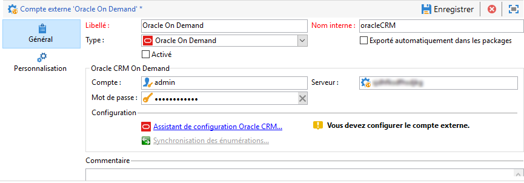

Pour configurer le compte externe Oracle On Demand afin de l’utiliser avec Adobe Campaign, vous devez fournir les détails suivants :

* **[!UICONTROL Compte]**

   Compte utilisé pour se connecter à Oracle CRM On Demand.

* **[!UICONTROL Serveur]**

   URL de votre serveur Oracle CRM On Demand.

* **[!UICONTROL Mot de passe]**

   Mot de passe utilisé pour se connecter à Oracle CRM On Demand.

Pour plus d’informations sur cette configuration, consultez [cette page](../../platform/using/crm-connectors.md#example-for-oracle-on-demand).

## Compte externe Salesforce CRM {#salesforce-crm-external-account}

Le compte externe **[!UICONTROL Salesforce CRM]** vous permet d’importer et d’exporter des données Salesforce vers Adobe Campaign.


Pour configurer le compte externe Salesforce CRM afin de l’utiliser avec Adobe Campaign, vous devez fournir les détails suivants :

* **[!UICONTROL Compte]**

   Compte utilisé pour se connecter à Salesforce CRM.

* **[!UICONTROL Mot de passe]**

   Mot de passe utilisé pour se connecter à Salesforce CRM.

* **[!UICONTROL Identifiant du client]**

   Pour savoir où trouver votre identifiant du client, consultez [cette page](https://help.salesforce.com/articleView?id=000205876&type=1).

* **[!UICONTROL Jeton de sécurité]**

   Pour savoir où trouver votre jeton de sécurité, consultez [cette page](https://help.salesforce.com/articleView?id=000205876&type=1).

* **[!UICONTROL Version de l’API]**

   Version de l’API parmi **[!UICONTROL Version 37]**, **[!UICONTROL Version 21]** et **[!UICONTROL Version 15]**.

Pour ce compte externe, vous devez configurer votre Salesforce CRM à l’aide de l’assistant de configuration.

Pour plus d’informations sur cette configuration, consultez [cette page](../../platform/using/crm-connectors.md#example-for-salesforce-com).
