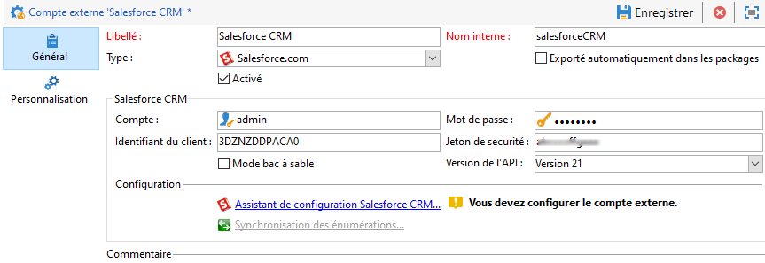

# Comptes externes{#external-accounts}

Un compte externe est un paramétrage qui permet de configurer et de tester l&#39;accès à un serveur externe à Adobe Campaign. Ces comptes externes peuvent être utilisés dans les workflows de Campaign pour accéder aux données et les gérer.

Vous pouvez configurer les types de comptes externes suivants :

* [Compte externe Routage](#routing-external-account)
* [Compte externe FTP](#ftp-external-account)
* [Compte externe de base de données externe](#external-database-external-account)
* [Compte externe Web Analytics](#web-analytics-external-account)
* [Compte externe Facebook Connect](#facebook-connect-external-account)
* [Compte externe d’instance d’exécution](#execution-instance-external-account)
* [Compte externe Adobe Experience Cloud](#adobe-experience-cloud-external-account)
* [Compte externe SFTP  ](#sftp-external-account)
* [Compte externe Adobe Experience Manager](#adobe-experience-manager-external-account)
* [Compte externe Amazon Simple Storage Service (S3)](#amazon-simple-storage-service--s3--external-account)
* [Compte externe Azure](#azure-external-account)
* [Compte externe Hadoop](#hadoop-external-account)
* [Compte externe Microsoft Dynamics CRM](#microsoft-dynamics-crm-external-account)
* [Compte externe Oracle On Demand](#oracle-on-demand-external-account)
* [Compte externe Salesforce CRM](#salesforce-crm-external-account)

## Création d&#39;un compte externe {#creating-an-external-account}

Adobe Campaign est livré avec un ensemble de comptes externes prédéfinis. Pour configurer des connexions avec des systèmes externes comme des serveurs FTP utilisés pour les transferts de fichiers, vous pouvez créer vos propres comptes externes.

Les comptes externes sont utilisés par des processus techniques, tels que des workflows techniques ou des workflows des opérations. Lors de la configuration d&#39;un transfert de fichier dans un workflow ou d&#39;un échange de données avec une autre application (Adobe Target, Experience Manager, etc.), vous devez sélectionner un compte externe.

1. From the **[!UICONTROL Explorer]**, unfold the **[!UICONTROL Administration]** menu.
1. Dépliez le **[!UICONTROL Platform]** menu et cliquez sur **[!UICONTROL External accounts]**.

   

1. Cliquez sur le **[!UICONTROL New]** bouton.

   

1. Entrez un **[!UICONTROL Label]** et **[!UICONTROL Internal Name]**. Les deux seront utilisés lors de la sélection de comptes externes dans les processus.
1. Check **[!UICONTROL Enabled]** if you want your connection to be enabled.
1. Sélectionnez le **[!UICONTROL Type]** de compte externe que vous voulez créer.
1. Configurez l’accès au compte en spécifiant les informations de connexion en fonction du type de compte externe choisi.

   Les informations nécessaires sont généralement fournies par le fournisseur du serveur auquel vous vous connectez.

1. Clics **[!UICONTROL Save]**.

Le compte externe est créé et ajouté à la liste des comptes externes. Il est maintenant disponible pour vos transferts de données/fichiers ou configurations de routage dans les activités de workflow et les propriétés de diffusion.

## Compte externe Mails rebonds {#bounce-mails-external-account}

Le compte externe **Mails rebonds** spécifie le compte POP3 externe à utiliser pour se connecter au service de messagerie. Pour plus d’informations sur ce compte externe, consultez cette [page](../../workflow/using/inbound-emails.md).

Tous les serveurs configurés pour l’accès POP3 peuvent être utilisés pour recevoir les mails rebonds.


To configure the **[!UICONTROL Bounce mails (defaultPopAccount)]** external account:

* **[!UICONTROL Server]**

   URL du serveur POP3.

* **[!UICONTROL Port]**

   Numéro de port de la connexion POP3. Le port par défaut est 110.

* **[!UICONTROL Account]**

   Nom de l&#39;utilisateur.

* **[!UICONTROL Password]**

   Mot de passe du compte de l&#39;utilisateur.

* **[!UICONTROL Encryption]**

   Type of chosen encryption between **[!UICONTROL By default]**, **[!UICONTROL POP3 + STARTTLS]**, **[!UICONTROL POP3]** or **[!UICONTROL POP3S]**.

## Compte externe Routage {#routing-external-account}

The **[!UICONTROL Routing]** external account allows you to configure each channel available in Adobe Campaign depending on the packages installed.


Les canaux suivants peuvent être configurés :

* [Email](../../installation/using/deploying-an-instance.md#email-channel-parameters)
* [Mobile (SMS)](../../delivery/using/sms-channel.md#activating-an-external-account).
* [Phone](../../delivery/using/other-channels.md)
* [Canal Courrier](../../delivery/using/about-direct-mail-channel.md)
* [Agence](../../delivery/using/other-channels.md)
* [Facebook](../../social/using/publishing-on-facebook-walls.md#delegating-write-access-to-adobe-campaign)
* [Twitter](../../social/using/configuring-publishing-on-twitter.md)
* [Canal iOS](../../delivery/using/setting-up-mobile-app-channel.md#ios-connectors)
* [Canal Android](../../delivery/using/setting-up-mobile-app-channel.md#android-connectors)

## Compte externe FTP {#ftp-external-account}

Le compte externe FTP vous permet de configurer et de tester l’accès à un serveur en dehors d’Adobe Campaign. Pour configurer des connexions à des systèmes externes tels que des serveurs FTP 898 utilisés pour les transferts de fichiers, vous pouvez créer vos propres comptes externes. Voir à ce sujet [cette page](../../workflow/using/file-transfer.md).

Pour ce faire, spécifiez dans ce compte externe l’adresse et les informations de connexion utilisées pour établir la connexion au serveur FTP.


* **[!UICONTROL Server]**

   Nom du serveur FTP.

* **[!UICONTROL Port]**

   Numéro de port de la connexion FTP. Le port par défaut est 21.

* **[!UICONTROL Account]**

   Nom de l&#39;utilisateur.

* **[!UICONTROL Password]**

   Mot de passe du compte de l&#39;utilisateur.

* **[!UICONTROL Encryption]**

   Type of chosen encryption between **[!UICONTROL None]** or **[!UICONTROL SSL]**.

Pour savoir où trouver ces informations de connexion, consultez [cette page](https://help.dreamhost.com/hc/en-us/articles/115000675027-FTP-overview-and-credentials).

## Compte externe de base de données externe {#external-database-external-account}

Adobe Campaign met à votre disposition plusieurs connecteurs permettant de communiquer avec des applications et de se connecter à des moteurs de bases de données externes.


Les types de connexions suivants peuvent être configurés :

* Oracle. Pour plus d&#39;informations, consultez cette [page](../../platform/using/accessing-an-external-database.md#configure-access-to-oracle).
* MySQL. Pour configurer l’accès à MYSQL, reportez-vous à cette [page](../../platform/using/accessing-an-external-database.md#configure-access-to-mysql).
* Netezza. Pour plus d&#39;informations, consultez cette [page](../../platform/using/accessing-an-external-database.md#configure-access-to-netezza).
* SAP HANA. Pour plus d&#39;informations, consultez cette [page](../../platform/using/accessing-an-external-database.md#configure-access-to-sap-hanaa).
* InfiniDB
* Microsoft SQL Server
* AsterData
* PostgreSQL
* Teradata
* DB2
* Amazon Redshift
* ODBC (Sybase ASE, Sybase IQ)
* Relais HTTP vers base distante

### Compte externe Teradata {#teradata-external-account}

Le compte externe **Teradata** vous permet de connecter votre instance Campaign à votre base de données externe Teradata. Pour plus d&#39;informations sur la configuration de Campaign Classic avec Teradata, consultez cette [page](https://helpx.adobe.com/campaign/kb/campaign_fda_teradata.html) ou cette [section](../../platform/using/accessing-an-external-database.md#configure-access-to-teradata).


Pour configurer ce compte externe afin de l’utiliser avec Adobe Campaign, vous devez fournir les détails suivants :

* **[!UICONTROL Type]**

   Choose the **[!UICONTROL Teradata]** type.

* **[!UICONTROL Server]**

   URL ou nom de votre serveur Teradata.

* **[!UICONTROL Account]**

   Nom du compte utilisé pour accéder à la base de données Teradata.

* **[!UICONTROL Password]**

   Mot de passe utilisé pour se connecter à la base de données Teradata.

* **[!UICONTROL Database]**

   Ce champ peut être vide.

* **[!UICONTROL Options]**

   Options à transmettre via Teradata.

* **[!UICONTROL Timezone]**

   Fuseau horaire défini dans Teradata


When multiple Adobe Campaign users connect to the same FDA Teradata external account, the **[!UICONTROL Query banding]** tab allows you to set a query band, i.e. a set of key/value pairs, on a session.

Chaque fois qu’un utilisateur Campaign réalise une requête sur la base de données Teradata, Adobe Campaign enverra des métadonnées qui se composent d’une liste de clés associées à cet utilisateur. Ces données peuvent ensuite être utilisées par les administrateurs Teradata à des fins d’audit ou de gestion des droits d’accès.

Check the **[!UICONTROL Active]** box to activate this feature

Le **[!UICONTROL Default]** champ vous permet de saisir une bande de requête par défaut qui sera utilisée si un utilisateur n’est associé à aucune bande de requête. Si ce champ est vide, les utilisateurs sans bande de requête ne pourront pas utiliser Teradata.

Le **[!UICONTROL Users]** champ vous permet de spécifier une bande de requête pour chaque utilisateur. Vous pouvez ajouter autant de paires clé/valeur que nécessaire, par exemple priority=1;work=high. Si aucune bande de requête n’est affectée à l’utilisateur, le **[!UICONTROL Default]** champ est appliqué.

For more information on **[!UICONTROL Query banding]**, refer to the [Teradata documentation](https://docs.teradata.com/reader/cY5B~oeEUFWjgN2kBnH3Vw/a5G1iz~ve68yTMa24kVjVw).

## Compte externe Web Analytics {#web-analytics-external-account}

Le compte **[!UICONTROL Web Analytics (Adobe Analytics - Data connector)]** externe vous permet de transférer des données d’Adobe Analytics vers Adobe Campaign sous forme de segments. Inversement, il envoie les indicateurs et les attributs des campagnes par courrier électronique fournies par Adobe Campaign à Adobe Analytics - Connecteur de données.


Pour ce compte externe, la formule de calcul pour les URL trackées doit être enrichie, et la connexion entre les deux solutions doit être validée. Voir à ce sujet [cette page](../../platform/using/adobe-analytics-data-connector.md#step-2--create-the-external-account-in-campaign).

## Compte externe Facebook Connect {#facebook-connect-external-account}

Le compte externe **[!UICONTROL Facebook Connect]** vous permet d’afficher du contenu personnalisé dans vos applications Facebook, ce qui facilite l’acquisition de prospects par l’intermédiaire de ce réseau social.

Pour chaque application Facebook, vous devez créer un compte externe de type **[!UICONTROL Facebook Connect]**. For more on this, refer to [page](../../social/using/creating-a-facebook-application.md#configuring-external-accounts).


* **[!UICONTROL Hosting mode]**

   Mode d’hébergement de l’application entre **[!UICONTROL hosted by a partner]** ou **[!UICONTROL hosted by this instance]**.

* **[!UICONTROL Application ID]**

   ID de l’application de votre application Facebook.

* **[!UICONTROL Application secret]**

   Secret de l’application de votre application Facebook.

Si vous choisissez le mode Hébergée sur cette instance, vous devez coller l’URL sécurisée du canevas dans le champ **Jeux Web Facebook (https)** sur Facebook.

Pour savoir où trouver ces informations de connexion, consultez [cette page](https://developers.facebook.com/docs/facebook-login/access-tokens).

## Compte externe d’instance d’exécution {#execution-instance-external-account}

Si vous possédez une architecture répartie, vous devez spécifier les instances d’exécution liées à l’instance de contrôle et les connecter. Les modèles de messages transactionnels sont déployés sur l’instance d’exécution.


* **[!UICONTROL URL]**

   URL du serveur sur lequel est installée l’instance d’exécution.

* **[!UICONTROL Account]**

   Nom du compte qui doit correspondre à l’Agent Message Center tel qu’il a été défini dans le dossier de l’opérateur.

* **[!UICONTROL Password]**

   Mot de passe du compte tel qu’il a été défini dans le dossier de l’opérateur.

Pour plus d’informations sur cette configuration, consultez [cette page](../../message-center/using/creating-a-shared-connection.md#control-instance).

## Compte externe Adobe Experience Cloud {#adobe-experience-cloud-external-account}

To connect to the Adobe Campaign console using an Adobe ID, you must configure the **[!UICONTROL Adobe Experience Cloud (MAC)]** external account.


* **[!UICONTROL IMS server]**

   URL de votre serveur IMS. Assurez-vous que les instances de test et de production pointent sur le même point de terminaison de production IMS.

* **[!UICONTROL IMS scope]**

   Les périmètres définis ici doivent être un sous-ensemble de ceux provisionnés par IMS.

* **[!UICONTROL IMS client identifier]**

   ID de votre client IMS.

* **[!UICONTROL IMS client secret]**

   Informations de connexion de votre secret client IMS.

* **[!UICONTROL Callback server]**

   URL d’accès à votre instance Adobe Campaign.

* **[!UICONTROL IMS organization ID]**

   Identifiant de votre organisation IMS. Pour trouver votre identifiant d’organisation, consultez cette [page](https://marketing.adobe.com/resources/help/en_US/mcloud/faq.html) (**Où puis-je trouver mon identifiant de l’organisation IMS ?**).

* **[!UICONTROL Association mask]**

   Syntaxe qui permettra la synchronisation des noms de configuration dans Enterprise Dashboard avec les groupes dans Adobe Campaign.

* **[!UICONTROL Server]**

   URL de votre instance Adobe Experience Cloud.

* **[!UICONTROL Tenant]**

   Nom de votre tenant Adobe Experience Cloud.

Pour plus d’informations sur cette configuration, consultez [cette page](../../integrations/using/configuring-ims.md).

## Compte externe SFTP   {#sftp-external-account}

Le compte externe SFTP vous permet de configurer et de tester l’accès à un serveur en dehors d’Adobe Campaign. Pour configurer des connexions à des systèmes externes tels que des serveurs SFTP utilisés pour les transferts de fichiers, vous pouvez créer vos propres comptes externes. Voir à ce sujet [cette page](../../workflow/using/file-transfer.md).


* **[!UICONTROL Server]**

   URL du serveur SFTP.

* **[!UICONTROL Port]**

   Numéro de port de connexion FTP. Le port par défaut est 22.

* **[!UICONTROL Account]**

   Nom du compte utilisé pour se connecter au serveur SFTP.

* **[!UICONTROL Password]**

   Mot de passe utilisé pour se connecter au serveur SFTP.

## Compte externe Adobe Experience Manager {#adobe-experience-manager-external-account}

The **[!UICONTROL AEM (AEM instance)]** external account allows you to manage the content of your email deliveries as well as your forms directly in Adobe Experience Manager.


* **[!UICONTROL Server]**

   URL du serveur Adobe Experience Manager.

* **[!UICONTROL Port]**

   Nom du compte utilisé pour se connecter à l’instance de création Adobe Experience Manager.

* **[!UICONTROL Password]**

   Mot de passe utilisé pour se connecter à l’instance de création Adobe Experience Manager.

Voir à ce propos cette [section](../../integrations/using/about-adobe-experience-manager.md).

## Compte externe Amazon Simple Storage Service (S3){#amazon-simple-storage-service--s3--external-account}

Le connecteur Amazon Simple Storage Service (S3) peut être utilisé pour importer ou exporter des données vers Adobe Campaign. Il peut être configuré dans une activité de workflow. Voir à ce sujet [cette page](../../workflow/using/file-transfer.md).


Lors de la configuration de ce nouveau compte externe, vous devez indiquer les informations suivantes :

* **[!UICONTROL AWS S3 Account Server]**

   URL du serveur qui doit être renseignée de la manière suivante :

   ```
   <S3bucket name>.s3.amazonaws.com/<s3object path>
   ```

* **[!UICONTROL AWS access key ID]**

   Pour savoir où trouver votre ID de la clé d’accès AWS, consultez [cette page](https://docs.aws.amazon.com/general/latest/gr/aws-sec-cred-types.html#access-keys-and-secret-access-keys) .

* **[!UICONTROL Secret access key to AWS]**

   Pour savoir où trouver votre clé d’accès secrète à AWS, consultez [cette page](https://aws.amazon.com/fr/blogs/security/wheres-my-secret-access-key/).

* **[!UICONTROL AWS Region]**

   Pour en savoir plus sur la région AWS, consultez cette [page](https://aws.amazon.com/about-aws/global-infrastructure/regions_az/).

* The **[!UICONTROL Use server side encryption]** checkbox allows you to store your file in S3 encrypted mode.

Pour savoir où trouver l’ID de la clé d’accès et la clé d’accès secrète, consultez la [documentation](https://docs.aws.amazon.com/general/latest/gr/aws-sec-cred-types.html#access-keys-and-secret-access-keys) d’Amazon Web Services .

## Compte externe Azure {#azure-external-account}

Le compte externe **[!UICONTROL Azure]** permet de se connecter à une base de données externe partagée. Tant que cette connexion est active, la base de données est accessible via Adobe Campaign.


* **[!UICONTROL Server]**

   URL du serveur Azure.

* **[!UICONTROL Encryption]**

   Type of chosen encryption between **[!UICONTROL None]** or **[!UICONTROL SSL]**.

* **[!UICONTROL Access key]**

   Pour savoir où trouver votre clé d’accès, consultez [cette page](https://docs.microsoft.com/en-us/azure/storage/common/storage-account-manage) (section **Afficher et copier les clés d’accès**).

## Compte externe Hadoop {#hadoop-external-account}

Le compte externe **[!UICONTROL Hadoop]** permet de se connecter à une base de données externe partagée. Tant que cette connexion est active, la base de données est accessible via Adobe Campaign. For more information on how to configure access to Hadoop, refer to this [section](../../platform/using/accessing-an-external-database.md#configure-access-to-hadoop).


* **[!UICONTROL Server]**

   URL du serveur Hadoop.

* **[!UICONTROL User account name]**

   Nom du compte utilisé pour accéder à Hadoop.

## Compte externe Microsoft Dynamics CRM {#microsoft-dynamics-crm-external-account}

Le compte externe **[!UICONTROL Microsoft Dynamics CRM]** vous permet d’importer et d’exporter des données Microsoft Dynamics vers Adobe Campaign.

La configuration du connecteur Microsoft Dynamics pour qu’il fonctionne avec Adobe Campaign dépend de votre type de déploiement.
Avec **[!UICONTROL On-premise]** et les types **[!UICONTROL Office 365]** de déploiement, vous devez fournir les détails suivants :


* **[!UICONTROL Account]**

   Compte utilisé pour se connecter à Microsoft CRM.

* **[!UICONTROL Server]**

   URL de votre serveur Microsoft CRM.

* **[!UICONTROL Password]**

   Mot de passe utilisé pour se connecter à Microsoft CRM.

* **[!UICONTROL Company name]** pour le déploiement local et Office 365

   Nom de votre société.

* **[!UICONTROL Organization name]** pour le déploiement sur site

   Nom de votre organisation.
Nom de l&#39;organisation qui se trouve dans le tableau de bord Ressources des développeurs dans le champ Microsoft Dynamics **[!UICONTROL Unique Name]** .

* **[!UICONTROL CRM version]** sur site

   Version de la gestion de la relation client entre **[!UICONTROL Dynamics CRM 2007]**, **[!UICONTROL Dynamics CRM 2015]** ou **[!UICONTROL Dynamics CRM 2016]**.

Avec le type de **[!UICONTROL Web API]** déploiement et **[!UICONTROL Password credentials]** l’authentification, vous devez fournir les détails suivants :


* **[!UICONTROL Account]**

   Compte utilisé pour se connecter à Microsoft CRM.

* **[!UICONTROL Server]**

   URL de votre serveur Microsoft CRM.

* **[!UICONTROL Client identifier]**

   ID de client qui se trouve sur le portail de gestion Microsoft Azure dans la **[!UICONTROL Update your code]** catégorie, le champ **[!UICONTROL Client ID]** .

* **[!UICONTROL CRM version]**

   Version de la gestion de la relation client entre **[!UICONTROL Dynamics CRM 2007]**, **[!UICONTROL Dynamics CRM 2015]** ou **[!UICONTROL Dynamics CRM 2016]**.

Avec le type de **[!UICONTROL Web API]** déploiement et **[!UICONTROL Certificate]** l’authentification, vous devez fournir les détails suivants :


* **[!UICONTROL Server]**

   URL de votre serveur Microsoft CRM.

* **[!UICONTROL Private Key (Base64 encoded)]**

   Clé privée codée en Base64

* **[!UICONTROL Custom Key identifier]**


* **[!UICONTROL Key ID]**

* **[!UICONTROL Client identifier]**

   ID de client qui se trouve sur le portail de gestion Microsoft Azure dans la **[!UICONTROL Update your code]** catégorie, le champ **[!UICONTROL Client ID]** .

* **[!UICONTROL CRM version]**

   Version de la gestion de la relation client entre **[!UICONTROL Dynamics CRM 2007]**, **[!UICONTROL Dynamics CRM 2015]** ou **[!UICONTROL Dynamics CRM 2016]**.

Pour plus d’informations sur cette configuration, consultez [cette page](../../platform/using/crm-connectors.md#example-for-microsoft-dynamics).

## Compte externe Oracle On Demand {#oracle-on-demand-external-account}

Le compte externe **[!UICONTROL Oracle on demand]** vous permet d’importer et d’exporter des données Oracle vers Adobe Campaign.


Pour configurer le compte externe Oracle On Demand afin de l’utiliser avec Adobe Campaign, vous devez fournir les détails suivants :

* **[!UICONTROL Account]**

   Compte utilisé pour se connecter à Oracle CRM On Demand.

* **[!UICONTROL Server]**

   URL de votre serveur Oracle CRM On Demand.

* **[!UICONTROL Password]**

   Mot de passe utilisé pour se connecter à Oracle CRM On Demand.

Pour plus d’informations sur cette configuration, consultez [cette page](../../platform/using/crm-connectors.md#example-for-oracle-on-demand).

## Compte externe Salesforce CRM {#salesforce-crm-external-account}

Le compte externe **[!UICONTROL Salesforce CRM]** vous permet d’importer et d’exporter des données Salesforce vers Adobe Campaign.



Pour configurer le compte externe Salesforce CRM afin de l’utiliser avec Adobe Campaign, vous devez fournir les détails suivants :

* **[!UICONTROL Account]**

   Compte utilisé pour se connecter à Salesforce CRM.

* **[!UICONTROL Password]**

   Mot de passe utilisé pour se connecter à Salesforce CRM.

* **[!UICONTROL Client identifier]**

   Pour savoir où trouver votre identifiant du client, consultez [cette page](https://help.salesforce.com/articleView?id=000205876&type=1).

* **[!UICONTROL Security token]**

   Pour savoir où trouver votre jeton de sécurité, consultez [cette page](https://help.salesforce.com/articleView?id=000205876&type=1).

* **[!UICONTROL API version]**

   Version of the API between **[!UICONTROL Version 37]**, **[!UICONTROL Version 21]** or **[!UICONTROL Version 15]**.

Pour ce compte externe, vous devez configurer votre Salesforce CRM à l’aide de l’assistant de configuration.

Pour plus d’informations sur cette configuration, consultez [cette page](../../platform/using/crm-connectors.md#example-for-salesforce-com).
