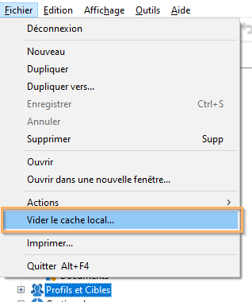

# FAQ sur les paramètres de Campaign {#settings-faq}

Découvrez les principales configurations afin de définir votre instance Campaign en fonction de vos besoins.

## Puis-je changer la langue de l&#39;interface de Campaign ?  {#can-i-change-the-language-of-campaign-interface-}

La langue de Campaign est sélectionnée lors de la création de l&#39;instance. Vous ne pouvez pas la changer par la suite. Voir à ce propos [cette section](../../installation/using/creating-an-instance-and-logging-on.md).

L&#39;interface utilisateur d&#39;Adobe Campaign est disponible en 4 langues : anglais, français, allemand et japonais. La console cliente et le serveur doivent être configurés avec la même langue. Chaque instance de Campaign ne peut s&#39;exécuter que dans une seule langue.

Pour l&#39;anglais, lors de l&#39;installation de Campaign, vous pouvez sélectionner l&#39;anglais américain ou l&#39;anglais britannique : les formats de date et d&#39;heure sont différents. Pour plus d&#39;informations sur ces différences, consultez [cette section](../../platform/using/adobe-campaign-workspace.md#date-and-time).

## Est-il possible d&#39;utiliser Campaign Classic avec d&#39;autres solutions Adobe ?  {#can-i-use-campaign-classic-with-other-adobe-solutions-}

Vous pouvez combiner les fonctionnalités de diffusion et de gestion de campagnes avancées d&#39;Adobe Campaign avec un ensemble de solutions conçues pour vous aider à personnaliser l&#39;expérience de vos utilisateurs.

Cliquez ici pour découvrir [comment utiliser d&#39;autres solutions Adobe](../../integrations/using/about-campaign-integrations.md) et [comment configurer IMS dans Campaign](../../integrations/using/about-adobe-id.md).

## Comment configurer les fonctionnalités de tracking sur mon instance Campaign ?  {#how-can-i-set-up-tracking-capabilities-on-my-campaign-instance-}

En tant qu&#39;utilisateur expert, vous pouvez configurer les fonctionnalités de tracking sur votre instance Campaign.

[Pour en savoir plus, cliquez ici](../../installation/using/deploying-an-instance.md#tracking-configuration).

## Comment configurer la délivrabilité des emails ?  {#how-to-configure-email-deliverability-}

Outre le [Guide des bonnes pratiques relatives à la délivrabilité d’Adobe](https://experienceleague.adobe.com/docs/deliverability-learn/deliverability-best-practice-guide/introduction.html?lang=fr), lisez les recommandations techniques sur la délivrabilité pour comprendre comment configurer votre instance afin d’optimiser les fonctionnalités de diffusion de Campaign.

[Pour en savoir plus, cliquez ici](../../delivery/using/about-deliverability.md).

## Comment mettre en place la validation du contenu ?  {#how-can-i-implement-content-approval-}

Grâce à Campaign, vous pouvez mettre en place des processus de validation des principales étapes d’une campagne marketing, dans un mode collaboratif. Pour chaque opération, vous pouvez valider la cible de diffusion, le contenu et les coûts. Les opérateurs Adobe Campaign en charge de la validation peuvent être avertis par e-mail et peuvent accepter ou refuser la validation depuis la console ou via une connexion web.

[Cliquez ici pour en savoir plus](../../campaign/using/marketing-campaign-approval.md#checking-and-approving-deliveries) et découvrir les étapes permettant d’implémenter la validation du contenu de vos diffusions dans Campaign.

## Comment accéder aux données stockées dans une base de données externe ?  {#how-can-i-access-data-stored-in-an-external-database-}

Adobe Campaign propose l&#39;option Federated Data (FDA) Access afin d&#39;exploiter des informations stockées dans une ou plusieurs bases de données externes : vous pouvez accéder à des données externes sans modifier la structure des données d&#39;Adobe Campaign.

[Pour en savoir plus, cliquez ici](../../installation/using/connecting-to-database.md).

## À quelles bases de données externes est-il possible de connecter Campaign ?  {#which-external-databases-can-i-connect-campaign-to-}

Les bases de données externes compatibles avec Campaign via FDA (Federated Data Access) sont répertoriées dans la [matrice de compatibilité](../../rn/using/compatibility-matrix.md).

## Adobe Campaign peut-il s&#39;intégrer avec LDAP ?  {#can-adobe-campaign-integrate-with-ldap-}

En tant que client on-premise/hybride, vous pouvez intégrer Campaign Classic avec votre annuaire LDAP.

[Cliquez ici pour découvrir comment](../../installation/using/connecting-through-ldap.md).

## Comment configurer les connecteurs CRM dans Campaign ?  {#how-can-i-set-up-crm-connectors-in-campaign-}

Adobe Campaign propose différents connecteurs CRM pour relier votre plateforme Adobe Campaign à vos systèmes tiers. Ces connecteurs CRM permettent par exemple de synchroniser les contacts, les comptes, les commandes, les achats, etc. Ils simplifient l&#39;intégration de votre application avec vos différentes applications tierces et métiers.

Ces connecteurs permettent d&#39;intégrer rapidement et simplement les données : Adobe Campaign propose un assistant dédié pour collecter et sélectionner parmi les tables disponibles dans le CRM. Ils permettent une synchronisation bidirectionnelle des informations afin que les données client soient à jour simultanément sur les différents systèmes.

Lisez la section [Configurer les connecteurs CRM](../../platform/using/crm-connectors.md) pour savoir comment synchroniser votre outil CRM avec Adobe Campaign.

 Regardez cette vidéo de cas pratique sur [l’intégration d’Adobe Campaign et Microsoft Dynamics 365](https://experienceleague.adobe.com/docs/campaign-classic-learn/tutorials/integrating/dynamics365-integration.html?lang=fr).

## Comment effectuer un effacement de la mémoire cache locale (soft) lorsque les problèmes sont spécifiques à la machine ou à l’utilisateur ?  {#perform-soft-cache-clear}

Si vous rencontrez des problèmes concernant, par exemple, la prise en compte correcte des nouveaux logos et la capacité d’exporter avec succès les données spécifiques à l’ordinateur ou à l’utilisateur, vous devrez peut-être effectuer un effacement de la mémoire cache locale (soft) avec Windows (Windows 7, Windows XP, Windows 10).

Une fois connecté, accédez à **[!UICONTROL Fichier]** > **[!UICONTROL Vider le cache local]**. Ensuite, déconnectez-vous et reconnectez-vous.

Si le problème n’est pas résolu, essayez d’effacer la mémoire cache locale (hard) en procédant comme suit.

## Comment effectuer un effacement de la mémoire cache locale (hard) lorsque les problèmes sont spécifiques à la machine ou à l’utilisateur ?  {#perform-hard-cache-clear}

Si vous rencontrez des problèmes concernant, par exemple, la prise en compte correcte des nouveaux logos et la capacité d’exporter avec succès les données spécifiques à l’ordinateur ou à l’utilisateur, vous devrez peut-être effectuer un effacement de la mémoire cache locale (hard) avec Windows (Windows 7, Windows XP, Windows 10).

1. Dans la console cliente, choisissez **[!UICONTROL Fichier]** > **[!UICONTROL Vider le cache local]**.

1. Déconnectez-vous et fermez la console cliente (client enrichi).

1. Accédez aux emplacements suivants, selon la version de votre système d’exploitation :

   * Windows 7 : C:\Users\ &lt; nom_utilisateur > \AppData\Roaming\Neolane\NL_5\
   * Windows XP : C:\Documents et Settings\ &lt; nom_utilisateur > \Application Data\Neolane\NL_5

   Ces dossiers contiennent de nombreux fichiers xml nommés nlclient-config-&lt; valeur alphanumérique >.xml.

1. Supprimez ces fichiers XML et leurs dossiers associés.

   >[!IMPORTANT]
   >
   >Ne supprimez pas le fichier nlclient_cnx.xml.

1. Connectez-vous à la console cliente.
