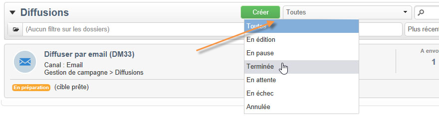

# Options de filtrage{#filtering-options}

## À propos du filtrage {#about-filtering}

Par défaut, Adobe Campaign affiche toutes les données de la base sur lesquelles l&#39;opérateur concerné a des droits en lecture.

Ces données peuvent être filtrées à partir des options situées dans la section supérieure de la fenêtre de navigation.

Plusieurs modes de filtrage des informations affichées sont possibles. Au besoin, ils peuvent être cumulés :

* Filtrage par dossier, voir la section [Filtrer par dossier](#filter-by-folder),
* Filtrage par statut, voir la section [Filtrer par statut](#filter-by-status),
* Tri des données, voir la section [Ordre de tri](#order-by),
* Recherche, voir la section [Recherche rapide](#quick-search).

## Filtrer par dossier {#filter-by-folder}

Cliquez sur l&#39;icône **[!UICONTROL Dossier]** pour sélectionner le dossier contenant les données à afficher.

Seuls les profils du dossier sélectionné sont affichés :

Utilisez la croix située à droite du champ de sélection du dossier pour revenir à un mode d&#39;affichage par défaut.

## Filtrer par statut {#filter-by-status}

Selon le type d&#39;informations affichées, vous pouvez appliquer un filtre par statut ou par état. Par exemple, pour les diffusions, vous pouvez choisir de n&#39;afficher que les diffusions terminées, comme dans l&#39;exemple ci-dessous :

## Ordre de tri {#order-by}

Vous pouvez sélectionner l&#39;ordre de tri des données proposées dans les pages à partir de la liste déroulante située à droite du champ de filtrage par dossier. Le contenu de ce filtre dépend du type de données de la page.

Par exemple, vous pouvez trier les tâches par priorité, par date de création ou par ordre alphabétique.

## Recherche rapide {#quick-search}

Utilisez le champ de recherche pour accéder rapidement à l&#39;élément souhaité : saisissez les caractères contenus dans le libellé ou le nom interne de l&#39;élément à afficher puis validez pour appliquer un filtre automatique sur les données de la page.

Pour afficher à nouveau tous les éléments, cliquez sur la croix afin de supprimer le contenu du champ de recherche.
