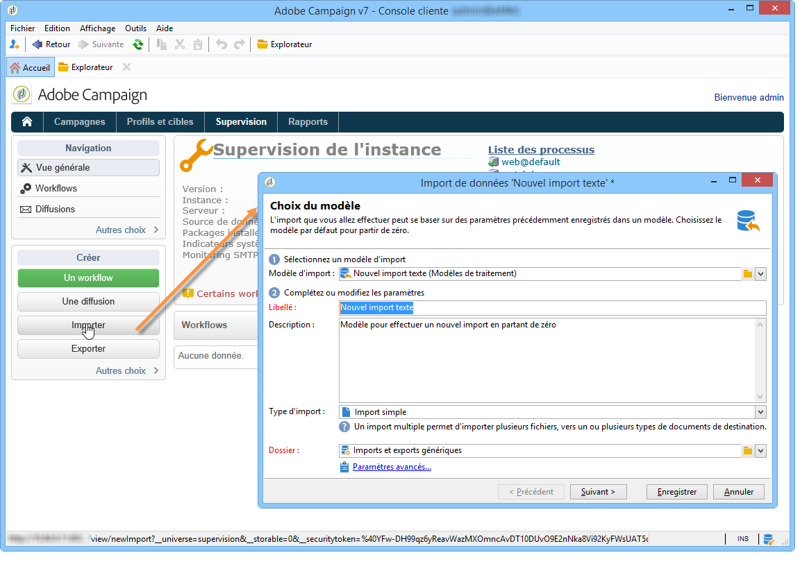
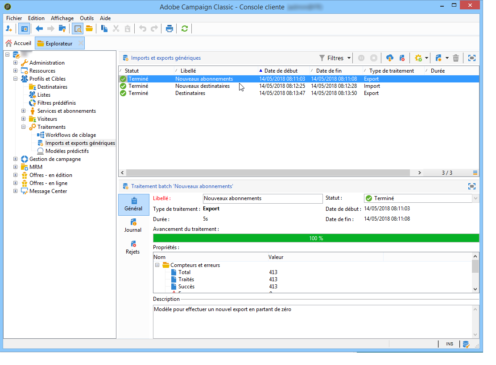

# Imports et exports génériques{#generic-imports-and-exports}

Adobe Campaign propose un module d&#39;export de données qui permet d&#39;extraire aisément, par exemple suite à une opération de ciblage, une liste de clients ou de prospects qui feront alors partie d&#39;une population cible.

Adobe Campaign propose également un module d&#39;import qui permet d&#39;alimenter la base en données à partir d&#39;un fichier externe.

>[!NOTE]
>
>Les exports et imports sont paramétrés dans des modèles dédiés et exécutés au travers des workflows via les activités **[!UICONTROL Import]** et **[!UICONTROL Export]**. Ainsi, ils peuvent être rejoués automatiquement de façon planifiée, afin par exemple d&#39;automatiser les échanges de données entre plusieurs systèmes d&#39;information. Au besoin, vous pouvez créer un import ou un export ponctuel depuis le nœud **[!UICONTROL Profils et Cibles > Traitements > Imports et exports génériques]** de l&#39;arborescence d&#39;Adobe Campaign.

Vous pouvez ainsi :

* Créer un modèle de d&#39;import ou d&#39;export et le paramétrer, voir ci-dessous.
* Créez une importation ou une exportation : voir [Exportation de données](../../platform/using/exporting-data.md) ou [Importation de données](../../platform/using/importing-data.md).
* Lancez l’importation ou l’exportation et surveillez son exécution. voir Suivi des [exécutions](#execution-tracking).

>[!CAUTION]
>
>L&#39;import de données dans Campaign doit être effectué par le biais des workflows afin de garantir la cohérence des données et d&#39;améliorer l&#39;efficacité. Voir à ce propos les sections [Importer des données](../../workflow/using/importing-data.md), [Bonnes pratiques d&#39;import](../../workflow/using/importing-data.md#best-practices-when-importing-data) et [Exemple de modèle d&#39;import](../../workflow/using/importing-data.md#setting-up-a-recurring-import).

## Créer un modèle de traitement {#creating-a-job-template}

Les modèles d&#39;import et d&#39;export sont stockés dans le répertoire **[!UICONTROL Ressources > Modèles > Modèles de traitement]** de l&#39;arborescence d&#39;Adobe Campaign.

Par défaut, trois modèles d&#39;import et un modèle d&#39;export sont présents dans ce répertoire. Ils ne doivent pas être modifiés. Vous pouvez les dupliquer pour créer vos propres modèles, ou créer un nouveau modèle à partir du menu **[!UICONTROL Nouveau > Modèle d&#39;import]**/**[!UICONTROL Modèle d&#39;export]**.

La procédure de création d’un modèle de processus est présentée dans [l’assistant](../../platform/using/exporting-data.md#export-wizard) d’exportation et l’assistant d’importation.

>[!NOTE]
>
>Le modèle natif **[!UICONTROL Import d&#39;un fichier repoussoir]** est déjà paramétré afin d&#39;importer une liste d&#39;emails en blackliste.
> 
>Les modèles **[!UICONTROL Nouvel import texte]** et **[!UICONTROL Nouvel export texte]** permettent de paramétrer un import ou un export en partant de zéro.

## Créer un import/export {#creating-a-new-import-export}

Une fois le modèle paramétré, les opérations d&#39;import et d&#39;export peuvent être lancés dans plusieurs contextes sous Adobe Campaign.

Ils permettent tous d&#39;ouvrir l&#39;assistant d&#39;[import](../../platform/using/importing-data.md) ou d&#39;[export](../../platform/using/exporting-data.md#export-wizard).

* Dans la section **[!UICONTROL Profils et cibles]** de l&#39;espace de travail d&#39;Adobe Campaign, cliquez sur le lien **[!UICONTROL Traitements]** : vous accédez alors à la liste des imports et exports existants.

   Cliquez sur le bouton **[!UICONTROL Créer]** et choisissez le type de traitement que vous souhaitez réaliser.

   

* Vous pouvez également lancer les imports et exports depuis la section Supervision de l&#39;espace de travail : deux liens dédiés vous permettent de démarrer directement l&#39;import ou l&#39;export.

   

* Les imports et exports peuvent aussi être lancés à partir de l&#39;explorateur Adobe Campaign.

   Pour exporter/importer des données, cliquez sur le nœud **[!UICONTROL Profils et Cibles > Traitements > Imports et exports génériques]**, puis sur l&#39;icône **[!UICONTROL Nouveau]**, et sélectionnez **[!UICONTROL Export]** ou **[!UICONTROL Import]**. Vous accédez ainsi à l&#39;assistant correspondant.

   

## Tracking de l&#39;exécution {#execution-tracking}

Le tracking de l&#39;exécution est visualisable dans la section supérieure de cet éditeur. Vous pouvez fermer l&#39;assistant d&#39;export et visualiser l&#39;exécution du traitement depuis la liste des traitements d&#39;import/export.

* L&#39;onglet **[!UICONTROL Journal]** permet de consulter les messages de logs relatifs à l&#39;exécution.
* The **[!UICONTROL Rejects]** tab contains the rejected records. See [Behavior in the event of an error](../../platform/using/importing-data.md#behavior-in-the-event-of-an-error).

>[!NOTE]
>
>Import/export job statuses are presented in [Job statuses](../../platform/using/importing-data.md#job-statuses).

