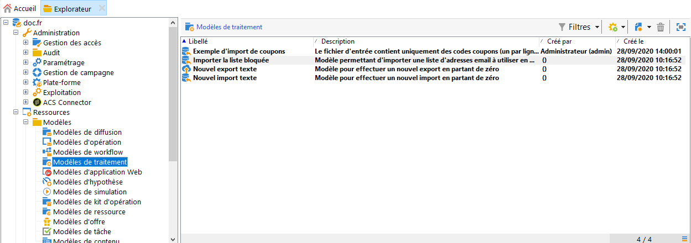

# Imports et exports génériques{#generic-imports-and-exports}

Adobe Campaign propose un module d&#39;export de données qui permet d&#39;extraire aisément, par exemple suite à une opération de ciblage, une liste de clients ou de prospects qui feront alors partie d&#39;une population cible.

Adobe Campaign propose également un module d&#39;import qui permet d&#39;alimenter la base en données à partir d&#39;un fichier externe.

>[!NOTE]
>
>Les exportations et les importations sont configurées dans des modèles dédiés exécutés par le biais de processus via les **[!UICONTROL Import]** et **[!UICONTROL Export]** activités. Ils peuvent être répétés automatiquement selon un calendrier, par exemple pour automatiser l’échange de données entre plusieurs systèmes d’information. Si nécessaire, vous pouvez créer une importation ou une exportation occasionnelle via le **[!UICONTROL Profiles and Targets > Jobs > Generic imports and exports]** noeud de l’arborescence Adobe Campaign.

Vous pouvez ainsi :

* Créer un modèle de d&#39;import ou d&#39;export et le paramétrer, voir ci-dessous.
* Créez une importation ou une exportation : voir [Exportation de données](../../platform/using/exporting-data.md) ou [Importation de données](../../platform/using/importing-data.md).
* Lancez l’importation ou l’exportation et surveillez son exécution. voir Suivi des [exécutions](#execution-tracking).

>[!CAUTION]
>
>L&#39;import de données dans Campaign doit être effectué par le biais des workflows afin de garantir la cohérence des données et d&#39;améliorer l&#39;efficacité. Voir à ce propos les sections [Importer des données](../../workflow/using/importing-data.md), [Bonnes pratiques d&#39;import](../../workflow/using/importing-data.md#best-practices-when-importing-data) et [Exemple de modèle d&#39;import](../../workflow/using/importing-data.md#setting-up-a-recurring-import).

## Créer un modèle de traitement {#creating-a-job-template}

Import and export templates are stored in the **[!UICONTROL Resources > Templates > Job templates]** directory of the Adobe Campaign tree.

Par défaut, ce répertoire contient trois modèles d’importation et un modèle d’exportation. Elles ne doivent pas être modifiées. Vous pouvez les dupliquer pour créer vos propres modèles ou créer un nouveau modèle via le **[!UICONTROL New > Import template]** / **[!UICONTROL Export template]** menu.

La procédure de création d’un modèle de processus est présentée dans [l’assistant](../../platform/using/exporting-data.md#export-wizard) d’exportation et l’assistant d’importation.

>[!NOTE]
>
>The native template **[!UICONTROL Import blacklist]** is already configured to import a list of blacklisted e-mail addresses.
> 
>Les **[!UICONTROL New text import]** modèles et **[!UICONTROL New text export]** les modèles vous permettent de configurer une importation ou une exportation à partir de zéro.

## Créer un import/export {#creating-a-new-import-export}

Une fois le modèle paramétré, les opérations d&#39;import et d&#39;export peuvent être lancés dans plusieurs contextes sous Adobe Campaign.

Ils permettent tous d&#39;ouvrir l&#39;assistant d&#39;[import](../../platform/using/importing-data.md) ou d&#39;[export](../../platform/using/exporting-data.md#export-wizard).

* In the **[!UICONTROL Profiles and targets]** section of Adobe Campaign workspace, click the **[!UICONTROL Jobs]** link: this takes you to the list of existing imports and exports.

   Click the **[!UICONTROL Create]** button and select the type of job you want to perform.

   

* Vous pouvez également lancer les imports et exports depuis la section Supervision de l&#39;espace de travail : deux liens dédiés vous permettent de démarrer directement l&#39;import ou l&#39;export.

   

* Les imports et exports peuvent aussi être lancés à partir de l&#39;explorateur Adobe Campaign.

   Pour exporter/importer des données, cliquez sur le **[!UICONTROL Profiles and Targets > Jobs > Generic imports and exports]** noeud, puis sur l’ **[!UICONTROL New]** icône, puis sélectionnez **[!UICONTROL Export]** ou **[!UICONTROL Import]**. L’assistant approprié s’ouvre.

   

## Tracking de l&#39;exécution {#execution-tracking}

Le tracking de l&#39;exécution est visualisable dans la section supérieure de cet éditeur. Vous pouvez fermer l&#39;assistant d&#39;export et visualiser l&#39;exécution du traitement depuis la liste des traitements d&#39;import/export.

* The **[!UICONTROL Log]** tab lets you look at log messages concerning execution.
* L’ **[!UICONTROL Rejects]** onglet contient les enregistrements rejetés. See [Behavior in the event of an error](../../platform/using/importing-data.md#behavior-in-the-event-of-an-error).

>[!NOTE]
>
>Import/export job statuses are presented in [Job statuses](../../platform/using/importing-data.md#job-statuses).

