# Exemples d&#39;import générique {#import-operations-samples}

## Import d&#39;une liste de destinataires {#example--import-from-a-list-of-recipients}

Pour créer et alimenter une liste de destinataires à partir de la vue d&#39;ensemble des listes, effectuez les étapes suivantes :

1. Création de la liste

   * Cliquez sur le lien **[!UICONTROL Listes]** dans le menu **[!UICONTROL Profils et cibles]** de la page d&#39;accueil d&#39;Adobe Campaign.
   * Cliquez sur le bouton **[!UICONTROL Créer]** puis **[!UICONTROL Importer une liste]**.

1. Sélection du fichier à importer

   Cliquez sur le dossier situé à droite du champ **[!UICONTROL Fichier local]** et sélectionnez le fichier contenant la liste à importer.

   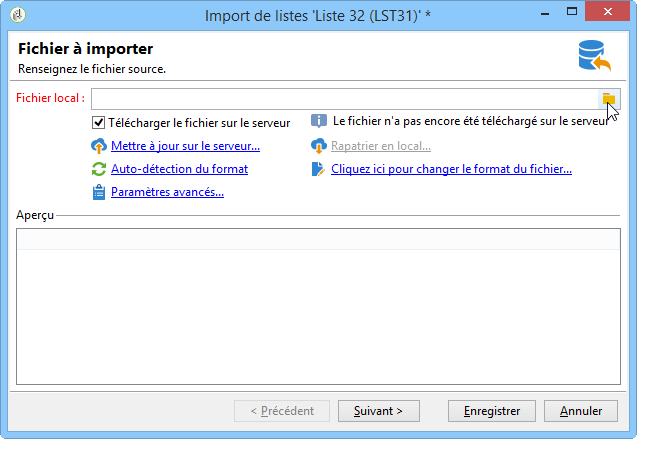

1. Nom et stockage de la liste

   Saisissez le nom de la liste et sélectionnez son répertoire d&#39;enregistrement.

   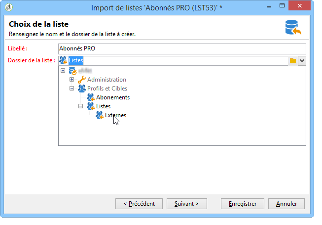

1. Lancement de l&#39;import

   Cliquez sur **[!UICONTROL Suivant]** puis **[!UICONTROL Démarrer]** pour lancer l&#39;import de la liste.

   

## Import de nouveaux enregistrements depuis un fichier texte {#example--import-new-records-from-a-text-file-}

Pour importer dans la base Adobe Campaign de nouveaux profils de destinataires stockés dans un fichier texte, effectuez les étapes suivantes :

1. Choix du modèle

   * A partir de la page d&#39;accueil d&#39;Adobe Campaign, cliquez sur le lien **[!UICONTROL Profils et cibles]** puis sur **[!UICONTROL Traitements]**. Au-dessus de la liste des traitements, cliquez sur **[!UICONTROL Nouvel import]**.
   * Conservez le modèle **[!UICONTROL Nouvel import texte]** sélectionné par défaut.
   * Modifiez le libellé et la description.
   * Sélectionnez **[!UICONTROL Import simple]**.
   * Conservez le dossier de traitement par défaut.
   * Cliquez sur **[!UICONTROL Paramètres avancés]** et sélectionnez l&#39;option **[!UICONTROL Mode tracking]** pour visualiser le détail de votre import durant l&#39;exécution.

1. Sélection du fichier à importer

   Cliquez sur le dossier situé à droite du champ **[!UICONTROL Fichier local]** et sélectionnez le fichier que souhaitez importer.

   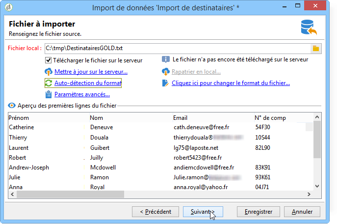

1. Association des champs

   Cliquez sur l&#39;icône **[!UICONTROL Deviner les champs destination]** pour effectuer automatiquement l&#39;association entre les schémas source et destination. Vérifiez les informations de cette fenêtre avant de cliquer sur **[!UICONTROL Suivant]**.

   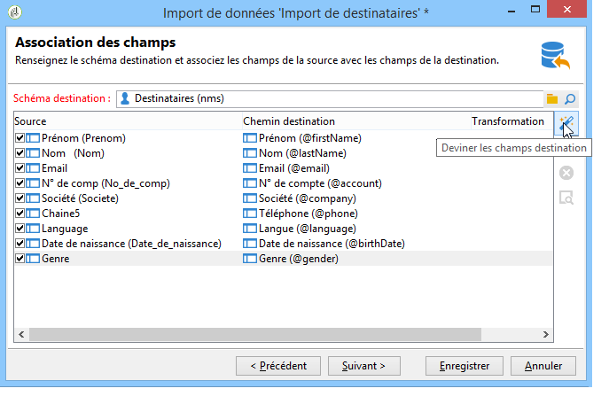

1. Réconciliation

   * Positionnez-vous au niveau de la table **Destinataires (nms:recipient)**.
   * Sélectionnez l&#39;opération **[!UICONTROL Insertion]** et laissez les autres champs par défaut.

     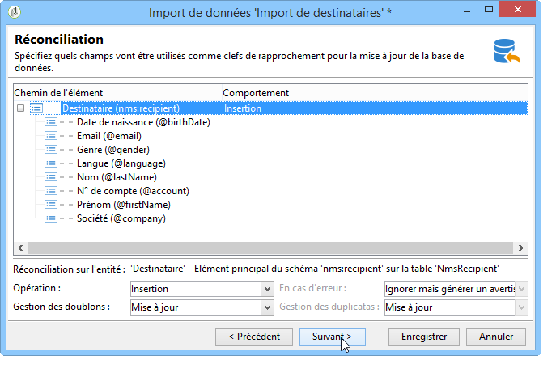

1. Import des destinataires

   * Au besoin, indiquez un dossier particulier où importer vos enregistrements.

     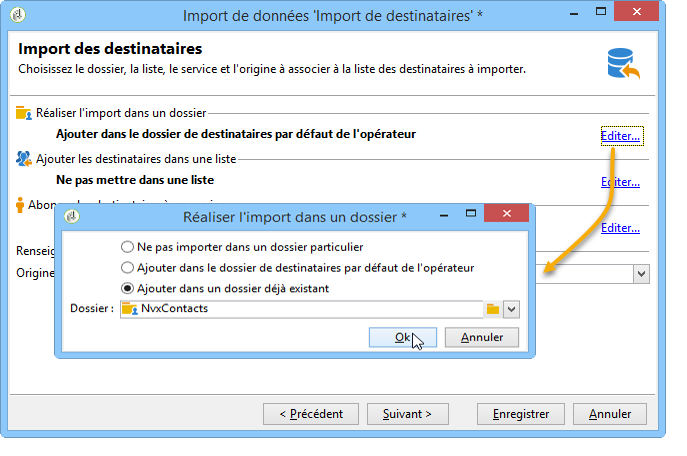

1. Lancement de l&#39;import

   * Cliquez sur **[!UICONTROL Démarrer]**.

     Dans la section centrale de l&#39;éditeur, vous pouvez vérifier que l&#39;opération d&#39;import s&#39;est bien déroulée et visualiser le nombre d&#39;enregistrements traités.

     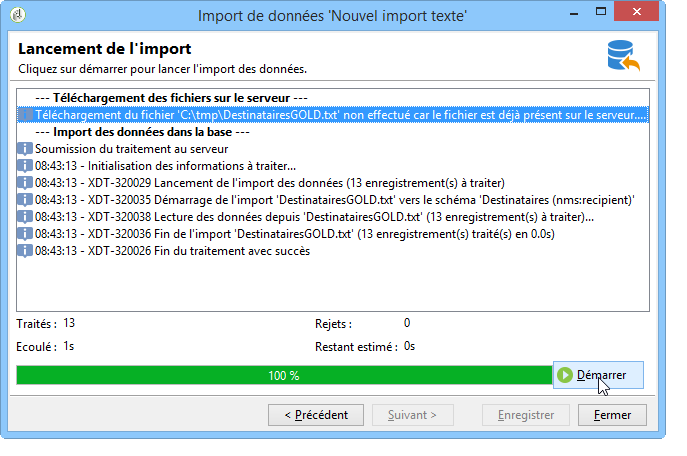

     Le mode **[!UICONTROL Tracking]** vous permet de suivre les détails de l&#39;import pour chacun des enregistrements du fichier source. Pour cela, à partir de la page d&#39;accueil, cliquez sur **[!UICONTROL Profils et Cibles]** puis **[!UICONTROL Traitements]**, sélectionnez cet import et consultez les onglets **[!UICONTROL Général]**, **[!UICONTROL Journal]** et **[!UICONTROL Rejets]**.

      * Consultation du déroulement de l&#39;import

        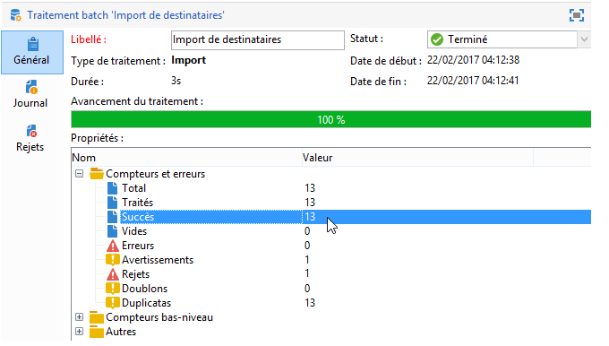

      * Consultation du traitement pour chaque enregistrement

        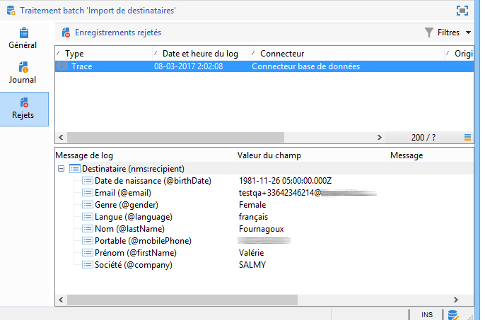

## Mise à jour et insertion de destinataires {#example--update-and-insert-recipients}

Vous souhaitez mettre à jour des enregistrements déjà existants dans la base et en créer de nouveaux à partir d&#39;un fichier texte. Voici un exemple de mise en œuvre :

1. Choix du modèle

   Reproduisez les mêmes étapes que l&#39;exemple 2 ci-avant.

1. Fichier à importer

   Sélectionnez le fichier que souhaitez importer.

   Dans notre exemple, l&#39;aperçu des premières lignes du fichier vous permet de constater que le fichier comporte des mises à jour pour trois enregistrements et la création d&#39;un enregistrement.

   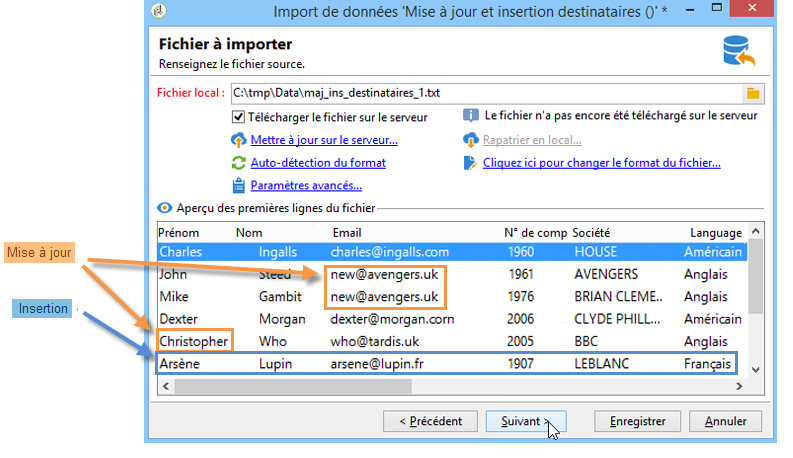

1. Association des champs

   Procédez comme dans l&#39;exemple 2 ci-avant.

1. Réconciliation

   * Conservez l&#39;opération **[!UICONTROL Mise à jour ou insertion]** sélectionnée par défaut.
   * Conservez l&#39;option **[!UICONTROL Gestions des duplicatas]** en mode **[!UICONTROL Mise à jour]**, pour que les enregistrements existants dans la base soient modifiés avec les données du fichier texte.
   * Sélectionnez les champs **[!UICONTROL Date de naissance]**, **[!UICONTROL Nom]** et **[!UICONTROL Société]** et attribuez-leur une clé de réconciliation.

     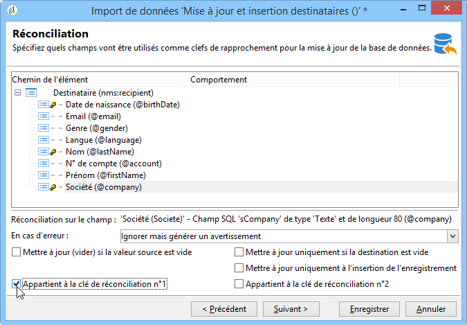

1. Lancement de l&#39;import

   * Cliquez sur **[!UICONTROL Démarrer]**.

     Dans la fenêtre de tracking, vous pouvez vérifier que l&#39;opération d&#39;import s&#39;est bien passée et le nombre d&#39;enregistrements qui ont été traités.

     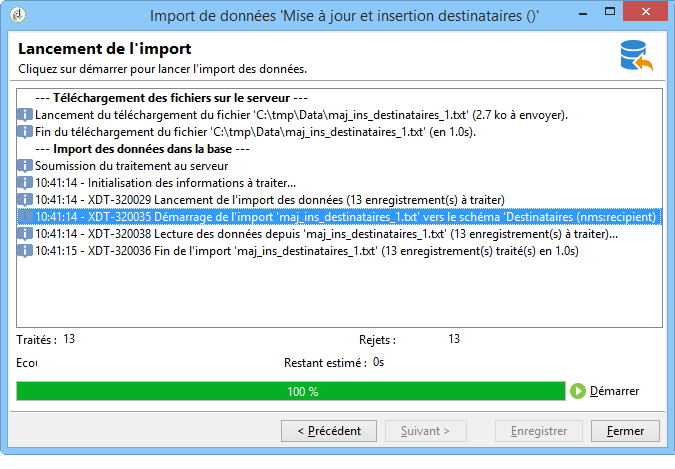

   * Vérifiez dans la table des destinataires que les enregistrements ont bien été modifiés par cette opération.

     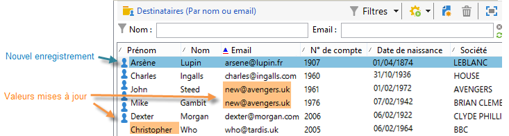

## Enrichissement des valeurs par celles d&#39;un fichier externe {#example--enrich-the-values-with-those-of-an-external-file}

Vous souhaitez modifier certains champs dans une table de la base de données depuis un fichier texte en privilégiant les valeurs contenues dans la base de données.

Dans cet exemple, vous noterez que certains champs de votre fichier texte ont une valeur alors que les champs correspondants dans la base de données sont vides. D&#39;autres champs contiennent une valeur différente de celle contenue dans la base de données.

* Contenu du fichier texte à importer

  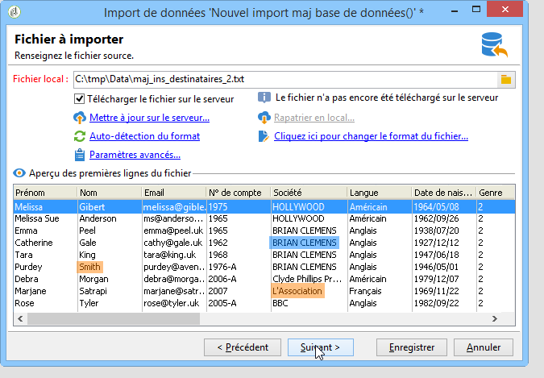

* Etat de la base de données avant import

  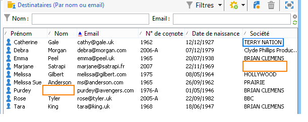

Les étapes sont les suivantes :

1. Choix du modèle

   Procédez comme dans l&#39;exemple 2 ci-avant.

1. Fichier à importer

   Sélectionnez le fichier que souhaitez importer.

1. Association des champs

   Procédez comme dans l&#39;exemple 2 ci-avant.

   Dans l&#39;aperçu des premières lignes du fichier, vous pouvez constater que le fichier comporte des mises à jour pour certains enregistrements.

1. Réconciliation

   * Positionnez-vous au niveau de la table et sélectionnez l&#39;opération **[!UICONTROL Mise à jour]**
   * Choisissez l&#39;option **[!UICONTROL Rejeter l&#39;entité]** pour le champ **[!UICONTROL Gestion des doublons]**.
   * Conservez l&#39;option **[!UICONTROL Gestions des duplicatas]** en mode **[!UICONTROL Mise à jour]**, pour que les enregistrements existants dans la base soient modifiés avec les données du fichier texte.
   * Positionnez-vous sur le noeud **[!UICONTROL Nom (@lastName)]** et sélectionnez l&#39;option **[!UICONTROL Mettre à jour uniquement si la destination est vide]**.
   * Recommencez l&#39;opération pour le noeud **[!UICONTROL Société (@company)]**.
   * Attribuez une clé de réconciliation aux champs **[!UICONTROL Date de naissance]**, **[!UICONTROL E-mail]** et **[!UICONTROL Prénom]**.

     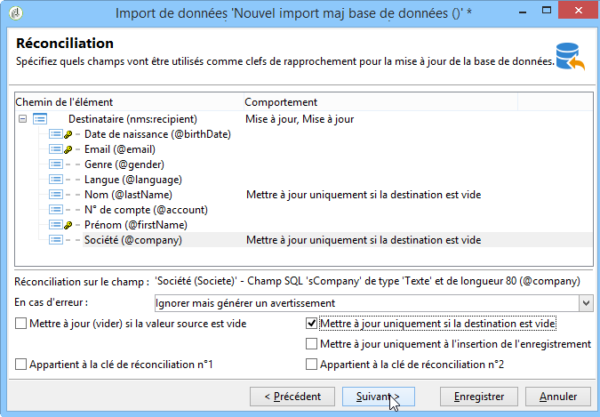

1. Lancement de l&#39;import

   Cliquez sur **[!UICONTROL Démarrer]**.

   Vérifiez dans la table des destinataires que les enregistrements ont bien été modifiés par l&#39;import.

   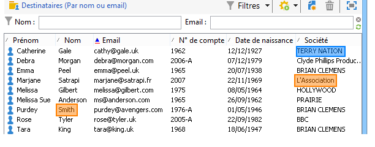

   Seules les valeurs qui étaient vides ont été remplacées par les valeurs du fichier texte. En revanche, la valeur déjà existante dans la base n&#39;a pas été écrasée par celle du fichier d&#39;import.

## Mise à jour et enrichissement des valeurs à partir de celles d&#39;un fichier externe {#example--update-and-enrich-the-values-from-those-in-an-external-file}

Vous souhaitez modifier certains champs dans une table de la base de données depuis un fichier texte et privilégier les valeurs contenues dans le fichier texte.

Dans cet exemple, vous noterez que certains champs de votre fichier texte ont une valeur vide alors que les champs correspondants dans la base de données ne le sont pas. D&#39;autres champs contiennent une valeur différente de celle contenue dans la base de données.

* Contenu du fichier texte à importer

  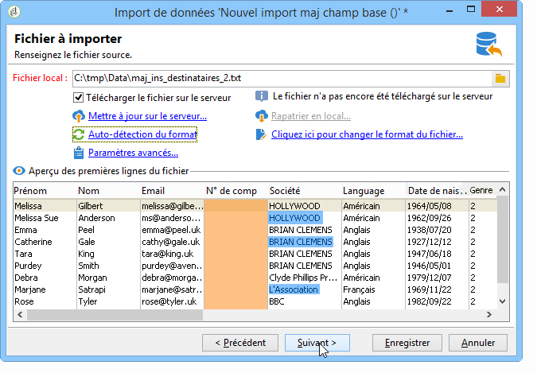

* Etat de la base de données avant import

  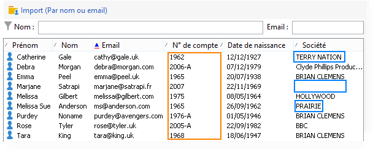

1. Choix du modèle

   Procédez comme dans l&#39;exemple 2 ci-avant.

1. Fichier à importer

   Sélectionnez le fichier que souhaitez importer.

   Dans l&#39;aperçu des premières lignes du fichier, vous pouvez constater que le fichier comporte des champs vides et des mises à jour pour certains enregistrements.

1. Association des champs

   Procédez comme dans l&#39;exemple 2 ci-avant.

1. Réconciliation

   * Positionnez-vous au niveau de la table et sélectionnez l&#39;opération **[!UICONTROL Mise à jour]**.
   * Choisissez l&#39;option **[!UICONTROL Rejeter l&#39;entité]** pour le champ **[!UICONTROL Gestion des doublons]**.
   * Laissez l&#39;option **[!UICONTROL Gestions des duplicatas]** en mode **[!UICONTROL Mise à jour]**, pour que les enregistrements existants dans la base soient modifiés avec les données du fichier texte.
   * Positionnez-vous sur le noeud **[!UICONTROL N° de compte (@account)]** et sélectionnez l&#39;option **[!UICONTROL Tenir compte des valeurs vides]**.
   * Sélectionnez les champs **[!UICONTROL Date de naissance]**, **[!UICONTROL E-mail]** et **[!UICONTROL Prénom]**, puis attribuez-leur une clé de réconciliation.

     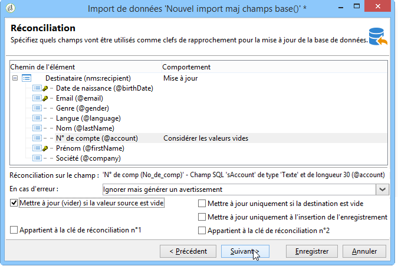

1. Lancement de l&#39;import

   * Cliquez sur **[!UICONTROL Démarrer]**.
   * Vérifiez dans la table des destinataires que les enregistrements ont bien été modifiés par l&#39;opération.

     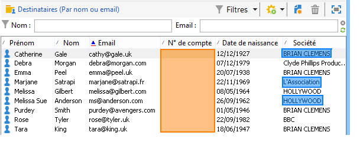

     Les valeurs du fichier texte qui étaient vides ont écrasées celles de la base. Les valeurs déjà existantes dans la base ont été mises à jour par celle du fichier d&#39;import, conformément à l&#39;option **[!UICONTROL Mise à jour]** sélectionnée pour les duplicatas à l&#39;étape 4.
