# Importer des données{#importing-data}

Adobe Campaign vous permet d&#39;importer des données dans la base à partir d&#39;un ou plusieurs fichiers au format texte, CSV, TAB ou XML. Ces fichiers sont associés à une table (principale ou liée) et chaque champ du ou des fichiers sources est associé à un champ de la base de données. Le paramétrage de l&#39;importation peut être enregistré afin d&#39;être réutilisé : vous pourrez ainsi planifier des tâches d&#39;import qui automatiseront les opérations de réplication.

>[!NOTE]
>
>You can import data without mapping it with the database data using the **[!UICONTROL Import a list]** function.
> 
>Les données peuvent alors être utilisées exclusivement dans les processus via l’ **[!UICONTROL Read list]** objet. Voir à ce propos [cette page](../../workflow/using/read-list.md).
>
>Pour plus d&#39;informations, regardez la vidéo [Importer des profils](https://docs.adobe.com/content/help/en/campaign-learn/campaign-classic-tutorials/getting-started/importing-profiles.html).

## Structure des données à importer {#structure-of-the-data-to-import}

Dans le fichier source, chaque ligne correspond à un enregistrement. Les données des enregistrements sont séparées les unes des autres par un délimiteur (espace, tabulation, caractère, etc.). Les données sont ainsi récupérées sous forme de colonnes et chaque colonne est associée à un champ de la base de données.

## L&#39;assistant d&#39;import {#import-wizard}

L&#39;assistant d&#39;import vous permet de paramétrer l&#39;import, d&#39;en définir les options (transformation des données, par exemple) puis d&#39;en lancer l&#39;exécution. Il se présente sous la forme d&#39;une suite d&#39;écrans dont le contenu dépend du type d&#39;import (simple ou multiple) et des droits dont dispose l&#39;opérateur.

>[!NOTE]
>
>Si vous utilisez un serveur web IIS, un paramétrage peut-être nécessaire afin d&#39;autoriser le téléchargement de gros fichiers (> 28 Mo).
>
>Voir à ce sujet [cette section](../../installation/using/integration-into-a-web-server-for-windows.md#changing-the-upload-file-size-limit).

### Etape 1 - Choix du modèle d&#39;import {#step-1---choosing-the-import-template}

Lorsque vous lancez l&#39;assistant d&#39;import, vous devez d&#39;abord sélectionner un modèle. A titre d&#39;exemple, pour configurer l&#39;import des destinataires qui ont reçu une newsletter, procédez comme suit :

1. Sélectionnez le **[!UICONTROL Profiles and Targets > Job > Generic imports and exports]** dossier.
1. Cliquez sur **Nouveau** puis sur **Import** pour créer le modèle d&#39;import.

   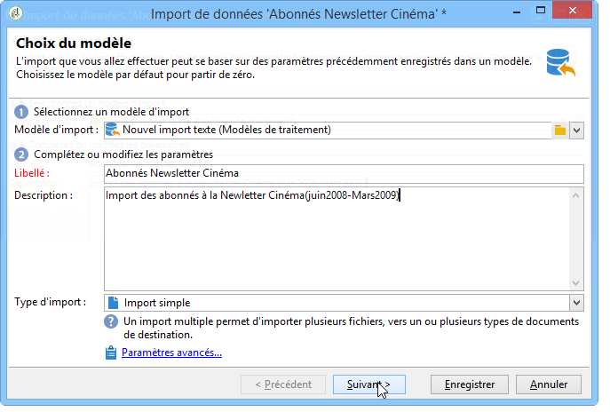

1. Click the arrow to the right of the **[!UICONTROL Import template]** field to select your template, or click **[!UICONTROL Select link]** to browse the tree.

   Le modèle natif est **[!UICONTROL New text import]**. Ce modèle ne doit pas être modifié, mais vous pouvez le dupliquer pour configurer un nouveau modèle en fonction de vos besoins. Par défaut, les modèles d’importation sont enregistrés dans le **[!UICONTROL Profiles and targets > Templates > Job templates]** noeud.

1. Entrez le nom de cette importation dans le **[!UICONTROL Label]** champ. Vous pouvez ajouter une description.
1. Sélectionnez le type d’importation dans le champ approprié. Il existe deux types d’importation possibles : **[!UICONTROL Simple import]** pour importer un seul fichier et **[!UICONTROL Multiple import]** pour importer plusieurs fichiers en une seule exécution.

   For a multiple import, select **[!UICONTROL Multiple import]** from the **[!UICONTROL Import type]** drop-down list in the first screen of the import wizard.

   

1. Specify the fields you want to import by clicking **[!UICONTROL Add]**.

   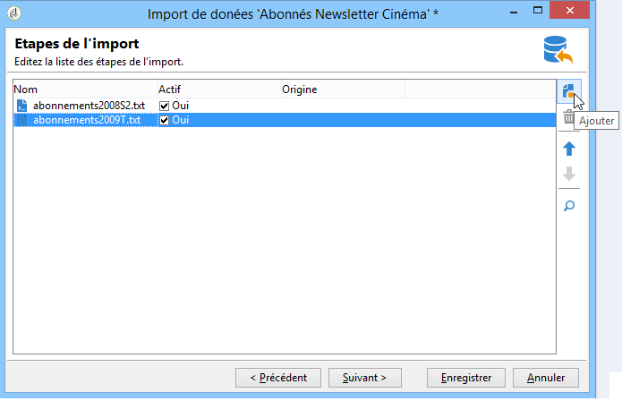

   Chaque fois qu’un fichier est ajouté, l’écran de l’ **[!UICONTROL File to import]** assistant s’affiche. Voir la section [Étape 2 - Sélection](#step-2---source-file-selection) du fichier source et suivez les étapes de l’assistant pour définir les options d’importation comme pour une importation simple.

   >[!NOTE]
   >
   >Les imports multiples ne doivent répondre qu&#39;à des besoins spécifiques et ne sont pas recommandés.

#### Paramètres avancés {#advanced-parameters}

The **[!UICONTROL Advanced parameters]** link lets you access the following options:

* **[!UICONTROL General]** tab

   * **[!UICONTROL Stop execution if there are too many rejects]**

      Cette option est sélectionnée par défaut. Vous pouvez la décocher si vous souhaitez continuer l&#39;exécution de l&#39;import, quel que soit le nombre de rejets. Par défaut, l&#39;exécution est stoppée si les 100 premières lignes sont rejetées.

   * **[!UICONTROL Trace mode]**

      Cochez cette option pour assurer un tracking de l&#39;exécution de l&#39;import, pour chaque ligne.

   * **[!UICONTROL Start the job in a detached process]**

      Cette option est sélectionnée par défaut. Elle permet de dissocier l&#39;exécution de l&#39;import afin de ne pas affecter d&#39;autres traitements en cours au même moment sur la base de données.

   * **[!UICONTROL Do not update enumerations]**

      Sélectionnez cette option pour éviter d’enrichir la liste des valeurs énumérées dans la base de données. Voir [Gestion des énumérations](../../platform/using/managing-enumerations.md).

* **[!UICONTROL Variables]** tab

   Vous pouvez définir des variables associées à la tâche qui seront accessibles dans les éditeurs de requête et les champs calculés. Pour créer une variable, cliquez sur **[!UICONTROL Add]** et utilisez l’éditeur de variables.

   >[!CAUTION]
   >
   >L&#39;onglet **[!UICONTROL Variables]** est réservé à des utilisations programmatiques de type Workflow et ne doit être paramétré que par des utilisateurs experts.

### Etape 2 - Choix du fichier source {#step-2---source-file-selection}

Le fichier source peut être au format texte (txt, csv, tab, colonnes fixes) ou xml.

Par défaut, **[!UICONTROL Upload file on the server]** est sélectionné. Cliquez sur le dossier à droite du **[!UICONTROL Local file]** champ pour parcourir le disque local et sélectionnez le fichier à importer. Vous pouvez désélectionner cette option pour saisir le chemin d’accès et le nom du fichier à importer s’il se trouve sur le serveur.

When the file has been specified, you can view its data in the lower section of the window by clicking **[!UICONTROL Auto-detect format]**. This preview displays the first 200 lines of the source file.

Utilisez les options proposées au-dessus de cette vue pour paramétrer l&#39;import. Les paramètres définis via ces options sont répercutés dans l&#39;aperçu. Les options disponibles sont les suivantes :

* **[!UICONTROL Click here to change the file format...]** vous permet de vérifier le format de fichier et d’affiner la configuration.
* **[!UICONTROL Update on server...]** vous permet de transférer le fichier local vers le serveur. Cette option n’est disponible que si **[!UICONTROL Upload file on the server]** elle est sélectionnée.
* **[!UICONTROL Download]** n’est disponible que si le fichier a été téléchargé sur le serveur.
* **[!UICONTROL Auto-detect format]** sert à réinitialiser le format de la source de données. Cette option vous permet de réappliquer les formats d’origine aux données qui ont été formatées via l’ **[!UICONTROL Click here to change the file format...]** option.
* Le **[!UICONTROL Advanced parameters]** lien vous permet de filtrer les données source et d’accéder aux options avancées. Dans cet écran, vous pouvez choisir d’importer uniquement une partie du fichier. Vous pouvez également définir un filtre, par exemple pour importer uniquement les utilisateurs de type &quot;Prospect&quot; ou &quot;Client&quot;, en fonction de la valeur de la ligne correspondante. Ces options ne doivent être utilisées que par des utilisateurs JavaScript experts.

#### Modifier le format du fichier {#changing-the-file-format}

L’ **[!UICONTROL Click here to change the file format...]** option vous permet de formater les données du fichier source, notamment pour spécifier le séparateur de colonne et le type de données pour chaque champ. Cette configuration est effectuée via la fenêtre suivante :

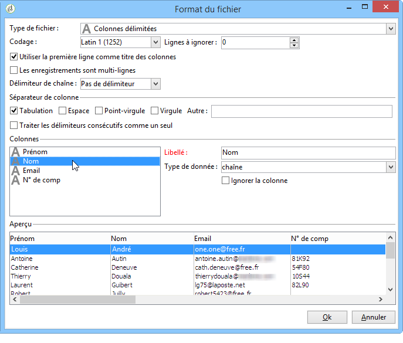

Cette étape permet de décrire comment doivent être lues les valeurs des champs du fichier. Par exemple, dans le cas d&#39;une date, vous pouvez associer le type de données Date ou Date+Heure à un format (jj/mm/aaaa, mm/jj/aa, etc.). Si la donnée en entrée ne correspond pas au format attendu, des rejets auront lieu lors de l&#39;import.

Vous pouvez visualiser le résultat du paramétrage dans la zone d&#39;aperçu située dans la section inférieure de la fenêtre.

Click **[!UICONTROL OK]** to save the formatting, then click **[!UICONTROL Next]** to display the next step.

### Etape 3 - Association des champs {#step-3---field-mapping}

Vous devez ensuite choisir le schéma de destination et associer les données de chaque colonne à des champs de la base de données.

* Le **[!UICONTROL Destination schema]** champ vous permet de sélectionner le schéma dans lequel les données seront importées. Cette information est obligatoire. Cliquez sur l’ **[!UICONTROL Select link]** icône pour sélectionner l’un des schémas existants. Cliquez sur **[!UICONTROL Edit link]** pour afficher le contenu du tableau sélectionné.
* Le tableau central reprend tous les champs définis dans le fichier source. Sélectionnez les champs à importer afin de leur associer un champ de destination. Ces champs peuvent être associés manuellement ou automatiquement.

   Pour mapper manuellement un champ, cochez la case pour sélectionner le champ source, puis cliquez sur la deuxième colonne pour activer la cellule correspondant au champ sélectionné. Cliquez ensuite sur l’ **[!UICONTROL Edit expression]** icône pour afficher tous les champs du tableau actuel. Sélectionnez le champ de destination et cliquez sur **[!UICONTROL OK]** pour valider le mappage.

   Pour associer automatiquement les champs source et de destination, cliquez sur l’ **[!UICONTROL Guess the destination fields]** icône à droite de la liste des champs. Les champs proposés peuvent être modifiés si nécessaire.

   >[!CAUTION]
   >
   >Le résultat de cette opération doit toujours être validé avant de passer à l&#39;étape suivante.

* Vous pouvez appliquer une transformation aux champs importés. Pour ce faire, cliquez dans la cellule de la **[!UICONTROL Transformation]** colonne qui se rapporte au champ concerné, puis sélectionnez la transformation à appliquer.

   

   >[!CAUTION]
   >
   >La transformation est appliquée au moment de l&#39;importation. Toutefois, si des contraintes ont été définies sur les champs de destination (dans l&#39;exemple ci-dessus, sur le champ @lastname), ces dernières sont prioritaires.

* Vous pouvez ajouter des champs calculés depuis l&#39;icône correspondante située à droite du tableau central. Les champs calculés permettent d&#39;effectuer des transformations complexes, d&#39;ajouter des colonnes virtuelles ou des fusionner les données de plusieurs colonnes. Reportez-vous aux paragraphes ci-dessous qui détaillent les différentes possibilités.

#### Les champs calculés {#calculated-fields}

Les champs calculés sont de nouvelles colonnes ajoutées au fichier source et calculées à partir d&#39;autres colonnes. Les champs calculés peuvent ensuite être associés à des champs de la base de données Adobe Campaign. Toutefois, les opérations de réconciliation ne sont pas possibles sur des champs calculés.

Quatre types de champ calculé sont proposés :

* **[!UICONTROL Fixed string]**: la valeur du champ calculé est la même pour toutes les lignes du fichier source. Permet de définir la valeur d’un champ des enregistrements insérés ou mis à jour. Par exemple, vous pouvez définir un marqueur sur &quot;yes&quot; pour tous les enregistrements importés.
* **[!UICONTROL String with JavaScript tags]**: la valeur du champ calculé est une chaîne de caractères contenant des commandes JavaScript.
* **[!UICONTROL JavaScript expression]**: la valeur du champ calculé est le résultat de l’évaluation d’une fonction JavaScript. La valeur renvoyée peut être un nombre, une date, etc.
* **[!UICONTROL Enumeration]**: la valeur du champ est attribuée selon une valeur contenue dans le fichier source. L’éditeur vous permet de spécifier la colonne source et de saisir la liste des valeurs d’énumération, comme dans l’exemple suivant :

   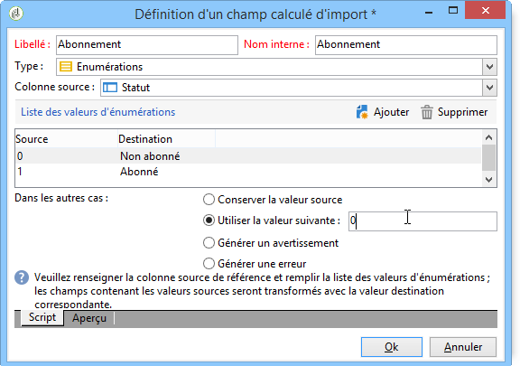

   L’ **[!UICONTROL Preview]** onglet permet d’afficher le résultat de la configuration définie. Ici, la **[!UICONTROL Subscription]** colonne a été ajoutée. La valeur est calculée à partir du champ **État** .

   

### Etape 4 - Réconciliation {#step-4---reconciliation}

L&#39;étape de réconciliation de l&#39;assistant d&#39;import permet de définir le mode de rapprochement des données issues du fichier avec les informations existantes dans la base de données, ainsi que de fixer les règles de priorité entre les données du fichier et celles de la base de données. La fenêtre de configuration se présente comme suit :

La section centrale de l&#39;écran présente, de manière arborescente les champs et les tables de la base de données Adobe Campaign vers lesquels des données seront importées.

Des options spéciales sont disponibles pour chaque noeud (tableau ou champ). Lorsque vous cliquez sur le noeud concerné dans la liste, ses paramètres et une brève description apparaissent ci-dessous. Le comportement défini pour chaque élément est affiché dans la **[!UICONTROL Behavior]** colonne correspondante.

#### Types d&#39;opérations {#types-of-operation}

Pour chaque table concernée par l&#39;import, vous devez définir le type d&#39;opération. Les opérations disponibles pour l&#39;élément principal de la base de données sont les suivantes :

* **[!UICONTROL Update or insertion]**: met à jour l’enregistrement s’il existe dans la base de données et le crée dans le cas contraire.
* **[!UICONTROL Insertion]** : insère les enregistrements dans la base.
* **[!UICONTROL Update]**: met à jour uniquement les enregistrements existants (ignore les autres enregistrements).
* **[!UICONTROL Reconciliation only]**: recherche l’enregistrement dans la base de données, mais n’effectue aucune mise à jour. Vous permet, par exemple, d’associer le dossier des destinataires à importer selon une colonne du fichier sans mettre à jour les données des dossiers.
* **[!UICONTROL Deletion]**: permet de détruire les enregistrements de la base de données.

Les options disponibles pour chaque champ de la table concernée par l&#39;import sont les suivantes :

* **[!UICONTROL Update (empty) if source value is empty]**: en cas de mise à jour, la valeur du champ supprime la valeur de base de données si le champ est vide dans le fichier source. Sinon, le champ de base de données est conservé.
* **[!UICONTROL Update only if destination is empty]**: la valeur du fichier source ne remplace pas la valeur du champ de base de données, sauf si le champ de base de données est vide. Dans ce cas, il prend la valeur du fichier source.
* **[!UICONTROL Update the field only when the record is inserted]**: lors d’une opération de mise à jour ou d’insertion, seuls les enregistrements de fichier source nouveaux seront importés.

>[!NOTE]
>
>Dans tous les cas, la définition d&#39;une clé de réconciliation est **obligatoire**, sauf en cas d&#39;insertion sans dédoublonnage.

#### Les clés de réconciliation {#reconciliation-keys}

Il est nécessaire de renseigner au moins une clé de réconciliation pour gérer le dédoublonnage.

Une clé de réconciliation est un ensemble de champs permettant d&#39;identifier un enregistrement. Par exemple pour un import de destinataires, la clé de réconciliation peut être le numéro de compte, le champ &quot;Email&quot; ou encore les champs &quot;Nom, Prénom, Société&quot;, etc.

Dans ce cas, pour savoir si une ligne du fichier correspond à un destinataire existant dans la base de données, le moteur d&#39;import compare les valeurs du fichier avec celles de la base de données pour tous les champs de la clé. Plus les champs sont spécifiques à un enregistrement, plus la comparaison entre les données source et destination pourra être fine et garantir l&#39;intégrité des données après l&#39;import. Il est possible de renseigner une seconde clé de réconciliation pour une même table : elle sera utilisée pour les lignes dont la première clé est vide.

Il convient aussi de ne pas choisir un champ qui risque d&#39;être modifié lors de l&#39;import, auquel cas, le moteur risque de créer des enregistrements supplémentaires.

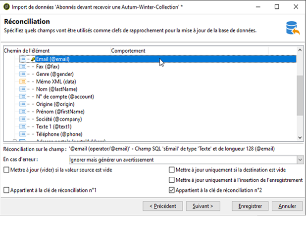

>[!NOTE]
>
>Pour une importation de destinataire, l’identifiant du dossier sélectionné est implicitement ajouté à la clé.
>
>Le rapprochement est donc effectué uniquement sur ce dossier (sauf si aucun dossier n’est sélectionné).

#### Déduplication {#deduplication}

>[!NOTE]
>
>Un doublon est un élément qui est présent au moins deux fois dans le fichier à importer.
>
>Un duplicata est un élément qui est présent à la fois dans le fichier à importer et dans la base.

Le **[!UICONTROL Management of doubles]** champ permet de configurer la déduplication des données. La déduplication concerne les enregistrements qui apparaissent plusieurs fois **dans le fichier** source (ou les fichiers source en cas d’importation de plusieurs fichiers), c’est-à-dire les lignes pour lesquelles les champs de la clé de rapprochement sont identiques.

* La gestion des doublons en **[!UICONTROL Update]** mode (mode par défaut) n’effectue pas la déduplication. Le dernier enregistrement a donc priorité (car il met à jour les données des enregistrements précédents). Le comptage des doublons n’est pas effectué dans ce mode.
* La gestion des doublons en **[!UICONTROL Ignore]** mode ou **[!UICONTROL Reject entity]** exclut les doublons de l’importation. Dans ce cas, aucun enregistrement n’est importé.
* In **[!UICONTROL Reject entity]** mode, the element is not imported, and an error is generated in the import logs.
* En **[!UICONTROL Ignore]** mode, l’élément n’est pas importé, mais aucune trace de l’erreur n’est conservée. Ce mode vous permet d’optimiser les performances.

>[!CAUTION]
>
>Le dédoublonnage est effectué uniquement en mémoire. Par conséquent, la taille d&#39;un import avec dédoublonnage est limitée. La limite dépend de plusieurs paramètres (capacité du serveur applicatif, activité, nombre de champs dans la clé, etc.). L&#39;ordre de grandeur de la taille maximale pour un dédoublonnage est 1 000 000 de lignes.

La déduplication concerne un enregistrement présent à la fois dans le fichier source et dans la base de données. Il concerne les opérations avec mise à jour uniquement (c.-à-d. **[!UICONTROL Update and insertion]** ou **[!UICONTROL Update]**). L’ **[!UICONTROL Duplicate management]** option vous permet de mettre à jour ou d’ignorer l’enregistrement s’il se trouve à la fois dans le fichier source et dans la base de données. Cette **[!UICONTROL Update or insert based on origin]** option appartient au module facultatif et ne peut pas être utilisée dans un contexte standard.

The options **[!UICONTROL Reject]** and **[!UICONTROL Ignore]** operate as presented above.

#### Comportement en cas d&#39;erreur {#behavior-in-the-event-of-an-error}

La plupart des opérations de transfert de données génèrent des erreurs qui peuvent être de différentes natures (format de ligne incohérent, email invalide, etc.). Toutes les erreurs et tous les avertissements générés par le moteur d&#39;import sont stockés et attachés à l&#39;instance d&#39;import.

Details of these rejects can be viewed via the **[!UICONTROL Rejects]** tab.

There are two types of rejects (the type is displayed in the **[!UICONTROL Connector]** column):

* Les rejets du connecteur texte concernent les erreurs lors du traitement de la ligne du fichier (champ calculé, analyse de données, etc.). Ainsi, en cas d’erreur, c’est toujours la ligne entière qui est rejetée.
* Les rejets du connecteur base de données concernent les erreurs ayant lieu lors de la réconciliation des données ou de l’écriture dans la base. Dans le cas d’un import sur plusieurs tables, le rejet peut ne concerner qu’une portion de l’enregistrement (par exemple pour un import de destinataires et d’événements associés, une erreur peut empêcher la mise à jour d’un événement sans pour autant rejeter le destinataire).

Dans la page de réconciliation des données, il est possible de définir champ par champ, et table par table, le type de gestion d&#39;erreur souhaité.

* **[!UICONTROL Ignore and log a warning]**: tous les champs sont importés dans la base de données, à l’exception de celui qui a généré une erreur.
* **[!UICONTROL Reject parent element]**: la ligne entière de l’enregistrement est rejetée, pas seulement le champ qui a provoqué une erreur.
* **[!UICONTROL Reject all elements]**: l’importation s’arrête et tous les éléments de l’enregistrement sont rejetés.

   

L&#39;arborescence dans l&#39;écran des rejets d&#39;une instance d&#39;import indique quels champs ont été rejetés et où les erreurs se sont produites.

You can generate a file containing these records via the **[!UICONTROL Export rejects]** icon:

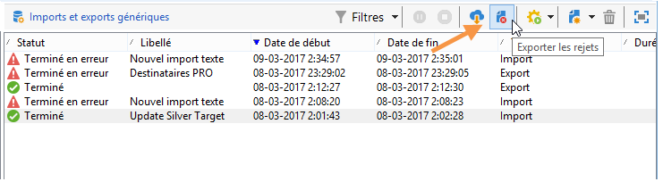

### Etape 5 - Etape supplémentaire lors de l&#39;import de destinataires {#step-5---additional-step-when-importing-recipients}

L&#39;étape suivante de l&#39;assistant d&#39;import permet de choisir ou créer le dossier dans lequel les données seront importées, d&#39;associer automatiquement les destinataires importés à une liste (existante ou nouvelle) et de les abonner à un service.

>[!NOTE]
>
>Cette étape n&#39;est proposée que dans le cas d&#39;un import de destinataires et si vous utilisez la table des destinataires Adobe Campaign par défaut (**nms:recipient**).

* Click the **[!UICONTROL Edit]** links to select the folder, the list, or the service to which you want to associate or subscribe the recipients.

   1. Importer dans un dossier

      Le **[!UICONTROL Edit...]** lien de la **[!UICONTROL Import into a folder]** section vous permet de sélectionner ou de créer le dossier dans lequel les destinataires seront importés. Par défaut, si aucune partition n’est définie, les données sont importées dans le dossier par défaut de l’opérateur.

      >[!NOTE]
      >
      >Le dossier par défaut d’un opérateur est le premier dossier pour lequel l’opérateur dispose d’un accès en écriture. Voir Gestion des [accès aux](../../platform/using/access-management.md#folder-access-management)dossiers.

      Pour sélectionner le dossier d’importation, cliquez sur la flèche à droite du **[!UICONTROL Folder]** champ et sélectionnez le dossier concerné. Vous pouvez également utiliser l’ **[!UICONTROL Select link]** icône pour afficher l’arborescence dans une nouvelle fenêtre ou créer un dossier.

      

      To create a new folder, select the node from which you want to add a folder, and right-click. Select **[!UICONTROL Create a new 'Recipients' folder]**.

      

      Le dossier est ajouté en sous-arborescence du noeud courant. Saisissez le nom de ce nouveau dossier, tapez sur la touche Entrée pour valider et cliquez sur **[!UICONTROL OK]**.

      

   1. Associer à une liste

      The **[!UICONTROL Edit...]** link in the **[!UICONTROL Add recipients to a list]** section lets you select or create a list into which the recipients will be imported.

      

      Vous pouvez créer une nouvelle liste pour ces destinataires en cliquant sur **[!UICONTROL Select link]**, puis **[!UICONTROL Create]**. La création et la gestion des listes sont présentées dans [Création et gestion des listes](../../platform/using/creating-and-managing-lists.md).

      

      Vous pouvez choisir d&#39;ajouter les destinataires à ceux déjà présents dans une liste existante ou de recréer la liste avec les nouveaux destinataires. Dans ce cas, si la liste contenait déjà des destinataires, ils seront supprimés, et remplacés par les destinataires importés.

   1. Abonner à un service

      Pour abonner tous les destinataires importés à un service d’informations, cliquez sur le **[!UICONTROL Edit...]** lien de la **[!UICONTROL Subscribe recipients to a service]** section afin de sélectionner ou de créer le service d’informations auquel les destinataires seront abonnés. Vous pouvez sélectionner l’ **[!UICONTROL Send a confirmation message]** option : Le contenu de ce message est défini dans le modèle de remise associé au service d’abonnement.

      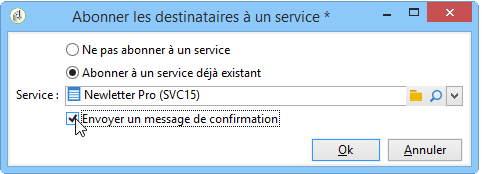

      Vous pouvez créer un nouveau service pour ces destinataires en cliquant sur **[!UICONTROL Select link]** puis sur l’icône **[!UICONTROL Create]** . La gestion des services d&#39;information est présentée dans [cette section](../../delivery/using/managing-subscriptions.md).

* Utilisez le **[!UICONTROL Origin]** champ pour ajouter des informations sur l’origine des destinataires à leurs profils. Ces informations sont particulièrement utiles dans le cadre d&#39;une importation multiple.

Click **[!UICONTROL Next]** to validate this step and display the following step.

### Etape 6 - Lancement de l&#39;import {#step-6---launching-the-import}

La dernière étape de l’assistant vous permet de lancer l’importation de données. To do this, click the **[!UICONTROL Start]** button.

### Les états des traitements {#job-statuses}

L&#39;état d&#39;un traitement indique son statut courant. A chaque état correspond une icône et un libellé spécifique. Ces informations sont affichées dans la liste des traitements. Les états et leur icône associée sont les suivants :

* **Edition en cours**

   Traitement en cours de création.

* **En cours d&#39;exécution**

   Traitement en cours d&#39;exécution.

* **Annuler**

   Click the **[!UICONTROL Cancel]** button: the job in progress is cancelled.

* **Annulation en cours**

   La commande d&#39;annulation a été prise en compte et le traitement est en cours d&#39;annulation.

* **Pause en cours**

   Clic sur le bouton **[!UICONTROL Pause]** : la suspension du traitement est en cours.

* **En pause**

   Click **[!UICONTROL Pause]**: the job is suspended. Vous pouvez le redémarrer en cliquant sur **[!UICONTROL Start]**.

* **Terminé**

   Exécution du traitement terminée.

* **Terminé en erreur**

   Le traitement n&#39;a pas été exécuté à cause d&#39;une erreur technique.

* **Arrêt du serveur en cours**

   Le traitement en cours est interrompu à cause d&#39;un arrêt du serveur Adobe Campaign.

## Exemples d&#39;import générique {#generic-import-samples}

### Exemple : import d&#39;une liste de destinataires {#example--import-from-a-list-of-recipients}

Pour créer et alimenter une liste de destinataires à partir de la vue d&#39;ensemble des listes, effectuez les étapes suivantes :

1. Création de la liste

   * Cliquez sur le **[!UICONTROL Lists]** lien dans le **[!UICONTROL Profiles and targets]** menu de la page d’accueil d’Adobe Campaign.
   * Cliquez sur le bouton **[!UICONTROL Create]** , puis sur le **[!UICONTROL Import a list]** .

1. Sélection du fichier à importer

   Click the folder to the right of the **[!UICONTROL Local file]** field and select the file containing the list to import.

   

1. Nom et stockage de la liste

   Saisissez le nom de la liste et sélectionnez son répertoire d&#39;enregistrement.

   

1. Lancement de l&#39;import

   Click **[!UICONTROL Next]** and then **[!UICONTROL Start]** to start importing the list.

   

### Exemple : import de nouveaux enregistrements depuis un fichier texte {#example--import-new-records-from-a-text-file-}

Pour importer dans la base Adobe Campaign de nouveaux profils de destinataires stockés dans un fichier texte, effectuez les étapes suivantes :

1. Choix du modèle

   * Dans la page d’accueil d’Adobe Campaign, cliquez sur le **[!UICONTROL Profiles and targets]** lien, puis **[!UICONTROL Jobs]**. Au-dessus de la liste des tâches, cliquez sur **[!UICONTROL New import]**.
   * Conservez le **[!UICONTROL New text import]** modèle sélectionné par défaut.
   * Modifiez le libellé et la description.
   * Sélectionner **[!UICONTROL Simple import]**.
   * Conservez le dossier de traitement par défaut.
   * Click **[!UICONTROL Advanced parameters]** and select the **[!UICONTROL Tracking mode]** option to view the details of your import during execution.

1. Sélection du fichier à importer

   Click the folder to the right of the **[!UICONTROL Local file]** field and select the file you want to import.

   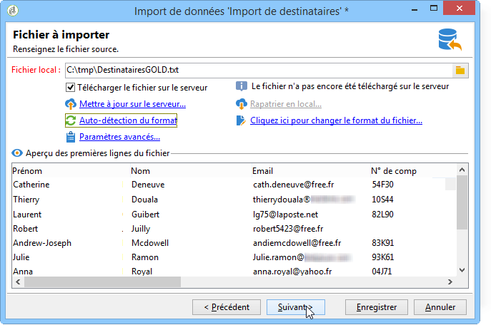

1. Association des champs

   Cliquez sur l’ **[!UICONTROL Guess the destination fields]** icône pour mapper automatiquement les schémas source et cible. Vérifiez les informations dans cette fenêtre avant de cliquer **[!UICONTROL Next]**.

   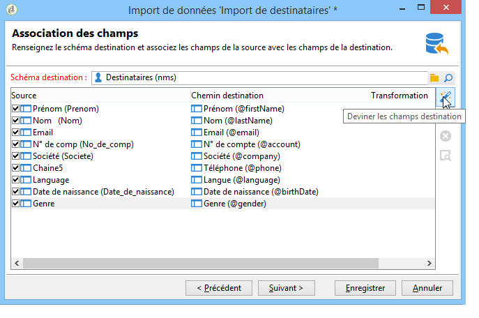

1. Réconciliation

   * Positionnez-vous au niveau de la table **Destinataires (nms:recipient)**.
   * Sélectionnez l&#39;opération **[!UICONTROL Insertion]** et laissez les autres champs par défaut.

      

1. Import des destinataires

   * Au besoin, indiquez un dossier particulier où importer vos enregistrements.

      

1. Lancement de l&#39;import

   * Clics **[!UICONTROL Start]**.

      Dans la section centrale de l&#39;éditeur, vous pouvez vérifier que l&#39;opération d&#39;import s&#39;est bien déroulée et visualiser le nombre d&#39;enregistrements traités.

      

      Le **[!UICONTROL Tracking]** mode permet de suivre les détails de l’importation pour chaque enregistrement dans le fichier source. Pour ce faire, dans la page d’accueil, cliquez **[!UICONTROL Profiles and Targets]** puis **[!UICONTROL Processes]**, sélectionnez l’importation appropriée, puis recherchez les **[!UICONTROL General]**, **[!UICONTROL Journal]** et **[!UICONTROL Rejects]** onglets.

      * Consultation du déroulement de l&#39;import

         

      * Consultation du traitement pour chaque enregistrement

         

### Exemple : mise à jour et insertion de destinataires {#example--update-and-insert-recipients}

Vous souhaitez mettre à jour des enregistrements déjà existants dans la base et en créer de nouveaux à partir d&#39;un fichier texte. Voici un exemple de mise en œuvre :

1. Choix du modèle

   Reproduisez les mêmes étapes que l&#39;exemple 2 ci-avant.

1. Fichier à importer

   Sélectionnez le fichier que souhaitez importer.

   Dans notre exemple, l&#39;aperçu des premières lignes du fichier vous permet de constater que le fichier comporte des mises à jour pour trois enregistrements et la création d&#39;un enregistrement.

   

1. Association des champs

   Procédez comme dans l&#39;exemple 2 ci-avant.

1. Réconciliation

   * Restez **[!UICONTROL Update or insert]** sélectionné par défaut.
   * Keep the option **[!UICONTROL Management of duplicates]** in **[!UICONTROL Update]** mode so that existing records in the database will be modified with data from the text file.
   * Sélectionnez les champs **[!UICONTROL Birth date]**, **[!UICONTROL Name]** et **[!UICONTROL Company]** affectez-leur une clé de rapprochement.

      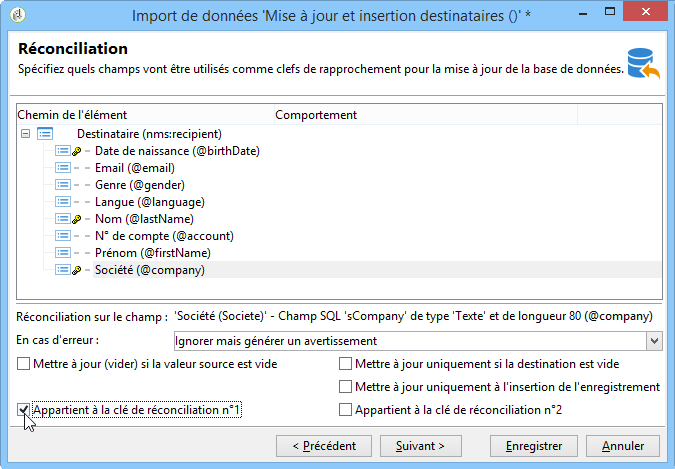

1. Lancement de l&#39;import

   * Clics **[!UICONTROL Start]**.

      Dans la fenêtre de tracking, vous pouvez vérifier que l&#39;opération d&#39;import s&#39;est bien passée et le nombre d&#39;enregistrements qui ont été traités.

      

   * Vérifiez dans la table des destinataires que les enregistrements ont bien été modifiés par cette opération.

      

### Exemple : enrichir les valeurs par celles d&#39;un fichier externe {#example--enrich-the-values-with-those-of-an-external-file}

Vous souhaitez modifier certains champs dans une table de la base de données depuis un fichier texte en privilégiant les valeurs contenues dans la base de données.

Dans cet exemple, vous noterez que certains champs de votre fichier texte ont une valeur alors que les champs correspondants dans la base de données sont vides. D&#39;autres champs contiennent une valeur différente de celle contenue dans la base de données.

* Contenu du fichier texte à importer

   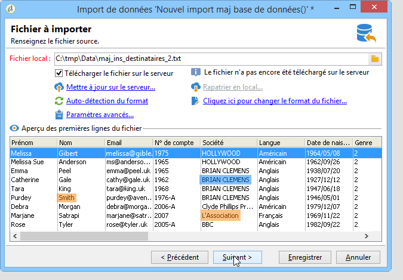

* Etat de la base de données avant import

   

Les étapes sont les suivantes :

1. Choix du modèle

   Procédez comme dans l&#39;exemple 2 ci-avant.

1. Fichier à importer

   Sélectionnez le fichier que souhaitez importer.

1. Association des champs

   Procédez comme dans l&#39;exemple 2 ci-avant.

   Dans l&#39;aperçu des premières lignes du fichier, vous pouvez constater que le fichier comporte des mises à jour pour certains enregistrements.

1. Réconciliation

   * Go to the table and select the **[!UICONTROL Update]** operation.
   * Sélectionnez l’option **[!UICONTROL Reject entity]** du **[!UICONTROL Management of doubles]** champ.
   * Keep the option **[!UICONTROL Management of duplicates]** in **[!UICONTROL Update]** mode so that existing records in the database will be modified with data from the text file.
   * Placez le curseur sur le **[!UICONTROL Last name (@lastName)]** noeud et sélectionnez l’ **[!UICONTROL Update only if destination is empty]** option.
   * Répétez cette opération pour le **[!UICONTROL Company (@company)]** noeud.
   * Affectez une clé de rapprochement aux champs **[!UICONTROL Birth date]**, **[!UICONTROL E-mail]** et **[!UICONTROL First name]**.

      

1. Lancement de l&#39;import

   Clics **[!UICONTROL Start]**.

   Vérifiez dans la table des destinataires que les enregistrements ont bien été modifiés par l&#39;import.

   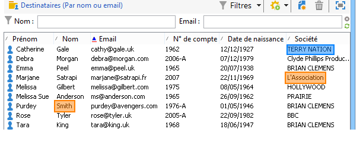

   Seules les valeurs qui étaient vides ont été remplacées par les valeurs du fichier texte. En revanche, la valeur déjà existante dans la base n&#39;a pas été écrasée par celle du fichier d&#39;import.

### Exemple : mettre à jour et enrichir les valeurs à partir de celles d&#39;un fichier externe {#example--update-and-enrich-the-values-from-those-in-an-external-file}

Vous souhaitez modifier certains champs dans une table de la base de données depuis un fichier texte et privilégier les valeurs contenues dans le fichier texte.

Dans cet exemple, vous noterez que certains champs de votre fichier texte ont une valeur vide alors que les champs correspondants dans la base de données ne le sont pas. D&#39;autres champs contiennent une valeur différente de celle contenue dans la base de données.

* Contenu du fichier texte à importer

   

* Etat de la base de données avant import

   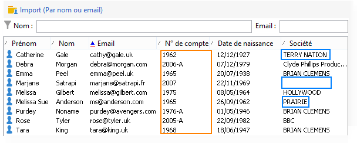

1. Choix du modèle

   Procédez comme dans l&#39;exemple 2 ci-avant.

1. Fichier à importer

   Sélectionnez le fichier que souhaitez importer.

   Dans l&#39;aperçu des premières lignes du fichier, vous pouvez constater que le fichier comporte des champs vides et des mises à jour pour certains enregistrements.

1. Association des champs

   Procédez comme dans l&#39;exemple 2 ci-avant.

1. Réconciliation

   * Go to the table and select **[!UICONTROL Update]**.
   * Sélectionnez l’option **[!UICONTROL Reject entity]** du **[!UICONTROL Management of doubles]** champ.
   * Leave the option **[!UICONTROL Management of duplicates]** in **[!UICONTROL Update]** mode for existing records in the database to be modified with data from the text file.
   * Placez le curseur sur le **[!UICONTROL Account number (@account)]** noeud et sélectionnez l’option **[!UICONTROL Take empty values into account]**.
   * Sélectionnez les champs **[!UICONTROL Birth date]**, **[!UICONTROL E-mail]** et **[!UICONTROL First name]** affectez-leur une clé de rapprochement.

      

1. Lancement de l&#39;import

   * Clics **[!UICONTROL Start]**.
   * Vérifiez dans la table des destinataires que les enregistrements ont bien été modifiés par l&#39;opération.

      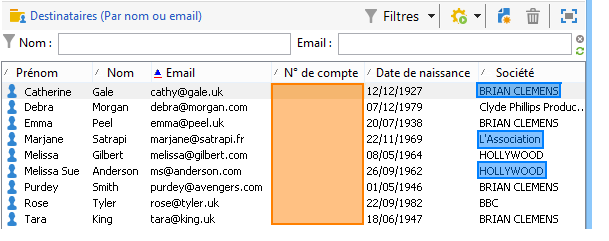

      Les valeurs du fichier texte vides ont écrasé celles de la base de données. Les valeurs existantes dans la base de données ont été mises à jour avec celles du fichier d’importation, conformément à l’ **[!UICONTROL Update]** option sélectionnée pour les doublons à l’étape 4.

## Importer des données avec un workflow {#importing-data-from-a-workflow}

Les workflows peuvent être utiles pour automatiser certains de vos imports. Que vous importiez des données à partir d&#39;un fichier local ou d&#39;un serveur SFTP, vous pouvez utiliser des workflows pour standardiser vos procédures de Data Management.

Pour plus d&#39;informations sur l&#39;import de données depuis un workflow, consultez [cette section](../../workflow/using/importing-data.md).
