# Importer des données{#importing-data}

Adobe Campaign vous permet d&#39;importer des données dans la base à partir d&#39;un ou plusieurs fichiers au format texte, CSV, TAB ou XML. Ces fichiers sont associés à une table (principale ou liée) et chaque champ du ou des fichiers sources est associé à un champ de la base de données. Le paramétrage de l&#39;importation peut être enregistré afin d&#39;être réutilisé : vous pourrez ainsi planifier des tâches d&#39;import qui automatiseront les opérations de réplication.

>[!NOTE]
>
>Vous pouvez importer des données sans les associer aux données de la base en utilisant la fonction **[!UICONTROL Importer une liste]**.
> 
>Les données seront alors utilisables exclusivement dans les workflows via l&#39;objet **[!UICONTROL Lecture de liste]**. Voir à ce sujet [cette page](../../workflow/using/read-list.md).
>
>Pour plus d&#39;informations, regardez la vidéo [Importer des profils](https://docs.adobe.com/content/help/en/campaign-learn/campaign-classic-tutorials/getting-started/importing-profiles.html).

## Structure des données à importer {#structure-of-the-data-to-import}

Dans le fichier source, chaque ligne correspond à un enregistrement. Les données des enregistrements sont séparées les unes des autres par un délimiteur (espace, tabulation, caractère, etc.). Les données sont ainsi récupérées sous forme de colonnes et chaque colonne est associée à un champ de la base de données.

## L&#39;assistant d&#39;import {#import-wizard}

L&#39;assistant d&#39;import vous permet de paramétrer l&#39;import, d&#39;en définir les options (transformation des données, par exemple) puis d&#39;en lancer l&#39;exécution. Il se présente sous la forme d&#39;une suite d&#39;écrans dont le contenu dépend du type d&#39;import (simple ou multiple) et des droits dont dispose l&#39;opérateur.

>[!NOTE]
>
>Si vous utilisez un serveur web IIS, un paramétrage peut-être nécessaire afin d&#39;autoriser le téléchargement de gros fichiers (> 28 Mo).
>
>Voir à ce sujet [cette section](../../installation/using/integration-into-a-web-server-for-windows.md#changing-the-upload-file-size-limit).

### Etape 1 - Choix du modèle d&#39;import {#step-1---choosing-the-import-template}

Lorsque vous lancez l&#39;assistant d&#39;import, vous devez d&#39;abord sélectionner un modèle. A titre d&#39;exemple, pour configurer l&#39;import des destinataires qui ont reçu une newsletter, procédez comme suit :

1. Sélectionnez le dossier **[!UICONTROL Profils et Cibles > Traitement > Imports et exports génériques]**.
1. Cliquez sur **Nouveau** puis sur **Import** pour créer le modèle d&#39;import.

   

1. Cliquez sur la flèche située à droite du champ **[!UICONTROL Modèle d&#39;import]** pour sélectionner votre modèle, ou cliquez sur l&#39;icône **[!UICONTROL Choisir le lien]** pour parcourir l&#39;arborescence.

   Le modèle natif est **[!UICONTROL Nouvel import texte]**. Ce modèle ne doit pas être modifié, mais vous pouvez le dupliquer pour paramétrer un modèle correspondant à vos besoins. Par défaut, les modèles d&#39;import sont enregistrés dans le nœud **[!UICONTROL Profils et cibles > Modèles > Modèles de traitement]**.

1. Saisissez un nom pour cet import dans le champ **[!UICONTROL Libellé]**. Vous pouvez ajouter une description.
1. Sélectionnez le type d&#39;import dans le champ correspondant. Deux types d&#39;imports sont possibles : **[!UICONTROL Import simple]** pour n&#39;importer qu&#39;un seul fichier et **[!UICONTROL Import multiple]** pour importer plusieurs fichiers en une seule exécution.

   Dans le cas d&#39;un import multiple, sélectionnez **[!UICONTROL Import multiple]** dans la liste déroulante **[!UICONTROL Type d&#39;import]** du premier écran de l&#39;assistant d&#39;import.

   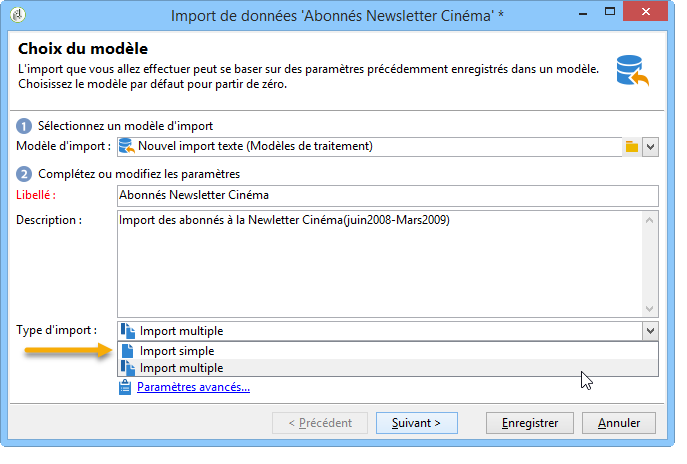

1. Indiquez ensuite les différents fichiers que vous souhaitez importer en cliquant sur **[!UICONTROL Ajouter]**.

   

   Chaque fois qu’un fichier est ajouté, l’écran de l’assistant **[!UICONTROL Fichier à importer]** s’affiche. Voir la section [Étape 2 - Sélection](#step-2---source-file-selection) du fichier source et suivez les étapes de l’assistant pour définir les options d’importation comme pour une importation simple.

   >[!NOTE]
   >
   >Les imports multiples ne doivent répondre qu&#39;à des besoins spécifiques et ne sont pas recommandés.

#### Paramètres avancés {#advanced-parameters}

Le lien **[!UICONTROL Paramètres avancés...]** permet d&#39;accéder aux options suivantes :

* Onglet **[!UICONTROL Général]**

   * **[!UICONTROL Stopper l&#39;exécution s&#39;il y a trop de rejets]**

      Cette option est sélectionnée par défaut. Vous pouvez la décocher si vous souhaitez continuer l&#39;exécution de l&#39;import, quel que soit le nombre de rejets. Par défaut, l&#39;exécution est stoppée si les 100 premières lignes sont rejetées.

   * **[!UICONTROL Mode trace]**

      Cochez cette option pour assurer un tracking de l&#39;exécution de l&#39;import, pour chaque ligne.

   * **[!UICONTROL Lancer le traitement dans un processus détaché]**

      Cette option est sélectionnée par défaut. Elle permet de dissocier l&#39;exécution de l&#39;import afin de ne pas affecter d&#39;autres traitements en cours au même moment sur la base de données.

   * **[!UICONTROL Ne pas mettre à jour les énumérations]**

      Sélectionnez cette option pour éviter d’enrichir la liste des valeurs énumérées dans la base de données. Voir [Gestion des énumérations](../../platform/using/managing-enumerations.md).

* Onglet **[!UICONTROL Variables]**

   Vous pouvez définir des variables associées au traitement et qui seront accessibles dans les éditeurs de requête et dans les champs calculés. Pour créer une variable, cliquez sur l&#39;icône **[!UICONTROL Ajouter]** et renseignez l&#39;éditeur de variables.

   >[!CAUTION]
   >
   >L&#39;onglet **[!UICONTROL Variables]** est réservé à des utilisations programmatiques de type Workflow et ne doit être paramétré que par des utilisateurs experts.

### Etape 2 - Choix du fichier source {#step-2---source-file-selection}

Le fichier source peut être au format texte (txt, csv, tab, colonnes fixes) ou xml.

Par défaut, l&#39;option **[!UICONTROL Télécharger le fichier sur le serveur]** est cochée. Cliquez sur le dossier situé à droite du champ **[!UICONTROL Fichier local]** pour parcourir le disque local et sélectionner le fichier à importer. Vous pouvez décocher cette option pour saisir le chemin d&#39;accès et le nom du fichier à importer s&#39;il se trouve sur le serveur.

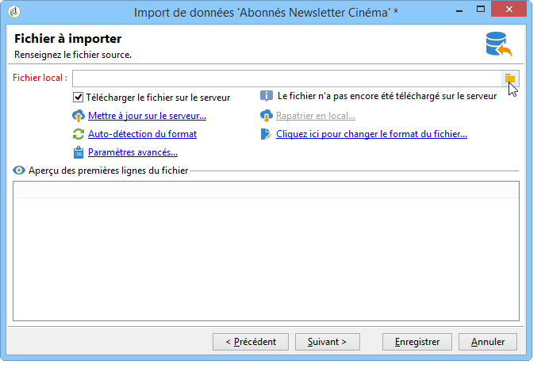

Une fois le fichier spécifié, vous pouvez en visualiser les données dans la section inférieure de la fenêtre en cliquant sur le lien **[!UICONTROL Auto-détection du format]**. Cet aperçu affiche les 200 premières lignes du fichier source.

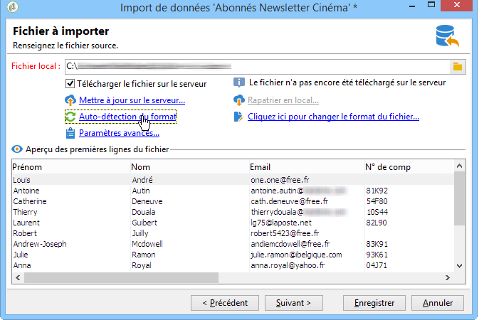

Utilisez les options proposées au-dessus de cette vue pour paramétrer l&#39;import. Les paramètres définis via ces options sont répercutés dans l&#39;aperçu. Les options disponibles sont les suivantes :

* **[!UICONTROL Cliquez ici pour changer le format du fichier...]** permet de vérifier le format du fichier et d&#39;affiner le paramétrage.
* **[!UICONTROL Mettre à jour sur le serveur...]** permet de transférer le fichier local sur le serveur. Cette option n&#39;est disponible que si l&#39;option **[!UICONTROL Télécharger le fichier sur le serveur]** est cochée.
* **[!UICONTROL Rapatrier en local]** n&#39;est disponible que si le fichier a été téléchargé sur le serveur.
* **[!UICONTROL Auto-détection du format]** permet de réinitialiser le format de la source de données. Cette option permet de réappliquer les formats originaux aux données qui ont été formatées via l&#39;option **[!UICONTROL Cliquez ici pour changer le format du fichier...]**.
* Le lien **[!UICONTROL Paramètres avancés...]** permet de filtrer les données sources et d&#39;accéder à des options avancées. Vous pouvez choisir depuis cet écran de n&#39;importer qu&#39;une partie du fichier. Vous pouvez également définir un filtre pour n&#39;importer par exemple que les utilisateurs de type &#39;Prospect&#39; ou &#39;Client&#39;, en fonction de la valeur de la ligne correspondante. L&#39;utilisation de ces options est réservée à des utilisateurs experts JavaScript.

#### Modifier le format du fichier {#changing-the-file-format}

L&#39;option **[!UICONTROL Cliquez ici pour changer le format du fichier...]** permet de formater les données du fichier source, et notamment de préciser le séparateur de colonnes et le type de données pour chaque champ. Ce paramétrage est réalisé au travers de la fenêtre suivante :

Cette étape permet de décrire comment doivent être lues les valeurs des champs du fichier. Par exemple, dans le cas d&#39;une date, vous pouvez associer le type de données Date ou Date+Heure à un format (jj/mm/aaaa, mm/jj/aa, etc.). Si la donnée en entrée ne correspond pas au format attendu, des rejets auront lieu lors de l&#39;import.

Vous pouvez visualiser le résultat du paramétrage dans la zone d&#39;aperçu située dans la section inférieure de la fenêtre.

Cliquez sur **[!UICONTROL OK]** pour enregistrer ce formatage puis sur **[!UICONTROL Suivant]** pour afficher l&#39;étape suivante.

### Etape 3 - Association des champs {#step-3---field-mapping}

Vous devez ensuite choisir le schéma de destination et associer les données de chaque colonne à des champs de la base de données.

* Le champ **[!UICONTROL Schéma destination]** permet de sélectionner le schéma dans lequel seront importées les données. Cette information est obligatoire. Cliquez sur l&#39;icône **[!UICONTROL Choisir le lien]** pour sélectionner un des schéma existants. Cliquez sur **[!UICONTROL Editer le lien]** pour visualiser le contenu de la table sélectionnée.
* Le tableau central reprend tous les champs définis dans le fichier source. Sélectionnez les champs à importer afin de leur associer un champ de destination. Ces champs peuvent être associés manuellement ou automatiquement.

   Pour associer un champ manuellement, cliquez sur la case à cocher pour sélectionner le champ source et cliquez dans la seconde colonne pour activer la cellule correspondant au champ sélectionné. Cliquez ensuite sur l&#39;icône **[!UICONTROL Editer l&#39;expression]** pour afficher tous les champs de la table courante. Sélectionnez le champ de destination et cliquez sur **[!UICONTROL OK]** pour valider l&#39;association.

   Pour associer automatiquement les champs sources et les champs de destination, cliquez sur l&#39;icône **[!UICONTROL Deviner les champs destination]** située à droite de la liste des champs. Les champs proposés peuvent si besoin être modifiés.

   >[!CAUTION]
   >
   >Le résultat de cette opération doit toujours être validé avant de passer à l&#39;étape suivante.

* Vous pouvez appliquer une transformation aux champs importés. Pour cela, cliquez dans la cellule de la colonne **[!UICONTROL Transformation]** relative au champ visé et sélectionnez la transformation à appliquer.

   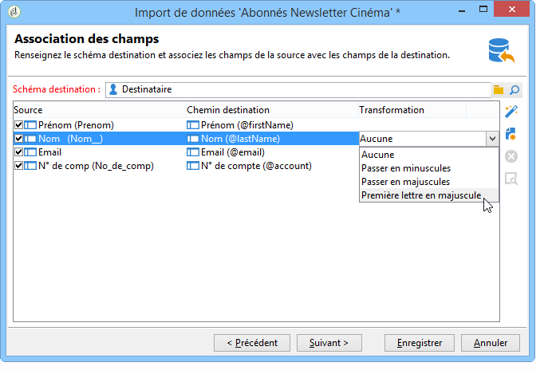

   >[!CAUTION]
   >
   >La transformation est appliquée au moment de l&#39;importation. Toutefois, si des contraintes ont été définies sur les champs de destination (dans l&#39;exemple ci-dessus, sur le champ @lastname), ces dernières sont prioritaires.

* Vous pouvez ajouter des champs calculés depuis l&#39;icône correspondante située à droite du tableau central. Les champs calculés permettent d&#39;effectuer des transformations complexes, d&#39;ajouter des colonnes virtuelles ou des fusionner les données de plusieurs colonnes. Reportez-vous aux paragraphes ci-dessous qui détaillent les différentes possibilités.

#### Les champs calculés {#calculated-fields}

Les champs calculés sont de nouvelles colonnes ajoutées au fichier source et calculées à partir d&#39;autres colonnes. Les champs calculés peuvent ensuite être associés à des champs de la base de données Adobe Campaign. Toutefois, les opérations de réconciliation ne sont pas possibles sur des champs calculés.

Quatre types de champ calculé sont proposés :

* **[!UICONTROL Chaîne fixe]** : la valeur du champ calculé est la même pour toutes les lignes du fichier source. Permet de définir la valeur d&#39;un champ des enregistrements insérés ou mis à jour. Par exemple, vous pouvez définir un marqueur sur &quot;oui&quot; pour tous les enregistrements importés.
* **[!UICONTROL Chaîne avec fusion JavaScript]** : la valeur du champ calculé est une chaîne de caractères contenant des directives JavaScript.
* **[!UICONTROL Expression JavaScript]** : la valeur du champ calculé est le résultat de l&#39;évaluation d&#39;une fonction JavaScript, la valeur retournée pouvant être typée (nombre, date, etc.).
* **[!UICONTROL Enumération]** : la valeur du champ est attribuée en fonction d&#39;une valeur contenue dans le fichier source. L&#39;éditeur vous permet de spécifier la colonne source et de saisir la liste des valeurs d&#39;énumération, comme dans l&#39;exemple suivant :

   

   L&#39;onglet **[!UICONTROL Aperçu]** permet de visualiser le résultat du paramétrage défini. Ici, la colonne **[!UICONTROL Abonnement]** a été ajoutée. La valeur est calculée à partir du champ **Statut**.

   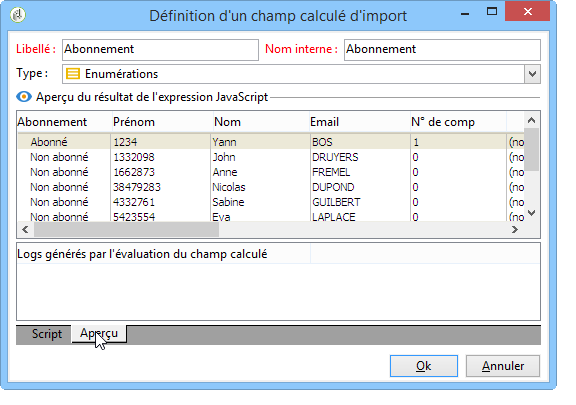

### Etape 4 - Réconciliation {#step-4---reconciliation}

L&#39;étape de réconciliation de l&#39;assistant d&#39;import permet de définir le mode de rapprochement des données issues du fichier avec les informations existantes dans la base de données, ainsi que de fixer les règles de priorité entre les données du fichier et celles de la base de données. La fenêtre de configuration se présente comme suit :

La section centrale de l&#39;écran présente, de manière arborescente les champs et les tables de la base de données Adobe Campaign vers lesquels des données seront importées.

Des options spécifiques sont disponibles pour chaque noeud (table ou champ). Cliquez sur le noeud concerné dans la liste et ses paramètres, ainsi qu&#39;une courte description apparaîtront en-dessous. Le comportement défini pour chaque élément est affiché dans la colonne **[!UICONTROL Comportement]** correspondante.

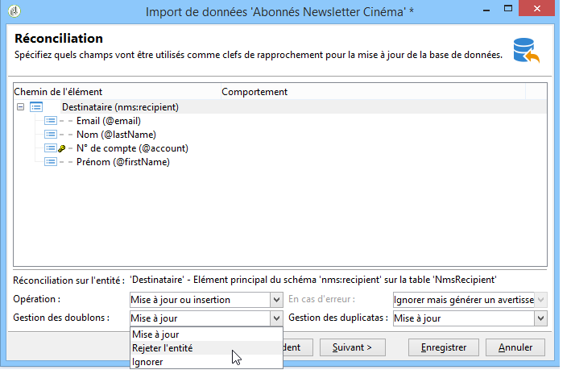

#### Types d&#39;opérations {#types-of-operation}

Pour chaque table concernée par l&#39;import, vous devez définir le type d&#39;opération. Les opérations disponibles pour l&#39;élément principal de la base de données sont les suivantes :

* **[!UICONTROL Mise à jour ou insertion]** : met à jour l&#39;enregistrement s&#39;il existe dans la base de données et le crée dans le cas contraire.
* **[!UICONTROL Insertion]** : insère les enregistrements dans la base.
* **[!UICONTROL Mise à jour]** : effectue uniquement une mise à jour des enregistrements existants (ignore les autres enregistrements).
* **[!UICONTROL Réconciliation seule]** : recherche l&#39;enregistrement dans la base de données mais n&#39;effectue aucune mise à jour de celui-ci. Permet par exemple d&#39;associer le dossier de destinataires à importer en fonction d&#39;une colonne du fichier sans mettre à jour les données des dossiers.
* **[!UICONTROL Suppression]** : permet de détruire des enregistrements de la base de données.

Les options disponibles pour chaque champ de la table concernée par l&#39;import sont les suivantes :

* **[!UICONTROL Mettre à jour (vider) si la valeur source est vide]** : en cas de mise à jour, permet d&#39;écraser la valeur du champ telle qu&#39;elle est dans la base de données si la valeur du champ est vide dans le fichier source. Sinon, le champ de la base est conservé.
* **[!UICONTROL Mettre à jour uniquement si la destination est vide]** : la valeur du champ de la base de données n&#39;est pas écrasée par celle du fichier source sauf si le champ de la base est vide. Il prend alors la valeur du fichier source.
* **[!UICONTROL Mettre à jour uniquement à l&#39;insertion de l&#39;enregistrement]** : lors d&#39;une opération de mise à jour ou insertion, ne sont importés que les enregistrement du fichier source qui sont nouveaux.

>[!NOTE]
>
>Dans tous les cas, la définition d&#39;une clé de réconciliation est **obligatoire**, sauf en cas d&#39;insertion sans dédoublonnage.

#### Les clés de réconciliation {#reconciliation-keys}

Il est nécessaire de renseigner au moins une clé de réconciliation pour gérer le dédoublonnage.

Une clé de réconciliation est un ensemble de champs permettant d&#39;identifier un enregistrement. Par exemple pour un import de destinataires, la clé de réconciliation peut être le numéro de compte, le champ &quot;Email&quot; ou encore les champs &quot;Nom, Prénom, Société&quot;, etc.

Dans ce cas, pour savoir si une ligne du fichier correspond à un destinataire existant dans la base de données, le moteur d&#39;import compare les valeurs du fichier avec celles de la base de données pour tous les champs de la clé. Plus les champs sont spécifiques à un enregistrement, plus la comparaison entre les données source et destination pourra être fine et garantir l&#39;intégrité des données après l&#39;import. Il est possible de renseigner une seconde clé de réconciliation pour une même table : elle sera utilisée pour les lignes dont la première clé est vide.

Il convient aussi de ne pas choisir un champ qui risque d&#39;être modifié lors de l&#39;import, auquel cas, le moteur risque de créer des enregistrements supplémentaires.

>[!NOTE]
>
>Pour une importation de destinataire, l’identifiant du dossier sélectionné est implicitement ajouté à la clé.
>
>Le rapprochement est donc effectué uniquement sur ce dossier (sauf si aucun dossier n’est sélectionné).

#### Déduplication {#deduplication}

>[!NOTE]
>
>Un doublon est un élément qui est présent au moins deux fois dans le fichier à importer.
>
>Un duplicata est un élément qui est présent à la fois dans le fichier à importer et dans la base.

Le champ **[!UICONTROL Gestion des doublons]** permet de paramétrer le dédoublonnage des données. Le dédoublonnage concerne les enregistrements qui apparaissent plusieurs fois **dans le fichier source** (ou les fichiers sources dans le cas d&#39;un import multi-fichiers), c&#39;est-à-dire des lignes pour lesquelles les champs de la clé de réconciliation sont identiques.

* La gestion des doublons en mode **[!UICONTROL Mise à jour]** (mode par défaut) n&#39;effectue pas de dédoublonnage. Par conséquent, le dernier enregistrement est prioritaire (puisqu&#39;il met à jour les données du ou des précédents enregistrements). Le comptage de doublons n&#39;est pas effectué dans ce mode.
* Les gestions des doublons en mode **[!UICONTROL Ignorer]** ou **[!UICONTROL Rejeter l&#39;entité]** excluent les doublons de l&#39;import. Dans ce cas, aucun enregistrement n&#39;est importé.
* En mode **[!UICONTROL Rejeter l&#39;entité]**, l&#39;élément n&#39;est pas importé et une erreur est générée dans les logs de l&#39;importation.
* En mode **[!UICONTROL Ignorer]**, l&#39;élément n&#39;est pas importé mais aucune trace de l&#39;erreur n&#39;est conservée. Ce mode permet d&#39;optimiser les performances.

>[!CAUTION]
>
>Le dédoublonnage est effectué uniquement en mémoire. Par conséquent, la taille d&#39;un import avec dédoublonnage est limitée. La limite dépend de plusieurs paramètres (capacité du serveur applicatif, activité, nombre de champs dans la clé, etc.). L&#39;ordre de grandeur de la taille maximale pour un dédoublonnage est 1 000 000 de lignes.

La déduplication concerne un enregistrement présent à la fois dans le fichier source et dans la base de données. Elle ne concerne que les opérations avec mise à jour (c&#39;est-à-dire **[!UICONTROL Mise à jour et insertion]** ou **[!UICONTROL Mise à jour]**). L&#39;option **[!UICONTROL Gestion des duplicatas]** permet de mettre à jour ou d&#39;ignorer l&#39;enregistrement s&#39;il est à la fois dans le fichier source et dans la base. L&#39;option **[!UICONTROL Mise à jour ou insertion en fonction de l&#39;origine]** fait partie d&#39;un module optionnel : elle n&#39;est pas utilisable dans un contexte standard.

Les options **[!UICONTROL Rejeter]** et **[!UICONTROL Ignorer]** fonctionnent comme présentés ci-dessus.

#### Comportement en cas d&#39;erreur {#behavior-in-the-event-of-an-error}

La plupart des opérations de transfert de données génèrent des erreurs qui peuvent être de différentes natures (format de ligne incohérent, email invalide, etc.). Toutes les erreurs et tous les avertissements générés par le moteur d&#39;import sont stockés et attachés à l&#39;instance d&#39;import.

Le détail de ces rejets est visible depuis l&#39;onglet **[!UICONTROL Rejets]**.

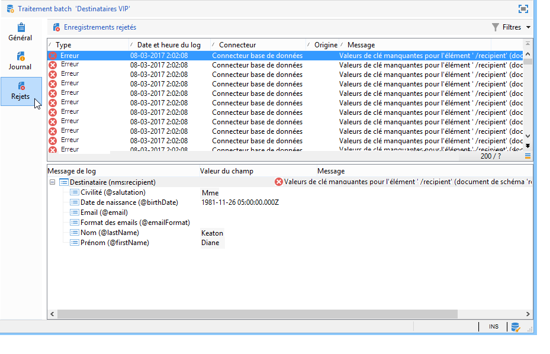

Les rejets peuvent être de deux types (le type est affiché dans la colonne **[!UICONTROL Connecteur]**) :

* Les rejets du connecteur texte concernent les erreurs lors du traitement de la ligne du fichier (champ calculé, analyse de données, etc.). Ainsi, en cas d’erreur, c’est toujours la ligne entière qui est rejetée.
* Les rejets du connecteur base de données concernent les erreurs ayant lieu lors de la réconciliation des données ou de l’écriture dans la base. Dans le cas d’un import sur plusieurs tables, le rejet peut ne concerner qu’une portion de l’enregistrement (par exemple pour un import de destinataires et d’événements associés, une erreur peut empêcher la mise à jour d’un événement sans pour autant rejeter le destinataire).

Dans la page de réconciliation des données, il est possible de définir champ par champ, et table par table, le type de gestion d&#39;erreur souhaité.

* **[!UICONTROL Ignorer mais générer un avertissement]** : tous les champs sont importés dans la base de données, sauf celui qui a généré une erreur.
* **[!UICONTROL Rejeter l&#39;élément parent]** : toute la ligne de l&#39;enregistrement est rejetée et pas uniquement le champ qui a provoqué une erreur.
* **[!UICONTROL Rejeter tous les éléments]** : l&#39;import s&#39;arrête et tous les éléments de l&#39;enregistrement sont rejetés.

   

L&#39;arborescence dans l&#39;écran des rejets d&#39;une instance d&#39;import indique quels champs ont été rejetés et où les erreurs se sont produites.

Vous pouvez générer un fichier comportant ces enregistrements via l&#39;icône **[!UICONTROL Exporter les rejets]**:

### Etape 5 - Etape supplémentaire lors de l&#39;import de destinataires {#step-5---additional-step-when-importing-recipients}

L&#39;étape suivante de l&#39;assistant d&#39;import permet de choisir ou créer le dossier dans lequel les données seront importées, d&#39;associer automatiquement les destinataires importés à une liste (existante ou nouvelle) et de les abonner à un service.

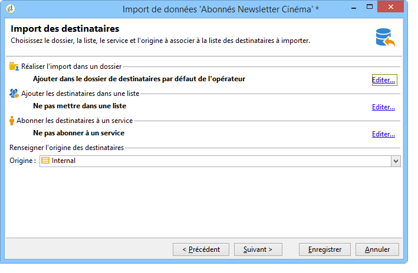

>[!NOTE]
>
>Cette étape n&#39;est proposée que dans le cas d&#39;un import de destinataires et si vous utilisez la table des destinataires Adobe Campaign par défaut (**nms:recipient**).

* Cliquez sur les liens **[!UICONTROL Editer]** pour choisir le dossier, la liste ou le service auxquels vous souhaitez associer ou abonner les destinataires.

   1. Importer dans un dossier

      Le lien **[!UICONTROL Editer...]** de la section **[!UICONTROL Réaliser l&#39;import dans un dossier]** permet de sélectionner ou créer le dossier dans lequel seront importés les destinataires. Par défaut, si aucun dossier n&#39;est défini, les données sont importées dans le dossier par défaut de l&#39;opérateur.

      >[!NOTE]
      >
      >Le dossier par défaut d’un opérateur est le premier dossier pour lequel l’opérateur dispose d’un accès en écriture. Voir Gestion des [accès aux](../../platform/using/access-management.md#folder-access-management)dossiers.

      Pour choisir le dossier d&#39;import, cliquez sur la flèche située à droite du champ **[!UICONTROL Dossier]** et sélectionnez le dossier visé. Vous pouvez également utiliser l&#39;icône **[!UICONTROL Choisir le lien]** pour afficher l&#39;arborescence dans une nouvelle fenêtre ou créer un nouveau dossier.

      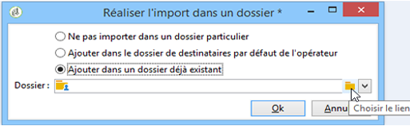

      Pour créer un nouveau dossier, sélectionnez le noeud à partir duquel vous souhaitez ajouter un dossier et cliquez sur le bouton droit de la souris. Choisissez **[!UICONTROL Ajouter un dossier Destinataires]**.

      

      Le dossier est ajouté en sous-arborescence du noeud courant. Saisissez le nom de ce nouveau dossier, tapez sur la touche Entrée pour valider et cliquez sur **[!UICONTROL OK]**.

      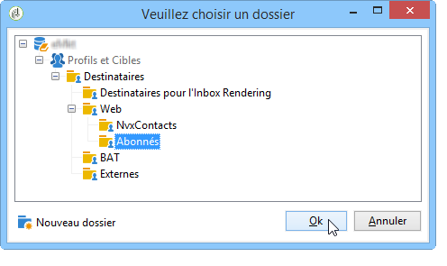

   1. Associer à une liste

      Le lien **[!UICONTROL Editer...]** de la section **[!UICONTROL Ajouter les destinataires dans une liste]** permet de sélectionner ou créer une liste dans laquelle seront ajoutés les destinataires importés.

      

      Vous pouvez créer une nouvelle liste pour ces destinataires en cliquant sur **[!UICONTROL Sélectionner un lien]**, puis **[!UICONTROL Créer]**. La création et la gestion des listes sont présentées dans [Création et gestion des listes](../../platform/using/creating-and-managing-lists.md).

      

      Vous pouvez choisir d&#39;ajouter les destinataires à ceux déjà présents dans une liste existante ou de recréer la liste avec les nouveaux destinataires. Dans ce cas, si la liste contenait déjà des destinataires, ils seront supprimés, et remplacés par les destinataires importés.

   1. Abonner à un service

      Pour abonner tous les destinataires importés à un service d&#39;information, cliquez sur le lien **[!UICONTROL Editer...]** de la section **[!UICONTROL Abonner les destinataires à un service]** afin de sélectionner ou créer le service d&#39;information auquel seront inscrits les destinataires. Vous pouvez cocher l&#39;option **[!UICONTROL Envoyer un message de confirmation]** : le contenu du message est défini dans le modèle de diffusion associé au service d&#39;abonnement.

      

      Vous pouvez créer un nouveau service pour ces destinataires en cliquant sur le bouton **[!UICONTROL Choisir le lien]**, puis sur l&#39;icône **[!UICONTROL Créer]**. La gestion des services d&#39;information est présentée dans [cette section](../../delivery/using/managing-subscriptions.md).

* Utilisez le champ **[!UICONTROL Origine]** pour ajouter des informations sur l&#39;origine des destinataires dans leur profil : ces informations sont notamment utiles dans le cadre d&#39;un import multiple.

Cliquez sur **[!UICONTROL Suivant]** pour valider cette étape et afficher l&#39;étape suivante.

### Etape 6 - Lancement de l&#39;import {#step-6---launching-the-import}

La dernière étape de l&#39;assistant permet de lancer l&#39;import des données. Pour cela, cliquez sur le bouton **[!UICONTROL Démarrer]**.

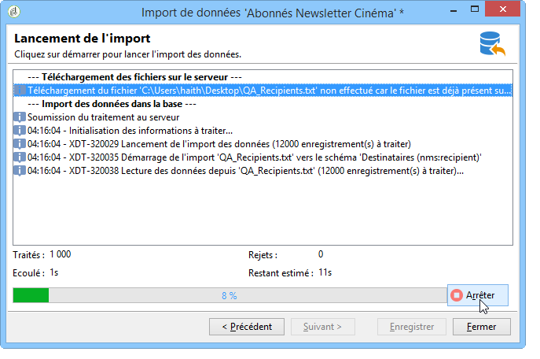

### Les états des traitements {#job-statuses}

L&#39;état d&#39;un traitement indique son statut courant. A chaque état correspond une icône et un libellé spécifique. Ces informations sont affichées dans la liste des traitements. Les états et leur icône associée sont les suivants :

* **Edition en cours**

   Traitement en cours de création.

* **En cours d&#39;exécution**

   Traitement en cours d&#39;exécution.

* **Annuler**

   Clic sur le bouton **[!UICONTROL Annuler]** : l&#39;annulation du traitement en cours.

* **Annulation en cours**

   La commande d&#39;annulation a été prise en compte et le traitement est en cours d&#39;annulation.

* **Pause en cours**

   Clic sur le bouton **[!UICONTROL Pause]** : la suspension du traitement est en cours.

* **En pause**

   Clic sur le bouton **[!UICONTROL Pause]** : le traitement est suspendu. Il peut être relancé via le bouton **[!UICONTROL Démarrer]**.

* **Terminé**

   Exécution du traitement terminée.

* **Terminé en erreur**

   Le traitement n&#39;a pas été exécuté à cause d&#39;une erreur technique.

* **Arrêt du serveur en cours**

   Le traitement en cours est interrompu à cause d&#39;un arrêt du serveur Adobe Campaign.

## Exemples d&#39;import générique {#generic-import-samples}

### Exemple : import d&#39;une liste de destinataires {#example--import-from-a-list-of-recipients}

Pour créer et alimenter une liste de destinataires à partir de la vue d&#39;ensemble des listes, effectuez les étapes suivantes :

1. Création de la liste

   * Cliquez sur le lien **[!UICONTROL Listes]** dans le menu **[!UICONTROL Profils et cibles]** de la page d&#39;accueil d&#39;Adobe Campaign.
   * Cliquez sur le bouton **[!UICONTROL Créer]** puis **[!UICONTROL Importer une liste]**.

1. Sélection du fichier à importer

   Cliquez sur le dossier situé à droite du champ **[!UICONTROL Fichier local]** et sélectionnez le fichier contenant la liste à importer.

   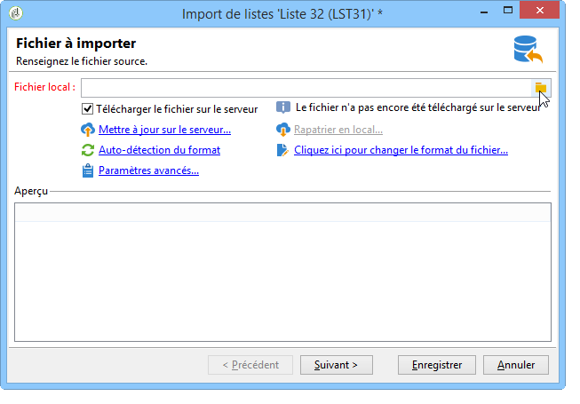

1. Nom et stockage de la liste

   Saisissez le nom de la liste et sélectionnez son répertoire d&#39;enregistrement.

   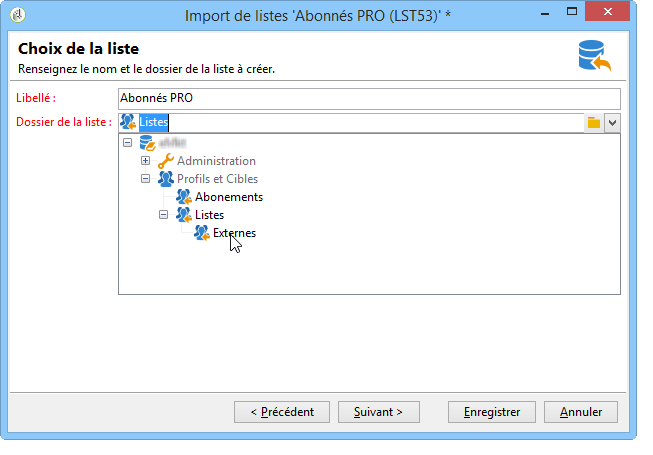

1. Lancement de l&#39;import

   Cliquez sur **[!UICONTROL Suivant]** puis **[!UICONTROL Démarrer]** pour lancer l&#39;import de la liste.

   

### Exemple : import de nouveaux enregistrements depuis un fichier texte {#example--import-new-records-from-a-text-file-}

Pour importer dans la base Adobe Campaign de nouveaux profils de destinataires stockés dans un fichier texte, effectuez les étapes suivantes :

1. Choix du modèle

   * A partir de la page d&#39;accueil d&#39;Adobe Campaign, cliquez sur le lien **[!UICONTROL Profils et cibles]** puis sur **[!UICONTROL Traitements]**. Au-dessus de la liste des traitements, cliquez sur **[!UICONTROL Nouvel import]**.
   * Conservez le modèle **[!UICONTROL Nouvel import texte]** sélectionné par défaut.
   * Modifiez le libellé et la description.
   * Sélectionnez **[!UICONTROL Import simple]**.
   * Conservez le dossier de traitement par défaut.
   * Cliquez sur **[!UICONTROL Paramètres avancés]** et sélectionnez l&#39;option **[!UICONTROL Mode tracking]** pour visualiser le détail de votre import durant l&#39;exécution.

1. Sélection du fichier à importer

   Cliquez sur le dossier situé à droite du champ **[!UICONTROL Fichier local]** et sélectionnez le fichier que souhaitez importer.

   

1. Association des champs

   Cliquez sur l&#39;icône **[!UICONTROL Deviner les champs destination]** pour effectuer automatiquement l&#39;association entre les schémas source et destination. Vérifiez les informations de cette fenêtre avant de cliquer sur **[!UICONTROL Suivant]**.

   

1. Réconciliation

   * Positionnez-vous au niveau de la table **Destinataires (nms:recipient)**.
   * Sélectionnez l&#39;opération **[!UICONTROL Insertion]** et laissez les autres champs par défaut.

      

1. Import des destinataires

   * Au besoin, indiquez un dossier particulier où importer vos enregistrements.

      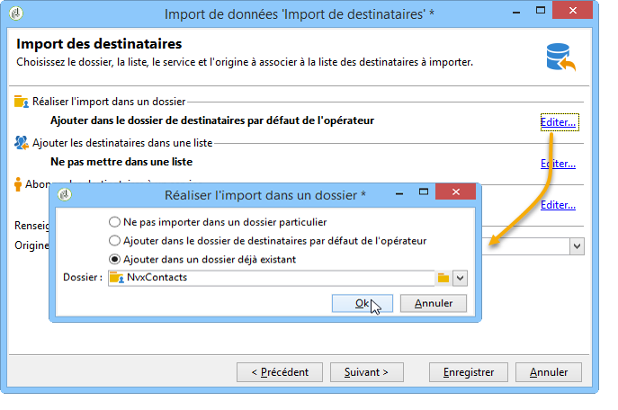

1. Lancement de l&#39;import

   * Cliquez sur **[!UICONTROL Démarrer]**.

      Dans la section centrale de l&#39;éditeur, vous pouvez vérifier que l&#39;opération d&#39;import s&#39;est bien déroulée et visualiser le nombre d&#39;enregistrements traités.

      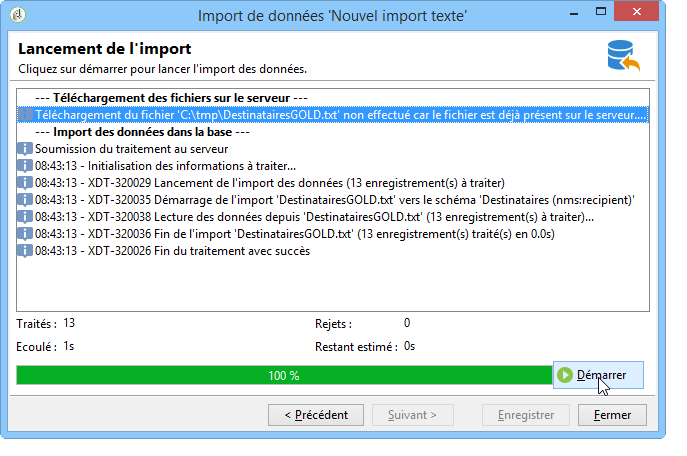

      Le mode **[!UICONTROL Tracking]** vous permet de suivre les détails de l&#39;import pour chacun des enregistrements du fichier source. Pour cela, à partir de la page d&#39;accueil, cliquez sur **[!UICONTROL Profils et Cibles]** puis **[!UICONTROL Traitements]**, sélectionnez cet import et consultez les onglets **[!UICONTROL Général]**, **[!UICONTROL Journal]** et **[!UICONTROL Rejets]**.

      * Consultation du déroulement de l&#39;import

         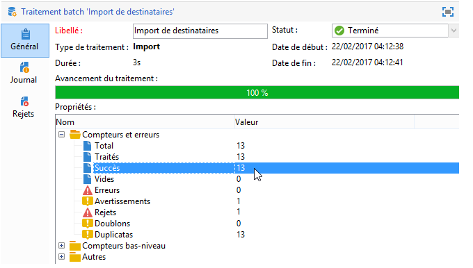

      * Consultation du traitement pour chaque enregistrement

         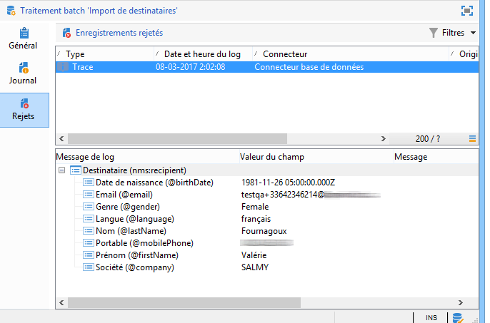

### Exemple : mise à jour et insertion de destinataires {#example--update-and-insert-recipients}

Vous souhaitez mettre à jour des enregistrements déjà existants dans la base et en créer de nouveaux à partir d&#39;un fichier texte. Voici un exemple de mise en œuvre :

1. Choix du modèle

   Reproduisez les mêmes étapes que l&#39;exemple 2 ci-avant.

1. Fichier à importer

   Sélectionnez le fichier que souhaitez importer.

   Dans notre exemple, l&#39;aperçu des premières lignes du fichier vous permet de constater que le fichier comporte des mises à jour pour trois enregistrements et la création d&#39;un enregistrement.

   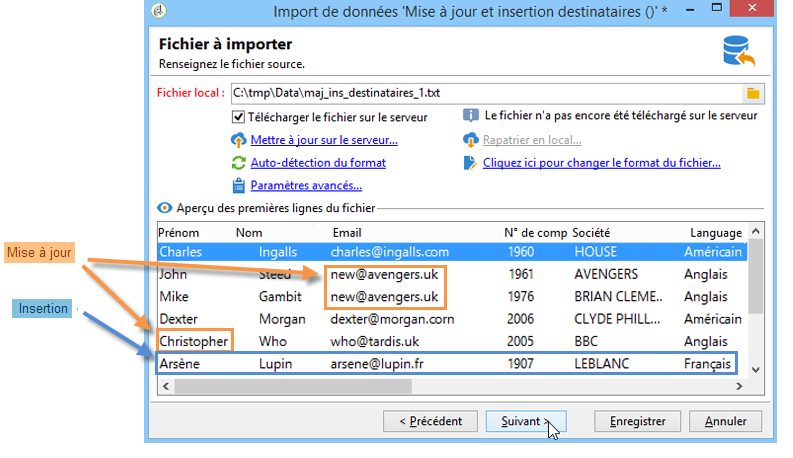

1. Association des champs

   Procédez comme dans l&#39;exemple 2 ci-avant.

1. Réconciliation

   * Conservez l&#39;opération **[!UICONTROL Mise à jour ou insertion]** sélectionnée par défaut.
   * Conservez l&#39;option **[!UICONTROL Gestions des duplicatas]** en mode **[!UICONTROL Mise à jour]**, pour que les enregistrements existants dans la base soient modifiés avec les données du fichier texte.
   * Sélectionnez les champs **[!UICONTROL Date de naissance]**, **[!UICONTROL Nom]** et **[!UICONTROL Société]** et attribuez-leur une clé de réconciliation.

      

1. Lancement de l&#39;import

   * Cliquez sur **[!UICONTROL Démarrer]**.

      Dans la fenêtre de tracking, vous pouvez vérifier que l&#39;opération d&#39;import s&#39;est bien passée et le nombre d&#39;enregistrements qui ont été traités.

      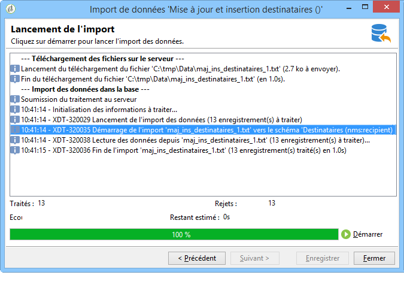

   * Vérifiez dans la table des destinataires que les enregistrements ont bien été modifiés par cette opération.

      

### Exemple : enrichir les valeurs par celles d&#39;un fichier externe {#example--enrich-the-values-with-those-of-an-external-file}

Vous souhaitez modifier certains champs dans une table de la base de données depuis un fichier texte en privilégiant les valeurs contenues dans la base de données.

Dans cet exemple, vous noterez que certains champs de votre fichier texte ont une valeur alors que les champs correspondants dans la base de données sont vides. D&#39;autres champs contiennent une valeur différente de celle contenue dans la base de données.

* Contenu du fichier texte à importer

   

* Etat de la base de données avant import

   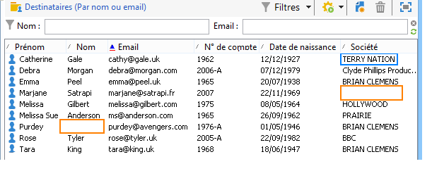

Les étapes sont les suivantes :

1. Choix du modèle

   Procédez comme dans l&#39;exemple 2 ci-avant.

1. Fichier à importer

   Sélectionnez le fichier que souhaitez importer.

1. Association des champs

   Procédez comme dans l&#39;exemple 2 ci-avant.

   Dans l&#39;aperçu des premières lignes du fichier, vous pouvez constater que le fichier comporte des mises à jour pour certains enregistrements.

1. Réconciliation

   * Positionnez-vous au niveau de la table et sélectionnez l&#39;opération **[!UICONTROL Mise à jour]**
   * Choisissez l&#39;option **[!UICONTROL Rejeter l&#39;entité]** pour le champ **[!UICONTROL Gestion des doublons]**.
   * Conservez l&#39;option **[!UICONTROL Gestions des duplicatas]** en mode **[!UICONTROL Mise à jour]**, pour que les enregistrements existants dans la base soient modifiés avec les données du fichier texte.
   * Positionnez-vous sur le noeud **[!UICONTROL Nom (@lastName)]** et sélectionnez l&#39;option **[!UICONTROL Mettre à jour uniquement si la destination est vide]**.
   * Recommencez l&#39;opération pour le noeud **[!UICONTROL Société (@company)]**.
   * Attribuez une clé de réconciliation aux champs **[!UICONTROL Date de naissance]**, **[!UICONTROL Email]** et **[!UICONTROL Prénom]**.

      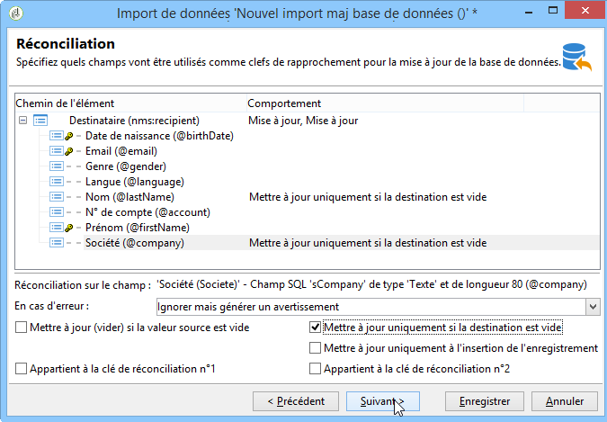

1. Lancement de l&#39;import

   Cliquez sur **[!UICONTROL Démarrer]**.

   Vérifiez dans la table des destinataires que les enregistrements ont bien été modifiés par l&#39;import.

   

   Seules les valeurs qui étaient vides ont été remplacées par les valeurs du fichier texte. En revanche, la valeur déjà existante dans la base n&#39;a pas été écrasée par celle du fichier d&#39;import.

### Exemple : mettre à jour et enrichir les valeurs à partir de celles d&#39;un fichier externe {#example--update-and-enrich-the-values-from-those-in-an-external-file}

Vous souhaitez modifier certains champs dans une table de la base de données depuis un fichier texte et privilégier les valeurs contenues dans le fichier texte.

Dans cet exemple, vous noterez que certains champs de votre fichier texte ont une valeur vide alors que les champs correspondants dans la base de données ne le sont pas. D&#39;autres champs contiennent une valeur différente de celle contenue dans la base de données.

* Contenu du fichier texte à importer

   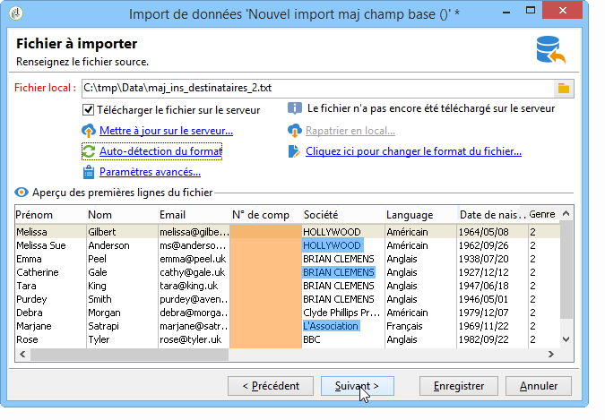

* Etat de la base de données avant import

   

1. Choix du modèle

   Procédez comme dans l&#39;exemple 2 ci-avant.

1. Fichier à importer

   Sélectionnez le fichier que souhaitez importer.

   Dans l&#39;aperçu des premières lignes du fichier, vous pouvez constater que le fichier comporte des champs vides et des mises à jour pour certains enregistrements.

1. Association des champs

   Procédez comme dans l&#39;exemple 2 ci-avant.

1. Réconciliation

   * Positionnez-vous au niveau de la table et sélectionnez l&#39;opération **[!UICONTROL Mise à jour]**.
   * Choisissez l&#39;option **[!UICONTROL Rejeter l&#39;entité]** pour le champ **[!UICONTROL Gestion des doublons]**.
   * Laissez l&#39;option **[!UICONTROL Gestions des duplicatas]** en mode **[!UICONTROL Mise à jour]**, pour que les enregistrements existants dans la base soient modifiés avec les données du fichier texte.
   * Positionnez-vous sur le noeud **[!UICONTROL N° de compte (@account)]** et sélectionnez l&#39;option **[!UICONTROL Tenir compte des valeurs vides]**.
   * Sélectionnez les champs **[!UICONTROL Date de naissance]**, **[!UICONTROL Email]** et **[!UICONTROL Prénom]** et attribuez-leur une clé de réconciliation.

      

1. Lancement de l&#39;import

   * Cliquez sur **[!UICONTROL Démarrer]**.
   * Vérifiez dans la table des destinataires que les enregistrements ont bien été modifiés par l&#39;opération.

      

      Les valeurs du fichier texte qui étaient vides ont écrasées celles de la base. Les valeurs déjà existantes dans la base ont été mises à jour par celle du fichier d&#39;import, conformément à l&#39;option **[!UICONTROL Mise à jour]** sélectionnée pour les duplicatas à l&#39;étape 4.

## Importer des données avec un workflow {#importing-data-from-a-workflow}

Les workflows peuvent être utiles pour automatiser certains de vos imports. Que vous importiez des données à partir d&#39;un fichier local ou d&#39;un serveur SFTP, vous pouvez utiliser des workflows pour standardiser vos procédures de Data Management.

Pour plus d&#39;informations sur l&#39;import de données depuis un workflow, consultez [cette section](../../workflow/using/importing-data.md).
