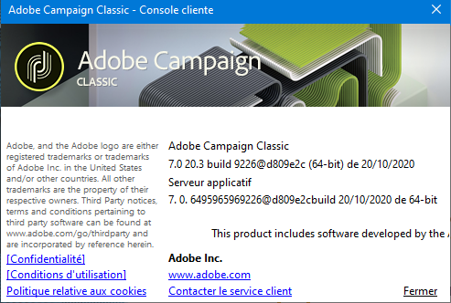

# Lancement d’Adobe Campaign{#launching-adobe-campaign}

La console cliente Campaign est un client riche qui vous permet de vous connecter à votre ou vos serveur(s) applicatif(s) Campaign. Découvrez comment télécharger et configurer la console cliente en consultant [cette page](../../installation/using/installing-the-client-console.md).

## Démarrage d’Adobe Campaign {#starting-adobe-campaign}

Vous pouvez démarrer Adobe Campaign à partir du menu **[!UICONTROL Démarrer / Tous les programmes / Adobe Campaign v.X / Console cliente Adobe Campaign]**.

La page de connexion de la console cliente permet de configurer ou de sélectionner une base de données existante, et de s’y connecter en utilisant un identifiant et un mot de passe :

## Connexion à Adobe Campaign {#connecting-to-adobe-campaign}

Il est possible de vous connecter à Adobe Campaign via votre Adobe ID. Voir à ce sujet [cette page](../../integrations/using/about-adobe-id.md).

Vous pouvez aussi vous connecter via un login/mot de passe dédié :

1. Saisissez l’identifiant du compte opérateur dans le champ **[!UICONTROL Login]**.

   L’identifiant vous est fourni par l’administrateur de la plate-forme Adobe Campaign.

1. Saisissez votre mot de passe dans le champ **[!UICONTROL Mot de passe]**.

   La première fois que vous accédez à la base de données, votre mot de passe est celui que vous aura attribué l’administrateur. Une fois que vous serez connecté, vous pourrez personnaliser votre mot de passe via le menu **[!UICONTROL Outils > Changer le mot de passe...]** Des détails sur les opérateurs et les connexions sont disponibles dans [Gestion des accès](../../platform/using/access-management.md).

1. Cliquez sur **[!UICONTROL Se connecter]** pour valider.

Vous pouvez maintenant accéder à l’[espace de travail Adobe Campaign](../../platform/using/adobe-campaign-workspace.md).

## Configuration de connexions {#setting-up-connections}

Vous pouvez accéder aux paramètres de connexion au serveur via le lien situé au-dessus de la zone de saisie.

Dans la fenêtre **[!UICONTROL Connexions]**, cliquez sur **[!UICONTROL Ajouter > Connexion]**.

Vous devez ensuite définir les paramètres de cette connexion. Pour cela :

1. Saisissez un **[!UICONTROL libellé]** qui correspond au nom que vous souhaitez attribuer à votre connexion vers la base de données.

1. Ajoutez l’adresse du serveur applicatif dans le champ **[!UICONTROL URL]**. Si vous ne connaissez pas l’URL de connexion, contactez votre administrateur.

1. Cochez la case **[!UICONTROL Se connecter avec un Adobe ID]** pour que les opérateurs puissent se connecter à la console via leur Adobe ID. Voir à ce sujet [cette page](../../integrations/using/about-adobe-id.md).

1. Cliquez sur **[!UICONTROL OK]** pour valider.

## Opérateurs et permissions {#operators-and-permissions}

Les identifiants et mots de passe des opérateurs ayant accès au logiciel, ainsi que leurs permissions respectives, sont définis par l’administrateur du système Adobe Campaign dans le nœud **[!UICONTROL Administration > Gestion des accès > Opérateurs]** de l’arborescence d’Adobe Campaign.

Cette fonctionnalité est décrite dans la section [Gestion des accès](../../platform/using/access-management.md).

## Déconnexion d’Adobe Campaign {#disconnecting-from-adobe-campaign}

Pour vous déconnecter d’Adobe Campaign, utilisez la première icône de la barre d’icônes.

>[!NOTE]
>
>Vous pouvez également quitter directement l’application, sans vous déconnecter au préalable.

## Obtention de la version de Campaign {#getting-your-campaign-version}

Le menu **[!UICONTROL Aide > À propos...]** vous permet d’accéder aux informations suivantes :

* **numéro de version**
* **numéro de build**
* un lien pour contacter le service à la clientèle Adobe
* liens vers la Politique de confidentialité des Adobes, les Conditions d&#39;utilisation et la Politique sur les cookies

Lorsque vous contactez l’équipe de l’assistance client Adobe, vous devez indiquer les numéros de version et de build du serveur applicatif et de la console cliente Campaign.

Si vous utilisez la version Campaign Gold Standard, vous devez également partager les caractères SHA/1 qui s’affichent dans la zone **[!UICONTROL A propos]** . Par exemple, pour la version **Gold** Standard 10, le numéro de version indique la **version 9032@efd8a94**, comme illustré ci-dessous :

Learn more about Gold Standard [in this article](https://helpx.adobe.com/fr/campaign/kb/gold-standard.html).

**Rubriques connexes** :

* [Options de prise en charge de Campaign](https://helpx.adobe.com/fr/campaign/kb/ac-support.html#acc-support)
* [Distribution de logiciels](https://docs.adobe.com/content/help/fr-FR/experience-cloud/software-distribution/home.html)
* [Assistance aux Experience Cloud et sessions d&#39;experts](https://helpx.adobe.com/enterprise/admin-guide.html/enterprise/using/support-for-experience-cloud.ug.html)
