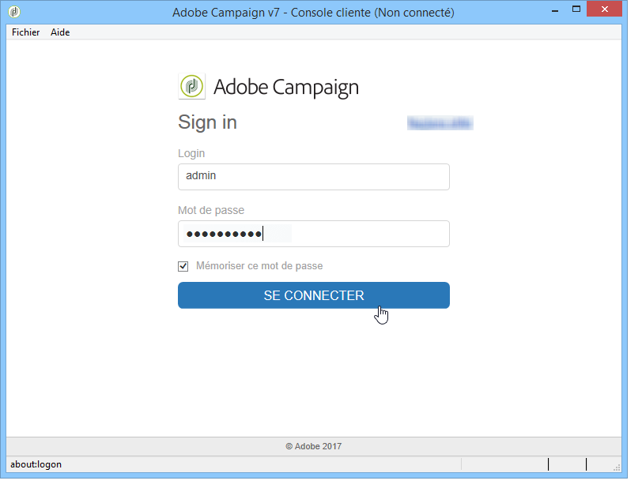
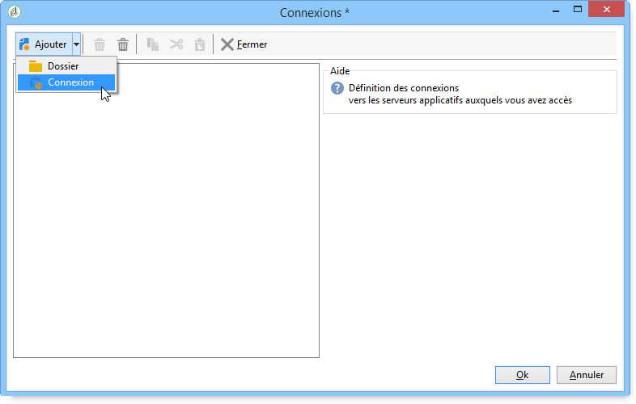

# Lancement d&#39;Adobe Campaign{#launching-adobe-campaign}

## Démarrage d&#39;Adobe Campaign {#starting-adobe-campaign}

Vous pouvez démarrer Adobe Campaign à partir du menu **[!UICONTROL Démarrer / Tous les programmes / Adobe Campaign v.X / Console cliente Adobe Campaign]**.

La page de connexion de la console cliente permet de configurer ou de sélectionner une base de données existante, et de s&#39;y connecter en utilisant un identifiant et un mot de passe :

## Connexion à Adobe Campaign {#connecting-to-adobe-campaign}

Il est possible de vous connecter à Adobe Campaign via votre Adobe ID. Voir à ce sujet [cette page](../../integrations/using/about-adobe-id.md).

Vous pouvez aussi vous connecter via un login/mot de passe dédié :

1. Saisissez l&#39;identifiant du compte opérateur dans le champ **[!UICONTROL Login]**.

   L&#39;identifiant vous est fourni par l&#39;administrateur de la plate-forme Adobe Campaign.

1. Saisissez votre mot de passe dans le champ **[!UICONTROL Mot de passe]**.

   **[!UICONTROL La première fois que vous accédez à la base de données, votre mot de passe est celui que vous donne l’administrateur. Une fois connecté, vous pouvez modifier votre mot de passe via]** Outils > Modifier le mot de passe... . Des détails sur les opérateurs et les connexions sont disponibles dans la gestion des accès.

1. Cliquez sur **[!UICONTROL Se connecter]** pour valider.

Vous pouvez maintenant accéder à l&#39;[espace de travail Adobe Campaign](../../platform/using/adobe-campaign-workspace.md).

## Configuration de connexions {#setting-up-connections}

Vous pouvez accéder aux paramètres de connexion au serveur via le lien situé au-dessus de la zone de saisie.

Dans la fenêtre **[!UICONTROL Connexions]**, cliquez sur **[!UICONTROL Ajouter > Connexion]**.

Vous devez ensuite définir les paramètres de cette connexion. Pour cela :

* Saisissez un **[!UICONTROL libellé]** qui correspond au nom que vous souhaitez attribuer à votre connexion vers la base de données.
* Ajoutez l&#39;adresse du serveur applicatif dans le champ **[!UICONTROL URL]**. Si vous ne connaissez pas l&#39;URL de connexion, contactez votre administrateur.
* Cochez la case **[!UICONTROL Se connecter avec un Adobe ID]** pour que les opérateurs puissent se connecter à la console via leur Adobe ID. Voir à ce sujet [cette page](../../integrations/using/about-adobe-id.md).
* Cliquez sur **[!UICONTROL OK]** pour valider.

>[!NOTE]
>
>Le bouton **[!UICONTROL Ajouter]** permet de créer des **[!UICONTROL dossiers]** dans lesquels vous pourrez classer vos différentes connexions par des opérations de glisser-déplacer.

## Opérateurs et permissions {#operators-and-permissions}

Les identifiants et mots de passe des opérateurs ayant accès au logiciel, ainsi que leurs permissions respectives, sont définis par l&#39;administrateur du système Adobe Campaign dans le nœud **[!UICONTROL Administration > Gestion des accès > Opérateurs]** de l&#39;arborescence d&#39;Adobe Campaign.

This functionality is detailed in the [Access management](../../platform/using/access-management.md) section.

## Déconnexion d&#39;Adobe Campaign {#disconnecting-from-adobe-campaign}

Pour vous déconnecter d&#39;Adobe Campaign, utilisez la première icône de la barre d&#39;icônes.

>[!NOTE]
>
>Vous pouvez également quitter directement l&#39;application, sans vous déconnecter au préalable.

## Obtention de la version de Campaign {#getting-your-campaign-version}

Le menu **[!UICONTROL Aide > À propos...]** vous permet d&#39;accéder aux informations suivantes :

* numéro de la **version** installée.
* numéro de **build**.
* lien pour contacter l&#39;assistance client Adobe Campaign.

   >[!CAUTION]
   >
   >Lorsque vous contactez l&#39;équipe de l&#39;assistance client Adobe, vous devez indiquer les numéros de version et de build du serveur applicatif et de la console cliente Campaign.

