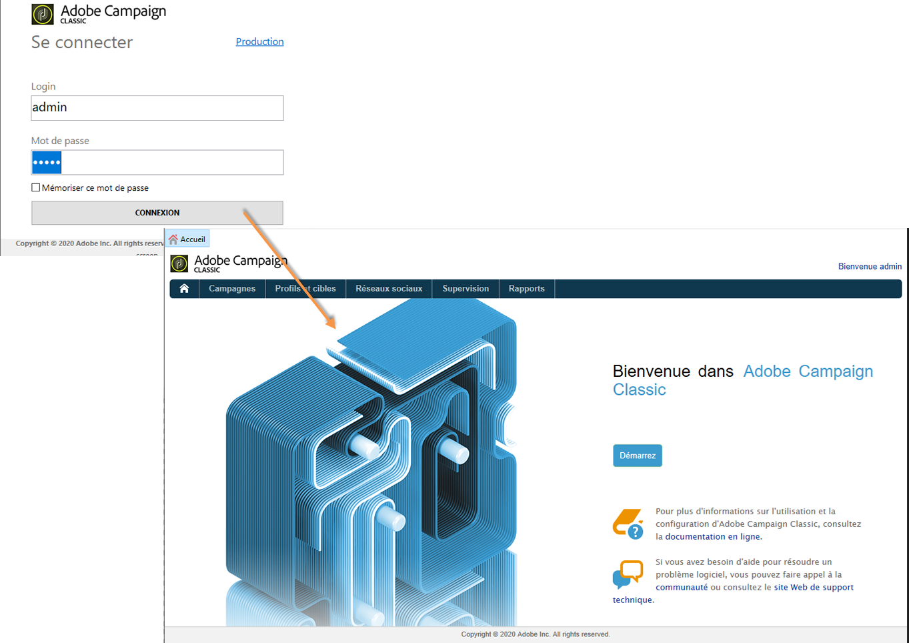
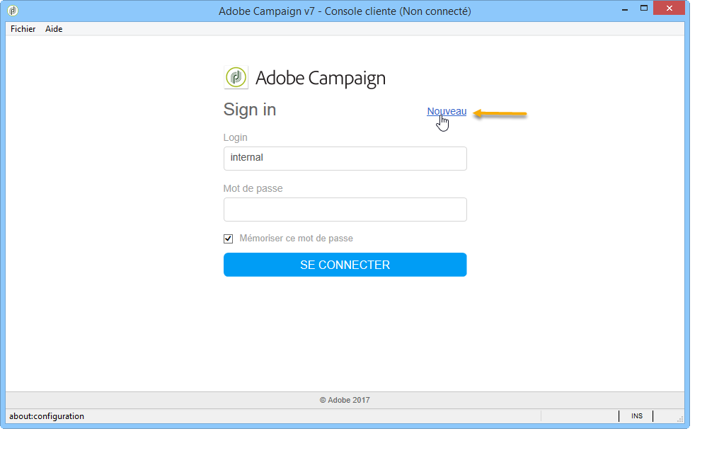
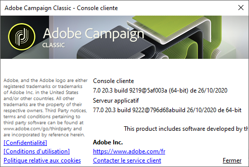

# Lancement d’Adobe Campaign {#launching-adobe-campaign}

La console cliente Campaign est un client riche qui vous permet de vous connecter à votre ou vos serveur(s) applicatif(s) Campaign. Découvrez comment télécharger et configurer la console cliente en consultant [cette page](../../installation/using/installing-the-client-console.md).

>[!CAUTION]
>
>Vérifiez la compatibilité de votre système et de vos outils avec la console cliente Adobe Campaign dans la [matrice de compatibilité](../../rn/using/compatibility-matrix.md#ClientConsoleoperatingsystems).

## Lancement d’Adobe Campaign {#starting-adobe-campaign}

Vous pouvez démarrer Adobe Campaign à partir du menu **[!UICONTROL Démarrer/Tous les programmes/Adobe Campaign v.X/Console cliente Adobe Campaign]**.

La page de connexion de la console cliente permet de configurer ou de sélectionner une base de données existante, et de s’y connecter en utilisant un identifiant et un mot de passe :

## Connexion à Adobe Campaign {#connecting-to-adobe-campaign}

### Connexion à votre Adobe ID

Les utilisateurs de Campaign se connectent à la console Adobe Campaign à l&#39;aide de leur Adobe ID, via le système IMS (Adobe Identity Management System). Ils peuvent utiliser le même identifiant pour toutes les solutions d&#39;Adobe. La connexion est enregistrée lors de l&#39;utilisation d&#39;Adobe Campaign avec d&#39;autres solutions. En savoir plus sur l’IMS d’Adobe [sur cette page](https://helpx.adobe.com/fr/enterprise/using/identity.html).

Pour configurer la connexion de Campaign Classic v7 avec Adobe Identity Management Service (IMS), consultez [cette page](../../integrations/using/about-adobe-id.md).

Une fois la configuration terminée, découvrez comment vous connecter à Campaign avec votre Adobe ID dans la documentation de [Campaign v8 (console)](https://experienceleague.adobe.com/fr/docs/campaign/campaign-v8/new/connect){target=_blank}.

### Se connecter avec un nom d’utilisateur/mot de passe

Vous pouvez également vous connecter à l’aide d’un nom d’utilisateur/mot de passe dédié. Cette connexion est appelée « Authentification native » de Campaign :

1. Saisissez l’identifiant du compte opérateur dans le champ **[!UICONTROL Login]**.

   L’identifiant vous est fourni par l’administrateur de la plateforme Adobe Campaign.

1. Saisissez votre mot de passe dans le champ **[!UICONTROL Mot de passe]**.

   La première fois que vous accédez à la base de données, votre mot de passe est celui qui vous a été attribué par l’équipe d’administration. Une fois connecté, vous pouvez modifier votre mot de passe via le menu **[!UICONTROL Outils > Changer le mot de passe…]** Des détails sur les opérateurs et les connexions sont disponibles dans [Gestion des accès](../../platform/using/access-management.md).

1. Cliquez sur **[!UICONTROL SE CONNECTER]** pour valider.

Vous pouvez maintenant accéder à l&#39;[espace de travail Adobe Campaign](../../platform/using/adobe-campaign-workspace.md).

## Configurer des connexions {#setting-up-connections}

Vous pouvez accéder aux paramètres de connexion au serveur via le lien situé au-dessus de la zone de saisie.

Découvrez comment configurer des connexions dans la documentation de [Campaign v8 (console)](https://experienceleague.adobe.com/fr/docs/campaign/campaign-v8/new/connect#create-your-connection){target=_blank}.

## Opérateurs et autorisations {#operators-and-permissions}

Les identifiants et mots de passe des opérateurs ayant accès au logiciel, ainsi que leurs autorisations respectives, sont définis par l’administrateur du système Adobe Campaign dans le nœud **[!UICONTROL Administration > Gestion des accès > Opérateurs]** de l’arborescence d’Adobe Campaign.

Cette fonctionnalité est décrite dans la section [Gestion des accès](../../platform/using/access-management.md).

## Obtention de la version d’Adobe Campaign {#getting-your-campaign-version}

Le menu **[!UICONTROL Aide > À propos...]** vous permet d’accéder aux informations suivantes :

* numéro de **version** de la console cliente Campaign et du serveur applicatif
* numéro de **build** de la console cliente Campaign et du serveur applicatif
* lien pour contacter l&#39;Assistance clientèle d&#39;Adobe
* liens vers la Politique de confidentialité, les Conditions d&#39;utilisation et la Politique relative aux cookies d&#39;Adobe

Lorsque vous contactez l&#39;équipe d&#39;Assistance clientèle d&#39;Adobe, vous devez indiquer les numéros de version et de build du serveur applicatif et de la console cliente Campaign.

