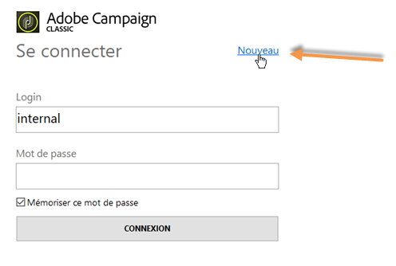
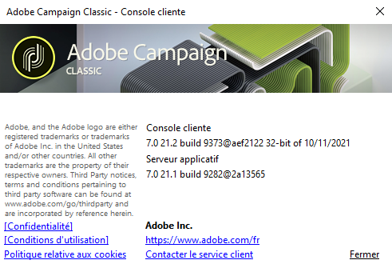

# Lancement d’Adobe Campaign{#launching-adobe-campaign}

La console cliente Campaign est un client riche qui vous permet de vous connecter à votre ou vos serveur(s) applicatif(s) Campaign. Découvrez comment télécharger et configurer la console cliente en consultant [cette page](../../installation/using/installing-the-client-console.md).

>[!CAUTION]
>
>Vérifiez la compatibilité de votre système et de vos outils avec la console cliente Adobe Campaign dans la [matrice de compatibilité](../../rn/using/compatibility-matrix.md#ClientConsoleoperatingsystems).

## Lancement d’Adobe Campaign {#starting-adobe-campaign}

Vous pouvez démarrer Adobe Campaign à partir du menu **[!UICONTROL Démarrer/Tous les programmes/Adobe Campaign v.X/Console cliente Adobe Campaign]**.

La page de connexion de la console cliente permet de configurer ou de sélectionner une base de données existante, et de s’y connecter en utilisant un identifiant et un mot de passe :

## Connexion à Adobe Campaign {#connecting-to-adobe-campaign}

Il est possible de vous connecter à Adobe Campaign via votre Adobe ID. Voir à ce sujet [cette page](../../integrations/using/about-adobe-id.md).

Vous pouvez aussi vous connecter via un login/mot de passe dédié :

1. Saisissez l’identifiant du compte opérateur dans le champ **[!UICONTROL Login]**.

   L’identifiant vous est fourni par l’administrateur de la plateforme Adobe Campaign.

1. Saisissez votre mot de passe dans le champ **[!UICONTROL Mot de passe]**.

   La première fois que vous accédez à la base de données, votre mot de passe est celui que vous aura attribué l’administrateur. Une fois que vous serez connecté, vous pourrez personnaliser votre mot de passe via le menu **[!UICONTROL Outils > Changer le mot de passe...]** Des détails sur les opérateurs et les connexions sont disponibles dans [Gestion des accès](../../platform/using/access-management.md).

1. Cliquez sur **[!UICONTROL SE CONNECTER]** pour valider.<!--You can also press the **Enter** key to launch connection.-->

Vous pouvez maintenant accéder à l’[espace de travail Adobe Campaign](../../platform/using/adobe-campaign-workspace.md).

Certains raccourcis clavier sont disponibles dans l&#39;**[!UICONTROL écran de connexion]** :
* Tous les éléments exploitables peuvent être sélectionnés à l&#39;aide de la touche **Tab** (de haut en bas) ou de la touche **Tab** + **Maj** (de bas en haut).
* Pour lancer la connexion, vous pouvez également appuyer sur la touche **Entrée**.
* Vous pouvez utiliser la touche **Échap** pour rétablir les dernières valeurs de connexion correctes dans les champs **[!UICONTROL Login]** et **[!UICONTROL Mot de passe]**.

## Configurer des connexions {#setting-up-connections}

Vous pouvez accéder aux paramètres de connexion au serveur via le lien situé au-dessus de la zone de saisie.

Dans la fenêtre **[!UICONTROL Connexions]**, cliquez sur **[!UICONTROL Ajouter > Connexion]**.

Vous devez ensuite définir les paramètres de cette connexion. Pour cela :

1. Saisissez un **[!UICONTROL libellé]** qui correspond au nom que vous souhaitez attribuer à votre connexion vers la base de données.

1. Ajoutez l’adresse du serveur applicatif dans le champ **[!UICONTROL URL]**. Si vous ne connaissez pas l’URL de connexion, contactez votre administrateur.

1. Cochez la case **[!UICONTROL Se connecter avec un Adobe ID]** pour que les opérateurs puissent se connecter à la console via leur Adobe ID. Voir à ce sujet [cette page](../../integrations/using/about-adobe-id.md).

1. Cliquez sur **[!UICONTROL OK]** pour valider.

## Opérateurs et autorisations {#operators-and-permissions}

Les identifiants et mots de passe des opérateurs ayant accès au logiciel, ainsi que leurs autorisations respectives, sont définis par l’administrateur du système Adobe Campaign dans le nœud **[!UICONTROL Administration > Gestion des accès > Opérateurs]** de l’arborescence d’Adobe Campaign.

Cette fonctionnalité est décrite dans la section [Gestion des accès](../../platform/using/access-management.md).

## Déconnexion d’Adobe Campaign {#disconnecting-from-adobe-campaign}

Pour vous déconnecter d&#39;Adobe Campaign, utilisez la première icône de la barre d&#39;icônes.

>[!NOTE]
>
>Vous pouvez également quitter directement l’application, sans vous déconnecter au préalable.

## Obtention de la version d’Adobe Campaign {#getting-your-campaign-version}

Le menu **[!UICONTROL Aide > À propos...]** vous permet d’accéder aux informations suivantes :

* numéro de **version** de la console cliente Campaign et du serveur applicatif
* numéro de **build** de la console cliente Campaign et du serveur applicatif
* lien pour contacter l&#39;Assistance clientèle d&#39;Adobe
* liens vers la Politique de confidentialité, les Conditions d&#39;utilisation et la Politique relative aux cookies d&#39;Adobe

Lorsque vous contactez l&#39;équipe d&#39;Assistance clientèle d&#39;Adobe, vous devez indiquer les numéros de version et de build du serveur applicatif et de la console cliente Campaign.

**Rubriques connexes** :

* [Options d&#39;aide et de support d&#39;Adobe Campaign](../../support.md)
* [Distribution du logiciel Adobe Campaign](https://experience.adobe.com/#/downloads/content/software-distribution/en/campaign.html)
* [Adobe Experience Cloud et sessions d&#39;experts](https://helpx.adobe.com/fr/enterprise/admin-guide.html/enterprise/using/support-for-experience-cloud.ug.html)
