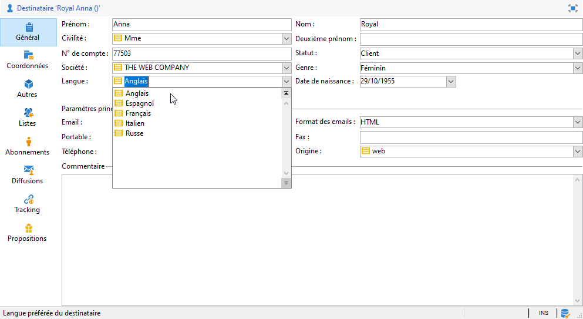

# Gestion des énumérations{#managing-enumerations}

## A propos des énumérations {#about-enumerations}

Une énumération est une liste de valeurs proposées par le système pour renseigner certains champs. Les énumérations permettent de standardiser les valeurs de ces champs et de faciliter leur saisie ou leur utilisation au sein de requêtes.

La liste de valeurs apparaît sous forme d&#39;une liste déroulante dans laquelle vous pouvez sélectionner la valeur à attribuer au champ. La liste déroulante permet également la saisie prédictive : l&#39;opérateur saisit les premières lettres et l&#39;application complète d&#39;elle-même la suite.

Un certain nombre de champs de la console ont ainsi été définis avec ce type d&#39;énumération. Ces énumérations sont dites &quot;ouvertes&quot; si vous pouvez ajouter des valeurs par une saisie directe dans le champ correspondant.

## Accès aux valeurs {#access-to-values}

La définition des valeurs des champs de ce type et l&#39;administration globale de ces champs (ajout/suppression d&#39;une valeur) s&#39;effectue depuis le nœud **[!UICONTROL Administration > Plate-forme > Enumérations]** de l&#39;arborescence.

* La section supérieure propose la liste des champs pour lesquels une énumération a été définie.
* La section inférieure liste les valeurs proposées. Ces valeurs seront reprises dans les éditeurs utilisant ce champ.

   

   Pour créer une nouvelle valeur d&#39;énumération, cliquez sur **[!UICONTROL Ajouter]**.

   

   Si l&#39;option **[!UICONTROL Ouverte]** est sélectionnée, l&#39;utilisateur peut ajouter une nouvelle valeur d&#39;énumération par saisie directe dans le champ correspondant. Un message de confirmation permet de créer cette valeur.

   

* Si l&#39;option **[!UICONTROL Fermée]** est sélectionnée, alors les utilisateurs ne pourront pas créer de nouvelles valeurs mais seulement choisir parmi les valeurs proposées.

## Normaliser les données {#standardizing-data}

### A propos de la gestion des alias {#about-alias-cleansing}

Dans les champs énumérés, il est possible de saisir d&#39;autres valeurs que les valeurs de l&#39;énumération. Ces valeurs peuvent être stockées telles quelles ou faire l&#39;objet d&#39;une normalisation.

>[!CAUTION]
>
>La normalisation des données est un processus critique qui affecte les données de la base. En effet, Adobe Campaign procède à la mise à jour en masse de données, ce qui peut impliquer la suppression de certaines valeurs. Cette opération est donc réservée à des utilisateurs avertis.

En effet, la valeur saisie peut être :

* ajoutée aux valeurs de l&#39;énumération : l&#39;option **[!UICONTROL Ouverte]** doit être cochée,
* remplacée automatiquement par son alias : cet alias doit être défini dans l&#39;onglet **[!UICONTROL Alias]** de l&#39;énumération,
* stockée dans la liste des alias : un alias pourra lui être attribué ultérieurement.

   >[!NOTE]
   >
   >Si vous devez utiliser les fonctionnalités de normalisation des données, sélectionnez l&#39;option **[!UICONTROL Support des alias]** dans l&#39;énumération.

### Utilisation des alias {#using-aliases}

L&#39;option **[!UICONTROL Support des alias]** permet de gérer les alias pour l&#39;énumération sélectionnée. Lorsque cette option est cochée, l&#39;onglet **[!UICONTROL Alias]** est ajouté en bas de la fenêtre.

#### Créer un alias {#creating-an-alias}

Pour créer un alias, cliquez sur le bouton **[!UICONTROL Ajouter]**.

Saisissez l&#39;alias à transformer et la valeur qui sera appliquée et cliquez sur **[!UICONTROL Ok]**.

Vérifiez les paramètres avant de valider cette opération.

>[!CAUTION]
>
>Une fois cette étape validée, il n&#39;est plus possible de récupérer les valeurs saisies antérieurement : les valeurs sont remplacées.

Thus, when a user enters the value **NEILSEN** in a &quot;company&quot; field (in the Adobe Campaign console or in a form), it will automatically be replaced by the value **NIELSEN Ltd**. Value replacement is performed by the **Alias cleansing** workflow. Reportez-vous à [Exécution du nettoyage](#running-data-cleansing)des données.

#### Conversion des valeurs en alias {#converting-values-into-aliases}

Pour transformer une valeur d&#39;énumération en alias, cliquez avec le bouton droit de la souris dans la liste des valeurs et sélectionnez l&#39;option **[!UICONTROL Convertir des valeurs en alias...]**.

Sélectionnez les valeurs que vous souhaitez convertir et cliquez sur le bouton **[!UICONTROL Suivant]**.

Cliquez sur **[!UICONTROL Démarrer]** pour lancer la conversion.

Une fois l&#39;exécution terminée, l&#39;alias est ajouté dans la liste des alias.

#### Récupération des apparitions des alias {#retrieving-alias-hits}

Les valeurs saisies par les utilisateurs peuvent être transformées en alias. En effet, lorsque l&#39;utilisateur saisit une valeur qui n&#39;est pas présente dans la liste des valeurs d&#39;énumération, cette valeur est stockée dans l&#39;onglet **[!UICONTROL Alias]**.

The **Alias cleansing** technical workflow recovers these values every night to update itemized list. Reportez-vous à la section [Exécution du nettoyage des données](#running-data-cleansing)

If necessary, the **[!UICONTROL Hits]** column can display the number of times this value was entered. Calculating this value can be both time and memory consuming. Pour plus d’informations, reportez-vous à la section [Calcul des occurrences](#calculating-entry-occurrences)d’entrée.

### Exécution de la normalisation des données {#running-data-cleansing}

Data cleansing is performed by the **[!UICONTROL Alias cleansing]** technical workflow. The configurations defined for enumerations are applied during execution. Reportez-vous à la section Processus [de nettoyage des](#alias-cleansing-workflow)alias.

Vous pouvez déclencher la normalisation via le lien **[!UICONTROL Uniformiser les valeurs...]**.

Le lien **[!UICONTROL Paramètres avancés...]** permet de définir la date de prise en compte des valeurs collectées.

Cliquez sur le bouton **[!UICONTROL Démarrer]** pour lancer l&#39;uniformisation des données.

#### Calcul des occurrences de saisie {#calculating-entry-occurrences}

Le sous-onglet **[!UICONTROL Alias]** d&#39;une énumération peut afficher le nombre d&#39;apparitions d&#39;un alias parmi toutes les valeurs saisies. Cette information est une estimation. Elle s&#39;affichera dans la colonne **[!UICONTROL Hits]**.

>[!CAUTION]
>
>Le calcul des occurrences de saisie d&#39;un alias peut être long. Cette fonctionnalité doit par conséquent être utilisée avec précaution.

Vous pouvez lancer le calcul des occurrences ponctuellement, via le lien **[!UICONTROL Uniformiser les valeurs...]**. Pour cela, cliquez sur le lien **[!UICONTROL Paramètres avancés...]** et sélectionnez la ou les options souhaitées.

* **[!UICONTROL Actualiser le nombre d&#39;apparitions des alias]** : permet de mettre à jour les occurrences déjà calculées, à partir de la date de prise en compte renseignée.
* **[!UICONTROL Recalculer depuis le début le nombre d&#39;apparitions des alias]** : permet de réinitialiser tout le calcul sur l&#39;ensemble de la plate-forme Adobe Campaign.

Vous pouvez également créer un workflow dédié afin que ce calcul s&#39;exécute automatiquement pour une période donnée, par exemple toutes les semaines.

Pour cela, créez une copie du workflow **[!UICONTROL Gestion des alias]**, modifiez le planificateur et utilisez les paramètres suivants dans l&#39;activité **[!UICONTROL Uniformisation des valeurs des énumérations]** :

* **-updateHits** pour mettre à jour le nombre d&#39;accès d&#39;alias,
* **-updateHits:full** pour recalculer toutes les apparitions des alias.

#### Workflow de gestion des alias {#alias-cleansing-workflow}

Le workflow **Gestion des alias** exécute la normalisation des valeurs d&#39;énumération. Par défaut, sa fréquence d&#39;exécution est quotidienne.

Il est accessible à partir du noeud **[!UICONTROL Administration > Exploitation > Workflows techniques]**.

