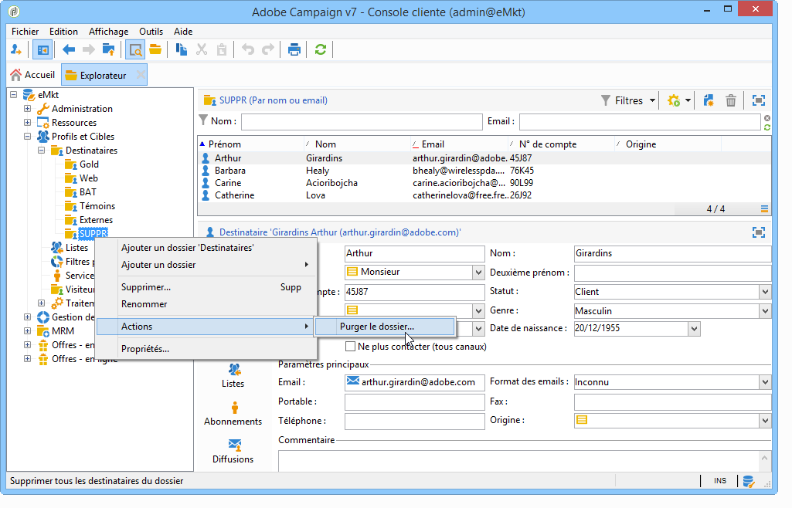
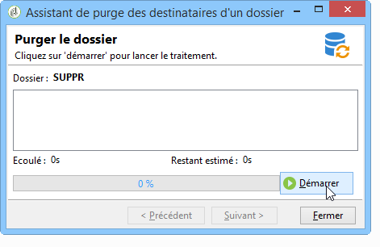

# Gestion des profils{#managing-profiles}

## Arborescence des destinataires {#recipient-tree}

Pour accéder aux fonctionnalités avancées de gestion des destinataires, vous devez éditer l&#39;arborescence d&#39;Adobe Campaign. Pour cela, cliquez sur le bouton **[!UICONTROL Explorateur]** de la barre d&#39;outils.

Le dossier des destinataires est positionné par défaut sous le noeud **[!UICONTROL Profils et cibles]** de l&#39;arborescence d&#39;Adobe Campaign. Vous pouvez créer, à partir du même noeud, un ou plusieurs dossiers et sous-dossiers afin d&#39;y stocker les profils des destinataires.

Chaque noeud correspond à un dossier. Les données de chaque dossier doivent être considérées comme cloisonnées les unes des autres. Ainsi, dans le cas de dossiers de destinataires multiples, la gestion des doublons sera plus délicate.

>[!NOTE]
>
> * Pour afficher la liste de tous les destinataires de la base, vous devez créer une vue. En savoir plus dans la section [Dossiers et vues](../../platform/using/access-management-folders.md).
> * Pour en savoir plus sur la gestion des profils, consultez la [documentation de Campaign v8](https://experienceleague.adobe.com/fr/docs/campaign/campaign-v8/config/configuration/folders-and-views){target=_blank}.

<!--
## Move recipients {#moving-recipients}

You can select one or more recipients, drag them from the recipient list, and drop them in the desired folder. A warning message asks you to confirm this action.

## Copy a recipient {#copying-a-recipient}

You can copy a recipient in the same folder by right-clicking the desired recipient and selecting **[!UICONTROL Copy]**.

## Delete recipients {#deleting-recipients}

To delete recipients, move them to a specific folder and then purge the content of this folder. It is **strongly recommended not to use** the **[!UICONTROL Delete]** option in this case.

To purge a folder, use the **[!UICONTROL Actions > Purge folder]** menu, accessed by right-clicking the desired folder.

Click **[!UICONTROL Start]** to launch the operation. The middle section of the window displays the progress status, as shown below:

-->