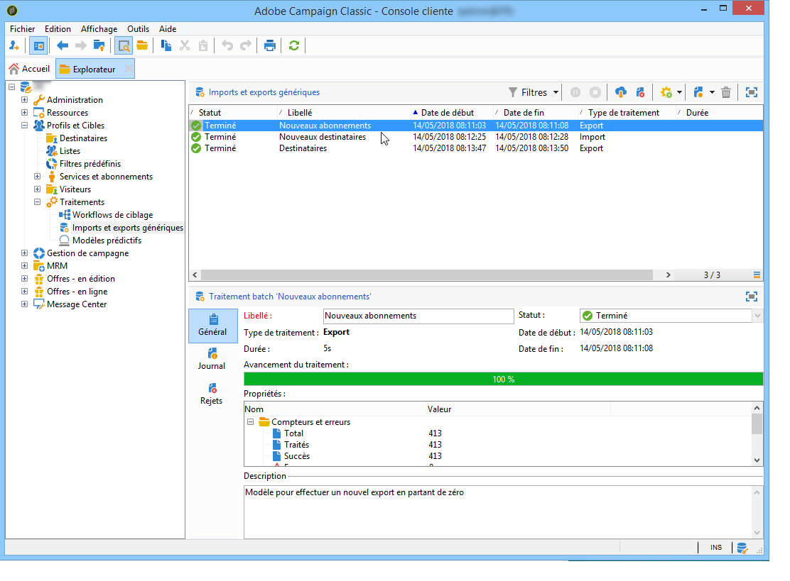
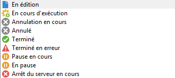

# Surveillance de l’exécution des traitements {#monitoring-job-execution}

Vous pouvez suivre l&#39;exécution de vos traitements d&#39;import et d&#39;export directement depuis la liste des traitements d&#39;import/export.

* L&#39;onglet **[!UICONTROL Journal]** permet de consulter les messages de logs relatifs à l&#39;exécution.
* L’onglet **[!UICONTROL Rejets]** contient les enregistrements rejetés. Consultez [cette section](../../platform/using/executing-import-jobs.md#behavior-in-the-event-of-an-error).

Dans l&#39;onglet **[!UICONTROL Général]**, le champ **[!UICONTROL Statut]** indique le statut actuel d&#39;un traitement.

Chaque statut est représenté par une icône et un libellé spéciaux. Les statuts et leurs icônes sont répertoriés ci-dessous :

* **Edition en cours**

  Traitement en cours de création.

* **En cours d&#39;exécution**

  Traitement en cours d&#39;exécution.

* **Annuler**

  Clic sur le bouton **[!UICONTROL Annuler]** : l&#39;annulation du traitement en cours.

* **Annulation en cours**

  La commande d&#39;annulation a été prise en compte et le traitement est en cours d&#39;annulation.

* **Pause en cours**

  Clic sur le bouton **[!UICONTROL Pause]** : la suspension du traitement est en cours.

* **En pause**

  Clic sur le bouton **[!UICONTROL Pause]** : le traitement est suspendu. Il peut être relancé via le bouton **[!UICONTROL Démarrer]**.

* **Terminé**

  Exécution du traitement terminée.

* **Terminé en erreur**

  Le traitement n&#39;a pas été exécuté à cause d&#39;une erreur technique.

* **Arrêt du serveur en cours**

  Le traitement en cours est interrompu à cause d&#39;un arrêt du serveur Adobe Campaign.
