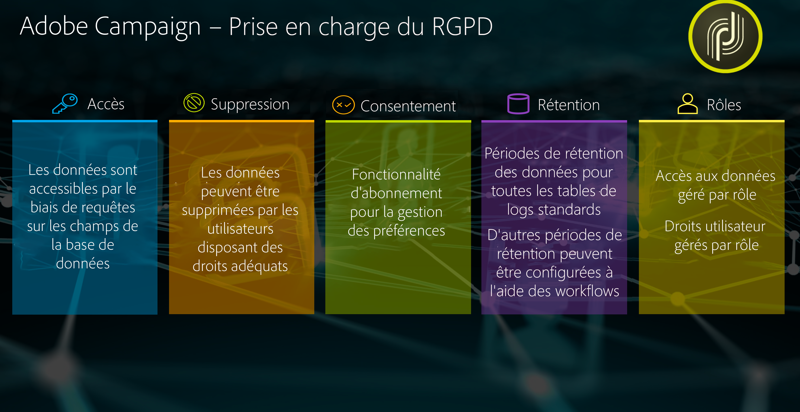
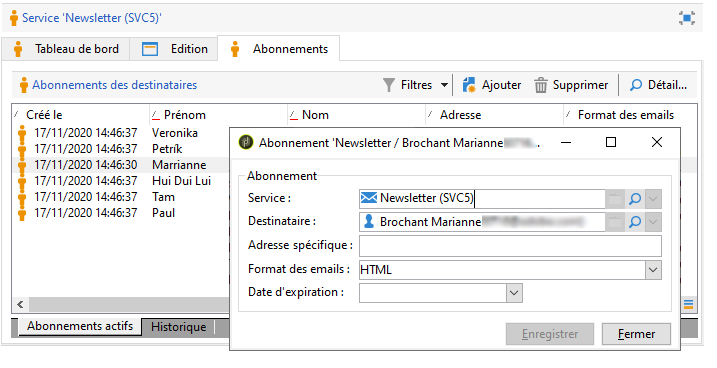
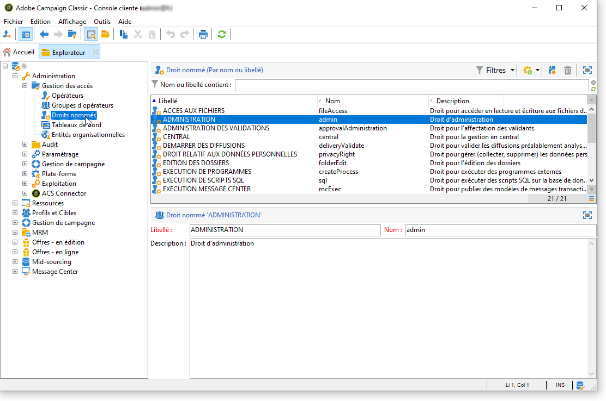

# Gestion de la confidentialité {#privacy-management}

Adobe Campaign propose un ensemble d’outils pour vous aider à vous conformer aux [règlements sur la protection des données](#privacy-management-regulations) (notamment RGPD, CCPA, PDPA, LGPD).

Voici les cinq principales fonctionnalités fournies par Adobe Campaign pour garantir le respect des réglementations en matière de confidentialité :

* **Droit d’accès**
* **Droit de suppression**
* **Gestion du consentement**
* **Conservation des données**
* **Gestion des droits**

Pour plus d’informations, consultez la section [Droit d&#39;accès et droit à l&#39;oubli](#right-access-forgotten) et [Consentement, conservation des données et rôles](#consent-retention-roles).

<!--This section presents general information on what Privacy management is and the features provided by Adobe Campaign to manage the [Right to Access and Right to be Forgotten](#right-access-forgotten).

It also contains information on important features to manage Privacy ([Consent, Retention and Roles](#consent-retention-roles)), as well as best practices to help you with your Privacy compliance when using Adobe Campaign.-->

## Règlements relatifs à la gestion de la confidentialité {#privacy-management-regulations}

Les fonctionnalités d’Adobe Campaign vous aident à respecter les règlements suivants :

* **Le RGPD** (Règlement général sur la protection des données) est une loi de l’Union européenne (UE) qui concerne la protection de la vie privée. Celui-ci harmonise et modernise les exigences en matière de protection des données pour les pays de l’UE.
* **Le CCPA** (California Consumer Privacy Act) fournit aux résidents de la Californie de nouveaux droits relatifs à leurs informations personnelles et impose des responsabilités en matière de protection des données à certaines entités qui exercent une activité en Californie.
* **Le PDPA** (Personal Data Protection Act) est une nouvelle loi sur la protection de la vie privée qui harmonise et modernise les exigences en matière de protection des données en Thaïlande.
* **La LGPD** (Lei Geral de Proteção de Dados) s’applique à toutes les sociétés qui collectent ou traitent des données personnelles au Brésil.
* **La CASL** (Canadian Anti-Spam Law, ou LCAP, Loi Canadienne Anti-Pourriel) inclut tous les messages envoyés vers le Canada ou à partir du Canada, mais n’inclut pas les messages qui transitent par le Canada.
* **Le VCDPA** (Virginia Consumer Data Protection Act) et le **CPA** (Colorado Privacy Act) s’appliquent à toutes les entreprises qui exercent une activité ou ciblent des résidents dans ces États.

Toutes ces législations s’appliquent aux clientes et aux clients Adobe Campaign qui détiennent des données de titulaires de données résidant dans les régions ou pays respectifs mentionnés ci-dessus.

<!--Several Privacy capabilities are available in Adobe Campaign, including consent management, data retention settings, and rights management. See [Consent, Retention and Roles](#consent-retention-roles). In addition to this, Adobe Campaign helps facilitate your readiness as Data Controller for certain Privacy requests. See [Right to Access and Right to be Forgotten](#right-access-forgotten).-->

>[!NOTE]
>
>Pour plus d’informations sur les données personnelles et sur les différentes entités qui gèrent les données (contrôleur de données, responsable du traitement des données et titulaire de données), consultez la section [Données personnelles et personas](../../platform/using/privacy-and-recommendations.md#personal-data).

## Droit d’accès et droit à l’oubli {#right-access-forgotten}

Pour faciliter la préparation à la protection des données, Adobe Campaign permet désormais de gérer les demandes d’**accès** et de **suppression**.

* Le **droit d’accès** permet au titulaire de données de demander au contrôleur de données si les données personnelles le concernant sont traitées ou non, et le cas échéant, de savoir où et à quelles fins elles le sont. Le contrôleur de données doit fournir gratuitement une copie des données personnelles dans un format électronique.

* Également appelé « Effacement de données », le **Droit à l’oubli** (demande de suppression) autorise le titulaire de données à demander au contrôleur de données d’effacer ses données personnelles, de cesser la diffusion des données et de faire éventuellement cesser le traitement des données par des tiers.

Pour découvrir comment créer des demandes d’**accès** et de **suppression**, ainsi que leur traitement par Adobe Campaign, consultez la section [Étapes d’implémentation](../../platform/using/privacy-requests.md).

<!--Tutorials on Privacy management in Campaign Standard are also available [here](https://experienceleague.adobe.com/docs/campaign-standard-learn/tutorials/privacy/privacy-overview.html).
https://experienceleague.adobe.com/docs/campaign-standard-learn/tutorials/privacy/privacy-overview.html-->

## Consentement, conservation des données et rôles {#consent-retention-roles}

En plus des récentes options **Droit d’accès** et **Droit à l’oubli**, Adobe Campaign propose d’autres fonctionnalités importantes qui sont essentielles pour la protection des données :

* [Gestion du consentement](#consent-management) : fonctionnalité d&#39;abonnement pour la gestion des préférences.
* [Conservation des données](#data-retention) : périodes de conservation des données pour toutes les tables de logs d&#39;usine ; des périodes de conservation supplémentaires peuvent être configurées avec des workflows.
* [Gestion des droits](#rights-management) : accès aux données géré par les droits nommés

### Gestion du consentement {#consent-management}

Le consentement signifie l&#39;accord donné par le titulaire des données pour le traitement des données personnelles le concernant. C&#39;est le contrôleur des données qui est responsable d&#39;obtenir les consentements nécessaires pour ce traitement. Bien qu&#39;Adobe Campaign puisse proposer certaines fonctionnalités permettant à un client de gérer les consentements relatifs au service, Adobe n&#39;est pas responsable des consentements. Les clients doivent collaborer avec leurs services juridiques pour établir leurs propres procédures et pratiques pour tout consentement nécessaire.

Depuis le début, Adobe Campaign se sert de certaines fonctionnalités pour gérer certains aspects du consentement. Grâce au processus de gestion des abonnements, les clients peuvent déterminer quels destinataires ont choisi quel type d’abonnement, qu’il s’agisse de newsletters, de promotions quotidiennes ou hebdomadaires ou de tout autre type de programme marketing.

Pour en savoir plus sur la gestion du consentement, consultez la [documentation détaillée](../../delivery/using/managing-subscriptions.md).

Outre les outils de gestion du consentement fournis par Adobe Campaign, vous pouvez suivre si un client s’est opposé à la vente de ses informations personnelles. Consultez [cette section](../../platform/using/privacy-requests.md#sale-of-personal-information-ccpa).

### Conservation des données {#data-retention}

En ce qui concerne la conservation des données, les tables de logs d&#39;usine de Campaign possèdent des périodes de conservation prédéfinies, limitant généralement le stockage des données à 6 mois ou moins.

Vous trouverez ci-dessous les valeurs de conservation par défaut pour les tables d&#39;usine. Notez que la configuration de conservation est définie par les administrateurs techniques Adobe lors de la mise en œuvre et que les valeurs peuvent varier pour chaque mise en œuvre, selon les exigences du client.

* **Tracking consolidé** : 1 an
* **Logs de diffusion** : 6 mois
* **Logs de tracking** : 1 an
* **Diffusions supprimées** : 1 semaine
* **Rejets d&#39;imports** : 6 mois
* **Profils des visiteurs** : 1 mois
* **Propositions d&#39;offres** : 1 an
* **Événements** : 1 mois
* **Statistiques du traitement des événements** : 1 an
* **Événements archivés** : 1 an
* **Événements Pipeline ignorés** : 1 mois
* **Rapports dynamiques** : 13 mois

Tout comme pour la suppression, il est possible de configurer des périodes de conservation des données pour des tables personnalisées en utilisant les fonctionnalité standard des workflows.

Pour en savoir plus sur la conservation des données ou pour définir des périodes de conservation pour les tables personnalisées, contactez les consultants ou les administrateurs techniques d&#39;Adobe.

### Gestion des droits {#rights-management}

Adobe Campaign permet de gérer les droits assignés aux divers opérateurs Campaign par l&#39;intermédiaire de différents rôles préconfigurés ou personnalisés.

Vous pouvez ainsi gérer qui, dans votre entreprise, peut accéder à différents types de données. Par exemple, plusieurs spécialistes marketing peuvent couvrir des secteurs géographiques différents en n’ayant accès qu’aux données de leur secteur.

De même, cette fonctionnalité vous permet également de configurer différentes fonctions pour chaque utilisateur, notamment la limitation des personnes autorisées à envoyer des diffusions, ou plus important encore pour la gestion de la confidentialité, celles qui peuvent modifier ou exporter des données.

Pour en savoir plus sur la gestion des accès, consultez la [documentation détaillée](../../platform/using/access-management.md).
