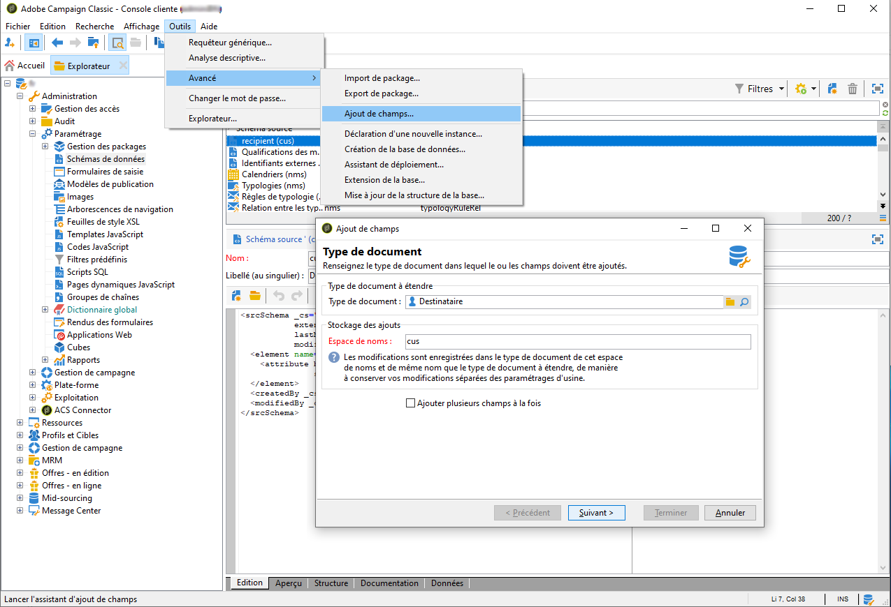
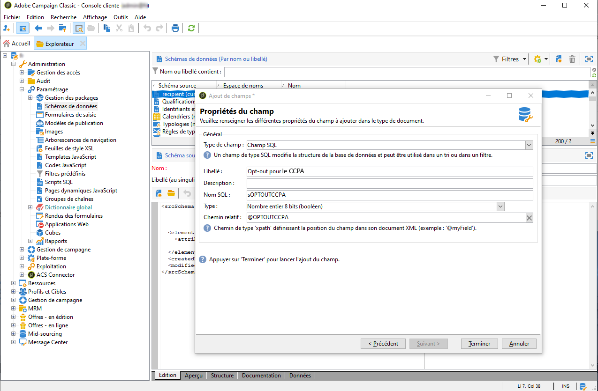
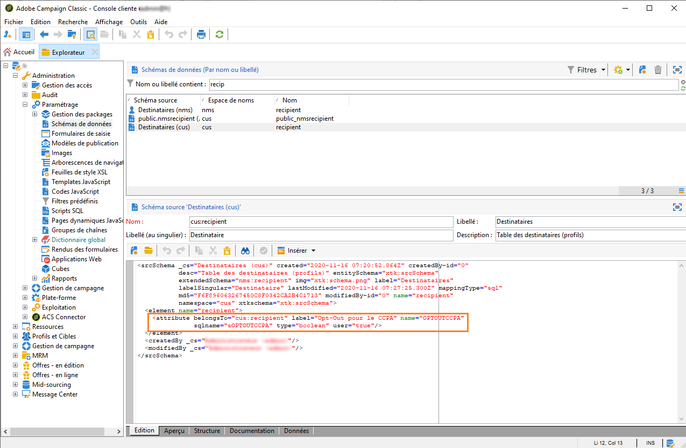
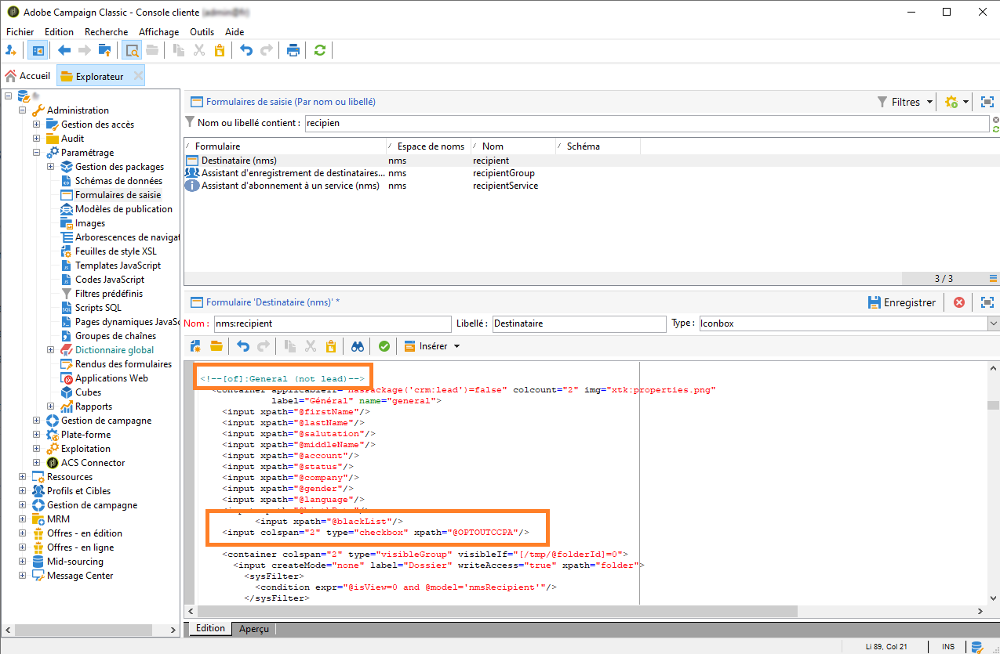
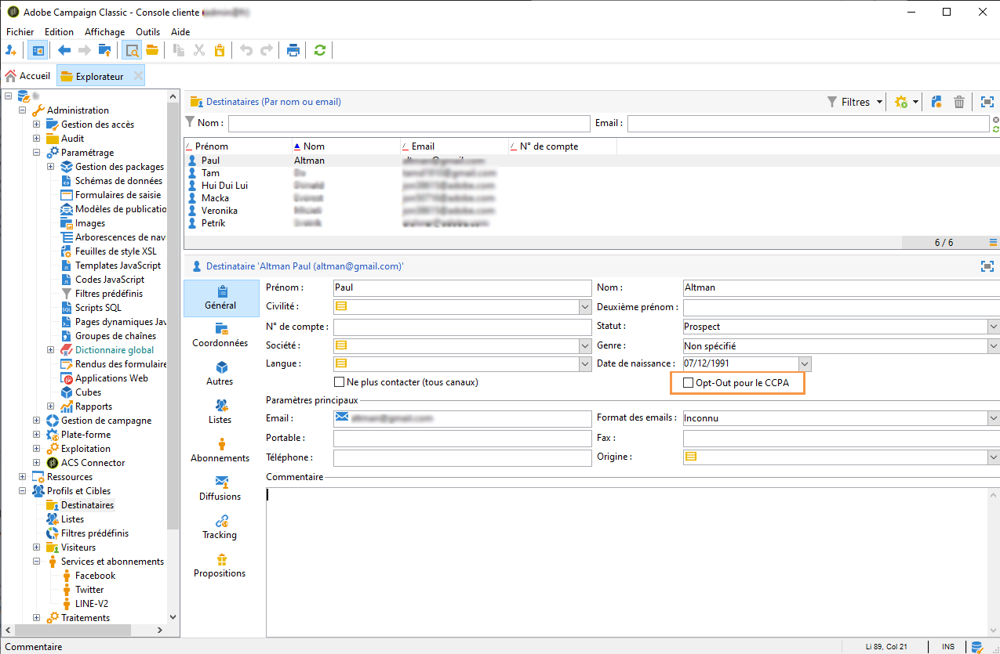
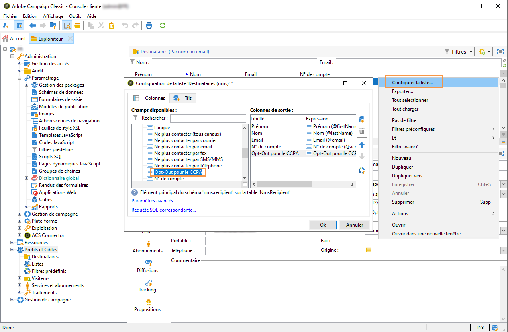
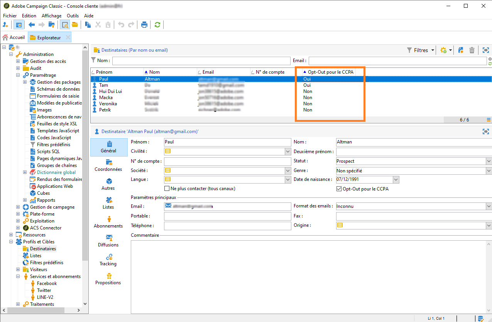

# Droit d&#39;opposition (opt-out) à la vente des informations personnelles (CCPA) {#sale-of-personal-information-ccpa}


Le **CCPA** (California Consumer Privacy Act) fournit aux résidents de la Californie de nouveaux droits relatifs aux informations personnelles et impose des responsabilités en matière de protection des données à certaines entités qui exercent des activités en Californie.

La configuration et l&#39;usage des demandes d&#39;accès et de suppression sont identiques pour le RGPD et le CCPA. Cette section présente le processus d’opt-out à la vente des données personnelles, qui est spécifique au CCPA.

Outre les outils de [gestion du consentement](privacy-management.md#consent-management) fournis par Adobe Campaign, vous pouvez suivre si un client s’est opposé à la vente de ses informations personnelles.

Les contacts peuvent décider, par l’intermédiaire de votre système, qu’ils n’autorisent pas la vente de leurs informations personnelles à un tiers. Avec Adobe Campaign, vous pourrez stocker et suivre ces informations.

Pour que cela fonctionne, vous devez étendre la table Profils et ajouter un champ **[!UICONTROL Opt-out pour le CCPA]**.

>[!IMPORTANT]
>
>En tant que contrôleur des données, il vous incombe de recevoir la demande du titulaire des données et de suivre les dates de la demande pour le CCPA. En tant que fournisseur de technologie, nous offrons uniquement une option d&#39;opt-out. Pour plus d&#39;informations sur votre rôle en tant que contrôleur de données, voir [Données personnelles et personnes concernées](privacy-and-recommendations.md#personal-data).

## Prérequis {#ccpa-prerequisite}

Pour exploiter ces informations, vous devez créer ce champ dans Adobe Campaign Classic. Pour ce faire, vous allez ajouter un champ booléen à la table **[!UICONTROL Destinataire]**. Lorsqu&#39;un champ est créé, il est automatiquement pris en charge par l&#39;API Campaign.

Si vous utilisez une table de destinataires personnalisée, vous devez également effectuer cette opération.

Pour plus d&#39;informations sur la création d&#39;un champ, reportez-vous à la [documentation sur l&#39;édition de schémas](../../configuration/using/about-schema-edition.md).

>[!IMPORTANT]
>
>La modification des schémas est une opération sensible qui ne doit être effectuée que par des utilisateurs experts.

1. Cliquez sur **[!UICONTROL Outils]** > **[!UICONTROL Avancé]** > **[!UICONTROL Ajout de champs]**, sélectionnez **[!UICONTROL Destinataires]** comme **[!UICONTROL Type de document]** et cliquez sur **[!UICONTROL Suivant]**. Pour plus d&#39;informations sur l&#39;ajout de champs à une table, consultez [cette section](../../configuration/using/new-field-wizard.md).

   

1. Pour le **[!UICONTROL Type de champ]**, sélectionnez **[!UICONTROL Champ SQL]**. Pour le Libellé, utilisez **[!UICONTROL Opt-out pour le CCPA]**. Sélectionnez le type **[!UICONTROL Nombre entier 8 bits (boolean)]** et définissez le **[!UICONTROL Chemin relatif]** unique suivant : @OPTOUTCCPA. Cliquez sur **[!UICONTROL Terminer]**.

   

   Cette opération va étendre ou créer le schéma **[!UICONTROL Destinataire (cus)]**. Cliquez dessus pour vérifier que le champ a été correctement ajouté.

   

1. Cliquez sur le nœud **[!UICONTROL Configuration]** > **[!UICONTROL Formulaires de saisie]** de l&#39;explorateur. Dans **[!UICONTROL Destinataire (nms)]**, sous &quot;Package général&quot;, ajoutez un élément `<input>` et utilisez, pour la valeur xpath, le chemin relatif défini à l&#39;étape 2. Pour plus d&#39;informations sur l&#39;identification d&#39;un formulaire, consultez [cette section](../../configuration/using/identifying-a-form.md).

   ```
   <input  colspan="2" type="checkbox" xpath="@OPTOUTCCPA"/>
   ```

   

1. Déconnectez-vous et reconnectez-vous. Suivez les étapes décrites dans la prochaine section afin de vérifier que le champ est disponible dans les détails d&#39;un destinataire.

## Usage {#usage}

Il est de la responsabilité du contrôleur de données d&#39;indiquer la valeur du champ et de suivre les règles et les directives du CCPA relatives à la vente des données.

Pour indiquer les valeurs, plusieurs méthodes peuvent être utilisées :

* à l&#39;aide de l&#39;interface de Campaign en éditant les détails du destinataire ;
* Utilisation de l&#39;API
* Par l&#39;intermédiaire d&#39;un workflow d&#39;import de données.

Vous devez ensuite vous assurer de ne jamais vendre à une quelconque tierce partie les informations personnelles des profils qui s&#39;y sont opposés.

1. Pour modifier le statut d&#39;opt-out, accédez à **[!UICONTROL Profils et cible]** > **[!UICONTROL Destinataires]** et sélectionnez un destinataire. Sous l&#39;onglet **[!UICONTROL Général]**, vous trouverez le champ configuré dans la section précédente.

   

1. Configurez la liste des destinataires pour qu&#39;elle affiche la colonne d&#39;opt-out. Pour savoir comment configurer des listes, consultez la [documentation détaillée](../../platform/using/adobe-campaign-workspace.md#configuring-lists).

   

1. Vous pouvez cliquer sur la colonne pour trier les destinataires en fonction des informations d&#39;opt-out. Vous pouvez également créer un filtre en vue d&#39;afficher uniquement les destinataires qui ont exercé leur droit d&#39;opposition. Pour plus d&#39;informations sur la création de filtres, consultez [cette section](../../platform/using/creating-filters.md).

   
