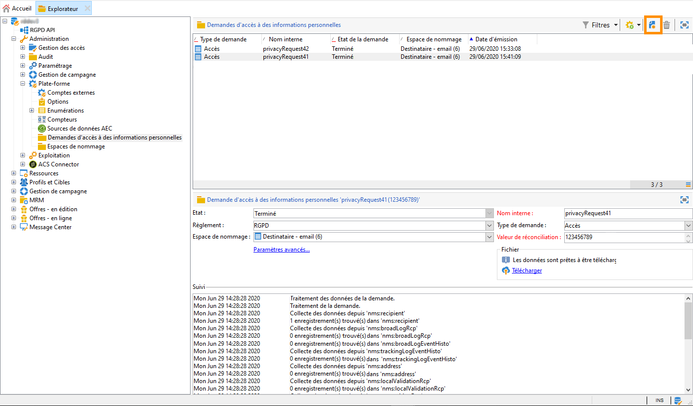
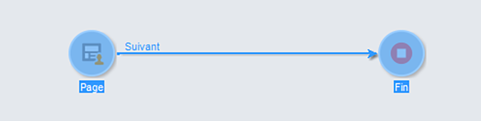

# Créer et gérer les demandes d’accès à des informations personnelles {#privacy-request-ui}


Cette section décrit comment créer des demandes d’accès et de suppression et comment elles sont traitées par Adobe Campaign.

## Créer une demande d’accès à des informations personnelles {#create-privacy-request-ui}

L&#39;**interface d&#39;Adobe Campaign** permet de créer des demandes d&#39;accès à des informations personnelles et de suivre leur évolution. Pour créer une demande d&#39;accès à des informations personnelles, procédez comme suit :

1. Accédez au dossier de demandes d&#39;accès aux informations personnelles sous **[!UICONTROL Administration]** > **[!UICONTROL Plateforme]** > **[!UICONTROL Demandes d&#39;accès aux informations personnelles]**.

   

1. Cet écran affiche toutes les demandes d&#39;accès à des informations personnelles en cours, leur statut et leurs logs. Cliquez sur **[!UICONTROL Nouveau]** pour créer une demande d&#39;accès à des informations personnelles.

   

1. Sélectionnez le **[!UICONTROL Règlement]** (RGPD, CCPA, PDPA ou LGPD), le **[!UICONTROL type de demande]** (Accès ou Suppression), sélectionnez un **[!UICONTROL Espace de noms]** et entrez la **[!UICONTROL valeur de réconciliation]**. Si vous utilisez l’e-mail comme espace de noms, saisissez l’adresse e-mail du titulaire de données.

   

Les workflows techniques d&#39;accès à des informations personnelles s&#39;exécutent une fois par jour et traitent chaque nouvelle demande :

* Demande de suppression : les données du destinataire stockées dans Adobe Campaign sont effacées.
* Demande d&#39;accès : les données du destinataire stockées dans Adobe Campaign sont générées au format XML et accessibles sur la gauche de l&#39;écran de la demande d&#39;accès.


## Liste des tables {#list-of-tables}

Lors de l’exécution d’une demande d’accès ou de suppression de données personnelles, Adobe Campaign recherche toutes les données du titulaire des données en fonction de la **[!UICONTROL Valeur de réconciliation]** dans toutes les tables ayant un lien avec la table du destinataire (type own).

Voici la liste des tables d&#39;usine qui sont prises en compte lors de l&#39;exécution des demandes d&#39;accès à des données personnelles :

* Destinataires (recipient)
* Log de diffusion des destinataires (broadLogRcp)
* Log de suivi des destinataires (trackingLogRcp)
* Log de diffusion d&#39;un événement historisé (broadLogEventHisto)
* Contenu des listes de destinataires (rcpGrpRel)
* Proposition d&#39;offre d&#39;un visiteur (propositionVisitor)
* Visiteurs (visitor)
* Historique d&#39;abonnement (subHisto)
* Abonnements (subscription)
* Proposition d&#39;offre d&#39;un destinataire (propositionRcp)

Si vous avez créé des tables personnalisées ayant un lien avec la table du destinataire (type own), celles-ci sont également prises en compte. Par exemple, si une table de transaction est liée à la table du destinataire et si une table de détails de transaction est liée à la table de transaction, elles sont toutes deux prises en compte.

>[!IMPORTANT]
>
>Si vous effectuez des demandes d&#39;accès à des informations personnelles par lots à l&#39;aide des workflows de suppression de profil, tenez compte des remarques suivantes :
>* La suppression de profil par le biais des workflows ne traite pas les tables enfants.
>* Vous devez gérer la suppression pour toutes les tables enfants.
>* Adobe recommande de créer un workflow ETL qui ajoute les lignes à supprimer dans la table Accès à des informations personnelles et de laisser le workflow **[!UICONTROL Supprimer les données de demande d&#39;accès à des informations personnelles]** effectuer la suppression. Nous suggérons de limiter à 200 profils par jour la suppression pour des raisons de performances.

## États des demandes d&#39;accès à des informations personnelles {#privacy-request-statuses}

Voici les différents états des demandes d&#39;accès à des informations personnelles :

* **[!UICONTROL Nouveau]**/**[!UICONTROL Reprise en attente]** : en cours, le workflow n&#39;a pas encore traité la demande.
* **[!UICONTROL Traitement]**/**[!UICONTROL Reprise en cours]** : le workflow traite la demande.
* **[!UICONTROL Suppression en attente]** : le workflow a identifié toutes les données du destinataire à supprimer.
* **[!UICONTROL Suppression en cours]** : le workflow traite la suppression.
* **[!UICONTROL Confirmation de suppression en attente]** : (demande de suppression dans le mode de processus en 2 étapes) - le workflow a traité la demande d&#39;accès. Une confirmation manuelle est requise pour effectuer la suppression. Le bouton est disponible pendant 15 jours.
* **[!UICONTROL Terminé]** : le traitement de la demande s&#39;est terminé sans erreur.
* **[!UICONTROL Erreur]** : le workflow a rencontré une erreur. La raison apparaît dans la colonne **[!UICONTROL Statut de la demande]** de la liste des demandes d’accès aux informations personnelles. Par exemple, le statut **[!UICONTROL Erreur : données introuvables]** indique qu’aucune donnée du destinataire correspondant à la **[!UICONTROL Valeur de réconciliation]** du titulaire des données n’a été trouvée dans la base de données.

## Processus en 2 étapes {#two-step-process}

Le **processus en 2 étapes** est activé par défaut. Lorsque vous créez une demande de suppression à l&#39;aide de ce mode, Adobe Campaign effectue toujours en premier une demande d&#39;accès. Vous pouvez ainsi vérifier les données avant de confirmer la suppression.

Vous pouvez modifier ce mode dans l&#39;écran d&#39;édition des demandes d&#39;accès à des informations personnelles. Cliquez sur **[!UICONTROL Paramètres avancés]**.


Lorsque le mode en 2 étapes est activé, une nouvelle demande de suppression passe en statut **[!UICONTROL Confirmation de suppression en attente]**. Téléchargez le fichier XML généré depuis l&#39;écran des demandes d&#39;accès à des informations personnelles et vérifiez les données. Pour confirmer l&#39;effacement des données, cliquez sur le bouton **[!UICONTROL Confirmer la suppression des données]**.


## URL JSSP {#jspp-url}

Lors du traitement des demandes d&#39;accès, Adobe Campaign génère une JSSP qui récupère les données du destinataire dans la base de données et les exporte vers un fichier XML stocké sur la machine locale. L&#39;URL JSSP est définie ci-dessous :

```
"$(serverUrl)+'/nms/gdpr.jssp?id='+@id"
```

Où @id correspond à l&#39;identifiant de demande d&#39;accès aux informations personnelles.

Cette URL est stockée dans le champ **[!UICONTROL &quot;Emplacement du fichier&quot; (@urlFile)]** du schéma **[!UICONTROL Demandes d&#39;accès aux informations personnelles (gdprRequest)]**.

L&#39;information est disponible dans la base de données pendant 90 jours. Une fois la demande nettoyée par le workflow technique, l&#39;information est supprimée de la base de données et l&#39;URL devient obsolète. Vérifiez que l&#39;URL est encore valide avant de télécharger les données depuis une page web.

Voici un exemple de fichier de données d’un titulaire de données :


Les contrôleurs de données peuvent facilement créer une application web comprenant l’URL JSSP correspondante pour que le fichier de données du titulaire des données soit disponible sur une page web.


Voici un élément de code que vous pouvez utiliser comme exemple dans l&#39;activité **[!UICONTROL Page]** de l&#39;application web.



```
<!DOCTYPE html PUBLIC "-//W3C//DTD XHTML 1.0 Transitional//EN" "http://www.w3.org/TR/xhtml1/DTD/xhtml1-transitional.dtd"> <html xmlns="http://www.w3.org/1999/xhtml"> <head> <meta http-equiv="Content-Language" content="en"> <meta http-equiv="Content-Type" content="text/html; charset=utf-8" /> <link rel="stylesheet" type="text/css" href="/nl/webForms/landingPage.css"/> <title>Clickthrough</title> <style type="text/css" media="all"> /* override formulary area */ .formulary { top: 200px; position: absolute; left: 0; } </style> </head> <body style="" class="">
<center>
<div id="wrap">
<div id="header">
<div class="header-title center-title">DOWNLOAD GDPR DATA</div>
<div class="formulary center-formulary"><form>
<div class="button large-button"><a href=[SERVER_URL]/nms/gdpr.jssp?id=13000" data-nl-type="externalLink">CLICK TO DOWNLOAD</a></div>
</form></div>
</div>
<div id="content">
<div class="row">
<div class="info">
<div class="desc">
<div class="title">EFFICIENCY</div>
<div class="desc">Our service is guaranteed to improve your efficiency. Increase performance and use our high-technology service to implement even the most ambitious of projects.</div>
</div>
</div>
</div>
</div>
<div id="footer">
<div style="text-align: center;">
<div style="float: left;"><a href="#">Contact us</a></div>
<div style="float: right;">&copy; Copyrights</div>
<div><a href="#"></a> <a href="#"></a> <a href="#"></a> <a href="#"></a></div>
</div>
</div>
</div>
</center>
</body> </html>
```

En raison des restrictions d’accès au fichier de données du titulaire de données, l’accès anonyme à une page web doit être désactivé. Seul un opérateur avec le droit nommé **[!UICONTROL Droit relatif aux données personnelles]** peut se connecter à la page et télécharger les données.
