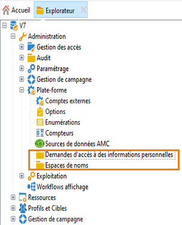
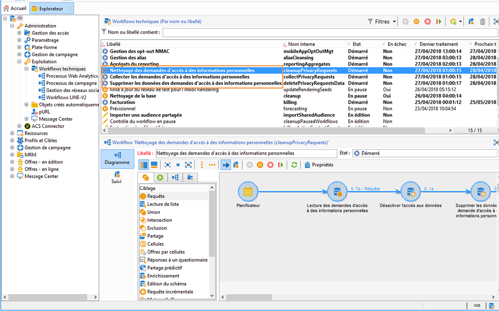
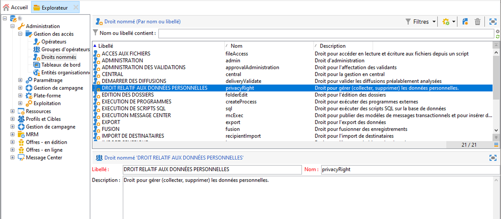

# À propos des demandes d&#39;accès à des informations personnelles {#privacy-requests}

Pour obtenir une présentation générale de la gestion de la protection des données, consultez [cette section](privacy-management.md).

Ces informations s&#39;appliquent au RGPD, au CCPA, au PDPA et au LGPD. Pour plus d&#39;informations sur ces règlementations, consultez [cette section](privacy-management.md#privacy-management-regulations).

>[!NOTE]
>
>Le droit d&#39;opposition (opt-out) à la vente des informations personnelles, spécifique au CCPA, est expliqué dans [cette section](#sale-of-personal-information-ccpa).

<!--Installation procedures described in this document are applicable starting Campaign Classic 18.4 (build 8931+). If you are running on a previous version, refer to this [technote](https://helpx.adobe.com/campaign/kb/how-to-install-gdpr-package-on-legacy-versions.html).-->

Pour faciliter la préparation à la protection des données, Adobe Campaign permet désormais de gérer les demandes d’accès et de suppression. Le **droit d&#39;accès** et le **droit à l&#39;oubli** (demande de suppression) sont décrits dans [cette section](privacy-management.md#right-access-forgotten).

Adobe Campaign offre aux contrôleurs de données deux moyens d&#39;effectuer les demandes d&#39;accès à des informations personnelles et de suppression :

* Via l’**interface d’Adobe Campaign** : pour chaque demande d’accès à des informations personnelles, le contrôleur de données crée une demande d’accès à des informations personnelles dans Adobe Campaign. Voir [cette section](privacy-requests-ui.md).
* Via l’**API** : Adobe Campaign fournit une API SOAP qui permet le traitement automatique des demandes d’accès à des informations personnelles. Voir [cette section](privacy-requests-api.md).

>[!NOTE]
>
>Pour plus d&#39;informations sur les données personnelles et sur les différentes entités qui gèrent les données (Contrôleur de données, Responsable du traitement des données et Titulaire de données), consultez la section [Données personnelles et personnes concernées](privacy-and-recommendations.md#personal-data).

## Conditions préalables requises {#prerequesites}

Adobe Campaign met à la disposition des contrôleurs de données des outils afin de créer et traiter des demandes d&#39;accès à des informations personnelles pour les données stockées dans Adobe Campaign. Il incombe toutefois au contrôleur de données de gérer la relation avec le titulaire de données (e-mail, assistance clientèle ou portail web).

Par conséquent, il est de votre responsabilité, en tant que contrôleur de données, de vérifier l&#39;identité du titulaire de données à l&#39;origine de la demande et de confirmer que les données renvoyées au demandeur concernent le titulaire de données.

## Installation du package relatif à la confidentialité {#install-privacy-package}

Pour utiliser cette fonctionnalité, vous devez installer le package **[!UICONTROL Règlement sur la protection des informations personnelles]** via le menu **[!UICONTROL Outils]** > **[!UICONTROL Avancé]** > **[!UICONTROL Import de package]** > **[!UICONTROL Package Adobe Campaign]**. Pour plus d&#39;informations sur l&#39;installation des packages, consultez la [documentation détaillée](../../installation/using/installing-campaign-standard-packages.md).

Deux nouveaux dossiers spécifiques à la confidentialité sont créés sous **[!UICONTROL Administration]** > **[!UICONTROL Plateforme]** :

* **[!UICONTROL Demandes d&#39;accès à des informations personnelles]** : c&#39;est là que vous créez les demandes d&#39;accès à des informations personnelles et que vous suivez leur évolution.
* **[!UICONTROL Espaces de noms]** : c&#39;est là que vous définissez le champ à utiliser pour identifier le titulaire des données dans la base de données Adobe Campaign.

Dans **[!UICONTROL Administration]** > **[!UICONTROL Exploitation]** > **[!UICONTROL Workflows techniques]**, trois workflows techniques sont exécutés tous les jours pour traiter les demandes d&#39;accès aux données personnelles.

* **[!UICONTROL Collecter les demandes d&#39;accès aux informations personnelles]** : ce workflow génère les données du destinataire stockées dans Adobe Campaign et les met à disposition sur l&#39;écran de la demande d&#39;accès.
* **[!UICONTROL Supprimer les données de demande d’accès aux informations personnelles]** : ce workflow supprime les données du destinataire stockées dans Adobe Campaign.
* **[!UICONTROL Nettoyage des demandes d&#39;accès à des informations personnelles]** : ce workflow supprime les fichiers de demande d&#39;accès qui ont plus de 90 jours.

Le droit nommé **[!UICONTROL Droit relatif aux données personnelles]** a été ajouté dans **[!UICONTROL Administration]** > **[!UICONTROL Gestion des accès]** > **[!UICONTROL Droits nommés]**. Les contrôleurs de données ont besoin de ce droit nommé pour utiliser les outils d&#39;accès à des informations personnelles et pour ainsi créer de nouvelles demandes, suivre leur évolution, utiliser l&#39;API, etc.

## Espaces de noms {#namesspaces}

Avant de créer des demandes d&#39;accès à des informations personnelles, vous devez définir l&#39;espace de noms que vous utiliserez. Il s&#39;agit de la clé qui sera utilisée pour identifier le titulaire de données dans la base de données Adobe Campaign.

Trois espaces de noms d&#39;usine sont disponibles : email, téléphone et téléphone mobile. Si vous avez besoin d&#39;un autre espace de noms (un champ personnalisé de destinataire, par exemple), vous pouvez le créer dans **[!UICONTROL Administration]** > **[!UICONTROL Plateforme]** > **[!UICONTROL Espaces de noms]**.

>[!NOTE]
>
>Pour des performances optimales, il est recommandé d’utiliser des espaces de noms d’usine.
