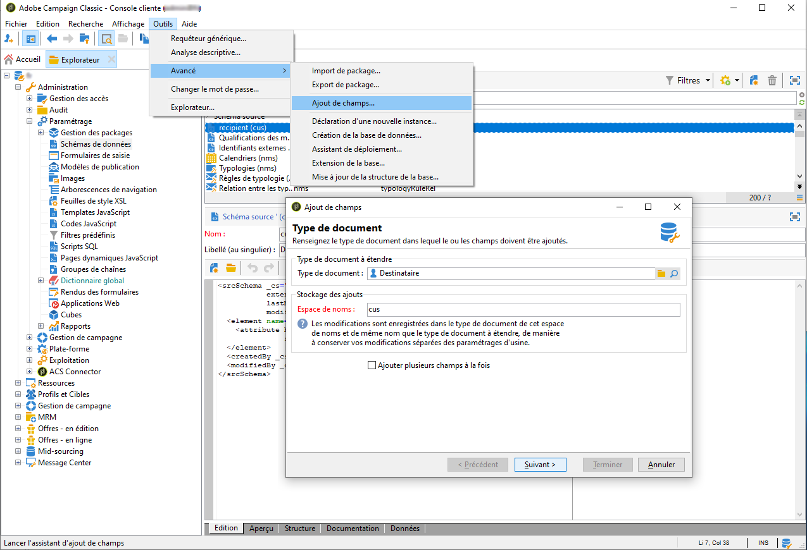
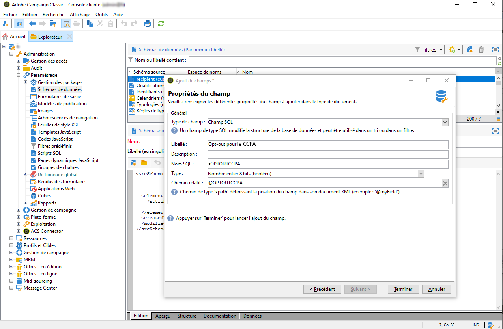

# Managing privacy requests {#privacy-requests}

For a general presentation on Privacy Management, refer to [this section](../../platform/using/privacy-management.md).

Ces informations s’appliquent au RGPD, au CCPA, au PDPA et au LGPD. Pour plus d’informations sur ces règlementations, consultez [cette section](../../platform/using/privacy-management.md#privacy-management-regulations).

The opt-out for the Sale of Personal Information, which is specific to CCPA, is explained in [this section](#sale-of-personal-information-ccpa).

>[!IMPORTANT]
>
>Les procédures d’installation décrites dans ce document s’appliquent à partir de Campaign Classic 18.4 (build 8931+). If you are running on a previous version, refer to this [technote](https://helpx.adobe.com/fr/campaign/kb/how-to-install-gdpr-package-on-legacy-versions.html).

## À propos des demandes d’accès à des informations personnelles {#about-privacy-requests}

Afin de vous aider à vous préparer à la protection de la vie privée, Adobe Campaign vous permet de traiter les demandes d&#39;accès et de suppression. Le **droit d&#39;accès** et le **droit d&#39;être oublié** (demande de suppression) sont décrits dans [cette section](../../platform/using/privacy-management.md#right-access-forgotten).

Voyons comment créer des requêtes Access et Delete, ainsi que comment Adobe Campaign les traite.

### Principes {#principles}

Adobe Campaign offre aux contrôleurs de données deux moyens d’effectuer les demandes d’accès à des informations personnelles et de suppression :

* Via the **Adobe Campaign interface**: for each Privacy request, the Data Controller creates a new privacy request in Adobe Campaign. Reportez-vous à [cette section](#create-privacy-request-ui).
* Via the **API**: Adobe Campaign provides an API that allows the automatic process of Privacy requests using SOAP. Reportez-vous à [cette section](#automatic-privacy-request-api).

>[!NOTE]
>
>Pour plus d’informations sur les données personnelles et sur les différentes entités qui gèrent les données (Contrôleur de données, Responsable du traitement des données et Titulaire de données), consultez [Données personnelles et acteurs impliqués](../../platform/using/privacy-and-recommendations.md#personal-data).

### Prérequis {#prerequesites}

Outils des contrôleurs de données des offres Adobe Campaign pour créer et traiter les demandes de confidentialité pour les données stockées dans Adobe Campaign. Il incombe toutefois au contrôleur de données de gérer la relation avec le titulaire de données (email, service à la clientèle ou portail web).

Par conséquent, il est de votre responsabilité, en tant que contrôleur de données, de vérifier l’identité du titulaire de données à l’origine de la demande et de confirmer que les données renvoyées au demandeur concernent le titulaire de données.

### Installing the Privacy package {#install-privacy-package}

Pour utiliser cette fonctionnalité, vous devez installer le package **[!UICONTROL Privacy Data Protection Regulation]** via le menu **[!UICONTROL Tools]** > **[!UICONTROL Advanced]** > **[!UICONTROL Import package > Adobe Campaign Package.]****** For more information on how to install packages, refer to the [detailed documentation](../../installation/using/installing-campaign-standard-packages.md).

Two new folders, specific to Privacy, are created under **[!UICONTROL Administration]** > **[!UICONTROL Platform]**:

* **[!UICONTROL Demandes]** de confidentialité : c&#39;est là que vous allez créer vos demandes de confidentialité et suivre leur évolution.
* **[!UICONTROL Espaces de nommage]** : c&#39;est là que vous définissez le champ à utiliser pour identifier le titulaire des données dans la base de données Adobe Campaign.


In **[!UICONTROL Administration]** > **[!UICONTROL Production]** > **[!UICONTROL Technical workflows]**, three technical workflows run every day to process Privacy requests.


* **[!UICONTROL Collecter les demandes d&#39;accès aux informations personnelles]** : ce workflow génère les données du destinataire stockées dans Adobe Campaign et les met à disposition sur l&#39;écran de la demande d&#39;accès.
* **[!UICONTROL Supprimer les données de demande d&#39;accès aux informations personnelles]** : ce workflow supprime les données du destinataire stockées dans Adobe Campaign.
* **[!UICONTROL Nettoyage des demandes d&#39;accès à des informations personnelles]** : ce workflow supprime les fichiers de demande d&#39;accès qui ont plus de 90 jours.

Le droit nommé **[!UICONTROL Droit relatif aux données personnelles]** a été ajouté dans **[!UICONTROL Administration]** > **[!UICONTROL Gestion des accès]** > **[!UICONTROL Droits nommés]**. Les contrôleurs de données ont besoin de ce droit nommé pour utiliser les outils d&#39;accès à des informations personnelles et pour ainsi créer de nouvelles demandes, suivre leur évolution, utiliser l&#39;API, etc.


### Espaces de nommage {#namesspaces}

Avant de créer des requêtes de confidentialité, vous devez définir l’espace de nommage que vous utiliserez. Il s&#39;agit de la clé qui sera utilisée pour identifier la personne concernée dans la base de données Adobe Campaign.

Trois espaces de noms d’usine sont disponibles : email, téléphone et téléphone mobile. If you need a different namespace (a recipient custom field, for example), you can create a new one from **[!UICONTROL Administration]** > **[!UICONTROL Platform]** > **[!UICONTROL Namespaces]**.

## Création d’une demande d’accès à des informations personnelles {#create-privacy-request-ui}

The **Adobe Campaign interface** allows you to create your Privacy requests and track their evolution. Pour créer une nouvelle demande de confidentialité, suivez les instructions suivantes :

1. Accédez au dossier de demandes d&#39;accès aux informations personnelles sous **[!UICONTROL Administration]** > **[!UICONTROL Plate-forme]** > **[!UICONTROL Demandes d&#39;accès aux informations personnelles]**.

   

1. Cet écran vous permet de vue toutes les requêtes de confidentialité actuelles, leur état et leurs journaux. Click **[!UICONTROL New]** to create a Privacy request.

   

1. Select the **[!UICONTROL Regulation]** (GDPR, CCPA, PDPA or LGPD),  **[!UICONTROL Request type]** (Access or Delete), select a **[!UICONTROL Namespace]** and enter the **[!UICONTROL Reconciliation value]**. Si vous utilisez l’email comme espace de noms, saisissez l’adresse email du titulaire de données.

   

Les workflows techniques de confidentialité s’exécutent une fois par jour et traitent chaque nouvelle demande :

* Demande de suppression : les données du destinataire stockées dans Adobe Campaign sont effacées.
* Demande d&#39;accès : les données du destinataire stockées dans Adobe Campaign sont générées au format XML et accessibles sur la gauche de l&#39;écran de la demande d&#39;accès.


### Liste des tables {#list-of-tables}

When performing a Delete or Access Privacy request, Adobe Campaign searches all the Data Subject&#39;s data based on the **[!UICONTROL Reconciliation value]** in all the tables that have a link to the recipient table (own type).

Voici la liste des tableaux prêts à l’emploi qui sont pris en compte lors de l’exécution de demandes de confidentialité :

* Destinataires (recipient)
* Log de diffusion des destinataires (broadLogRcp)
* Log de suivi des destinataires (trackingLogRcp)
* Log de diffusion d&#39;un événement historisé (broadLogEventHisto)
* Contenu des listes de destinataires (rcpGrpRel)
* Proposition d&#39;offre d&#39;un visiteur (propositionVisitor)
* Visiteurs (visitor)
* Historique d&#39;abonnement (subHisto)
* Abonnements (subscription)
* Proposition d&#39;offre d&#39;un destinataire (propositionRcp)

Si vous avez créé des tables personnalisées ayant un lien avec la table du destinataire (type own), celles-ci sont également prises en compte. Par exemple, si une table de transaction est liée à la table du destinataire et si une table de détails de transaction est liée à la table de transaction, elles sont toutes deux prises en compte.

>[!IMPORTANT]
>
>Si vous effectuez des demandes de traitement par lots de confidentialité en utilisant des workflows de suppression de profil, veuillez tenir compte des remarques suivantes :
>* La suppression de profil par le biais des workflows ne traite pas les tables filles.
>* Vous devez gérer la suppression pour toutes les tables filles.
>* Adobe recommends that you create an ETL workflow that add the lines to delete in the Privacy Access table and let the **[!UICONTROL Delete privacy requests data]** perform the deletion. Nous suggérons de limiter à 200 profils par jour la suppression pour des raisons de performances.


### Etat des requêtes de confidentialité {#privacy-request-statuses}

Voici les différents états des demandes de confidentialité :

* **[!UICONTROL Nouveau]**/**[!UICONTROL Reprise en attente]** : en cours, le workflow n&#39;a pas encore traité la demande.
* **[!UICONTROL Traitement]**/**[!UICONTROL Reprise en cours]** : le workflow traite la demande.
* **[!UICONTROL Suppression en attente]** : le workflow a identifié toutes les données du destinataire à supprimer.
* **[!UICONTROL Suppression en cours]** : le workflow traite la suppression.
* **[!UICONTROL Supprimer la confirmation en attente]** (Supprimer la demande en mode de traitement en 2 étapes) : le processus a traité la demande d&#39;accès. Une confirmation manuelle est demandée pour effectuer la suppression. Le bouton est disponible pendant 15 jours.
* **[!UICONTROL Terminé]** : le traitement de la demande s&#39;est terminé sans erreur.
* **[!UICONTROL Erreur]**: le processus a rencontré une erreur. Le motif apparaît dans la liste des demandes de confidentialité de la colonne Etat **[!UICONTROL de la]** requête. Par exemple, les données d&#39; **[!UICONTROL erreur introuvables]** signifie qu&#39;aucune donnée de destinataire correspondant à la valeur **[!UICONTROL de]** rapprochement de la personne concernée n&#39;a été trouvée dans la base de données.

### Processus en 2 étapes {#two-step-process}

By default, the **2-step process** is activated. Lorsque vous créez une demande de suppression à l’aide de ce mode, Adobe Campaign effectue toujours en premier une demande d’accès. Cela vous permet de vérifier les données avant de confirmer la suppression.

Vous pouvez modifier ce mode dans l’écran d’édition des demandes d’accès à des informations personnelles. Click **[!UICONTROL Advanced settings]**.


With the 2-step mode activated, the status of a new Delete request changes to **[!UICONTROL Confirm Delete Pending]**. Téléchargez le fichier XML généré depuis l’écran des demandes d’accès à des informations personnelles et vérifiez les données. To confirm erasing the data, click the **[!UICONTROL Confirm delete data]** button.


### URL JSSP {#jspp-url}

Lors du traitement des demandes d&#39;accès, Adobe Campaign génère une JSSP qui récupère les données du destinataire dans la base de données et les exporte vers un fichier XML stocké sur la machine locale. L&#39;URL JSSP est définie ci-dessous :

```
"$(serverUrl)+'/nms/gdpr.jssp?id='+@id"
```

Où @id correspond à l&#39;identifiant de demande d&#39;accès aux informations personnelles.

This URL is stored in the **[!UICONTROL &quot;File location&quot; (@urlFile)]** field of the **[!UICONTROL Privacy Requests (gdprRequest)]** schema.

L&#39;information est disponible dans la base de données pendant 90 jours. Une fois la demande nettoyée par le workflow technique, l&#39;information est supprimée de la base de données et l&#39;URL devient obsolète. Vérifiez que l&#39;URL est encore valide avant de télécharger les données depuis une page web.

Voici un exemple de fichier de données d&#39;un titulaire de données :


Les contrôleurs de données peuvent facilement créer une application web comprenant l&#39;URL JSSP correspondante pour que le fichier de données du titulaire des données soit disponible sur une page web.


Voici un élément de code que vous pouvez utiliser comme exemple dans l&#39;activité **[!UICONTROL Page]** de l&#39;application web.


```
<!DOCTYPE html PUBLIC "-//W3C//DTD XHTML 1.0 Transitional//EN" "http://www.w3.org/TR/xhtml1/DTD/xhtml1-transitional.dtd"> <html xmlns="http://www.w3.org/1999/xhtml"> <head> <meta http-equiv="Content-Language" content="en"> <meta http-equiv="Content-Type" content="text/html; charset=utf-8" /> <link rel="stylesheet" type="text/css" href="/nl/webForms/landingPage.css"/> <title>Clickthrough</title> <style type="text/css" media="all"> /* override formulary area */ .formulary { top: 200px; position: absolute; left: 0; } </style> </head> <body style="" class="">
<center>
<div id="wrap">
<div id="header">
<div class="header-title center-title">DOWNLOAD GDPR DATA</div>
<div class="formulary center-formulary"><form>
<div class="button large-button"><a href=[SERVER_URL]/nms/gdpr.jssp?id=13000" data-nl-type="externalLink">CLICK TO DOWNLOAD</a></div>
</form></div>
</div>
<div id="content">
<div class="row">
<div class="info">
<div class="desc">
<div class="title">EFFICIENCY</div>
<div class="desc">Our service is guaranteed to improve your efficiency. Increase performance and use our high-technology service to implement even the most ambitious of projects.</div>
</div>
</div>
</div>
</div>
<div id="footer">
<div style="text-align: center;">
<div style="float: left;"><a href="#">Contact us</a></div>
<div style="float: right;">&copy; Copyrights</div>
<div><a href="#"></a> <a href="#"></a> <a href="#"></a> <a href="#"></a></div>
</div>
</div>
</div>
</center>
</body> </html>
```

En raison des restrictions d&#39;accès au fichier de données du titulaire de données, l&#39;accès anonyme à une page web doit être désactivé. Seul un opérateur avec le droit nommé **[!UICONTROL Droit relatif aux données personnelles]** peut se connecter à la page et télécharger les données.

## Processus de demande de confidentialité automatique {#automatic-privacy-request-api}

Adobe Campaign provides an **API** which allows you to setup an automatic Privacy request process.

With the API, the general Privacy process is the same as [using the interface](#create-privacy-request-ui). La seule différence est la création de la demande de confidentialité. Au lieu de créer la requête en Adobe Campaign, un POST contenant les informations de la requête est envoyé à Campaign. For every request, a new entry is added in the **[!UICONTROL Privacy Requests]** screen. Les workflows techniques de confidentialité traitent ensuite la demande, de la même manière que pour une demande ajoutée à l’aide de l’interface.

If you&#39;re using the API to submit Privacy requests, we recommend that you leave the **2-step process** activated for the first Delete requests, in order to test the returned data. Une fois vos tests terminés, vous pouvez désactiver le processus en deux étapes afin que le processus de demande de suppression puisse s’exécuter automatiquement.

L&#39;API JS **[!UICONTROL CreateRequestByName]** est définie comme suit.

>[!NOTE]
>
>Si vous utilisiez l’API **gdprRequest**, vous pouvez la conserver, mais il est recommandé d’utiliser la nouvelle API **privacyRequest**.

>[!IMPORTANT]
>
>The **[!UICONTROL Privacy Data Right]** named right is required to use the API.

```
<method library="nms:gdpr.js" name="CreateRequestByName" static="true">
 <help>Create a new GDPR Request using namespace internal name</help>
 <parameters>
  <param name="namespaceName" type="string" desc="Namespace internal name"/>
  <param name="reconciliationValue" type="string" desc="Reconciliation value"/>
  <param name="type" type="long" desc="Reconciliation value"/>
  <param name="confirmDeletePending" type="boolean" desc="Request confirm before deleting data"/>
  <param name="regulation" type="long" desc="regulation of newly created request"/>
  <param name="id" type="long" inout="out" desc="ID of newly created request"/>
 </parameters>
</method>
```

>[!NOTE]
>
>Le champ &quot;règlement&quot; n’est disponible que si vous utilisez Campaign Classic 20.2 (build 9178+).
>
>Si vous effectuez une migration vers la version 20.2 et que vous utilisiez déjà l’API, vous devez ajouter ce champ comme illustré ci-dessus. Si vous avez recours à un build précédent, vous pouvez continuer à utiliser l’API sans le champ «règlement».

### Appel de l&#39;API en externe {#invoking-api-externally}

Voici un exemple de la manière dont vous pouvez appeler l’API en externe (authentification via l’API et détails spécifiques sur l’API de confidentialité). For more information on the Privacy API, consult the [API documentation](https://docs.adobe.com/content/help/en/campaign-classic/technicalresources/api/s-nms-privacyRequest.html). Vous pouvez également consulter la documentation [sur les appels de service](../../configuration/using/web-service-calls.md)Web.

Tout d&#39;abord, vous devez effectuer l&#39;authentification par le biais de l&#39;API :

1. Download the **xtk:session** WSDL via this url: **`<server url>`/nl/jsp/schemawsdl.jsp?schema=xtk:session**.

1. Utilisez la méthode &quot;Logon&quot; et transmettez un nom d&#39;utilisateur et un mot de passe en tant que paramètres dans la demande. Vous obtiendrez une réponse contenant un jeton de session. Voici un exemple utilisant SoapUI.

   

1. Utilisez le jeton de session retourné comme authentification pour tous les appels d&#39;API suivants. Il arrive à expiration au bout de 24 heures.

Ensuite, appelez l’API Confidentialité :

1. Download the WSDL from this URL: **`<server url>`/nl/jsp/schemawsdl.jsp?schema=nms:privacyRequest**.

1. Use **[!UICONTROL CreateRequestByName]** to create a specific Privacy request.

   Here is an example using the **[!UICONTROL CreateRequestByName]**. Remarquez comment nous utilisons le jeton de session fourni ci-dessus pour l’authentification. La réponse est l’identifiant de la demande créée.

   

   Pour vous aider à effectuer les étapes ci-dessus, tenez compte des points suivants :

   * You can use a **queryDef** on the **nms:gdprRequest** schema to check the status of the Access request.
   * You can use a **queryDef** on the **nms:gdprRequestData** schema to get the result of the Access request.
   * To be able to download the XML file from **&quot;$(serverUrl)&#39;/nms/gdpr.jssp?id=&#39;@id&quot;**, you must be logged in and accessing it from a whitelisted IP. Pour ce faire, créez une application Web vous permettant d’accéder au fichier généré par le JSSP.

### Appel de l&#39;API depuis un script JS {#invoking-api-from-js}

Vous trouverez ci-dessous un exemple d&#39;appel de l&#39;API depuis un script JS dans Campaign
      Classic.

>[!NOTE]
>
>Le champ &#39;regulation&#39; n’est disponible que si vous utilisez Campaign Classic 20.2 (build 9178+).
>
>Si vous effectuez une migration vers la version 20.2 et que vous utilisiez déjà l’API, vous devez ajouter ce champ. Si vous avez recours à un build précédent, vous pouvez continuer à utiliser l’API sans le champ &#39;regulation&#39;.

* If you are **using a previous build (with GDPR package)**, you can continue to use the API without the ‘regulation’ field as shown below:

   ```
   loadLibrary("nms:gdpr.js");
   /**************************** 
   This code calls an API to create new Privay request on the DB.
   It requires 4 parameters below.
   Feel free to change parameter values.
   ****************************/
   // 1. Namespace internal name
   var namespaceName = "defaultNamespace1";
   // 2. Reconciliation value for privacy request
   var reconciliationValue = "example@adobe.com";
   // 3. Privacy request type
   // GDPR_REQUEST_TYPE_ACCESS = 1;
   // GDPR_REQUEST_TYPE_DELETE = 2;
   var requestType = GDPR_REQUEST_TYPE_ACCESS;
   // 4. Confirm deleting data required.
   // value : true or false
   var ConfirmDeletePending = true;
   // BEGIN
   var requestId = nms.privacyRequest.CreateRequestByName(namespaceName, reconciliationValue, requestType, ConfirmDeletePending);
   // User can use a simple queryDef with requestID as a parameter to check request status.
   ```

* If you are **migrating to 20.2** and if you were already using the API, you must add the ‘regulation’ field as shown below:

   ```
   loadLibrary("nms:gdpr.js");
   /**************************** 
   This code calls an API to create new Privay request on the DB.
   It requires 5 parameters below.
   Feel free to change parameter values.
   ****************************/
   // 1. Namespace internal name
   var namespaceName = "defaultNamespace1";
   // 2. Reconciliation value for privacy request
   var reconciliationValue = "example@adobe.com";
   // 3. Privacy request type
   // PRIVACY_REQUEST_TYPE_ACCESS = 1;
   // PRIVACY_REQUEST_TYPE_DELETE = 2;
   var requestType = PRIVACY_REQUEST_TYPE_ACCESS;
   // 4. Confirm deleting data required.
   // value : true or false
   var ConfirmDeletePending = true;
   // 5. Specify which regulation applies to newly created request. This is mandatory parameter.
   // GDPR = 1
   // CCPA = 2
   // PDPA = 3
   // LGPD = 4
   var regulation = 1;
   // BEGIN
   var requestId = nms.privacyRequest.CreateRequestByName(namespaceName, reconciliationValue, requestType, ConfirmDeletePending, regulation);
   // User can use a simple queryDef with requestID as a parameter to check request status.
   ```

* If you are **using Campaign Classic 20.2 (build 9178+) or above**, the &#39;regulation&#39; field is optional, as shown below:

   ```
   loadLibrary("nms:gdpr.js");
   /**************************** 
   This code calls an API to create new Privay request on the DB.
   It requires 5 parameters below.
   Feel free to change parameter values 
   ****************************/
   // 1. Namespace internal name
   var namespaceName = "defaultNamespace1";
   // 2. Reconciliation value for privacy request
   var reconciliationValue = "example@adobe.com";
   // 3. Privacy request type
   // PRIVACY_REQUEST_TYPE_ACCESS = 1;
   // PRIVACY_REQUEST_TYPE_DELETE = 2;
   var requestType = PRIVACY_REQUEST_TYPE_ACCESS;
   // 4. Confirm deleting data required.
   // value : true or false
   var ConfirmDeletePending = true;
   // 5. Specify which regulation applies to newly created request. This is optional parameter.
   // GDPR = 1
   // CCPA = 2
   // PDPA = 3
   // LGPD = 4
   var regulation = 1;
   // BEGIN
   var requestId = nms.privacyRequest.CreateRequestByName(namespaceName, reconciliationValue, requestType, ConfirmDeletePending, regulation);
   // User can use a simple queryDef with requestID as a parameter to check request status.
   ```

## Droit d’opposition (opt-out) à la vente des informations personnelles (CCPA) {#sale-of-personal-information-ccpa}

The **California Consumer Privacy Act** (CCPA) provides California residents new rights in regards to their personal information and imposes data protection responsibilities on certain entities whom conduct business in California.

La configuration et l’usage des demandes d’accès et de suppression sont identiques pour le RGPD et le CCPA. Cette section présente le droit d’opposition à la vente des données personnelles, qui est spécifique au CCPA.

In addition to the [Consent management](../../platform/using/privacy-management.md#consent-management) tools provided by Adobe Campaign, you have the possibility to track whether a consumer has opted-out for the sale of Personal Information.

Un consommateur décide, par l&#39;intermédiaire de votre système, qu&#39;il n&#39;autorise pas la vente de ses renseignements personnels à un tiers. En Adobe Campaign, vous pourrez stocker et suivre ces informations.

For this to work, you need to extend the Profiles table and add an **[!UICONTROL Opt-Out for CCPA]** field.

>[!IMPORTANT]
>
>En tant que contrôleur des données, il vous incombe de recevoir la demande de la personne concernée et de suivre les dates de la demande d&#39;ACCP. En tant que fournisseur de technologies, nous ne fournissons qu&#39;un moyen de s&#39;exclure. Pour plus d’informations sur votre rôle en tant que contrôleur de données, voir Données [personnelles et Personnalités](../../platform/using/privacy-and-recommendations.md#personal-data).

### Prérequis  {#ccpa-prerequisite}

Pour exploiter ces informations, vous devez créer ce champ dans Adobe Campaign Classic. Pour ce faire, vous allez ajouter un champ booléen à la table **[!UICONTROL Destinataire]** . Lorsqu’un champ est créé, il est automatiquement pris en charge par l’API Campaign.

Si vous utilisez un tableau de destinataire personnalisé, vous devez également effectuer cette opération.

Pour plus d’informations sur la création d’un champ, reportez-vous à la [documentation sur l’édition de schémas](../../configuration/using/about-schema-edition.md).

>[!IMPORTANT]
>
>La modification de schémas est une opération sensible qui doit être effectuée par des utilisateurs experts uniquement.

1. Go to **[!UICONTROL Tools]** > **[!UICONTROL Advanced]** > **[!UICONTROL Add new fields]**, select **[!UICONTROL Recipients]** as the **[!UICONTROL Document type]** and click **[!UICONTROL Next]**. For more on adding fields to a table, see [this section](../../configuration/using/new-field-wizard.md).

   

1. Pour le type **** Champ, sélectionnez Champ **** SQL. For the Label, use **[!UICONTROL Opt-Out for CCPA]**. Sélectionnez le type d’entier (booléen) **** 8 bits et définissez le chemin d’accès **** relatif unique suivant : @OPTOUTCCPA. Cliquez sur **[!UICONTROL Terminer]**.

   

   Cela va étendre ou créer le (cus) **[!UICONTROL schéma]** Destinataire. Cliquez dessus pour vérifier que le champ a été correctement ajouté.

   

1. Click the **[!UICONTROL Configuration]** > **[!UICONTROL Input forms]** node of the explorer. In **[!UICONTROL Recipient (nms)]**, under &quot;General Package&quot;, add an `<input>` element and use, for the xpath value, the relative path defined in step 2. For more on identifying a form, see [this section](../../configuration/using/identifying-a-form.md).

   ```
   <input  colspan="2" type="checkbox" xpath="@OPTOUTCCPA"/>
   ```

   

1. Déconnectez-vous et reconnectez-vous. Suivez les étapes décrites dans la prochaine section afin de vérifier que le champ est disponible dans les détails d’un destinataire.

### Utilisation {#usage}

Il incombe au contrôleur des données de renseigner la valeur du champ et de respecter les lignes directrices et les règles de l&#39;ACCP concernant la vente de données.

Pour indiquer les valeurs, plusieurs méthodes peuvent être utilisées :

* à l’aide de l’interface de Campaign en éditant les détails du destinataire ;
* Utilisation de l&#39;API
* par l’intermédiaire d’un workflow d’import de données.

Vous devez ensuite vous assurer de ne jamais vendre à une quelconque tierce partie les informations personnelles des profils qui s’y sont opposés.

To change the opt-out status, go to **[!UICONTROL Profiles and Target]** > **[!UICONTROL Recipients]** and select a recipient. In the **[!UICONTROL General]** tab, you will see the field configured in the previous section.


Configurez la liste destinataire pour qu’elle affiche la colonne d’ouverture. Pour savoir comment configurer des listes, consultez la documentation [](../../platform/using/adobe-campaign-workspace.md#configuring-lists)détaillée.


Vous pouvez cliquer sur la colonne pour trier les destinataires en fonction des informations d’exclusion. Vous pouvez également créer un filtre en vue d’afficher uniquement les destinataires qui ont exercé leur droit d’opposition. For more on creating filters, see [this section](../../platform/using/creating-filters.md).


