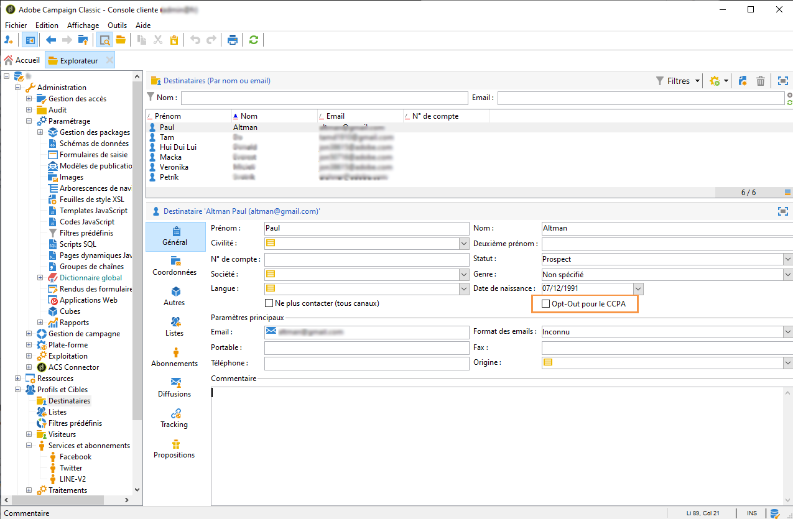
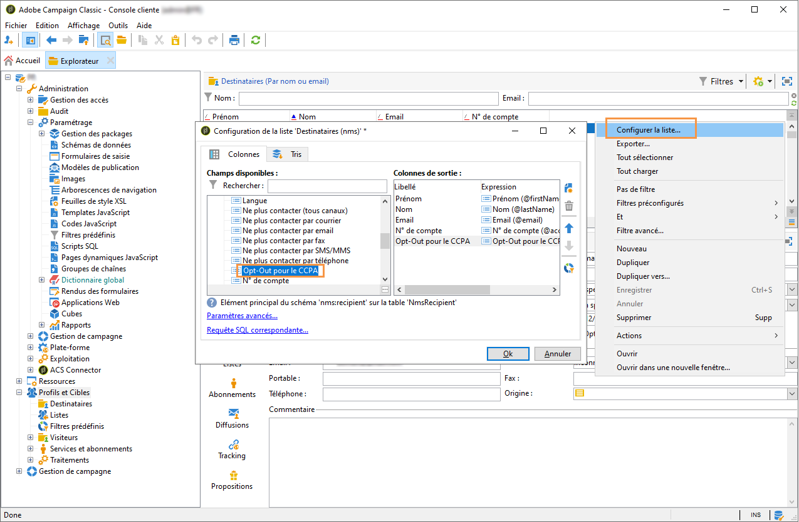

# Gestion des demandes d&#39;accès à des informations personnelles {#privacy-requests}


Pour obtenir une présentation générale de la gestion de la protection des données, consultez [cette section](../../platform/using/privacy-management.md).

Ces informations s&#39;appliquent au RGPD, au CCPA, au PDPA et au LGPD. Pour plus d&#39;informations sur ces règlementations, consultez [cette section](../../platform/using/privacy-management.md#privacy-management-regulations).

Le droit d&#39;opposition (opt-out) à la vente des informations personnelles, spécifique au CCPA, est expliqué dans [cette section](#sale-of-personal-information-ccpa).

<!--Installation procedures described in this document are applicable starting Campaign Classic 18.4 (build 8931+). If you are running on a previous version, refer to this [technote](https://helpx.adobe.com/campaign/kb/how-to-install-gdpr-package-on-legacy-versions.html).-->

## À propos des demandes d&#39;accès à des informations personnelles {#about-privacy-requests}

Pour faciliter la préparation à la protection des données, Adobe Campaign permet désormais de gérer les demandes d&#39;accès et de suppression. Le **droit d&#39;accès** et le **droit à l&#39;oubli** (demande de suppression) sont décrits dans [cette section](../../platform/using/privacy-management.md#right-access-forgotten).

Découvrez comment créer des demandes d&#39;Accès et de Suppression, et comment elles sont traitées par Adobe Campaign.

### Principes {#principles}

Adobe Campaign offre aux contrôleurs de données deux moyens d&#39;effectuer les demandes d&#39;accès à des informations personnelles et de suppression :

* Via l’**interface d’Adobe Campaign** : pour chaque demande d’accès à des informations personnelles, le contrôleur de données crée une demande d’accès à des informations personnelles dans Adobe Campaign. Voir [cette section](#create-privacy-request-ui).
* Via l’**API** : Adobe Campaign fournit une API SOAP qui permet le traitement automatique des demandes d’accès à des informations personnelles. Voir [cette section](#automatic-privacy-request-api).

>[!NOTE]
>
>Pour plus d&#39;informations sur les données personnelles et sur les différentes entités qui gèrent les données (Contrôleur de données, Responsable du traitement des données et Titulaire de données), consultez la section [Données personnelles et personnes concernées](../../platform/using/privacy-and-recommendations.md#personal-data).

### Conditions préalables requises {#prerequesites}

Adobe Campaign met à la disposition des contrôleurs de données des outils afin de créer et traiter des demandes d&#39;accès à des informations personnelles pour les données stockées dans Adobe Campaign. Il incombe toutefois au contrôleur de données de gérer la relation avec le titulaire de données (e-mail, assistance clientèle ou portail web).

Par conséquent, il est de votre responsabilité, en tant que contrôleur de données, de vérifier l&#39;identité du titulaire de données à l&#39;origine de la demande et de confirmer que les données renvoyées au demandeur concernent le titulaire de données.

### Installation du package relatif à la confidentialité {#install-privacy-package}

Pour utiliser cette fonctionnalité, vous devez installer le package **[!UICONTROL Règlement sur la protection des informations personnelles]** via le menu **[!UICONTROL Outils]** > **[!UICONTROL Avancé]** > **[!UICONTROL Import de package]** > **[!UICONTROL Package Adobe Campaign]**. Pour plus d&#39;informations sur l&#39;installation des packages, consultez la [documentation détaillée](../../installation/using/installing-campaign-standard-packages.md).

Deux nouveaux dossiers spécifiques à la confidentialité sont créés sous **[!UICONTROL Administration]** > **[!UICONTROL Plateforme]** :

* **[!UICONTROL Demandes d&#39;accès à des informations personnelles]** : c&#39;est là que vous créez les demandes d&#39;accès à des informations personnelles et que vous suivez leur évolution.
* **[!UICONTROL Espaces de noms]** : c&#39;est là que vous définissez le champ à utiliser pour identifier le titulaire des données dans la base de données Adobe Campaign.


Dans **[!UICONTROL Administration]** > **[!UICONTROL Exploitation]** > **[!UICONTROL Workflows techniques]**, trois workflows techniques sont exécutés tous les jours pour traiter les demandes d&#39;accès aux données personnelles.


* **[!UICONTROL Collecter les demandes d&#39;accès aux informations personnelles]** : ce workflow génère les données du destinataire stockées dans Adobe Campaign et les met à disposition sur l&#39;écran de la demande d&#39;accès.
* **[!UICONTROL Supprimer les données de demande d’accès aux informations personnelles]** : ce workflow supprime les données du destinataire stockées dans Adobe Campaign.
* **[!UICONTROL Nettoyage des demandes d&#39;accès à des informations personnelles]** : ce workflow supprime les fichiers de demande d&#39;accès qui ont plus de 90 jours.

Le droit nommé **[!UICONTROL Droit relatif aux données personnelles]** a été ajouté dans **[!UICONTROL Administration]** > **[!UICONTROL Gestion des accès]** > **[!UICONTROL Droits nommés]**. Les contrôleurs de données ont besoin de ce droit nommé pour utiliser les outils d&#39;accès à des informations personnelles et pour ainsi créer de nouvelles demandes, suivre leur évolution, utiliser l&#39;API, etc.


### Espaces de noms {#namesspaces}

Avant de créer des demandes d&#39;accès à des informations personnelles, vous devez définir l&#39;espace de noms que vous utiliserez. Il s&#39;agit de la clé qui sera utilisée pour identifier le titulaire de données dans la base de données Adobe Campaign.

Trois espaces de noms d&#39;usine sont disponibles : email, téléphone et téléphone mobile. Si vous avez besoin d&#39;un autre espace de noms (un champ personnalisé de destinataire, par exemple), vous pouvez le créer dans **[!UICONTROL Administration]** > **[!UICONTROL Plateforme]** > **[!UICONTROL Espaces de noms]**.

>[!NOTE]
>
>Pour des performances optimales, il est recommandé d’utiliser des espaces de noms d’usine.

## Création d&#39;une demande d&#39;accès à des informations personnelles {#create-privacy-request-ui}

L&#39;**interface d&#39;Adobe Campaign** permet de créer des demandes d&#39;accès à des informations personnelles et de suivre leur évolution. Pour créer une demande d&#39;accès à des informations personnelles, procédez comme suit :

1. Accédez au dossier de demandes d&#39;accès aux informations personnelles sous **[!UICONTROL Administration]** > **[!UICONTROL Plateforme]** > **[!UICONTROL Demandes d&#39;accès aux informations personnelles]**.

   

1. Cet écran affiche toutes les demandes d&#39;accès à des informations personnelles en cours, leur statut et leurs logs. Cliquez sur **[!UICONTROL Nouveau]** pour créer une demande d&#39;accès à des informations personnelles.

   

1. Sélectionnez le **[!UICONTROL Règlement]** (RGPD, CCPA, PDPA ou LGPD), le **[!UICONTROL type de demande]** (Accès ou Suppression), sélectionnez un **[!UICONTROL Espace de noms]** et entrez la **[!UICONTROL valeur de réconciliation]**. Si vous utilisez l&#39;email comme espace de noms, saisissez l&#39;adresse email du titulaire de données.

   

Les workflows techniques d&#39;accès à des informations personnelles s&#39;exécutent une fois par jour et traitent chaque nouvelle demande :

* Demande de suppression : les données du destinataire stockées dans Adobe Campaign sont effacées.
* Demande d&#39;accès : les données du destinataire stockées dans Adobe Campaign sont générées au format XML et accessibles sur la gauche de l&#39;écran de la demande d&#39;accès.


### Liste des tables {#list-of-tables}

Lors de l&#39;exécution d&#39;une demande d&#39;accès ou de suppression de données personnelles, Adobe Campaign recherche toutes les données du titulaire des données en fonction de la **[!UICONTROL Valeur de réconciliation]** dans toutes les tables ayant un lien avec la table du destinataire (type own).

Voici la liste des tables d&#39;usine qui sont prises en compte lors de l&#39;exécution des demandes d&#39;accès à des données personnelles :

* Destinataires (recipient)
* Log de diffusion des destinataires (broadLogRcp)
* Log de suivi des destinataires (trackingLogRcp)
* Log de diffusion d&#39;un événement historisé (broadLogEventHisto)
* Contenu des listes de destinataires (rcpGrpRel)
* Proposition d&#39;offre d&#39;un visiteur (propositionVisitor)
* Visiteurs (visitor)
* Historique d&#39;abonnement (subHisto)
* Abonnements (subscription)
* Proposition d&#39;offre d&#39;un destinataire (propositionRcp)

Si vous avez créé des tables personnalisées ayant un lien avec la table du destinataire (type own), celles-ci sont également prises en compte. Par exemple, si une table de transaction est liée à la table du destinataire et si une table de détails de transaction est liée à la table de transaction, elles sont toutes deux prises en compte.

>[!IMPORTANT]
>
>Si vous effectuez des demandes d&#39;accès à des informations personnelles par lots à l&#39;aide des workflows de suppression de profil, tenez compte des remarques suivantes :
>* La suppression de profil par le biais des workflows ne traite pas les tables enfants.
>* Vous devez gérer la suppression pour toutes les tables enfants.
>* Adobe recommande de créer un workflow ETL qui ajoute les lignes à supprimer dans la table Accès à des informations personnelles et de laisser le workflow **[!UICONTROL Supprimer les données de demande d&#39;accès à des informations personnelles]** effectuer la suppression. Nous suggérons de limiter à 200 profils par jour la suppression pour des raisons de performances.


### États des demandes d&#39;accès à des informations personnelles {#privacy-request-statuses}

Voici les différents états des demandes d&#39;accès à des informations personnelles :

* **[!UICONTROL Nouveau]**/**[!UICONTROL Reprise en attente]** : en cours, le workflow n&#39;a pas encore traité la demande.
* **[!UICONTROL Traitement]**/**[!UICONTROL Reprise en cours]** : le workflow traite la demande.
* **[!UICONTROL Suppression en attente]** : le workflow a identifié toutes les données du destinataire à supprimer.
* **[!UICONTROL Suppression en cours]** : le workflow traite la suppression.
* **[!UICONTROL Confirmation de suppression en attente]** : (demande de suppression dans le mode de processus en 2 étapes) - le workflow a traité la demande d&#39;accès. Une confirmation manuelle est requise pour effectuer la suppression. Le bouton est disponible pendant 15 jours.
* **[!UICONTROL Terminé]** : le traitement de la demande s&#39;est terminé sans erreur.
* **[!UICONTROL Erreur]** : le workflow a rencontré une erreur. La raison apparaît dans la colonne **[!UICONTROL Statut de la demande]** de la liste des demandes d&#39;accès aux informations personnelles. Par exemple, le statut **[!UICONTROL Erreur : données introuvables]** indique qu&#39;aucune donnée du destinataire correspondant à la **[!UICONTROL Valeur de réconciliation]** du titulaire des données n&#39;a été trouvée dans la base de données.

### Processus en 2 étapes {#two-step-process}

Le **processus en 2 étapes** est activé par défaut. Lorsque vous créez une demande de suppression à l&#39;aide de ce mode, Adobe Campaign effectue toujours en premier une demande d&#39;accès. Vous pouvez ainsi vérifier les données avant de confirmer la suppression.

Vous pouvez modifier ce mode dans l&#39;écran d&#39;édition des demandes d&#39;accès à des informations personnelles. Cliquez sur **[!UICONTROL Paramètres avancés]**.


Lorsque le mode en 2 étapes est activé, une nouvelle demande de suppression passe en statut **[!UICONTROL Confirmation de suppression en attente]**. Téléchargez le fichier XML généré depuis l&#39;écran des demandes d&#39;accès à des informations personnelles et vérifiez les données. Pour confirmer l&#39;effacement des données, cliquez sur le bouton **[!UICONTROL Confirmer la suppression des données]**.


### URL JSSP {#jspp-url}

Lors du traitement des demandes d&#39;accès, Adobe Campaign génère une JSSP qui récupère les données du destinataire dans la base de données et les exporte vers un fichier XML stocké sur la machine locale. L&#39;URL JSSP est définie ci-dessous :

```
"$(serverUrl)+'/nms/gdpr.jssp?id='+@id"
```

Où @id correspond à l&#39;identifiant de demande d&#39;accès aux informations personnelles.

Cette URL est stockée dans le champ **[!UICONTROL &quot;Emplacement du fichier&quot; (@urlFile)]** du schéma **[!UICONTROL Demandes d&#39;accès aux informations personnelles (gdprRequest)]**.

L&#39;information est disponible dans la base de données pendant 90 jours. Une fois la demande nettoyée par le workflow technique, l&#39;information est supprimée de la base de données et l&#39;URL devient obsolète. Vérifiez que l&#39;URL est encore valide avant de télécharger les données depuis une page web.

Voici un exemple de fichier de données d&#39;un titulaire de données :


Les contrôleurs de données peuvent facilement créer une application web comprenant l&#39;URL JSSP correspondante pour que le fichier de données du titulaire des données soit disponible sur une page web.


Voici un élément de code que vous pouvez utiliser comme exemple dans l&#39;activité **[!UICONTROL Page]** de l&#39;application web.


```
<!DOCTYPE html PUBLIC "-//W3C//DTD XHTML 1.0 Transitional//EN" "http://www.w3.org/TR/xhtml1/DTD/xhtml1-transitional.dtd"> <html xmlns="http://www.w3.org/1999/xhtml"> <head> <meta http-equiv="Content-Language" content="en"> <meta http-equiv="Content-Type" content="text/html; charset=utf-8" /> <link rel="stylesheet" type="text/css" href="/nl/webForms/landingPage.css"/> <title>Clickthrough</title> <style type="text/css" media="all"> /* override formulary area */ .formulary { top: 200px; position: absolute; left: 0; } </style> </head> <body style="" class="">
<center>
<div id="wrap">
<div id="header">
<div class="header-title center-title">DOWNLOAD GDPR DATA</div>
<div class="formulary center-formulary"><form>
<div class="button large-button"><a href=[SERVER_URL]/nms/gdpr.jssp?id=13000" data-nl-type="externalLink">CLICK TO DOWNLOAD</a></div>
</form></div>
</div>
<div id="content">
<div class="row">
<div class="info">
<div class="desc">
<div class="title">EFFICIENCY</div>
<div class="desc">Our service is guaranteed to improve your efficiency. Increase performance and use our high-technology service to implement even the most ambitious of projects.</div>
</div>
</div>
</div>
</div>
<div id="footer">
<div style="text-align: center;">
<div style="float: left;"><a href="#">Contact us</a></div>
<div style="float: right;">&copy; Copyrights</div>
<div><a href="#"></a> <a href="#"></a> <a href="#"></a> <a href="#"></a></div>
</div>
</div>
</div>
</center>
</body> </html>
```

En raison des restrictions d&#39;accès au fichier de données du titulaire de données, l&#39;accès anonyme à une page web doit être désactivé. Seul un opérateur avec le droit nommé **[!UICONTROL Droit relatif aux données personnelles]** peut se connecter à la page et télécharger les données.

## Processus automatique de demande d&#39;accès à des informations personnelles {#automatic-privacy-request-api}

Adobe Campaign fournit une **API** qui permet de configurer un processus automatique de demande d&#39;accès à des informations personnelles.

Avec l&#39;API, le processus général d&#39;accès à des informations personnelles est identique à [celui de l&#39;interface](#create-privacy-request-ui). La seule différence est la création de la demande d&#39;accès à des informations personnelles. Au lieu de créer la demande dans Adobe Campaign, une instruction POST contenant les informations de la demande est envoyée à Campaign. Pour chaque demande, une nouvelle entrée est ajoutée dans l&#39;écran **[!UICONTROL Demandes d&#39;accès à des informations personnelles]**. Les workflows techniques d&#39;accès à des informations personnelles traitent ensuite la demande, de la même manière que pour une demande ajoutée à l&#39;aide de l&#39;interface.

Si vous utilisez l&#39;API pour soumettre des demandes d&#39;accès à des informations personnelles, il est recommandé de conserver l&#39;option **Processus en 2 étapes** activée pour les premières demandes de suppression, afin de tester les données renvoyées. Une fois vos tests terminés, vous pouvez désactiver le processus en 2 étapes de façon à ce que le processus de demande de suppression puisse s&#39;exécuter automatiquement.

L&#39;API JS **[!UICONTROL CreateRequestByName]** est définie comme suit.

>[!NOTE]
>
>Si vous utilisiez l&#39;API **gdprRequest**, vous pouvez la conserver, mais il est recommandé d&#39;utiliser la nouvelle API **privacyRequest**.

>[!IMPORTANT]
>
>Le droit nommé **[!UICONTROL Droit relatif aux données personnelles]** est nécessaire pour utiliser l&#39;API.

```
<method library="nms:gdpr.js" name="CreateRequestByName" static="true">
 <help>Create a new GDPR Request using namespace internal name</help>
 <parameters>
  <param name="namespaceName" type="string" desc="Namespace internal name"/>
  <param name="reconciliationValue" type="string" desc="Reconciliation value"/>
  <param name="type" type="long" desc="Reconciliation value"/>
  <param name="confirmDeletePending" type="boolean" desc="Request confirm before deleting data"/>
  <param name="regulation" type="long" desc="regulation of newly created request"/>
  <param name="id" type="long" inout="out" desc="ID of newly created request"/>
 </parameters>
</method>
```

>[!NOTE]
>
>Le champ &quot;règlement&quot; n&#39;est disponible que si vous utilisez Campaign Classic 20.2 (build 9178+).
>
>Si vous effectuez une migration vers la version 20.2 et que vous utilisiez déjà l&#39;API, vous devez ajouter ce champ comme illustré ci-dessus. Si vous avez recours à un build précédent, vous pouvez continuer à utiliser l&#39;API sans le champ «règlement».

### Appel de l&#39;API en externe {#invoking-api-externally}

Voici un exemple d&#39;appel externe de l&#39;API (authentification via l&#39;API et détails spécifiques sur l&#39;API de protection des données). Pour en savoir plus sur l&#39;API de protection des données, consultez la [documentation de l&#39;API](https://experienceleague.adobe.com/developer/campaign-api/api/s-nms-privacyRequest.html?lang=fr). Vous pouvez également consulter la [documentation sur les appels Web Service](../../configuration/using/web-service-calls.md).

Tout d&#39;abord, vous devez effectuer l&#39;authentification par le biais de l&#39;API :

1. Téléchargez le WSDL **xtk:session** depuis cette URL : **`<server url>`/nl/jsp/schemawsdl.jsp?schema=xtk:session**.

1. Utilisez la méthode &quot;Logon&quot; et transmettez un nom d&#39;utilisateur et un mot de passe en tant que paramètres dans la demande. Vous obtiendrez une réponse contenant un jeton de session. Voici un exemple utilisant SoapUI.

   

1. Utilisez le jeton de session retourné comme authentification pour tous les appels d&#39;API suivants. Il arrive à expiration au bout de 24 heures.

Vous pouvez ensuite appeler l&#39;API de protection des données :

1. Téléchargez le WSDL depuis cette URL : **`<server url>`/nl/jsp/schemawsdl.jsp?schema=nms:privacyRequest**.

1. Utilisez **[!UICONTROL CreateRequestByName]** pour créer une demande d&#39;accès à des informations personnelles spécifique.

   Voici un exemple utilisant **[!UICONTROL CreateRequestByName]**. Remarquez comment nous utilisons le jeton de session fourni ci-dessus pour l&#39;authentification. La réponse est l&#39;identifiant de la demande créée.

   

   Pour vous aider à effectuer les étapes ci-dessus, tenez compte des points suivants :

   * Vous pouvez utiliser une **queryDef** sur le schéma **nms:gdprRequest** pour vérifier le statut de la demande d&#39;accès.
   * Vous pouvez utiliser une **queryDef** sur le schéma **nms:gdprRequestData** pour obtenir le résultat de la demande d&#39;accès.
   * Pour pouvoir télécharger le fichier XML à partir de **&quot;$(serverUrl)&#39;/nms/gdpr.jssp?id=&#39;@id&quot;**, vous devez être connecté et y accéder à partir d’une adresse IP placée sur la liste autorisée. Pour ce faire, créez une application web vous permettant d&#39;accéder au fichier généré par le JSSP.

### Appel de l&#39;API depuis un script JS {#invoking-api-from-js}

Vous trouverez ci-dessous un exemple d&#39;appel de l&#39;API depuis un script JS dans Campaign Classic.

>[!NOTE]
>
>Le champ &quot;règlement&quot; n&#39;est disponible que si vous utilisez Campaign Classic 20.2 (build 9178+).
>
>Si vous effectuez une migration vers la version 20.2 et que vous utilisiez déjà l&#39;API, vous devez ajouter ce champ. Si vous avez recours à un build précédent, vous pouvez continuer à utiliser l&#39;API sans le champ «règlement».

* Si **vous utilisez une version précédente (avec le package RGPD)**, vous pouvez continuer à utiliser l&#39;API sans le champ &#39;regulation&#39; comme illustré ci-dessous :

   ```
   loadLibrary("nms:gdpr.js");
   /**************************** 
   This code calls an API to create new Privacy request on the DB.
   It requires 4 parameters below.
   Feel free to change parameter values.
   ****************************/
   // 1. Namespace internal name
   var namespaceName = "defaultNamespace1";
   // 2. Reconciliation value for privacy request
   var reconciliationValue = "example@adobe.com";
   // 3. Privacy request type
   // GDPR_REQUEST_TYPE_ACCESS = 1;
   // GDPR_REQUEST_TYPE_DELETE = 2;
   var requestType = GDPR_REQUEST_TYPE_ACCESS;
   // 4. Confirm deleting data required.
   // value : true or false
   var ConfirmDeletePending = true;
   // BEGIN
   var requestId = nms.privacyRequest.CreateRequestByName(namespaceName, reconciliationValue, requestType, ConfirmDeletePending);
   // User can use a simple queryDef with requestID as a parameter to check request status.
   ```

* Si vous effectuez une **migration vers la version 20.2** et que vous utilisiez déjà l&#39;API, vous devez ajouter ce champ comme illustré ci-dessous :

   ```
   loadLibrary("nms:gdpr.js");
   /**************************** 
   This code calls an API to create new Privacy request on the DB.
   It requires 5 parameters below.
   Feel free to change parameter values.
   ****************************/
   // 1. Namespace internal name
   var namespaceName = "defaultNamespace1";
   // 2. Reconciliation value for privacy request
   var reconciliationValue = "example@adobe.com";
   // 3. Privacy request type
   // PRIVACY_REQUEST_TYPE_ACCESS = 1;
   // PRIVACY_REQUEST_TYPE_DELETE = 2;
   var requestType = PRIVACY_REQUEST_TYPE_ACCESS;
   // 4. Confirm deleting data required.
   // value : true or false
   var ConfirmDeletePending = true;
   // 5. Specify which regulation applies to newly created request. This is mandatory parameter.
   // GDPR = 1
   // CCPA = 2
   // PDPA = 3
   // LGPD = 4
   var regulation = 1;
   // BEGIN
   var requestId = nms.privacyRequest.CreateRequestByName(namespaceName, reconciliationValue, requestType, ConfirmDeletePending, regulation);
   // User can use a simple queryDef with requestID as a parameter to check request status.
   ```

* Si **vous utilisez Campaign Classic 20.2 (version 9178+) ou une version ultérieure**, le champ &#39;regulation&#39; est facultatif, comme illustré ci-dessous :

   ```
   loadLibrary("nms:gdpr.js");
   /**************************** 
   This code calls an API to create new Privacy request on the DB.
   It requires 5 parameters below.
   Feel free to change parameter values 
   ****************************/
   // 1. Namespace internal name
   var namespaceName = "defaultNamespace1";
   // 2. Reconciliation value for privacy request
   var reconciliationValue = "example@adobe.com";
   // 3. Privacy request type
   // PRIVACY_REQUEST_TYPE_ACCESS = 1;
   // PRIVACY_REQUEST_TYPE_DELETE = 2;
   var requestType = PRIVACY_REQUEST_TYPE_ACCESS;
   // 4. Confirm deleting data required.
   // value : true or false
   var ConfirmDeletePending = true;
   // 5. Specify which regulation applies to newly created request. This is optional parameter.
   // GDPR = 1
   // CCPA = 2
   // PDPA = 3
   // LGPD = 4
   var regulation = 1;
   // BEGIN
   var requestId = nms.privacyRequest.CreateRequestByName(namespaceName, reconciliationValue, requestType, ConfirmDeletePending, regulation);
   // User can use a simple queryDef with requestID as a parameter to check request status.
   ```

## Droit d&#39;opposition (opt-out) à la vente des informations personnelles (CCPA) {#sale-of-personal-information-ccpa}

Le **CCPA** (California Consumer Privacy Act) fournit aux résidents de la Californie de nouveaux droits relatifs aux informations personnelles et impose des responsabilités en matière de protection des données à certaines entités qui exercent des activités en Californie.

La configuration et l&#39;usage des demandes d&#39;accès et de suppression sont identiques pour le RGPD et le CCPA. Cette section présente le droit d&#39;opposition à la vente des données personnelles, qui est spécifique au CCPA.

Outre les outils de [gestion du consentement](../../platform/using/privacy-management.md#consent-management) fournis par Adobe Campaign, vous pouvez suivre si un client s’est opposé à la vente de ses informations personnelles.

Les contacts peuvent décider, par l’intermédiaire de votre système, qu’ils n’autorisent pas la vente de leurs informations personnelles à un tiers. Avec Adobe Campaign, vous pourrez stocker et suivre ces informations.

Pour que cela fonctionne, vous devez étendre la table Profils et ajouter un champ **[!UICONTROL Opt-out pour le CCPA]**.

>[!IMPORTANT]
>
>En tant que contrôleur des données, il vous incombe de recevoir la demande du titulaire des données et de suivre les dates de la demande pour le CCPA. En tant que fournisseur de technologie, nous offrons uniquement une option d&#39;opt-out. Pour plus d&#39;informations sur votre rôle en tant que contrôleur de données, voir [Données personnelles et personnes concernées](../../platform/using/privacy-and-recommendations.md#personal-data).

### Prérequis {#ccpa-prerequisite}

Pour exploiter ces informations, vous devez créer ce champ dans Adobe Campaign Classic. Pour ce faire, vous allez ajouter un champ booléen à la table **[!UICONTROL Destinataire]**. Lorsqu&#39;un champ est créé, il est automatiquement pris en charge par l&#39;API Campaign.

Si vous utilisez une table de destinataires personnalisée, vous devez également effectuer cette opération.

Pour plus d&#39;informations sur la création d&#39;un champ, reportez-vous à la [documentation sur l&#39;édition de schémas](../../configuration/using/about-schema-edition.md).

>[!IMPORTANT]
>
>La modification des schémas est une opération sensible qui ne doit être effectuée que par des utilisateurs experts.

1. Cliquez sur **[!UICONTROL Outils]** > **[!UICONTROL Avancé]** > **[!UICONTROL Ajout de champs]**, sélectionnez **[!UICONTROL Destinataires]** comme **[!UICONTROL Type de document]** et cliquez sur **[!UICONTROL Suivant]**. Pour plus d&#39;informations sur l&#39;ajout de champs à une table, consultez [cette section](../../configuration/using/new-field-wizard.md).

   

1. Pour le **[!UICONTROL Type de champ]**, sélectionnez **[!UICONTROL Champ SQL]**. Pour le Libellé, utilisez **[!UICONTROL Opt-out pour le CCPA]**. Sélectionnez le type **[!UICONTROL Nombre entier 8 bits (boolean)]** et définissez le **[!UICONTROL Chemin relatif]** unique suivant : @OPTOUTCCPA. Cliquez sur **[!UICONTROL Terminer]**.

   

   Cette opération va étendre ou créer le schéma **[!UICONTROL Destinataire (cus)]**. Cliquez dessus pour vérifier que le champ a été correctement ajouté.

   

1. Cliquez sur le nœud **[!UICONTROL Configuration]** > **[!UICONTROL Formulaires de saisie]** de l&#39;explorateur. Dans **[!UICONTROL Destinataire (nms)]**, sous &quot;Package général&quot;, ajoutez un élément `<input>` et utilisez, pour la valeur xpath, le chemin relatif défini à l&#39;étape 2. Pour plus d&#39;informations sur l&#39;identification d&#39;un formulaire, consultez [cette section](../../configuration/using/identifying-a-form.md).

   ```
   <input  colspan="2" type="checkbox" xpath="@OPTOUTCCPA"/>
   ```

   

1. Déconnectez-vous et reconnectez-vous. Suivez les étapes décrites dans la prochaine section afin de vérifier que le champ est disponible dans les détails d&#39;un destinataire.

### Usage {#usage}

Il est de la responsabilité du contrôleur de données d&#39;indiquer la valeur du champ et de suivre les règles et les directives du CCPA relatives à la vente des données.

Pour indiquer les valeurs, plusieurs méthodes peuvent être utilisées :

* à l&#39;aide de l&#39;interface de Campaign en éditant les détails du destinataire ;
* Utilisation de l&#39;API
* Par l&#39;intermédiaire d&#39;un workflow d&#39;import de données.

Vous devez ensuite vous assurer de ne jamais vendre à une quelconque tierce partie les informations personnelles des profils qui s&#39;y sont opposés.

1. Pour modifier le statut d&#39;opt-out, accédez à **[!UICONTROL Profils et cible]** > **[!UICONTROL Destinataires]** et sélectionnez un destinataire. Sous l&#39;onglet **[!UICONTROL Général]**, vous trouverez le champ configuré dans la section précédente.

   

1. Configurez la liste des destinataires pour qu&#39;elle affiche la colonne d&#39;opt-out. Pour savoir comment configurer des listes, consultez la [documentation détaillée](../../platform/using/adobe-campaign-workspace.md#configuring-lists).

   

1. Vous pouvez cliquer sur la colonne pour trier les destinataires en fonction des informations d&#39;opt-out. Vous pouvez également créer un filtre en vue d&#39;afficher uniquement les destinataires qui ont exercé leur droit d&#39;opposition. Pour plus d&#39;informations sur la création de filtres, consultez [cette section](../../platform/using/creating-filters.md).

   
