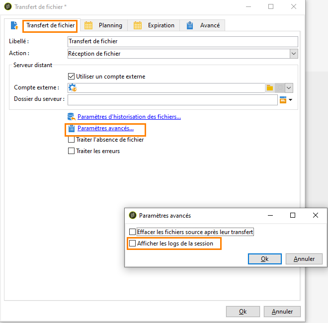

# Bonnes pratiques et résolution des problèmes liés au serveur SFTP {#sftp-server-usage}

## Recommandations globales relatives au serveur SFTP {#global-recommendations}

Lors de la gestion de fichiers et de données à des fins d’ETL, ces fichiers sont stockés sur un serveur SFTP hébergé, fourni par Adobe. Veillez à suivre les recommandations ci-dessous lors de l’utilisation de serveurs SFTP.

* Utilisez l’authentification par clé plutôt que par mot de passe pour éviter l’expiration du mot de passe (la période de validité des mots de passe est de 90 jours). De plus, l’authentification par clé permet de générer plusieurs clés, par exemple lors de la gestion de plusieurs entités. À l’inverse, l’authentification par mot de passe nécessite le partage du mot de passe avec toutes les entités que vous gérez.

  Le format de clé pris en charge est SSH-2 RSA 2048. L’outil de génération de clés SSH pour Windows est PuTTYgen et ssh-keygen pour Linux. Vous pouvez télécharger des clés SSH publiques via le Panneau de Contrôle Campaign. [En savoir plus](https://experienceleague.adobe.com/en/docs/control-panel/using/sftp-management/key-management){target="_blank"}

* Utilisez des batchs dans les téléchargements SFTP ainsi que dans les workflows.

* Gérez les erreurs/exceptions.

* Par défaut, tous les dossiers que vous créez sont en lecture/écriture pour votre identifiant uniquement. Lorsque vous créez des dossiers auxquels Campaign doit accéder, veillez à les configurer avec des droits en lecture/écriture pour l&#39;ensemble du groupe. Sinon, les workflows peuvent ne pas pouvoir créer/supprimer des fichiers, car ils sont exécutés sous un identifiant différent au sein du même groupe pour des raisons de sécurité.

* Les adresses IP publiques à partir desquelles vous tentez d&#39;établir la connexion SFTP doivent être ajoutées à la liste autorisée sur l&#39;instance Campaign. Les adresses IP publiques peuvent être ajoutées via le Panneau de Contrôle. [En savoir plus](https://experienceleague.adobe.com/en/docs/control-panel/using/sftp-management/ip-range-allow-listing){target="_blank"}

## Bonnes pratiques d&#39;utilisation du stockage SFTP {#sftp-server-best-practices}

Les serveurs SFTP sont conçus en tant qu’espaces de stockage temporaire sur lequel vous pouvez contrôler la conservation et la suppression des fichiers.

Lorsqu’ils ne sont pas correctement utilisés ou surveillés, ces espaces peuvent rapidement remplir l’espace physique disponible sur le serveur et entraîner la troncation des fichiers lors des téléchargements suivants. Une fois l’espace saturé, la purge automatique peut être déclenchée et effacer les fichiers les plus anciens de l’espace de stockage SFTP.

Pour éviter ces problèmes, Adobe recommande de suivre les bonnes pratiques ci-après.

>[!NOTE]
>
>Vous pouvez surveiller le stockage de votre serveur SFTP avec le Campaign Classic [Panneau de Contrôle](https://experienceleague.adobe.com/docs/control-panel/using/sftp-management/sftp-storage-management.html?lang=fr){target="_blank"}.
>
>Le Panneau de contrôle est accessible à tous les utilisateurs administrateurs et utilisatrices administratrices. Les étapes permettant d’accorder un accès d’administration à un utilisateur ou à une utilisatrice sont présentées sur [cette page](https://experienceleague.adobe.com/docs/control-panel/using/discover-control-panel/managing-permissions.html?lang=fr#discover-control-panel){target="_blank"}.
>
>Notez que votre instance doit être mise à niveau avec la [dernière build GA](../../rn/using/rn-overview.md). Découvrez comment vérifier votre version dans [cette section](../../platform/using/launching-adobe-campaign.md#getting-your-campaign-version){target="_blank"}.

* La taille du serveur varie en fonction de votre licence. Dans tous les cas, conservez le minimum de données possible et uniquement pendant le temps nécessaire (15 jours est la durée maximale).

* Utilisez des workflows pour supprimer correctement les données (gérez la conservation depuis les workflows utilisant les données).

* Connectez-vous de temps à autre au SFTP afin de vérifier directement ce qui s’y trouve.

* Gardez à l’esprit que la gestion des disques SFTP relève principalement de votre responsabilité.

## Utilisation d’un serveur SFTP externe {#external-SFTP-server}

Si vous utilisez votre propre serveur SFTP, suivez autant que possible les recommandations mentionnées ci-dessus.

En outre, lors de la spécification dans Campaign Classic d’un chemin d’accès à un serveur SFTP externe, la syntaxe du chemin d’accès diffère selon le système d’exploitation du serveur SFTP :

* Si votre serveur SFTP est sous **Windows**, utilisez toujours un chemin relatif.
* Si votre serveur STP est sous **Linux**, utilisez toujours un chemin relatif au répertoire de base (commençant par &quot;~/&quot;) ou un chemin absolu (commençant par &quot;/&quot;).

## Problèmes de connexion liés au serveur SFTP hébergé par Adobe {#sftp-server-troubleshooting}

La section ci-dessous répertorie les informations à vérifier et à fournir à l’équipe d’assistance Adobe via [Adobe de l’assistance clientèle](https://helpx.adobe.com/fr/enterprise/admin-guide.html/enterprise/using/support-for-experience-cloud.ug.html){target="_blank"} lorsque vous rencontrez des problèmes de connexion avec les serveurs SFTP hébergés par Adobe.

1. Vérifiez que votre instance est en cours d’exécution. Pour cela, ouvrez votre navigateur, puis effectuez un appel **[!UICONTROL GET]** sur le point d’entrée **[!UICONTROL /r/test]** de l’instance :

   ```
   https://instanceUrl/r/test
   ```

   Si l&#39;instance est en cours d&#39;exécution, vous devez obtenir ce type de réponse :

   ```
   <redir status='OK' date='YYYY-MM-DD HH:MM:SS' build='XXXX' instance='instance-name'
   sourceIP='AAA.BB.CCC.DD' host='instanceUrl' localHost='instance-name'/>
   ```

   Dans tous les cas, indiquez la réponse de la commande dans le ticket de support.

1. Vérifiez si le port 22 sortant est ouvert sur le site à partir duquel vous essayez d&#39;initialiser la connexion SFTP. Pour cela, utilisez la commande suivante :

   ```
   bash-3.2$ nc -vz <SFTP_URL> 22
   # Replace the SFTP_URL with actual SFTP instance URL
   # If the port 22 is opened you will see output similar to the below one
   # for e.g. the  output for the command on myCompany-stage-sftp.neolane.net after ssh-out, will give
   bash-3.2$ nc -vz myCompagny-stage-sftp.neolane.net 22
   myCompany-stage-sftp.neolane.net [AAA.BBB.CCC.D] 22 (ssh) open
   ```

   Si le port n&#39;est pas ouvert, veillez à ouvrir les connexions sortantes de votre côté, puis réessayez. Si vous rencontrez toujours des problèmes de connexion, partagez la sortie de la commande avec l’équipe de l&#39;[Assistance clientèle d&#39;Adobe](https://helpx.adobe.com/fr/enterprise/admin-guide.html/enterprise/using/support-for-experience-cloud.ug.html).

1. Vérifiez que l&#39;adresse IP publique à partir de laquelle vous essayez d&#39;établir la connexion SFTP est celle que vous avez fournie au support Adobe pour la liste autorisée.
1. Si vous utilisez une authentification par mot de passe, votre mot de passe peut avoir expiré (les mots de passe ont une période de validité de 90 jours). Nous vous recommandons donc vivement d’utiliser une authentification par clé (voir [Bonnes pratiques d&#39;utilisation du serveur SFTP](#sftp-server-best-practices)).
1. Si vous utilisez une authentification par clé, vérifiez que la clé que vous utilisez est la même que celle fournie à l&#39;[Assistance clientèle d&#39;Adobe](https://helpx.adobe.com/fr/enterprise/admin-guide.html/enterprise/using/support-for-experience-cloud.ug.html) pour la configuration de l’instance.
1. Si vous utilisez FileZilla ou un outil FTP équivalent, fournissez les détails des logs de connexion dans le ticket de support.

## Erreur « Impossible de résoudre le nom d’hôte »

Cette section fournit des informations sur les vérifications et les actions à effectuer lors de l’affichage de l’erreur « Impossible de résoudre le nom d’hôte » après la connexion de Campaign Classic au serveur FTP.

Le journal des workflows affiche les logs suivants :

```
16/05/2016 12:49:03    fileTransfer    Upload error in cURL
16/05/2016 12:49:03    fileTransfer    Couldn't resolve host name
16/05/2016 12:49:03    fileTransfer    Couldn't resolve host name
16/05/2016 12:49:03    fileTransfer    Starting transfer of '/usr/local/neolane/nl6/var/williamreed/export/Recipients' to 'ftp://213.253.61.250/Recipients'
16/05/2016 12:49:03    fileTransfer    1 file(s) to transfer
```

Cette erreur se produit lorsque vous tentez de connecter le serveur FTP à partir d’un workflow et de télécharger les fichiers à partir du serveur, alors que vous pouvez toujours vous connecter via FTP à l’aide de FileZilla ou WinSCP.

Cette erreur indique que le nom de domaine du serveur FTP n&#39;a pas pu être résolu correctement. Pour résoudre le problème, procédez comme suit :

1. Résolution des problèmes de **configuration du serveur DNS** :

   1. Vérifiez si le nom du serveur a été ajouté au serveur DNS local.
   1. Si oui, exécutez la commande suivante sur le serveur Adobe Campaign pour obtenir l’adresse IP :

      `nslookup <server domain name>`

      Cela confirme que le serveur FTP fonctionne et est accessible à partir du serveur applicatif Adobe Campaign.

1. Résolution des problèmes liés aux **logs de session** :

   1. Dans le workflow, double-cliquez sur l&#39;activité [Transfert de fichier](../../workflow/using/file-transfer.md).
   1. Accédez à l’onglet **[!UICONTROL Transfert de fichier]**, puis cliquez sur **[!UICONTROL Paramètres avancés]**.
   1. Cochez l’option **[!UICONTROL Afficher les logs de la session]**.

      

   1. Accédez au workflow Audit et vérifiez si les logs affichent l’erreur « Impossible de résoudre le nom d’hôte ».

1. Si le serveur SFTP est hébergé par Adobe, vérifiez si l&#39;adresse IP est ajoutée à la liste autorisée en contactant l&#39;Assistance clientèle.

   Sinon, validez :

   * Le mot de passe ne contient pas le caractère « @ ». La connexion a échoué si le mot de passe contient le caractère « @ ».
   * Il n’existe aucun problème de pare-feu qui peut gêner la communication entre le serveur applicatif Adobe Campaign et le serveur SFTP.
   * Exécutez les commandes tracert et telnet du serveur de campagne vers le serveur sftp pour vérifier s’il y a des problèmes de connexion.
   * Il n&#39;y a pas de problème de protocole de communication.
   * Le port est ouvert.
