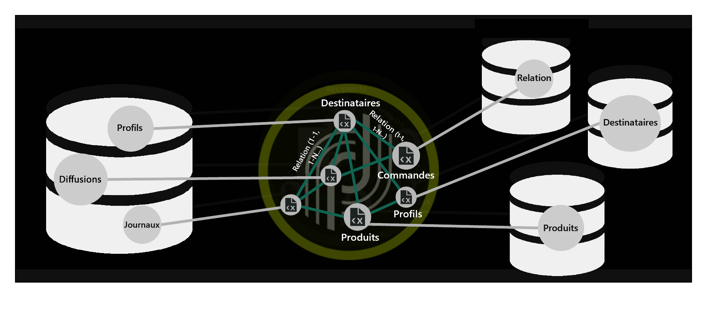
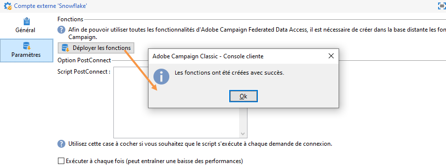
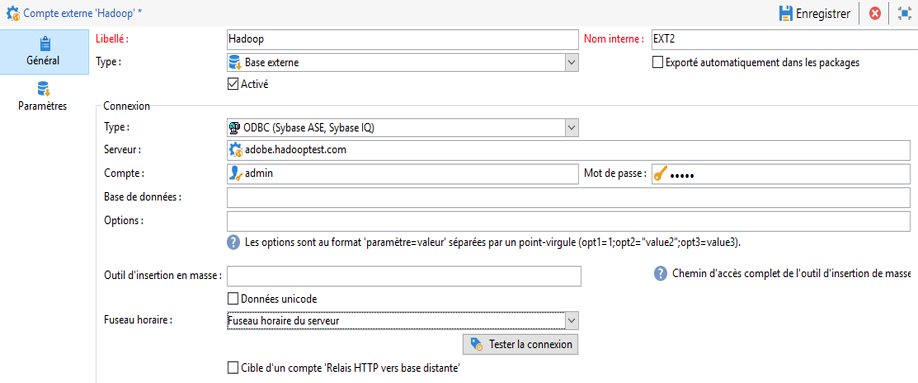

# Configurations spécifiques par type de base de données {#specific-configurations-by-database-type}

En fonction des bases de données externes auxquelles vous souhaitez pouvoir accéder depuis Adobe Campaign, certains paramétrages spécifiques sont nécessaires. Ces paramétrages concernent essentiellement l&#39;installation de pilotes et la déclarations de variables d&#39;environnement propres à chaque SGBDR sur le serveur Adobe Campaign.

En règle générale, il est nécessaire d&#39;installer la couche cliente correspondant à la base externe utilisée sur le serveur Adobe Campaign.

>[!NOTE]
>
>Les versions compatibles sont répertoriées dans la [Matrice de compatibilité Campaign](https://helpx.adobe.com/campaign/kb/compatibility-matrix.html#FederatedDataAccessFDA).

<!--
## Configure access to Azure Synapse {#configure-access-to-azure-synapse}

### Azure Synapse on CentOS {#azure-centos}

1. Download mysql57-community-release.noarch.rpm. You can find it in this [page](https://dev.mysql.com/downloads/repo/yum).

1. Install the client library:

    ```
    $ yum install mysql57-community-release-el7-9.noarch.rpm
    $ yum install mysql-community-libs
    ```

1. You now need to configure the external account. In Campaign Classic, unfold the **[!UICONTROL Platform]** menu and click **[!UICONTROL External accounts]**.

1. Select the out-of-the box **[!UICONTROL Azure Synapse]** external account.

1. To configure the **[!UICONTROL Azure Synapse]** external account:

    * **[!UICONTROL Server]**
  
      URL of the Azure Synapse server.

    * **[!UICONTROL Account]**

      Name of the user.

    * **[!UICONTROL Password]**

      User account password.

    * **[!UICONTROL Database]**

      Name of your database

    >[!NOTE]
    >
    >Make sure the **[!UICONTROL Time zone]** and **[!UICONTROL Unicode data]** are set according to your database.

### Azure Synapse on Debian {#azure-debian}

1. Download mysql-apt-config.deb. You can find it in this [page](https://dev.mysql.com/doc/mysql-apt-repo-quick-guide/en).

1. Install the client library:

    ```
    $ dpkg -i mysql-apt-config_*_all.deb # choose mysql-5.7 in the configuration menu
    $ apt update
    $ apt install libmysqlclient20
    ```

1. You now need to configure the external account. In Campaign Classic, unfold the **[!UICONTROL Platform]** menu and click **[!UICONTROL External accounts]**.

1. Select the out-of-the box **[!UICONTROL Azure Synapse]** external account.

1. To configure the **[!UICONTROL Azure Synapse]** external account:

    * **[!UICONTROL Server]**
  
      URL of the Azure Synapse server.

    * **[!UICONTROL Account]**

      Name of the user.

    * **[!UICONTROL Password]**

      User account password.

    * **[!UICONTROL Database]**

      Name of your database

    >[!NOTE]
    >
    >Make sure the **[!UICONTROL Time zone]** and **[!UICONTROL Unicode data]** are set according to your database.

### Azure Synapse on Windows {#azure-windows}

1. Download the C connector. You can find it in this [page](https://dev.mysql.com/downloads/connector/c).

1. Make sure the directory that contains libmysqlclient.dll is added to the PATH environment variable that nlserver will use.

1. You now need to configure the external account. In Campaign Classic, unfold the **[!UICONTROL Platform]** menu and click **[!UICONTROL External accounts]**.

1. You now need to configure the external account. In Campaign Classic, unfold the **[!UICONTROL Platform]** menu and click **[!UICONTROL External accounts]**.

1. Select the out-of-the box **[!UICONTROL Azure Synapse]** external account.

1. To configure the **[!UICONTROL Azure Synapse]** external account:

    * **[!UICONTROL Server]**
  
      URL of the Azure Synapse server.

    * **[!UICONTROL Account]**

      Name of the user.

    * **[!UICONTROL Password]**

      User account password.

    * **[!UICONTROL Database]**

      Name of your database

    >[!NOTE]
    >
    >Make sure the **[!UICONTROL Time zone]** and **[!UICONTROL Unicode data]** are set according to your database.

-->

## Configuration de l’accès à Snowflake {#configure-access-to-snowflake}

>[!NOTE]
>
>Le connecteur Snowflake est disponible pour les déploiements hébergés et sur site. Pour plus d’informations à ce propos, consultez [cette page](https://helpx.adobe.com/campaign/kb/acc-on-prem-vs-hosted.html).



### Flocon de neige sur CentOS {#snowflake-centos}

1. Téléchargez les pilotes ODBC pour Snowflake. Vous trouverez [ici](https://sfc-repo.snowflakecomputing.com/odbc/linux/latest/snowflake-odbc-2.20.2.x86_64.rpm)les chauffeurs de Snowflake.

1. Vous devez ensuite installer les pilotes ODBC sur CentOs avec la commande suivante :

   ```
   rpm -Uvh unixodbc
   rpm -Uvh snowflake-odbc-2.20.2.x86_64.rpm
   ```

1. Après avoir téléchargé et installé les pilotes ODBC, vous devez redémarrer Campaign Classic. Pour ce faire, exécutez la commande suivante :

   ```
   /etc/init.d/nlserver6 stop
   /etc/init.d/nlserver6 start
   ```
1. Dans Campaign Classic, configurez votre compte externe Snowflake dans Campaign Classic. From the **[!UICONTROL Explorer]**, unfold the **[!UICONTROL Administration]** menu.

1. Dépliez le **[!UICONTROL Platform]** menu et cliquez sur **[!UICONTROL External accounts]**.

1. Sélectionnez le compte **[!UICONTROL Snowflake]** externe prêt à l’emploi.

1. To configure the **[!UICONTROL Snowflake]** external account:

   * **[!UICONTROL Server]**

      URL du serveur Snowflake.

   * **[!UICONTROL Account]**

      Nom de l&#39;utilisateur.

   * **[!UICONTROL Password]**

      Mot de passe du compte de l&#39;utilisateur.

   * **[!UICONTROL Database]**

      Nom de votre base de données.
   

1. Cliquez sur l’ **[!UICONTROL Parameters]** onglet, puis sur le **[!UICONTROL Deploy function]** bouton pour créer des fonctions.

   

Le connecteur prend en charge les options suivantes :

| Option | Valeur | Description |
|---|---|---|
| workschema |  | Schéma de base de données à utiliser pour les tables de travail |
| entrepôt |  | Nom de l’entrepôt par défaut à utiliser. Elle remplace la valeur par défaut de l’utilisateur. |
| TimeZoneName |  | Par défaut, vide, ce qui signifie que le fuseau horaire système du serveur d’applications Campaign Classic est utilisé. Cette option peut être utilisée pour forcer le paramètre de session TIMEZONE. <br>Pour plus d’informations à ce propos, consultez [cette page](https://docs.snowflake.net/manuals/sql-reference/parameters.html#timezone). |
| WeekStart | 0, 1-7 | Par défaut, cette valeur est définie sur 0. (Paramètre de session WEEK_START) <br>Pour plus d’informations à ce sujet, consultez cette [page](https://docs.snowflake.net/manuals/sql-reference/parameters.html#week-start). |
| UseCachedResult | TRUE/FALSE | Par défaut, cette valeur est définie sur TRUE. Cette option peut être utilisée pour désactiver les résultats en mémoire cache de Snowflake (paramètre de session USE_CACHED_RESULTS) <br>Pour plus d&#39;informations sur ce point, consultez cette [page](https://docs.snowflake.net/manuals/user-guide/querying-persisted-results.html). |

### Flocon de neige sur Debian {#snowflake-debian}

1. Téléchargez les pilotes ODBC pour Snowflake. Vous trouverez [ici](https://sfc-repo.snowflakecomputing.com/odbc/linux/latest/index.html)les chauffeurs de Snowflake.

1. Vous devez ensuite installer les pilotes ODBC sur Debian avec la commande suivante :

   ```
   apt-get install unixodbc
   apt-get install snowflake-odbc-x.xx.x.x86_64.deb
   ```

1. Après avoir téléchargé et installé les pilotes ODBC, vous devez redémarrer Campaign Classic. Pour ce faire, exécutez la commande suivante :

   ```
   systemctl stop nlserver.service
   systemctl start nlserver.service
   ```

1. Dans Campaign Classic, configurez votre compte externe Snowflake dans Campaign Classic. From the **[!UICONTROL Explorer]**, unfold the **[!UICONTROL Administration]** menu.

1. Dépliez le **[!UICONTROL Platform]** menu et cliquez sur **[!UICONTROL External accounts]**.

1. Sélectionnez le compte **[!UICONTROL Snowflake]** externe prêt à l’emploi.

1. To configure the **[!UICONTROL Snowflake]** external account:

   * **[!UICONTROL Server]**

      URL du serveur Snowflake.

   * **[!UICONTROL Account]**

      Nom de l&#39;utilisateur.

   * **[!UICONTROL Password]**

      Mot de passe du compte de l&#39;utilisateur.

   * **[!UICONTROL Database]**

      Nom de votre base de données
   

1. Cliquez sur l’ **[!UICONTROL Parameters]** onglet, puis sur le **[!UICONTROL Deploy function]** bouton pour créer des fonctions.

   

Le connecteur prend en charge les options suivantes :

| Option | Valeur | Description |
|---|---|---|
| workschema |   | Schéma de base de données à utiliser pour les tables de travail |
| entrepôt |   | Nom de l’entrepôt par défaut à utiliser. Elle remplace la valeur par défaut de l’utilisateur. |
| TimeZoneName |   | Par défaut, vide, ce qui signifie que le fuseau horaire système du serveur d’applications Campaign Classic est utilisé. Cette option peut être utilisée pour forcer le paramètre de session TIMEZONE. <br>Pour plus d’informations à ce propos, consultez [cette page](https://docs.snowflake.net/manuals/sql-reference/parameters.html#timezone). |
| WeekStart | 0, 1-7 | Par défaut, cette valeur est définie sur 0. (Paramètre de session WEEK_START) <br>Pour plus d’informations à ce sujet, consultez cette [page](https://docs.snowflake.net/manuals/sql-reference/parameters.html#week-start). |
| UseCachedResult | TRUE/FALSE | Par défaut, cette valeur est définie sur TRUE. Cette option peut être utilisée pour désactiver les résultats en mémoire cache de Snowflake (paramètre de session USE_CACHED_RESULTS) <br>Pour plus d&#39;informations sur ce point, consultez cette [page](https://docs.snowflake.net/manuals/user-guide/querying-persisted-results.html). |

### Flocon de neige sous Windows {#snowflake-windows}

1. Téléchargez le pilote [ODBC pour Windows](https://docs.snowflake.net/manuals/user-guide/odbc-download.html). Notez que vous avez besoin de privilèges de niveau administrateur pour installer le pilote. Voir à ce propos [cette page](https://docs.snowflake.net/manuals/user-guide/admin-user-management.html)

1. Configurez le pilote ODBC. Voir à ce propos [cette page](https://docs.snowflake.net/manuals/user-guide/odbc-windows.html#step-2-configure-the-odbc-driver)

1. Une fois le pilote ODBC installé et configuré, vous devez configurer votre compte externe Snowflake dans Campaign Classic. From the **[!UICONTROL Explorer]**, unfold the **[!UICONTROL Administration]** menu.

1. Dépliez le **[!UICONTROL Platform]** menu et cliquez sur **[!UICONTROL External accounts]**.

1. Sélectionnez le compte **[!UICONTROL Snowflake]** externe prêt à l’emploi.

1. To configure the **[!UICONTROL Snowflake]** external account:

   * **[!UICONTROL Server]**

      URL du serveur Snowflake.

   * **[!UICONTROL Account]**

      Nom de l&#39;utilisateur.

   * **[!UICONTROL Password]**

      Mot de passe du compte de l&#39;utilisateur.

   * **[!UICONTROL Database]**

      Nom de votre base de données
   

1. Cliquez sur l’ **[!UICONTROL Parameters]** onglet, puis sur le **[!UICONTROL Deploy function]** bouton pour créer des fonctions.

   

Le connecteur prend en charge les options suivantes :

| Option | Valeur | Description |
|---|---|---|
| workschema |   | Schéma de base de données à utiliser pour les tables de travail |
| entrepôt |   | Nom de l’entrepôt par défaut à utiliser. Elle remplace la valeur par défaut de l’utilisateur. |
| TimeZoneName |   | Par défaut, vide, ce qui signifie que le fuseau horaire système du serveur d’applications Campaign Classic est utilisé. Cette option peut être utilisée pour forcer le paramètre de session TIMEZONE. <br>Pour plus d’informations à ce propos, consultez [cette page](https://docs.snowflake.net/manuals/sql-reference/parameters.html#timezone). |
| WeekStart | 0, 1-7 | Par défaut, cette valeur est définie sur 0. (Paramètre de session WEEK_START) <br>Pour plus d’informations à ce sujet, consultez cette [page](https://docs.snowflake.net/manuals/sql-reference/parameters.html#week-start). |
| UseCachedResult | TRUE/FALSE | Par défaut, cette valeur est définie sur TRUE. Cette option peut être utilisée pour désactiver les résultats en mémoire cache de Snowflake (paramètre de session USE_CACHED_RESULTS) <br>Pour plus d&#39;informations sur ce point, consultez cette [page](https://docs.snowflake.net/manuals/user-guide/querying-persisted-results.html). |

## Configure access to Hadoop 3.0 {#configure-access-to-hadoop-3}

La connexion à une base de données externe Hadoop dans FDA requiert les configurations suivantes sur le serveur Adobe Campaign. Notez que cette configuration est disponible pour Windows et Linux.

1. Téléchargez les pilotes ODBC pour Hadoop en fonction de votre version du système d’exploitation. Les pilotes se trouvent sur cette [page](https://www.cloudera.com/downloads.html).

1. Vous devez ensuite installer les pilotes ODBC et créer un DSN pour votre connexion Hive. L&#39;instruction se trouve [ici](https://docs.cloudera.com/documentation/other/connectors/hive-odbc/2-6-5/Cloudera-ODBC-Driver-for-Apache-Hive-Install-Guide.pdf)

1. Après avoir téléchargé et installé les pilotes ODBC, vous devez redémarrer Campaign Classic. Pour ce faire, exécutez la commande suivante :

   ```
   systemctl stop nlserver.service
   systemctl start nlserver.service
   ```

1. Dans Campaign Classic, configurez votre compte externe Hadoop dans Campaign Classic. From the **[!UICONTROL Explorer]**, unfold the **[!UICONTROL Administration]** menu.

1. Dépliez le **[!UICONTROL Platform]** menu et cliquez sur **[!UICONTROL External accounts]**.

1. Cliquez sur **[!UICONTROL Create]** et sélectionnez **[!UICONTROL External database]** le type de compte.

1. To configure the **[!UICONTROL  Hadoop]** external account:

   * **[!UICONTROL Type]**

      ODBC (Sybase ASE, Sybase IQ)

   * **[!UICONTROL Server]**

      Nom du DNS.

   * **[!UICONTROL Account]**

      Nom de l&#39;utilisateur.

   * **[!UICONTROL Password]**

      Mot de passe du compte de l&#39;utilisateur.

   * **[!UICONTROL Database]**

      Nom de votre base de données s’il n’est pas spécifié dans DSN. Il peut rester vide s’il est spécifié dans le DSN.

   * **[!UICONTROL Time zone]**

      Fuseau horaire du serveur
   

Le connecteur prend en charge les options ODBC suivantes :

| Nom | Valeur |
|---|---|
| ODBCMgr | iODBC |
| entrepôt | 1/2/4 |

Le connecteur prend également en charge les options Hive suivantes :

| Nom | Valeur | Description |
|---|---|---|
| globalKey | Clé d&#39;accès Azure blob ou DataLake | Pour les chargeurs en vrac wasb:// ou wasbs:// (c.-à-d. si l’outil de chargement en vrac commence par wasb:// ou wasbs://). <br>Il s’agit de la clé d’accès pour le bucket ou DataLake pour le chargement en vrac. |
| hdfsPort | numéro de port <br>défini par défaut sur 8020 | Pour le chargement en vrac HDFS (c.-à-d. si l’outil de chargement en vrac commence par webhdfs:// ou webhdfss://). |
| buketsNumber | 20 | Nombre de intervalles lors de la création d’un tableau en grappe. |
| fileFormat | PARQUET | Format de fichier par défaut pour les tableaux de travail. |

## Configure access to Hadoop 2.1 {#configure-access-to-hadoop}

For more information on how to configure your Hadoop external database in FDA, refer to this [article](https://helpx.adobe.com/campaign/kb/access-hadoop-2.html).

### Pour Windows {#for-windows}

1. Installez les pilotes ODBC et [Azure HD Insight](https://www.microsoft.com/en-us/download/details.aspx?id=40886) pour Windows.
1. Créez le nom de la source de données en exécutant l&#39;outil ODBC DataSource Administrator. Il vous est fourni un exemple de nom de source de données système pour Hive que vous pouvez modifier.

   ```
   Description: vorac (or any name you like)
   Host: vorac.azurehdinsight.net
   Port: 443
   Database: sm_tst611 (or your database name)
   Mechanism: Azure HDInsight Service
   User/Password: admin/<your password here>
   ```

1. Créez le compte externe Hadoop, comme indiqué dans la section [Création d’une connexion](../../message-center/using/creating-a-shared-connection.md) partagée.

### Pour Linux {#for-linux}

1. Installez unixodbc pour Linux.

   ```
   apt-get install unixodbc
   ```

1. Téléchargez et installez les pilotes ODBC pour Apache Hive depuis HortonWorks : [https://www.hortonworks.com/downloads/](https://www.hortonworks.com/downloads/).

   ```
   dpkg -i hive-odbc-native_2.1.10.1014-2_amd64.deb
   ```

1. Vérifiez l’emplacement des fichiers ODBC.

   ```
   root@campadpac71:/tmp# odbcinst -j
   unixODBC 2.3.1
   DRIVERS............: /etc/odbcinst.ini
   SYSTEM DATA SOURCES: /etc/odbc.ini
   FILE DATA SOURCES..: /etc/ODBCDataSources
   USER DATA SOURCES..: /root/.odbc.ini
   SQLULEN Size.......: 8
   SQLLEN Size........: 8
   SQLSETPOSIROW Size.: 8
   ```

1. Créez le nom de la source de données et éditez le fichier odbc.ini. Puis, créez un nom de source de données pour votre connexion Hive.

   Voici un exemple pour HDInsight destiné à configurer une connexion appelée &quot;viral&quot; :

   ```
   [ODBC Data Sources]
   vorac 
   
   [vorac]
   Driver=/usr/lib/hive/lib/native/Linux-amd64-64/libhortonworkshiveodbc64.so
   HOST=vorac.azurehdinsight.net
   PORT=443
   Schema=sm_tst611
   HiveServerType=2
   AuthMech=6
   UID=admin
   PWD=<your password here>
   HTTPPath=
   UseNativeQuery=1
   ```

   >[!NOTE]
   >
   >Le paramètre **UseNativeQuery** est ici très important. Campaign est basé sur Hive et ne fonctionnera pas correctement si le paramètre UseNativeQuery n&#39;est pas défini. En règle générale, le pilote ou Hive SQL Connector réécrit les requêtes et modifie l&#39;ordre des colonnes.

   La configuration de l&#39;authentification dépend de la configuration de Hive/Hadoop. Par exemple, pour HDInsight, utilisez AuthMech=6 pour l&#39;authentification par utilisateur/mot de passe, comme décrit [ici](https://www.simba.com/products/Spark/doc/ODBC_InstallGuide/unix/content/odbc/hi/configuring/authenticating/azuresvc.htm).

1. Exportez les variables.

   ```
   export ODBCINI=/etc/myodbc.ini
   export ODBCSYSINI=/etc/myodbcinst.ini
   ```

1. Configurez les pilotes Hortonworks via /usr/lib/hive/lib/native/Linux-amd64-64/hortonworks.hiveodbc.ini.

   Vous devez utiliser UTF-16 pour vous connecter à Campaign et unix-odbc (libodbcinst).

   ```
   [Driver]
   
   DriverManagerEncoding=UTF-16
   ErrorMessagesPath=/usr/lib/hive/lib/native/hiveodbc/ErrorMessages/
   LogLevel=0
   LogPath=/tmp/hive
   SwapFilePath=/tmp
   
   ODBCInstLib=libodbcinst.so
   ```

1. Vous pouvez maintenant tester votre connexion en utilisant isql.

   ```
   isql vorac
   isql vorac -v
   ```

1. Créez le compte externe Hadoop, comme indiqué dans la section [Création d’une connexion](../../message-center/using/creating-a-shared-connection.md) partagée.

## Configurer l’accès à Netezza {#configure-access-to-netezza}

La connexion à une base de données externe Netezza en FDA requiert les paramétrages additionnels ci-dessous sur le serveur Adobe Campaign :

1. Installez les pilotes ODBC pour Netezza, en fonction du système d&#39;exploitation que vous utilisez :

   * **nz-linuxclient-v7.2.0.0.tar.gz pour Linux. Sélectionnez le dossier correspondant à votre système d&#39;exploitation (linux ou linux64) et lancez la commande unpack. Vous pouvez laisser l&#39;installation s&#39;effectuer dans le répertoire par défaut proposé : &quot;/usr/local/nz&quot;.**
   * **nz-winclient-v7.2.0.0.zip pour Windows. Décompressez le fichier et lancez le script exécutable correspondant à votre système d&#39;exploitation : nzodbcsetup.exe ou nzodbcsetup64.exe. Suivez les indications de l&#39;assistant pour finaliser l&#39;installation des pilotes.**

1. Configure the ODBC driver. The configuration can be carried out in the standard files: **/etc/odbc.ini** for general parameters and **/etc/odbcinst.ini** for declaring drivers.

   * **/etc/odbc.ini**

      ```
      [ODBC]
      InstallDir=/etc/
      ```

      &quot;InstallDir&quot; correspond à l’emplacement du fichier odbcinst.ini.

   * **/etc/odbcinst.ini**

      ```
      [ODBC Drivers]
      NetezzaSQL = Installed
      
      [NetezzaSQL]
      Driver           = /usr/local/nz/lib/libnzsqlodbc3.so
      Setup            = /usr/local/nz/lib/libnzsqlodbc3.so
      APILevel         = 1
      ConnectFunctions = YYN
      Description      = Netezza ODBC driver
      DriverODBCVer    = 03.51
      DebugLogging     = false
      LogPath          = /tmp
      UnicodeTranslationOption = utf8
      CharacterTranslationOption = all
      PreFetch         = 256
      Socket           = 16384
      ```

1. Définissez les variables d’environnement du serveur Adobe Campaign :

   * **LD_LIBRARY_PATH**: /usr/local/nz/lib et /usr/local/nz/lib64. &quot;/usr/local/nz&quot; correspond au référentiel d&#39;installation proposé par défaut lors de l&#39;installation des pilotes. Vous devez spécifier ici le référentiel que vous avez sélectionné pour l’installation.
   * **ODBCINI**: emplacement du fichier odbc.ini (par exemple, /etc/odbc.ini).
   * **NZ_ODBC_INI_PATH**: emplacement du fichier odbc.ini. Netezza nécessite également cette seconde variable pour utiliser le fichier odbc.ini.

1. Créez le compte externe Netezza, comme indiqué dans la section [Création d&#39;une connexion](../../message-center/using/creating-a-shared-connection.md) partagée.

>[!NOTE]
>
>Les opérations sur les schémas comportant des clés primaires générées automatiquement ne sont pas prises en charge.
>
>The table will be using the **Organize on** clause on the first index defined in the schema. As this clause is limited to 1 to 4 columns with Netezza, this index cannot contain more than 4 columns.

## Configurer l’accès à Oracle {#configure-access-to-oracle}

La connexion à une base de données externe Oracle en FDA requiert les paramétrages additionnels ci-dessous sur le serveur Adobe Campaign.

### Pour Linux {#for-linux-1}

1. Installez le client complet Oracle correspondant à votre version d&#39;Oracle.
1. Add your TNS definitions to your installation. To do this, specify them in a **tnsnames.ora** file in the /etc/oracle repository. If this repository does not exist, create it.

   Créez alors une nouvelle variable d&#39;environnement TNS_ADMIN : export TNS_ADMIN=/etc/oracle et redémarrez la machine.

1. Integrate Oracle into your Adobe Campaign server (nlserver). To do this, check that the **customer.sh** file is present in the &quot;nl6&quot; folder of the Adobe Campaign server tree structure and that it includes the links to the Oracle libraries.

   Par exemple pour un client 11.2 :

   ```
   export ORACLE_HOME=/usr/lib/oracle/11.2
   export TNS_ADMIN=/etc/oracle
   export LD_LIBRARY_PATH=$ORACLE_HOME/client64/lib:$LD_LIBRARY_PATH
   ```

   >[!NOTE]
   >
   >Ces valeurs (notamment ORACLE_HOME), dépendent de vos répertoires d&#39;installation. Vérifiez bien votre arborescence avant de référencer ces valeurs.

1. Installez les librairies nécessaires à Oracle :

   * **libclntsh.so**

      ```
      cd /usr/lib/oracle/<version>/client<architecture>/lib
      ln -s libclntsh.so.<version> libclntsh.so
      ```

   * **libaio1**

      ```
      aptitude install libaio1
      or
      yum install libaio1
      ```

### Pour Windows {#for-windows-1}

1. Installez le client Oracle.
1. In the C:Oracle folder, create a **tnsnames.ora** file containing your TNS definition.

   Ajoutez une variable d’environnement TNS_ADMIN avec C:Oracle comme valeur et redémarrez l’ordinateur.

## Configurer l’accès à Sybase IQ {#configure-access-to-sybase-iq}

La connexion à une base de données externe Sybase IQ en FDA requiert les paramétrages additionnels ci-dessous sur le serveur Adobe Campaign :

1. Vérifiez que le package unixodbc se trouve sur le serveur.
1. Installez **iq_odbc**. Une erreur peut se produire à la fin de l&#39;installation. Celle-ci peut être ignorée.
1. Installez **iq_client_common**. Une erreur Java peut se produire à la fin de l&#39;installation. Celle-ci peut être ignorée.
1. Configurez le pilote ODBC. La configuration peut être réalisée dans les fichiers standard : /etc/odbc.ini pour les paramètres généraux et /etc/odbcinst.ini pour la déclaration des pilotes :

   * **/etc/odbc.ini** (remplacez des valeurs telles que `<server_alias>` des caractères par vos propres) :

      ```
      [ODBC Data Sources]
      <server_alias>=libdbodbc.so
      
      [<server_alias>]
      Driver=/opt/sybase/IQ-16_0/lib64/libdbodbc16.so
      Description=<description>
      Username=<username>
      Password=<password>
      ServerName=<server_name>
      CommLinks=tcpip(host=<host>)
      ```

   * **/etc/odbcinst.ini**

      ```
      [ODBC DRIVERS]
      SAP SybaseIQ=Installed
      
      [SAP SybaseIQ]
      Driver=/opt/sybase/IQ-16_0/lib64/libdbodbc16.so
      ```

1. Ajoutez le chemin d&#39;accès de la nouvelle bibliothèque libodbc16.so dans la variable LD_LIBRARY_PATH. Pour ce faire :

   * Si vous utilisez un fichier customer.sh pour déclarer le chemin d&#39;accès : ajoutez le chemin d&#39;accès /opt/sybase/IQ-16_0/lib64 pour la variable LD_LIBRARY_PATH.
   * Sinon, utilisez une commande Unix.

1. Créez un compte externe FDA, comme décrit dans la section [Création d&#39;une connexion](../../message-center/using/creating-a-shared-connection.md) partagée. Pour Sybase IQ, le nom du serveur correspond à la connexion ODBC (`<server_alias>`) définie à l’étape 5. Ce n&#39;est pas nécessairement le nom du serveur lui-même.

>[!NOTE]
>
>Pour Windows, vous devez installer le client IQ Sybase sur le serveur Adobe Campaign et créer une connexion ODBC. Veillez à créer une source de données système lorsque le serveur Adobe Campaign (nlserver) est exécuté en tant que service sous Windows.

## Configurer l’accès à Teradata {#configure-access-to-teradata}

La connexion à une base de données externe Teradata en FDA requiert certains paramétrages additionnels sur le serveur Adobe Campaign. Pour plus d’informations sur le paramétrage de votre base de données Teradata, consultez cet [article](https://helpx.adobe.com/campaign/kb/campaign_fda_teradata.html).

1. Installez le [pilote ODBC pour Teradata](https://downloads.teradata.com/download/connectivity/odbc-driver/linux).

   Il est constitué de trois packages pouvant être installés sur Red Hat (ou CentOS)/Suse dans l&#39;ordre suivant :

   * TeraGSS
   * tdicu1510 (installez-le via setup_wrapper.sh)
   * tdodbc1510 (installez-le à l’aide de setup_wrapper.sh)

1. Configure the ODBC driver. The configuration can be carried out in the standard files: **/etc/odbc.ini** for general parameters and /etc/odbcinst.ini for declaring drivers:

   * **/etc/odbc.ini**

      ```
      [ODBC]
      InstallDir=/etc/
      ```

      &quot;InstallDir&quot; corresponds to the location of the **odbcinst.ini** file.

   * **/etc/odbcinst.ini**

      ```
      [ODBC DRIVERS]
      teradata=Installed
      
      [teradata]
      Driver=/opt/teradata/client/15.10/lib64/tdata.so
      APILevel=CORE
      ConnectFunctions=YYY
      DriverODBCVer=3.51
      SQLLevel=1
      ```

1. Définissez les variables d’environnement du serveur Adobe Campaign :

   * **LD_LIBRARY_PATH**: /opt/teradata/client/15.10/lib64 et /opt/teradata/client/15.10/odbc_64/lib.
   * **ODBCINI**: emplacement du fichier odbc.ini (par exemple, /etc/odbc.ini).
   * **NLSPATH**: emplacement du fichier opermsgs.cat (/opt/teradata/client/15.10/msg/opermsgs.cat)

## Configurer l’accès à SAP HANA {#configure-access-to-sap-hana}

La connexion à une base de données externe SAP HANA en FDA requiert certains paramétrages additionnels sur le serveur Adobe Campaign :

1. Installez les pilotes ODBC pour SAP HANA, en fonction du système d&#39;exploitation que vous utilisez :

   * **hdb_client_linux.tgz pour Linux. Une fois le fichier décompressé, lancez la commande hdbinst et suivez les instructions pour terminer l&#39;installation des pilotes.**
   * **hdb_client_windows.zip** pour Windows. Décompressez le fichier et démarrez le fichier exécutable : **hdbinst.exe**. Suivez les instructions de l&#39;assistant pour terminer l&#39;installation des pilotes.

1. Configurez le pilote ODBC. La configuration peut être réalisée dans les fichiers standard : /etc/odbc.ini pour les paramètres généraux et /etc/odbcinst.ini pour la déclaration des pilotes.

   * **/etc/odbc.ini**

      ```
      [ODBC]
      InstallDir=/etc/
      
      [HDB]
      Driver=HDBODBC
      servernode=localhost:39013 (this value depend of your server)
      User:SYSTEM
      ```

      &quot;InstallDir&quot; corresponds to the location of the **odbcinst.ini** file.

   * **/etc/odbcinst.ini**

      ```
      [HDBODBC]
      Description = "SmartCloudPT HANA"
      Driver = /usr/sap/hdbclient/libodbcHDB.so
      ```

1. Définissez les variables d’environnement du serveur Adobe Campaign :

   * **LD_LIBRARY_PATH**: Il doit inclure le lien vers votre client SAP Hana (/usr/sap/hdbclient/libodbcHDB.so) par défaut.
   * **ODBCINI**: emplacement du fichier odbc.ini (par exemple, /etc/odbc.ini).

1. Créez le compte externe SAP Hana, comme indiqué dans la section [Création d’une connexion](../../message-center/using/creating-a-shared-connection.md) partagée.
