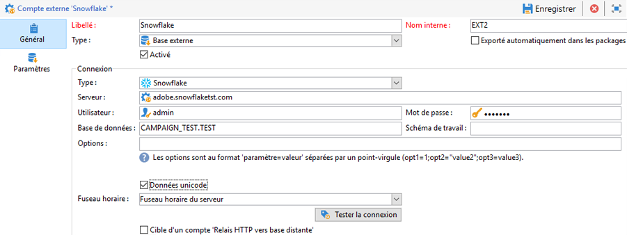

# Configurations spécifiques par type de base de données {#specific-configurations-by-database-type}

En fonction des bases de données externes auxquelles vous souhaitez pouvoir accéder depuis Adobe Campaign, certains paramétrages spécifiques sont nécessaires. Ces paramétrages concernent essentiellement l&#39;installation de pilotes et la déclarations de variables d&#39;environnement propres à chaque SGBDR sur le serveur Adobe Campaign.

En règle générale, il est nécessaire d&#39;installer la couche cliente correspondant à la base externe utilisée sur le serveur Adobe Campaign.

>[!NOTE]
>
>Les versions compatibles sont répertoriées dans la [Matrice de compatibilité Campaign](https://helpx.adobe.com/fr/campaign/kb/compatibility-matrix.html#FederatedDataAccessFDA).

<!--
## Configure access to Azure Synapse {#configure-access-to-azure-synapse}

### Azure Synapse on CentOS {#azure-centos}

1. Download mysql57-community-release.noarch.rpm. You can find it in this [page](https://dev.mysql.com/downloads/repo/yum).

1. Install the client library:

    ```
    $ yum install mysql57-community-release-el7-9.noarch.rpm
    $ yum install mysql-community-libs
    ```

1. You now need to configure the external account. In Campaign Classic, unfold the **[!UICONTROL Platform]** menu and click **[!UICONTROL External accounts]**.

1. Select the out-of-the box **[!UICONTROL Azure Synapse]** external account.

1. To configure the **[!UICONTROL Azure Synapse]** external account:

    * **[!UICONTROL Server]**
  
      URL of the Azure Synapse server.

    * **[!UICONTROL Account]**

      Name of the user.

    * **[!UICONTROL Password]**

      User account password.

    * **[!UICONTROL Database]**

      Name of your database

    >[!NOTE]
    >
    >Make sure the **[!UICONTROL Time zone]** and **[!UICONTROL Unicode data]** are set according to your database.

### Azure Synapse on Debian {#azure-debian}

1. Download mysql-apt-config.deb. You can find it in this [page](https://dev.mysql.com/doc/mysql-apt-repo-quick-guide/en).

1. Install the client library:

    ```
    $ dpkg -i mysql-apt-config_*_all.deb # choose mysql-5.7 in the configuration menu
    $ apt update
    $ apt install libmysqlclient20
    ```

1. You now need to configure the external account. In Campaign Classic, unfold the **[!UICONTROL Platform]** menu and click **[!UICONTROL External accounts]**.

1. Select the out-of-the box **[!UICONTROL Azure Synapse]** external account.

1. To configure the **[!UICONTROL Azure Synapse]** external account:

    * **[!UICONTROL Server]**
  
      URL of the Azure Synapse server.

    * **[!UICONTROL Account]**

      Name of the user.

    * **[!UICONTROL Password]**

      User account password.

    * **[!UICONTROL Database]**

      Name of your database

    >[!NOTE]
    >
    >Make sure the **[!UICONTROL Time zone]** and **[!UICONTROL Unicode data]** are set according to your database.

### Azure Synapse on Windows {#azure-windows}

1. Download the C connector. You can find it in this [page](https://dev.mysql.com/downloads/connector/c).

1. Make sure the directory that contains libmysqlclient.dll is added to the PATH environment variable that nlserver will use.

1. You now need to configure the external account. In Campaign Classic, unfold the **[!UICONTROL Platform]** menu and click **[!UICONTROL External accounts]**.

1. You now need to configure the external account. In Campaign Classic, unfold the **[!UICONTROL Platform]** menu and click **[!UICONTROL External accounts]**.

1. Select the out-of-the box **[!UICONTROL Azure Synapse]** external account.

1. To configure the **[!UICONTROL Azure Synapse]** external account:

    * **[!UICONTROL Server]**
  
      URL of the Azure Synapse server.

    * **[!UICONTROL Account]**

      Name of the user.

    * **[!UICONTROL Password]**

      User account password.

    * **[!UICONTROL Database]**

      Name of your database

    >[!NOTE]
    >
    >Make sure the **[!UICONTROL Time zone]** and **[!UICONTROL Unicode data]** are set according to your database.

-->

## Configurer l’accès à Snowflake {#configure-access-to-snowflake}

>[!NOTE]
>
>Le connecteur [!DNL Snowflake] est disponible pour les déploiements hébergés et on-premise. Voir à ce propos [cet article](https://helpx.adobe.com/fr/campaign/kb/acc-on-prem-vs-hosted.html).


### Snowflake sous CentOS {#snowflake-centos}

1. Téléchargez les pilotes ODBC pour [!DNL Snowflake]. [Cliquez ici](https://sfc-repo.snowflakecomputing.com/odbc/linux/latest/snowflake-odbc-2.20.2.x86_64.rpm) pour lancer le téléchargement.
1. Vous devez ensuite installer les pilotes ODBC sur CentOs à l’aide de la commande suivante :

   ```
   rpm -Uvh unixodbc
   rpm -Uvh snowflake-odbc-2.20.2.x86_64.rpm
   ```

1. Après avoir téléchargé et installé les pilotes ODBC, vous devez redémarrer Campaign Classic. Pour cela, exécutez la commande suivante :

   ```
   /etc/init.d/nlserver6 stop
   /etc/init.d/nlserver6 start
   ```

1. Dans Campaign Classic, vous pouvez ensuite configurer votre compte externe [!DNL Snowflake]. Dans l’**[!UICONTROL Explorateur]**, cliquez sur **[!UICONTROL Administration]** / **[!UICONTROL Plateforme]** / **[!UICONTROL Comptes externes]**.

1. Sélectionnez le compte externe **[!UICONTROL Snowflake]** intégré.

1. Configurez le compte externe **[!UICONTROL Snowflake]**. Vous devez indiquer les informations suivantes :

   * **[!UICONTROL Serveur]** : URL du serveur [!DNL Snowflake]

   * **[!UICONTROL Compte]** : nom de l’utilisateur

   * **[!UICONTROL Mot de passe]** : mot de passe du compte utilisateur

   * **[!UICONTROL Base de données]** : nom de la base de données
   

1. Cliquez sur l’onglet **[!UICONTROL Paramètres]**, puis sur le bouton **[!UICONTROL Déployer les fonctions]** pour créer des fonctions.

   

Le connecteur prend en charge les options suivantes :

| Option | Description |
|---|---|
| workschema | Schéma de base de données à utiliser pour les tables de travail. |
| warehouse | Nom de l’entrepôt par défaut à utiliser. Il remplace la valeur par défaut de l’utilisateur. |
| TimeZoneName | Vide par défaut. C’est le fuseau horaire système du serveur applicatif Campaign Classic qui est utilisé. Il est possible d’utiliser cette option pour forcer le paramètre de session TIMEZONE. <br>[Voir à ce propos cette page](https://docs.snowflake.net/manuals/sql-reference/parameters.html#timezone). |
| WeekStart | Paramètre de session WEEK_START. Par défaut, cette valeur est définie sur 0. <br>[Voir à ce propos cette page](https://docs.snowflake.com/en/sql-reference/parameters.html#week-start). |
| UseCachedResult | Paramètre de session USE_CACHED_RESULTS. Par défaut, cette valeur est définie sur TRUE. Il est possible d’utiliser cette option pour désactiver les résultats de Snowflake mis en mémoire cache. <br>Pour plus d’informations à ce sujet, voir [cette page](https://docs.snowflake.net/manuals/user-guide/querying-persisted-results.html). |

### Snowflake sous Debian {#snowflake-debian}

1. Téléchargez les pilotes ODBC pour [!DNL Snowflake]. [Cliquez ici](https://sfc-repo.snowflakecomputing.com/odbc/linux/latest/index.html) pour lancer le téléchargement.

1. Vous devez ensuite installer les pilotes ODBC sous Debian à l’aide de la commande suivante :

   ```
   apt-get install unixodbc
   apt-get install snowflake-odbc-x.xx.x.x86_64.deb
   ```

1. Après avoir téléchargé et installé les pilotes ODBC, vous devez redémarrer Campaign Classic. Pour cela, exécutez la commande suivante :

   ```
   systemctl stop nlserver.service
   systemctl start nlserver.service
   ```

1. Dans Campaign Classic, vous pouvez ensuite configurer votre compte externe [!DNL Snowflake]. Dans l’**[!UICONTROL Explorateur]**, cliquez sur **[!UICONTROL Administration]** / **[!UICONTROL Plateforme]** / **[!UICONTROL Comptes externes]**.

1. Sélectionnez le compte externe **[!UICONTROL Snowflake]** intégré.

1. Pour configurer le compte externe **[!UICONTROL Snowflake]**, vous devez indiquer les informations suivantes :

   * **[!UICONTROL Serveur]** : URL du serveur [!DNL Snowflake]

   * **[!UICONTROL Compte]** : nom de l’utilisateur

   * **[!UICONTROL Mot de passe]** : mot de passe du compte utilisateur

   * **[!UICONTROL Base de données]** : nom de la base de données
   

1. Cliquez sur l’onglet **[!UICONTROL Paramètres]**, puis sur le bouton **[!UICONTROL Déployer les fonctions]** pour créer des fonctions.

   

Le connecteur prend en charge les options suivantes :

| Option | Description |
|---|---|
| workschema | Schéma de base de données à utiliser pour les tables de travail. |
| warehouse | Nom de l’entrepôt par défaut à utiliser. Il remplace la valeur par défaut de l’utilisateur. |
| TimeZoneName | Vide par défaut. C’est le fuseau horaire système du serveur applicatif Campaign Classic qui est utilisé. Il est possible d’utiliser cette option pour forcer le paramètre de session TIMEZONE. <br>[Voir à ce propos cette page](https://docs.snowflake.net/manuals/sql-reference/parameters.html#timezone). |
| WeekStart | Paramètre de session WEEK_START. Par défaut, cette valeur est définie sur 0.  <br>[Voir à ce propos cette page](https://docs.snowflake.net/manuals/sql-reference/parameters.html#week-start). |
| UseCachedResult | Paramètre de session USE_CACHED_RESULTS. Par défaut, cette valeur est définie sur TRUE. Il est possible d’utiliser cette option pour désactiver les résultats de Snowflake mis en mémoire cache. <br>Pour plus d’informations à ce sujet, voir cette [page](https://docs.snowflake.net/manuals/user-guide/querying-persisted-results.html). |

### Snowflake sous Windows {#snowflake-windows}

1. Téléchargez le pilote [ODBC pour Windows](https://docs.snowflake.net/manuals/user-guide/odbc-download.html). Notez la nécessité de disposer de privilèges de niveau administrateur pour installer le pilote. Voir à ce propos [cette page](https://docs.snowflake.net/manuals/user-guide/admin-user-management.html)

1. Configurez le pilote ODBC. Voir à ce propos [cette page](https://docs.snowflake.net/manuals/user-guide/odbc-windows.html#step-2-configure-the-odbc-driver)

1. Dans Campaign Classic, vous pouvez ensuite configurer votre compte externe [!DNL Snowflake]. Dans l’**[!UICONTROL Explorateur]**, cliquez sur **[!UICONTROL Administration]** / **[!UICONTROL Plateforme]** / **[!UICONTROL Comptes externes]**.

1. Sélectionnez le compte externe **[!UICONTROL Snowflake]** intégré.

1. Pour configurer le compte externe **[!UICONTROL Snowflake]**, vous devez indiquer les informations suivantes :

   * **[!UICONTROL Serveur]** : URL du serveur [!DNL Snowflake]

   * **[!UICONTROL Compte]** : nom de l&#39;utilisateur

   * **[!UICONTROL Mot de passe]** : mot de passe du compte utilisateur

   * **[!UICONTROL Base de données]** : nom de la base de données
   

1. Cliquez sur l’onglet **[!UICONTROL Paramètres]**, puis sur le bouton **[!UICONTROL Déployer les fonctions]** pour créer des fonctions.

   

Le connecteur prend en charge les options suivantes :

| Option | Description |
|---|---|---|
| workschema | Schéma de base de données à utiliser pour les tables de travail. |
| warehouse | Nom de l’entrepôt par défaut à utiliser. Il remplace la valeur par défaut de l’utilisateur. |
| TimeZoneName | Vide par défaut. C’est le fuseau horaire système du serveur applicatif Campaign Classic qui est utilisé. Il est possible d’utiliser cette option pour forcer le paramètre de session TIMEZONE. <br>[Voir à ce propos cette page](https://docs.snowflake.net/manuals/sql-reference/parameters.html#timezone). |
| WeekStart | Paramètre de session WEEK_START. Par défaut, cette valeur est définie sur 0. <br>[Voir à ce propos cette page](https://docs.snowflake.net/manuals/sql-reference/parameters.html#week-start). |
| UseCachedResult | Par défaut, cette valeur est définie sur TRUE. Il est possible d’utiliser cette option pour désactiver les résultats de Snowflake mis en mémoire cache (paramètre de session USE_CACHED_RESULTS) <br>Pour plus d’informations à ce sujet, voir [cette page](https://docs.snowflake.net/manuals/user-guide/querying-persisted-results.html). |

## Configurer l’accès à Hadoop 3.0 {#configure-access-to-hadoop-3}

La connexion à une base de données externe Hadoop dans FDA requiert les paramétrages suivants sur le serveur Adobe Campaign. Notez que cette configuration est possible pour Windows et Linux.

1. Téléchargez les pilotes ODBC pour Hadoop en fonction de votre version de système d’exploitation. Les pilotes se trouvent dans [cette page](https://www.cloudera.com/downloads.html).

1. Vous devez ensuite installer les pilotes ODBC et créer un DSN pour votre connexion Hive. Les instructions se trouvent dans [cette page](https://docs.cloudera.com/documentation/other/connectors/hive-odbc/2-6-5/Cloudera-ODBC-Driver-for-Apache-Hive-Install-Guide.pdf)

1. Après avoir téléchargé et installé les pilotes ODBC, vous devez redémarrer Campaign Classic. Pour cela, exécutez la commande suivante :

   ```
   systemctl stop nlserver.service
   systemctl start nlserver.service
   ```

1. Dans Campaign Classic, vous pouvez ensuite configurer votre compte externe Snowflake. Dans l’**[!UICONTROL Explorateur]**, cliquez sur **[!UICONTROL Administration]** / **[!UICONTROL Plateforme]** / **[!UICONTROL Comptes externes]**.

1. Cliquez sur **[!UICONTROL Créer]**, puis sélectionnez le type de compte **[!UICONTROL Base de données externe]**.

1. Pour configurer le compte externe **[!UICONTROL Hadoop]**, vous devez indiquer les informations suivantes :

   * **[!UICONTROL Type]** : ODBC (Sybase ASE, Sybase IQ)

   * **[!UICONTROL Serveur]** : nom du DNS

   * **[!UICONTROL Compte]** : nom de l’utilisateur

   * **[!UICONTROL Mot de passe]** : mot de passe du compte utilisateur

   * **[!UICONTROL Base de données]** : nom de la base de données s’il n’est pas spécifié dans le DSN. Il peut rester vide s’il est spécifié dans le DSN

   * **[!UICONTROL Fuseau horaire]** : fuseau horaire du serveur
   

Le connecteur prend en charge les options ODBC suivantes :

| Nom | Valeur |
|---|---|
| ODBCMgr | iODBC |
| warehouse | 1/2/4 |

Le connecteur prend également en charge les options Hive suivantes :

| Nom | Valeur | Description |
|---|---|---|
| bulkKey | Clé d’accès Azure Blob ou DataLake. | Pour les chargeurs en masse wasb:// ou wasbs:// (c.-à-d. si l’outil de chargement en masse a pour préfixe wasb:// ou wasbs://). <br>Il s’agit de la clé d’accès pour le compartiment de blob ou de DataLake servant au chargement en masse. |
| hdfsPort | Numéro de port <br>défini par défaut sur 8020 | Pour le chargement HDFS en masse (c.-à-d. si l’outil de chargement en masse a pour préfixe webhdfs:// ou webhdfss://). |
| bucketsNumber | 20 | Nombre de compartiments lors de la création d’une table regroupée. |
| fileFormat | PARQUET | Format de fichier par défaut pour les tables de travail. |

## Configurer l’accès à Hadoop 2.1 {#configure-access-to-hadoop}

### Pour Windows {#for-windows}

1. Installez les pilotes ODBC et [Azure HD Insight](https://www.microsoft.com/en-us/download/details.aspx?id=40886) pour Windows.
1. Créez le nom de la source de données en exécutant l&#39;outil ODBC DataSource Administrator. Il vous est fourni un exemple de nom de source de données système pour Hive que vous pouvez modifier.

   ```
   Description: vorac (or any name you like)
   Host: vorac.azurehdinsight.net
   Port: 443
   Database: sm_tst611 (or your database name)
   Mechanism: Azure HDInsight Service
   User/Password: admin/<your password here>
   ```

1. Créez le compte externe Hadoop, comme décrit dans [cette page](../../platform/using/external-accounts.md#hadoop-external-account).

### Pour Linux {#for-linux}

1. Installez unixodbc pour Linux.

   ```
   apt-get install unixodbc
   ```

1. Téléchargez et installez les pilotes ODBC pour Apache Hive depuis HortonWorks : [https://www.hortonworks.com/downloads/](https://www.hortonworks.com/downloads/).

   ```
   dpkg -i hive-odbc-native_2.1.10.1014-2_amd64.deb
   ```

1. Vérifiez l’emplacement des fichiers ODBC.

   ```
   root@campadpac71:/tmp# odbcinst -j
   unixODBC 2.3.1
   DRIVERS............: /etc/odbcinst.ini
   SYSTEM DATA SOURCES: /etc/odbc.ini
   FILE DATA SOURCES..: /etc/ODBCDataSources
   USER DATA SOURCES..: /root/.odbc.ini
   SQLULEN Size.......: 8
   SQLLEN Size........: 8
   SQLSETPOSIROW Size.: 8
   ```

1. Créez le nom de la source de données et éditez le fichier odbc.ini. Puis, créez un nom de source de données pour votre connexion Hive.

   Voici un exemple pour HDInsight destiné à configurer une connexion appelée &quot;viral&quot; :

   ```
   [ODBC Data Sources]
   vorac 
   
   [vorac]
   Driver=/usr/lib/hive/lib/native/Linux-amd64-64/libhortonworkshiveodbc64.so
   HOST=vorac.azurehdinsight.net
   PORT=443
   Schema=sm_tst611
   HiveServerType=2
   AuthMech=6
   UID=admin
   PWD=<your password here>
   HTTPPath=
   UseNativeQuery=1
   ```

   >[!NOTE]
   >
   >Le paramètre **UseNativeQuery** est ici très important. Campaign est basé sur Hive et ne fonctionnera pas correctement si le paramètre UseNativeQuery n&#39;est pas défini. En règle générale, le pilote ou Hive SQL Connector réécrit les requêtes et modifie l&#39;ordre des colonnes.

   La configuration de l&#39;authentification dépend de la configuration de Hive/Hadoop. Par exemple, pour HDInsight, utilisez AuthMech=6 pour l&#39;authentification par utilisateur/mot de passe, comme décrit [ici](https://www.simba.com/products/Spark/doc/ODBC_InstallGuide/unix/content/odbc/hi/configuring/authenticating/azuresvc.htm).

1. Exportez les variables.

   ```
   export ODBCINI=/etc/myodbc.ini
   export ODBCSYSINI=/etc/myodbcinst.ini
   ```

1. Configurez les pilotes Hortonworks via /usr/lib/hive/lib/native/Linux-amd64-64/hortonworks.hiveodbc.ini.

   Vous devez utiliser UTF-16 pour vous connecter à Campaign et unix-odbc (libodbcinst).

   ```
   [Driver]
   
   DriverManagerEncoding=UTF-16
   ErrorMessagesPath=/usr/lib/hive/lib/native/hiveodbc/ErrorMessages/
   LogLevel=0
   LogPath=/tmp/hive
   SwapFilePath=/tmp
   
   ODBCInstLib=libodbcinst.so
   ```

1. Vous pouvez maintenant tester votre connexion en utilisant isql.

   ```
   isql vorac
   isql vorac -v
   ```

1. Créez le compte externe Hadoop, comme décrit dans [cette page](../../platform/using/external-accounts.md#hadoop-external-account).

## Configurer l’accès à Netezza {#configure-access-to-netezza}

La connexion à une base de données externe Netezza en FDA requiert les paramétrages additionnels ci-dessous sur le serveur Adobe Campaign :

1. Installez les pilotes ODBC pour Netezza, en fonction du système d&#39;exploitation que vous utilisez :

   * **nz-linuxclient-v7.2.0.0.tar.gz pour Linux. Sélectionnez le dossier correspondant à votre système d&#39;exploitation (linux ou linux64) et lancez la commande unpack. Vous pouvez laisser l&#39;installation s&#39;effectuer dans le répertoire par défaut proposé : &quot;/usr/local/nz&quot;.**
   * **nz-winclient-v7.2.0.0.zip pour Windows. Décompressez le fichier et lancez le script exécutable correspondant à votre système d&#39;exploitation : nzodbcsetup.exe ou nzodbcsetup64.exe. Suivez les indications de l&#39;assistant pour finaliser l&#39;installation des pilotes.**

1. Configurez le pilote ODBC. La configuration peut être réalisée dans les fichiers standard : **/etc/odbc.ini** pour les paramètres généraux et **/etc/odbcinst.ini** pour la déclaration des pilotes.

   * **/etc/odbc.ini**

      ```
      [ODBC]
      InstallDir=/etc/
      ```

      &quot;InstallDir&quot; correspond à l’emplacement du fichier odbcinst.ini.

   * **/etc/odbcinst.ini**

      ```
      [ODBC Drivers]
      NetezzaSQL = Installed
      
      [NetezzaSQL]
      Driver           = /usr/local/nz/lib/libnzsqlodbc3.so
      Setup            = /usr/local/nz/lib/libnzsqlodbc3.so
      APILevel         = 1
      ConnectFunctions = YYN
      Description      = Netezza ODBC driver
      DriverODBCVer    = 03.51
      DebugLogging     = false
      LogPath          = /tmp
      UnicodeTranslationOption = utf8
      CharacterTranslationOption = all
      PreFetch         = 256
      Socket           = 16384
      ```

1. Définissez les variables d’environnement du serveur Adobe Campaign :

   * **LD_LIBRARY_PATH** : /usr/local/nz/lib et /usr/local/nz/lib64. &quot;/usr/local/nz&quot; correspond au répertoire d&#39;installation proposé par défaut lors de l&#39;installation des pilotes. Indiquez ici le répertoire que vous avez sélectionné pour l&#39;installation.
   * **ODBCINI** : emplacement du fichier odbc.ini (par exemple /etc/odbc.ini).
   * **NZ_ODBC_INI_PATH** : emplacement du fichier odbc.ini. Netezza requiert également cette seconde variable pour l&#39;utilisation du fichier odbc.ini.

1. Dans Campaign Classic, vous pouvez ensuite configurer votre compte externe Netezza. Dans l’**[!UICONTROL Explorateur]**, cliquez sur **[!UICONTROL Administration]** / **[!UICONTROL Plateforme]** / **[!UICONTROL Comptes externes]**.

1. Cliquez sur **[!UICONTROL Nouveau]**, puis sélectionnez **[!UICONTROL Base de données externe]** comme **[!UICONTROL Type]**.

1. Pour configurer le compte externe **[!UICONTROL Netezza]**, vous devez indiquer les informations suivantes :

   * **[!UICONTROL Type]** : Netezza

   * **[!UICONTROL Serveur]** : URL du serveur Netezza

   * **[!UICONTROL Compte]** : nom de l&#39;utilisateur

   * **[!UICONTROL Mot de passe]** : mot de passe du compte utilisateur

   * **[!UICONTROL Base de données]** : nom de la base de données

>[!NOTE]
>
>Les opérations sur les schémas comportant des clés primaires générées automatiquement ne sont pas prises en charge.
>
>La table utilise la clause **Organize on** sur le premier index défini dans le schéma. Comme cette clause est limitée de 1 à 4 colonnes avec Netezza, cet index ne peut pas contenir plus de 4 colonnes.

## Configurer l’accès à Oracle {#configure-access-to-oracle}

La connexion à une base de données externe Oracle en FDA requiert les paramétrages additionnels ci-dessous sur le serveur Adobe Campaign.

### Pour Linux {#for-linux-1}

1. Installez le client complet Oracle correspondant à votre version d&#39;Oracle.
1. Ajoutez vos définitions TNS à votre installation. Pour cela, indiquez-les dans un fichier **tnsnames.ora** dans le répertoire /etc/oracle. Si ce répertoire n’existe pas, créez-le.

   Créez alors une nouvelle variable d&#39;environnement TNS_ADMIN : export TNS_ADMIN=/etc/oracle et redémarrez la machine.

1. Intégrez Oracle à votre serveur Adobe Campaign (nlserver). Pour cela, vérifiez que le fichier **customer.sh** est bien présent dans le dossier &quot;nl6&quot; de l’arborescence du serveur Adobe Campaign et que ce dernier comprend bien les liens vers les bibliothèques Oracle.

   Par exemple pour un client 11.2 :

   ```
   export ORACLE_HOME=/usr/lib/oracle/11.2
   export TNS_ADMIN=/etc/oracle
   export LD_LIBRARY_PATH=$ORACLE_HOME/client64/lib:$LD_LIBRARY_PATH
   ```

   >[!NOTE]
   >
   >Ces valeurs (notamment ORACLE_HOME), dépendent de vos répertoires d&#39;installation. Vérifiez bien votre arborescence avant de référencer ces valeurs.

1. Installez les librairies nécessaires à Oracle :

   * **libclntsh.so**

      ```
      cd /usr/lib/oracle/<version>/client<architecture>/lib
      ln -s libclntsh.so.<version> libclntsh.so
      ```

   * **libaio1**

      ```
      aptitude install libaio1
      or
      yum install libaio1
      ```

### Pour Windows {#for-windows-1}

1. Installez le client Oracle.
1. Dans le dossier C:Oracle, créez un fichier **tnsnames.ora** contenant vos définitions TNS.

   Ajoutez une variable d&#39;environnement TNS_ADMIN avec pour valeur C:Oracle et redémarrez la machine.

## Configurer l’accès à Sybase IQ {#configure-access-to-sybase-iq}

La connexion à une base de données externe Sybase IQ en FDA requiert les paramétrages additionnels ci-dessous sur le serveur Adobe Campaign :

1. Vérifiez que le package unixodbc se trouve sur le serveur.
1. Installez **iq_odbc**. Une erreur peut se produire à la fin de l&#39;installation. Celle-ci peut être ignorée.
1. Installez **iq_client_common**. Une erreur Java peut se produire à la fin de l&#39;installation. Celle-ci peut être ignorée.
1. Configurez le pilote ODBC. La configuration peut être réalisée dans les fichiers standard : /etc/odbc.ini pour les paramètres généraux et /etc/odbcinst.ini pour la déclaration des pilotes :

   * **/etc/odbc.ini**(remplacez les valeurs telles que `<server_alias>` par les vôtres) :

      ```
      [ODBC Data Sources]
      <server_alias>=libdbodbc.so
      
      [<server_alias>]
      Driver=/opt/sybase/IQ-16_0/lib64/libdbodbc16.so
      Description=<description>
      Username=<username>
      Password=<password>
      ServerName=<server_name>
      CommLinks=tcpip(host=<host>)
      ```

   * **/etc/odbcinst.ini**

      ```
      [ODBC DRIVERS]
      SAP SybaseIQ=Installed
      
      [SAP SybaseIQ]
      Driver=/opt/sybase/IQ-16_0/lib64/libdbodbc16.so
      ```

1. Ajoutez le chemin d&#39;accès de la nouvelle bibliothèque libodbc16.so dans la variable LD_LIBRARY_PATH. Pour ce faire :

   * Si vous utilisez un fichier customer.sh pour déclarer le chemin d&#39;accès : ajoutez le chemin d&#39;accès /opt/sybase/IQ-16_0/lib64 pour la variable LD_LIBRARY_PATH.
   * Sinon, utilisez une commande Unix.

1. Dans Campaign Classic, vous pouvez ensuite configurer votre compte externe Sybase IQ. Dans l’**[!UICONTROL Explorateur]**, cliquez sur **[!UICONTROL Administration]** / **[!UICONTROL Plateforme]** / **[!UICONTROL Comptes externes]**.

1. Cliquez sur **[!UICONTROL Nouveau]**, puis sélectionnez **[!UICONTROL Base de données externe]** comme **[!UICONTROL Type]**.

1. Pour configurer le compte externe **[!UICONTROL Sybase IQ]**, vous devez indiquer les informations suivantes :

   * **[!UICONTROL Type]** : ODBC (Sybase ASE, Sybase IQ)

   * **[!UICONTROL Serveur]** : correspond à la connexion ODBC (`<server_alias>`) définie à l’étape 5. Il ne s’agit pas nécessairement du nom du serveur lui-même.

   * **[!UICONTROL Compte]** : nom de l&#39;utilisateur

   * **[!UICONTROL Mot de passe]** : mot de passe du compte utilisateur

   * **[!UICONTROL Base de données]** : nom de la base de données

>[!NOTE]
>
>Pour Windows, vous devez installer le client Sybase IQ sur le serveur Adobe Campaign et créer une connexion ODBC. Veillez à créer une source de données système lorsque le serveur Adobe Campaign (nlserver) s’exécute en tant que service sous Windows.

## Configurer l’accès à Teradata {#configure-access-to-teradata}

La connexion à une base de données externe Teradata en FDA requiert certains paramétrages additionnels sur le serveur Adobe Campaign. Pour plus d’informations sur le paramétrage de votre base de données Teradata, consultez cet [article](https://helpx.adobe.com/fr/campaign/kb/campaign_fda_teradata.html).

1. Installez le [pilote ODBC pour Teradata](https://downloads.teradata.com/download/connectivity/odbc-driver/linux).

   Il est constitué de trois packages pouvant être installés sur Red Hat (ou CentOS)/Suse dans l&#39;ordre suivant :

   * TeraGSS
   * tdicu1510 (installez-le via setup_wrapper.sh)
   * tdodbc1510 (installez-le via setup_wrapper.sh)

1. Configurez le pilote ODBC. La configuration peut être réalisée dans les fichiers standard : **/etc/odbc.ini** pour les paramètres généraux et /etc/odbcinst.ini pour la déclaration des pilotes :

   * **/etc/odbc.ini**

      ```
      [ODBC]
      InstallDir=/etc/
      ```

      « InstallDir » correspond à l’emplacement du fichier **odbcinst.ini**.

   * **/etc/odbcinst.ini**

      ```
      [ODBC DRIVERS]
      teradata=Installed
      
      [teradata]
      Driver=/opt/teradata/client/15.10/lib64/tdata.so
      APILevel=CORE
      ConnectFunctions=YYY
      DriverODBCVer=3.51
      SQLLevel=1
      ```

1. Définissez les variables d’environnement du serveur Adobe Campaign :

   * **LD_LIBRARY_PATH** : /opt/teradata/client/15.10/lib64 et /opt/teradata/client/15.10/odbc_64/lib.
   * **ODBCINI** : emplacement du fichier odbc.ini (par exemple /etc/odbc.ini).
   * **NLSPATH** : emplacement du fichier opermsgs.cat (/opt/teradata/client/15.10/msg/opermsgs.cat)

1. Dans Campaign Classic, vous pouvez ensuite configurer votre compte Teradata. Dans l’**[!UICONTROL Explorateur]**, cliquez sur **[!UICONTROL Administration]** / **[!UICONTROL Plateforme]** / **[!UICONTROL Comptes externes]**.

1. Cliquez sur **[!UICONTROL Nouveau]**, puis sélectionnez **[!UICONTROL Base de données externe]** comme **[!UICONTROL Type]**.

1. Pour configurer le compte externe **[!UICONTROL Teradata]**, vous devez indiquer les informations suivantes :

   * **[!UICONTROL Type]** : Teradata

   * **[!UICONTROL Serveur]** : URL du serveur Teradata

   * **[!UICONTROL Compte]** : nom de l’utilisateur

   * **[!UICONTROL Mot de passe]** : mot de passe du compte utilisateur

   * **[!UICONTROL Base de données]** : nom de la base de données

## Configurer l’accès à SAP HANA {#configure-access-to-sap-hana}

La connexion à une base de données externe SAP HANA en FDA requiert certains paramétrages additionnels sur le serveur Adobe Campaign :

1. Installez les pilotes ODBC pour SAP HANA, en fonction du système d&#39;exploitation que vous utilisez :

   * **hdb_client_linux.tgz pour Linux. Une fois le fichier décompressé, lancez la commande hdbinst et suivez les instructions pour terminer l&#39;installation des pilotes.**
   * **Hdb_client_windows.zip** pour Windows. Décompressez le fichier et lancez l&#39;exécutable : **hdbinst.exe**. Suivez les instructions de l&#39;assistant pour terminer l&#39;installation des pilotes.

1. Configurez le pilote ODBC. La configuration peut être réalisée dans les fichiers standard : /etc/odbc.ini pour les paramètres généraux et /etc/odbcinst.ini pour la déclaration des pilotes.

   * **/etc/odbc.ini**

      ```
      [ODBC]
      InstallDir=/etc/
      
      [HDB]
      Driver=HDBODBC
      servernode=localhost:39013 (this value depend of your server)
      User:SYSTEM
      ```

      « InstallDir » correspond à l’emplacement du fichier **odbcinst.ini**.

   * **/etc/odbcinst.ini**

      ```
      [HDBODBC]
      Description = "SmartCloudPT HANA"
      Driver = /usr/sap/hdbclient/libodbcHDB.so
      ```

1. Définissez les variables d’environnement du serveur Adobe Campaign :

   * **LD_LIBRARY_PATH** : doit inclure le lien vers votre client SAP HANA (/usr/sap/hdbclient/libodbcHDB.so par défaut).
   * **ODBCINI** : emplacement du fichier odbc.ini (par exemple /etc/odbc.ini).

1. Dans Campaign Classic, vous pouvez ensuite configurer votre compte externe SAP Hana. Dans l’**[!UICONTROL Explorateur]**, cliquez sur **[!UICONTROL Administration]** / **[!UICONTROL Plateforme]** / **[!UICONTROL Comptes externes]**.

1. Cliquez sur **[!UICONTROL Nouveau]**, puis sélectionnez **[!UICONTROL Base de données externe]** comme **[!UICONTROL Type]**.

1. Pour configurer le compte externe **[!UICONTROL SAP Hana]**, vous devez indiquer les informations suivantes :

   * **[!UICONTROL Type]** : SAP Hana

   * **[!UICONTROL Serveur]** : URL du serveur SAP Hana

   * **[!UICONTROL Compte]** : nom de l’utilisateur

   * **[!UICONTROL Mot de passe]** : mot de passe du compte utilisateur
