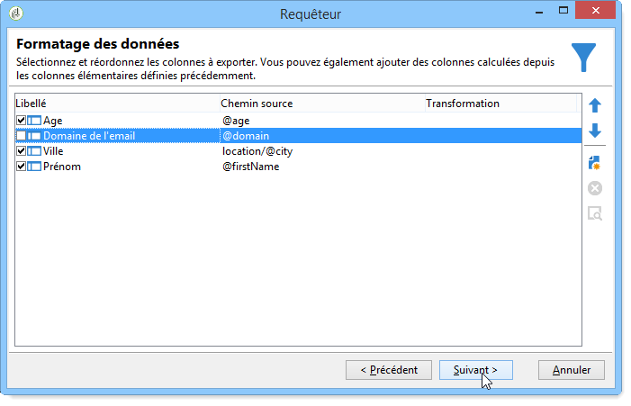

# Étapes pour créer une requête{#steps-to-create-a-query}

Les étapes de construction d&#39;une requête dans Adobe Campaign sont les suivantes :

1. Sélectionner la table de travail. Pour plus d&#39;informations, consultez la section [Etape 1 - Sélection de la table](#step-1---choose-a-table).
1. Sélectionner les données à extraire. Pour plus d&#39;informations, consultez la section [Etape 2 - Sélection des données à extraire](#step-2---choose-data-to-extract).
1. Définir la séquence de tri des données. Pour plus d&#39;informations, consultez la section [Etape 3 - Tri des données](#step-3---sort-data).
1. Filtrer les données. Pour plus d&#39;informations, consultez la section [Etape 4 - Filtrage des données](#step-4---filter-data).
1. Mettre en forme les données. Pour plus d&#39;informations, consultez la section [Etape 5 - Formatage des données](#step-5---format-data).
1. Afficher le résultat. Pour plus d&#39;informations, consultez la section [Etape 6 - Prévisualisation des données](#step-6---preview-data).

>[!NOTE]
>
>Dans le requêteur générique, toutes ces étapes sont proposées. Lorsqu&#39;une requête est créée dans un autre contexte, certaines étapes peuvent être omises.\
>L&#39;activité Requête est présentée dans [cette section](../../workflow/using/query.md).

## Etape 1 - Sélection de la table {#step-1---choose-a-table}

Sélectionnez la table contenant les données à interroger dans le **[!UICONTROL Type de document]** fenêtre. Au besoin, filtrez les données à l&#39;aide du champ de filtrage ou de la variable **[!UICONTROL Filtres]** bouton .

## Etape 2 - Sélection des données à extraire {#step-2---choose-data-to-extract}

Dans la fenêtre **[!UICONTROL Données à extraire]**, sélectionnez les données à afficher : ces champs constitueront les colonnes de sortie.

Sélectionnez par exemple **[!UICONTROL Age]**, **[!UICONTROL Clé primaire]**, **[!UICONTROL Domaine de l&#39;email]** et **[!UICONTROL Ville]**. Les résultats seront organisés en fonction de cette sélection. Réordonnez les colonnes de sortie avec les flèches bleues situées à droite de la fenêtre.

Vous pouvez éditer une expression en y insérant une formule ou en exécutant un processus sur une fonction d&#39;agrégat. Pour ce faire, cliquez sur le bouton **[!UICONTROL Expression]** champ de colonne, puis sélectionnez **[!UICONTROL Expression d’édition]**.

Il est possible de regrouper les données des colonnes de sortie : pour cela, cochez la case **[!UICONTROL Oui]** dans le **[!UICONTROL Groupe]** de la colonne **[!UICONTROL Données à extraire]** fenêtre. Cette fonction génère un résultat autour de l&#39;axe de groupement coché. Un exemple de requête avec regroupement est disponible dans [cette section](../../workflow/using/querying-delivery-information.md).

* La fonction de groupement **[!UICONTROL Gérer les groupements (GROUP BY + HAVING)]** permet un groupement (&quot;group by&quot;) et une sélection de ce qui a été groupé (&quot;having&quot;). Elle s&#39;applique aux champs inscrits en colonne de sortie. Par exemple, cette option regroupe les choix d&#39;une colonne de sortie et récupère un type d&#39;information particulier : les destinataires âgés de 35 à 50 ans.

  Voir à ce propos [cette section](../../workflow/using/querying-using-grouping-management.md).

* La fonction **[!UICONTROL Supprimer les doublons (DISTINCT)]** permet de dédoublonner des résultats identiques obtenus en colonne de sortie. Si l&#39;on recense les destinataires en sélectionnant les champs Nom, Prénom et Email en colonne de sortie, ceux qui ont un prénom, un nom et une adresse email identiques sont éliminés. En effet, il s&#39;agit du même contact renseigné plus d&#39;une fois dans la base. Ainsi, un seul résultat sera pris en compte.

## Etape 3 - Tri des données {#step-3---sort-data}

La fenêtre **[!UICONTROL Tris]** permet de trier le contenu des colonnes. Utilisez les flèches pour modifier l&#39;ordre de tri des colonnes :

* Avec **[!UICONTROL Tri]**, le contenu de chaque colonne est ordonné de A à Z. Le contenu est ordonné par ordre croissant s&#39;il est chiffré.
* Avec **[!UICONTROL Tri descendant]**, le contenu de la colonne est ordonné de Z à A ou dans un ordre décroissant si le contenu est chiffré. Un tri descendant est utile par exemple pour visualiser les ventes de disques, avec les meilleurs scores affichés en haut de la liste.

Dans cet exemple, les données seront triées en fonction de l&#39;âge des destinataires, du plus jeune au plus âgé.

## Etape 4 - Filtrage des données {#step-4---filter-data}

Le requêteur permet de filtrer les données pour affiner la recherche.

Les filtres proposés dépendent de la table sur laquelle porte la requête.

Après la sélection de **[!UICONTROL Critères de filtrage]**, vous accédez à la section **[!UICONTROL Eléments de la cible]** : vous pouvez y définir comment filtrer les données à collecter.

* Pour créer un nouveau filtre, sélectionnez les champs, opérateurs et valeurs nécessaires à la création de la formule. Elle devra être vérifiée pour permettre la sélection des données. Il est possible de combiner plusieurs conditions (voir à ce sujet la section [Définir les conditions de filtrage](../../platform/using/defining-filter-conditions.md)).
* Pour utiliser des filtres enregistrés au préalable, déroulez la liste du bouton **[!UICONTROL Ajouter]**, cliquez sur **[!UICONTROL Filtre prédéfini]** puis sélectionnez un filtre pré-enregistré.

  

* Les filtres créés dans la variable **[!UICONTROL Éditeur de requêtes générique]** sont disponibles dans d’autres applications de requête et vice versa. Pour enregistrer un filtre, cliquez sur le bouton **[!UICONTROL Enregistrer]** Icône

  >[!NOTE]
  >
  >La création et l&#39;utilisation des filtres sont présentées dans la section [Options de filtrage](../../platform/using/filtering-options.md).

Dans l&#39;exemple ci-dessous, pour ne récupérer que les destinataires de langue française, choisissez : &quot;langue des destinataires **égal à** FR&quot;.

>[!NOTE]
>
>Vous pouvez accéder directement à une option en inscrivant la formule suivante dans le champ **Valeur** : **$(options:OPTION_NAME)**.

Cliquez sur l&#39;onglet **[!UICONTROL Aperçu]** afin de visualiser le résultat de la condition de filtrage. Dans ce cas, chaque destinataire de langue française est affiché avec son nom, prénom et adresse email.

Les utilisateurs maîtrisant le langage SQL peuvent cliquer sur **[!UICONTROL Requête SQL correspondante]** pour visualiser la requête en SQL.

## Etape 5 - Formatage des données {#step-5---format-data}

Après le paramétrage de filtres de restriction, vous accédez à la fenêtre **[!UICONTROL Formatage des données]**. Elle permet de réordonner l&#39;affichage des colonnes de sortie, de transformer les données et de modifier la casse des libellés de colonnes. Elle permet également d&#39;appliquer une formule sur le résultat final, grâce à un champ calculé.

>[!NOTE]
>
>Au sujet des types de champs calculés, voir la section [Création de champs calculés](../../platform/using/defining-filter-conditions.md#creating-calculated-fields).

Une colonne qui n&#39;est pas cochée ne s&#39;affichera pas dans la fenêtre de prévisualisation des données.

La variable **[!UICONTROL Transformation]** permet de changer le libellé d&#39;une colonne en majuscules ou en minuscules. Sélectionnez la colonne et cliquez sur le bouton **[!UICONTROL Transformation]** colonne . Vous pouvez choisir :

* **[!UICONTROL Passer en minuscules]**,
* **[!UICONTROL Passer en majuscules]**,
* **[!UICONTROL Première lettre en majuscule]**.

## Etape 6 - Prévisualisation des données {#step-6---preview-data}

La variable **[!UICONTROL Aperçu des données]** La fenêtre est la dernière étape. Cliquez sur **[!UICONTROL Lancer la prévisualisation des données]** pour obtenir le résultat de votre requête. Il est disponible en colonnes ou au format XML. Cliquez sur le bouton **[!UICONTROL Requêtes SQL générées]** pour visualiser la requête au format SQL.

Dans cet exemple, les données sont triées selon l&#39;âge des destinataires ciblés et dans un ordre croissant.

>[!NOTE]
>
>Par défaut, seules les 200 premières lignes sont affichées dans la variable **[!UICONTROL Aperçu des données]** fenêtre. Pour modifier ce paramètre, saisissez un nombre dans le champ **[!UICONTROL Lignes à afficher]** puis cliquez sur **[!UICONTROL Lancer la prévisualisation des données]**.
