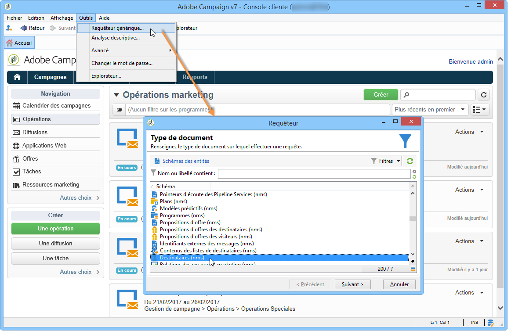
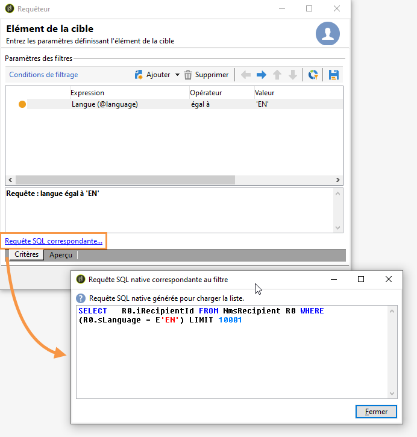

# Etapes pour créer une requête{#steps-to-create-a-query}

Les étapes de construction d&#39;une requête dans Adobe Campaign sont les suivantes :

1. Sélectionnez le tableau de travail. Reportez-vous à l’ [étape 1 - Sélection d’un tableau](#step-1---choose-a-table).
1. Sélectionnez les données à extraire. Reportez-vous à l’ [étape 2 - Sélection des données à extraire](#step-2---choose-data-to-extract).
1. Définissez la séquence de tri des données. Reportez-vous à l’ [étape 3 - Tri des données](#step-3---sort-data).
1. Filtrez les données. Reportez-vous à l’ [étape 4 - Filtrer les données](#step-4---filter-data).
1. Mettez en forme les données. Reportez-vous à l’ [étape 5 - Formatage des données](#step-5---format-data).
1. Affiche le résultat. Reportez-vous à l’ [étape 6 - Aperçu des données](#step-6---preview-data).

>[!NOTE]
>
>Dans le requêteur générique, toutes ces étapes sont proposées. Lorsqu&#39;une requête est créée dans un autre contexte, certaines étapes peuvent être omises.\
>The Query activity is presented in [this section](../../workflow/using/query.md).

## Etape 1 - Sélection de la table {#step-1---choose-a-table}

Sélectionnez le tableau contenant les données à interroger dans la **[!UICONTROL Document type]** fenêtre. Si nécessaire, filtrez les données à l’aide du champ de filtre ou du **[!UICONTROL Filters]** bouton.

## Etape 2 - Sélection des données à extraire {#step-2---choose-data-to-extract}

In the **[!UICONTROL Data to extract]** window, select the data to display: these fields will make up the output columns.

Par exemple, sélectionnez **[!UICONTROL Age]**, **[!UICONTROL Primary key]**, **[!UICONTROL Email domain]** et **[!UICONTROL City]**. Les résultats seront organisés en fonction de cette sélection. Utilisez les flèches bleues à droite de la fenêtre pour modifier l’ordre des colonnes.

Vous pouvez modifier une expression en y insérant une formule ou en exécutant un processus sur une fonction d’agrégation. Pour ce faire, cliquez sur le champ de **[!UICONTROL Expression]** colonne, puis sélectionnez **[!UICONTROL Edit expression]**.

Il est possible de grouper les données de colonne de sortie : pour ce faire, vérifiez **[!UICONTROL Yes]** dans la **[!UICONTROL Group]** colonne de la **[!UICONTROL Data to extract]** fenêtre. Cette fonction génère un résultat autour de l’axe de regroupement vérifié. Vous trouverez un exemple de requête avec regroupement dans [cette section](../../workflow/using/querying-delivery-information.md).

* La **[!UICONTROL Handle groupings (GROUP BY + HAVING)]** fonction vous permet de &quot;grouper par&quot; et de sélectionner ce qui a été regroupé (&quot;avoir&quot;). Cette fonction s’applique à tous les champs de la colonne de sortie. Par exemple, cette option vous permet de regrouper tous les choix d’une colonne de sortie et de récupérer un type spécifique d’informations, comme les destinataires situés entre 35 et 50.

   Voir à ce propos [cette section](../../workflow/using/querying-using-grouping-management.md).

* La **[!UICONTROL Remove duplicate rows (DISTINCT)]** fonction permet de dédupliquer des résultats identiques obtenus dans la colonne de sortie. Si, par exemple, vous effectuez un recensement en sélectionnant les champs Nom, Prénom et Courriel dans la colonne de sortie, ceux qui contiennent des données identiques seront éliminés, car cela signifie que le même contact a été entré plusieurs fois dans la base de données : un seul résultat sera pris en compte.

## Etape 3 - Tri des données {#step-3---sort-data}

La **[!UICONTROL Sorting]** fenêtre vous permet de trier le contenu des colonnes. Utilisez les flèches pour modifier l’ordre des colonnes :

* The **[!UICONTROL Sorting]** column enables a simple sort and arranges column content from A to Z or in ascending order.
* Le **[!UICONTROL Descending sort]** groupe le contenu de Z à A et dans l’ordre décroissant. Cela s’avère utile pour consulter les ventes d’enregistrements, par exemple : les chiffres les plus élevés figurent en haut de la liste.

Dans cet exemple, les données seront triées en fonction de l&#39;âge des destinataires, du plus jeune au plus âgé.

## Etape 4 - Filtrage des données {#step-4---filter-data}

Le requêteur permet de filtrer les données pour affiner la recherche.

Les filtres proposés dépendent de la table sur laquelle porte la requête.

Once you select the **[!UICONTROL Filtering conditions]** you will access the **[!UICONTROL Target elements]** section: this lets you define how to filter the data to collect.

* Pour créer un nouveau filtre, sélectionnez les champs, opérateurs et valeurs nécessaires à la création de la formule à vérifier pour que les données soient sélectionnées. Il est possible de combiner plusieurs conditions (pour plus d’informations, voir [Définition des conditions](../../platform/using/defining-filter-conditions.md)de filtre).
* To use previously saved filters, open the drop-down list by clicking the **[!UICONTROL Add]** button, click **[!UICONTROL Predefined filter]** and select the one you want.

   

* Les filtres créés dans le **[!UICONTROL Generic query editor]** sont disponibles dans d&#39;autres applications de requête et inversement. Pour enregistrer un filtre, cliquez sur l’ **[!UICONTROL Save]** icône .

   >[!NOTE]
   >
   >For more on creating and using filters, refer to [Filtering options](../../platform/using/filtering-options.md).

Dans l&#39;exemple ci-dessous, pour ne récupérer que les destinataires de langue française, choisissez : &quot;langue des destinataires **égal à** FR&quot;.

>[!NOTE]
>
>Vous pouvez accéder directement à une option en inscrivant la formule suivante dans le champ **Valeur** : **$(options:OPTION_NAME)**.

Cliquez sur l’ **[!UICONTROL Preview]** onglet pour afficher le résultat de la condition de filtrage. Dans ce cas, tous les destinataires anglophones sont affichés avec leur nom, prénom et adresse électronique.

Users familiar with SQL language can click **[!UICONTROL Generate SQL query]** to view the query in SQL.

## Etape 5 - Formatage des données {#step-5---format-data}

Une fois les filtres de restriction configurés, vous accédez à la **[!UICONTROL Data formatting]** fenêtre. Cette fenêtre vous permet de réorganiser les colonnes de sortie, de transformer les données et de modifier la casse des libellés de colonne. Vous pouvez également appliquer une formule au résultat final à l’aide d’un champ calculé.

>[!NOTE]
>
>For more information on the types of calculated fields, refer to [Creating calculated fields](../../platform/using/defining-filter-conditions.md#creating-calculated-fields).

Une colonne qui n&#39;est pas cochée ne s&#39;affichera pas dans la fenêtre de prévisualisation des données.

La **[!UICONTROL Transformation]** colonne vous permet de changer le libellé d’une colonne en majuscules ou en minuscules. Sélectionnez la colonne et cliquez sur dans la **[!UICONTROL Transformation]** colonne. Vous pouvez choisir :

* **[!UICONTROL Switch to lower case]**,
* **[!UICONTROL Switch to upper case]**,
* **[!UICONTROL First letter in upper case]**.

## Etape 6 - Prévisualisation des données {#step-6---preview-data}

La **[!UICONTROL Data preview]** fenêtre est la dernière étape. Cliquez sur **[!UICONTROL Start the preview of the data]** pour obtenir le résultat de votre requête. Il est disponible en colonnes ou au format XML. Cliquez sur l&#39; **[!UICONTROL Generated SQL queries]** onglet pour afficher la requête au format SQL.

Dans cet exemple, les données sont triées selon l&#39;âge des destinataires ciblés et dans un ordre croissant.

>[!NOTE]
>
>Par défaut, seules les 200 premières lignes sont affichées dans la **[!UICONTROL Data preview]** fenêtre. Pour modifier ce paramètre, saisissez un nombre dans la **[!UICONTROL Lines to display]** zone et cliquez sur **[!UICONTROL Start the preview of the data]**.

